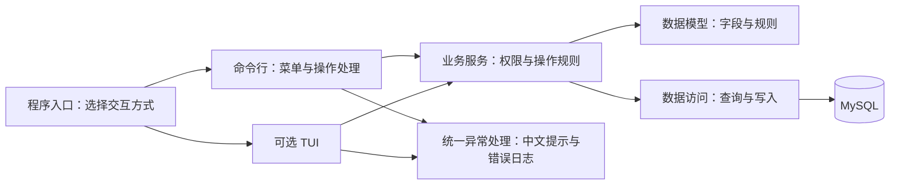

# 系统设计与框架方案

> 更新：2026-09-20。数据字段与接口已写入骨架文件，应用骨架中的所有手写方法仍为未实现占位；本文中的方法体和建表 SQL 是后续实现示例，尚未作为业务功能执行或在 MySQL 验证。已确定 Python、MySQL、默认命令行交互（CLI）、`--tui` 启用可选终端界面（TUI）；具体库见 [README 技术栈](../README.md#技术栈)，已确认的业务边界与实现待办见第 10 节。
>
> 参考上学期 OOP 的 `data-design.md`、`services-interface.md`、`error-and-log-design.md`，把模块落位、数据、接口与交互方式集中写在这一份文档里。功能范围与进度以[功能清单](./功能列表.csv)为准，代码风格与完成标准见[项目规范](./project-standards.md)。

---

**阅读建议**：这篇文档较长，建议按需查阅。一般来说，可以先看 [常用名称](#常用名称是什么意思) 来熟悉术语，再根据分工在第 2 节定位模块，在第 3 节核对公共数据定义，在第 4 节核对已有接口签名；代码中从公共模块导入类型。

**快速定位**：会员/卡（3.3、3.4 + 4.2）| 课程/预约（3.5 + 4.3）| 器械/体测（3.6 + 4.4）| 账号/日志（第 7 节）

任务分工见 [docs 阅读指引](./README.md#从这里开始)。

以下是目录，方便跳转阅读——

## 目录

- [1. 设计目标与调用关系](#1-设计目标与调用关系)
  - [常用名称是什么意思](#常用名称是什么意思)
- [2. 建议目录与模块分工](#2-建议目录与模块分工)
- [3. 数据模型](#3-数据模型)
  - [3.1 开工前固定的格式](#31-开工前固定的格式)
  - [3.2 公共 Python 类型](#32-公共-python-类型)
  - [3.3 账号、会员与教练](#33-账号会员与教练)
  - [3.4 卡产品、会员卡与收款](#34-卡产品会员卡与收款)
  - [3.5 私教课程、课次、预约与评价](#35-私教课程课次预约与评价)
  - [3.6 器械与体测](#36-器械与体测)
  - [3.7 报表与防重复提交](#37-报表与防重复提交)
- [4. 服务与数据库接口](#4-服务与数据库接口)
  - [4.1 方法签名就是组员之间的约定](#41-方法签名就是组员之间的约定)
  - [4.2 账号、会员与会员卡](#42-账号会员与会员卡)
  - [4.3 教练、课程、预约、签到与评价](#43-教练课程预约签到与评价)
  - [4.4 器械、体测、收款和报表](#44-器械体测收款和报表)
  - [4.5 有方法体的例子：查询会员详情](#45-有方法体的例子查询会员详情)
  - [4.6 怎样防止返回类型再次漂移](#46-怎样防止返回类型再次漂移)
  - [4.7 骨架文件的补充约定](#47-骨架文件的补充约定)
- [5. 核心事务与失败处理](#5-核心事务与失败处理)
  - [5.1 办卡与预约](#51-办卡与预约)
  - [5.2 消课与重复提交](#52-消课与重复提交)
- [6. CLI 设计](#6-cli-设计)
  - [6.1 入口与生命周期](#61-入口与生命周期)
  - [6.2 CLI 各文件怎样配合](#62-cli-各文件怎样配合)
  - [6.3 菜单与导航](#63-菜单与导航)
- [7. 异常与日志](#7-异常与日志)
  - [7.1 errors 是统一处理入口](#71-errors-是统一处理入口)
  - [7.2 异常和处理结果的具体定义](#72-异常和处理结果的具体定义)
  - [7.3 统一记录安全日志](#73-统一记录安全日志)
  - [7.4 handle_error 的实现示例](#74-handle_error-的实现示例)
- [8. 数据库初始化与测试](#8-数据库初始化与测试)
- [9. 框架搭建的首轮范围](#9-框架搭建的首轮范围)
- [10. 已确认的业务边界与实现待办](#10-已确认的业务边界与实现待办)

## 1. 设计目标与调用关系

系统围绕“办卡 → 约课 → 签到 → 消课 → 评价”展开，器械、体测和报表作为配套模块。CLI 必须能独立完成交付，TUI 根据时间补充；两者共用业务服务。



| 部分 | 职责 | 主要边界 |
|------|------|----------|
| `main.py` / `src/app.py` | 读取启动参数、创建并连接各个服务、启动和关闭资源 | 选择入口，不处理预约等业务 |
| `ui/cli` / `ui/tui` | 输入、导航、确认、展示 | 调用业务服务，不直接查库或扣次 |
| `services` | 授权、业务校验、跨实体流程、事务 | 不依赖 input、print 或界面控件 |
| `models` | 实体、状态、卡权益规则、输入/输出类型 | 明确字段与必须一直成立的规则，例如剩余次数不能为负；不控制交互 |
| `db` 中的数据访问文件 | 查询、保存、必要的行锁 | 使用服务提供的同一数据库会话，不自行提交 |
| `errors` | 异常定义、统一分类、中文处理结果、脱敏错误日志 | 不操作界面或数据库，事务清理由业务服务负责 |

### 常用名称是什么意思

文件和类名保留英文，方便在代码中查找；阅读时按下面的中文含义理解即可。

| 名称 | 在本项目中是什么意思 | 例子 |
|------|----------------------|------|
| CLI / TUI | CLI 用文本菜单、输入和输出交互；这里的 TUI 指带布局、表格、控件的终端界面 | 默认 CLI；`--tui` 选择后者 |
| Model（模型） | 用 Python 表示一类业务数据 | Member 表示会员，有姓名、联系方式等字段 |
| Handler（操作处理器） | 组织一次用户交互 | 询问姓名 → 调用建档服务 → 显示会员编号 |
| Service（业务服务） | 判断操作是否允许，并组织完整业务 | 预约前查权限、名额和卡次数 |
| Repository，简称 repo（数据访问） | 从数据库读取或写入数据 | 按会员编号查询，保存一条预约 |
| Actor（当前操作者） | 记录本次是谁在操作、有什么角色 | 前台替会员预约时，操作者是前台，预约归属会员 |
| Session（数据库会话） | 一次数据库操作使用的工作对象，不是登录账号 | 一次办卡用同一会话写卡和收款 |
| Input / View | Input 是调用服务时提交的数据；View 是服务返回给界面看的数据 | MemberInput 是建档输入，MemberView 是会员展示结果 |
| 接口 / 方法签名 | 方法叫什么、接收什么、返回什么的约定，不一定是网络接口 | `get_member(member_id: int) -> MemberView` |
| 事务 / 提交 / 回滚 | 一组数据库修改一起生效；提交是确认生效，回滚是放弃这次未完成的修改 | 办卡与收款必须一起成功，不能只存一半 |
| 幂等 | 重复执行同一次操作，不会重复产生业务结果 | 点两次消课只扣一次 |

后续涉及“依赖注入”，就是在创建处理器时把它要用的服务作为参数传进去；“副作用”指除返回结果外还做了什么，例如写数据库或日志。

## 2. 建议目录与模块分工

`src/` 各层已建立字段与函数签名文件，当前结构见 [README](../README.md#仓库结构)。`tests/` 已有静态格式检查，用 `.gitkeep` 保留待写业务用例的分类目录；`sql/001_initial_schema.sql` 目前仅有说明注释。

下面展示骨架文件的落位，省略部分同类模块。源码不包含文档中的具体方法体，应用骨架中的所有手写方法均以 NotImplementedError 占位，按第 9 节逐步实现。签名与类型的补充约定见第 4.7 节。

```text
main.py                         # 解析 --tui 等启动参数
src/
├── app.py                      # 创建各服务，管理程序启动与关闭
├── config.py                   # 配置与共享业务参数
├── logging_config.py           # 标准库 logging 统一配置
├── errors/
│   ├── __init__.py             # 统一导出异常类型与处理入口
│   ├── base.py                 # 异常基类与固定的处理结果类型
│   ├── business.py             # 输入、权限、预约、权益等业务异常
│   ├── storage.py              # 数据库失败与提交结果未知的异常
│   └── handler.py              # 统一分类、生成中文提示、记录错误
├── models/
│   ├── account.py              # 账号存储字段
│   ├── member.py               # 会员档案
│   ├── membership.py           # 卡产品、会员持有的卡、权益规则
│   ├── course.py               # 教练、场地、课程模板、具体课次
│   ├── booking.py              # 预约、消课、评价
│   ├── equipment.py            # 器械与维修记录
│   ├── measurement.py          # 体测记录
│   ├── payment.py              # 收款记录
│   ├── operation.py            # 防重复操作记录
│   └── contracts.py            # 提交给服务的数据、返回结果、分页结果
├── services/                   # 各业务的规则和事务
│   ├── member_service.py       # 会员建档、查询等业务
│   ├── booking_service.py      # 预约、取消等业务
│   └── ...                     # 其他业务服务按同样方式命名
├── db/
│   ├── connection.py           # 创建数据库连接和会话，处理提交、回滚与关闭
│   ├── member_repo.py          # 会员数据查询与保存
│   ├── booking_repo.py         # 预约数据查询与保存
│   └── ...                     # 其他业务的数据访问文件
└── ui/
    ├── cli/
    │   ├── app.py              # 重复显示菜单，按选择调用相应操作
    │   ├── menus.py            # 菜单项与导航映射
    │   ├── prompts.py          # 输入、转换、确认与取消
    │   ├── formatters.py       # 列表、详情、汇总的文本格式化
    │   └── handlers/           # 各业务的交互步骤
    │       ├── member.py       # 会员建档、查询的输入与展示
    │       ├── booking.py      # 预约、取消的输入与展示
    │       └── ...             # 其他业务的交互处理文件
    └── tui/                    # 界面与依赖可选
        └── app.py              # TUI 入口与关闭签名
tests/                          # 模型、业务、数据库、界面、启动退出的测试
sql/                            # 按版本保存结构变更脚本
└── 001_initial_schema.sql       # 仅注释占位，SQL 尚未实现
docs/                           # 本项目文档
```

若采用 SQLAlchemy，Python 类与数据库表的对应关系（称为 ORM 映射）统一放在 `models`，`db` 负责连接与查询，不再复制一套同名实体。服务返回的 `*View` 是普通数据对象，不携带数据库会话；简单查询可由数据访问层组装 View，复杂流程由服务组合结果。具体库变化时可以调整映射方式，服务和交互边界保持一致。

暂定分工与 [README 成员表](../README.md#小组成员排名不分先后)、[功能清单](./功能列表.csv)一致：

- Jiafeng YE：`AuthService`（账号与权限，AUTH）与 `errors/`、日志（LOG）。
- Xingzhou PENG：`MemberService`、`CardService`（会员、会员卡，MEM / CARD）。
- Weijie ZHOU：`CourseService` 中的教练功能（COACH）；与 Yuxi ZHU 共同负责课程、场地和 `BookingService`（COURSE / BOOK）。
- Yihao QIAN：`AttendanceService.check_in/correct_attendance`（签到及更正，ATT-01）、`ReviewService`（评价，REVIEW）。
- Tuao SONG：`EquipmentService`（器械，EQ）；与 Mingjin LI 共同负责 `MeasurementService`（体测，MEASURE）。
- Mingjin LI：收款数据访问、`ReportService`（收款查询与报表，PAY / REPORT）。
- Guanyu ZHOU：文档与报告编写。
- Lvzhen ZHOU：剩余部分，包括基础框架、公共 CLI、可选 TUI、消课和缺席处理（ATT-02 / ATT-03）、测试统筹、集成验收与后续扩展。

组员负责自己模块的交互处理、业务服务、数据访问和测试，并提供对应的文档与验证材料。共同负责的条目先在 CSV 开发备注中写明本次修改范围；同一个文件也可能需要协调，例如签到与消课共用 `AttendanceService`。办卡与收款虽由不同人负责，仍由 `CardService.sell_card` 统一管理事务，收款数据访问不能自己提交。

## 3. 数据模型

**这一节是什么**：定义系统中所有数据的格式（会员、卡、课程等），用于核对 `src/models/contracts.py` 中已有的公共类型。

**使用方式**：
- **写业务代码前**，先核对这里的 `*Input`（输入数据）和 `*View`（返回数据），代码中从公共模块导入
- **看不懂某个字段**，对照前面的 [常用名称](#常用名称是什么意思) 或直接问负责该模块的同学
- **SQL 建表**，这里是待 MySQL 验证的结构设计；正式执行前须整理到版本脚本并按第 8 节检查目标空库

### 3.1 开工前固定的格式

为确保不同人写的代码能正确对接。比如你的函数返回字典、我的期望列表，代码就会崩溃。

**核心规则**（必须遵守）：

- 单条查询返回对应的 `*View` 对象；不存在或不可见时抛 `NotFoundError`。创建、修改、停用成功也返回修改后的 `*View`。
- 所有业务列表查询都返回 `Page[T]`，记录在 `items: list[T]` 中。没有记录返回 `items=[]、total=0`，页码和每页条数原样保留本次请求值；例如请求第 3 页、每页 10 条，空结果仍为 `page=3, page_size=10`。超过最后一页时 `items=[]`，但 `total` 仍是符合条件的总数。不得改成 `None`、裸列表或字典。
- 服务层失败一律抛第 7 节的异常，不返回 `False`、`{"error": ...}` 或另一种类型。只有明确没有数据的操作（如退出登录）才返回 `None`。
- ID 用 `1..2**63-1` 的整数，与有符号 BIGINT 一致，拒绝 bool 冒充整数；请求编号 `request_id` 用标准 UUID 字符串，同一次操作重试沿用原值。状态用下面 `Literal` 中的固定英文值，显示时转成中文。
- 初版所有金额以人民币元计，用 `Decimal`，两位小数，从文字构造，例如 `Decimal("199.00")`；不得经 float 中转。体测值同样使用两位小数的 Decimal。输入多于两位小数时明确拒绝，不能让数据库悄悄截断。
- 纯日期用 `date`；业务时刻用带时区的 `datetime`，统一转 UTC。MySQL `DATETIME(6)` 保存 UTC 值但不自带时区：数据访问层写入前转 UTC 再去掉时区，读取后补 UTC。界面按门店时区展示；不接受无时区的业务参数。
- SQL `NULL` 对应 Python `None`，表示“没有值”，不替换成 `""`、`0` 或 `"未知"`。私教课节余额和预约占用为非负整数；所有会员卡都保存这两个数。
- `*Input` 是完整提交的数据；更新时同样提交全部可编辑字段，`phone=None` 表示清空联系方式。先读详情再编辑，不用随意字典混淆“字段没传”和“清空字段”。
- `*View` 是离开数据库会话后也能使用的普通数据对象。服务不得返回游标、ORM 对象或数据库行字典；数据库内部的行映射必须在返回前转换。
- `Literal` 和类型注解说明约定，**不会自动检查运行时输入**。服务仍检查类型、长度、范围与权限；数据库约束再兜底。密码及其哈希永远不出现在 View 中。

代码段使用 Python 3.10+ 语法，SQL 以支持 `CHECK` 的 MySQL 8.0.16+ 为基线，建议搭建时验证 MySQL 8.4。此处固定兼容要求，精确依赖版本在搭建时锁定。

字段边界也属于接口约定，不能交给各模块自行猜测：

- 落库的整数数量使用 SQL INT 范围，正数为 `1..2**31-1`，余额与阈值允许 0；分页 total 和报表合计不受单行 INT 上限限制。页码、评分等同样拒绝 bool。启用状态只接受 bool，不能把字符串 `"false"` 当真值。
- Decimal 必须是有限数，拒绝 NaN、Infinity 和 float。单笔价格/实收范围为 `0.01..99999999.99`；身高体重的存储范围为 `0.01..9999.99`，体脂为 `0.00..100.00`。报表金额总和可以超过单笔上限；比例按 `ROUND_HALF_UP` 保留四位小数，差值允许负数。
- 日期及转 UTC 后的时刻必须落在 MySQL 支持的 1000–9999 年内，日期加月份/天数的结果也要检查溢出。`DateWindow.start < end`；拒绝空区间、反向区间、无时区时刻和用 datetime 代替纯 date。
- 普通文字去首尾空白后校验长度：姓名/名称/位置 1–100 字，资产编号 1–50 字，专长 0–200 字，评价留言 0–1000 字，故障描述 1–1000 字。专长和留言允许空串，因为它们是非空字符串字段；可空电话使用 None，界面空输入转 None，服务拒绝用空串代替。关键词允许空串，按字面包含匹配，百分号与下划线不作通配符。资产编号保留大小写且区分大小写。
- 密码仅允许 ASCII 大小写字母、数字、短横线 `-` 和下划线 `_`，长度 1–32 位；空密码不接受，不额外要求混合字符种类，也不做强度评分。输入原样处理，不去首尾空白、不转小写；空白、中文、其他符号均不在允许范围。校验规则可表达为 `re.fullmatch(r"[A-Za-z0-9_-]{1,32}", password)`，避免把末尾换行或部分匹配当作合法密码。密码仍使用专用哈希算法保存，具体库待定；32 位限制针对输入密码，不限制哈希长度，数据库仍为 `VARCHAR(255)`。
- 嵌套 View 与分页总数来自同一事务。`frozen=True` 只防止字段重新赋值，`Page.items` 仍是 list，调用方应只读使用，界面排序另复制列表。

### 3.2 公共 Python 类型

**这一小节是什么**：所有模块共用的基础类型，包括分页、角色、状态等，已声明在 `src/models/contracts.py`。

**怎么用**：用 `from src.models.contracts import Page, Role` 等导入已有定义，不在业务文件中复制另一套同名类。

**说明**：`dataclass` 会自动生成构造方法；`frozen=True` 防止随手改字段；`Literal` 为类型检查器列出固定值，服务仍须做运行时校验。

```python
from dataclasses import dataclass, field
from datetime import date, datetime
from decimal import Decimal
from typing import Generic, Literal, TypeVar

T = TypeVar("T")  # Page 可以装会员，也可以装预约等其他记录
Role = Literal["member", "coach", "receptionist", "admin"]
CardKind = Literal["monthly", "quarterly", "yearly", "count"]
# 当前只做私教课；保留类型字段是为了让接口语义明确，唯一允许值为 private。
CourseKind = Literal["private"]
CardStatus = Literal["active", "void"]
SessionStatus = Literal["scheduled", "completed", "cancelled"]
BookingStatus = Literal["reserved", "cancelled", "checked_in", "completed", "no_show"]
EquipmentStatus = Literal["available", "maintenance", "retired"]
PaymentMethod = Literal["cash", "card", "transfer"]  # 现金、刷卡、转账；仅记账
OperationName = Literal["sell_card", "create_session", "cancel_session", "book", "cancel_booking", "register_entry"]

@dataclass(frozen=True, kw_only=True)
class PageRequest:
    page: int = 1
    page_size: int = 20

@dataclass(frozen=True, kw_only=True)
class Page(Generic[T]):
    items: list[T]
    total: int
    page: int
    page_size: int

@dataclass(frozen=True, kw_only=True)
class DateWindow:
    start: datetime
    end: datetime  # [start, end)，开始包含、结束不包含

@dataclass(frozen=True, kw_only=True)
class NamedQuery:
    keyword: str = ""
    is_active: bool | None = None  # None 表示不过滤启用状态
    paging: PageRequest = field(default_factory=PageRequest)

@dataclass(frozen=True, kw_only=True)
class Actor:
    account_id: int
    role: Role
    member_id: int | None
    coach_id: int | None
```

分页统一校验 `page >= 1`、`1 <= page_size <= 100`，无效参数抛 `InvalidInputError`。默认按 ID 升序；时间型记录按业务时间降序、ID 降序。排序含唯一 ID，保证数据未变动时翻页顺序稳定。总数和本页记录使用相同权限与筛选条件，在同一读取事务中取一致快照。

### 3.3 账号、会员与教练

会员可以先建档后开账号；教练建档前先建教练账号。`Actor` 是可信登录结果，不是输入框中的角色；服务每次调用仍核对账号启用状态、角色和档案关联。

```python
@dataclass(frozen=True, kw_only=True)
class AccountInput:
    username: str
    password: str = field(repr=False)  # 避免普通对象打印带出密码
    role: Role

@dataclass(frozen=True, kw_only=True)
class AccountView:
    id: int
    username: str
    role: Role
    is_active: bool
    member_id: int | None
    coach_id: int | None

@dataclass(frozen=True, kw_only=True)
class AccountLinkInput:
    member_id: int | None
    coach_id: int | None  # 恰好一项有值；将指定档案移交给空闲且角色匹配的目标账号

@dataclass(frozen=True, kw_only=True)
class MemberInput:
    name: str
    phone: str | None = None

@dataclass(frozen=True, kw_only=True)
class MemberView:
    id: int
    account_id: int | None
    name: str
    phone: str | None
    is_active: bool

@dataclass(frozen=True, kw_only=True)
class MemberQuery:
    member_id: int | None = None
    keyword: str = ""  # 姓名包含匹配，同名用 ID 区分
    is_active: bool | None = None
    paging: PageRequest = field(default_factory=PageRequest)

@dataclass(frozen=True, kw_only=True)
class CoachInput:
    account_id: int
    name: str
    specialty: str

@dataclass(frozen=True, kw_only=True)
class CoachUpdateInput:
    name: str
    specialty: str  # 资料编辑不改变账号关联

@dataclass(frozen=True, kw_only=True)
class CoachView:
    id: int
    account_id: int
    name: str
    specialty: str
    is_active: bool
```

以下 SQL 按本文顺序组成计划中的初始结构脚本。只对显式选定的空库执行，不用 `DROP TABLE` 或自动覆盖已有表。InnoDB 提供事务，utf8mb4 支持中文；为便于阅读，每行可声明多个短字段。

```sql
CREATE TABLE schema_versions (
    version INT PRIMARY KEY,
    applied_at DATETIME(6) NOT NULL DEFAULT CURRENT_TIMESTAMP(6)
) ENGINE=InnoDB DEFAULT CHARSET=utf8mb4;

CREATE TABLE accounts (
    id BIGINT PRIMARY KEY AUTO_INCREMENT,
    username VARCHAR(50) COLLATE utf8mb4_bin NOT NULL UNIQUE,
    password_hash VARCHAR(255) NOT NULL,
    role VARCHAR(16) NOT NULL, is_active BOOLEAN NOT NULL DEFAULT TRUE,
    created_at DATETIME(6) NOT NULL DEFAULT CURRENT_TIMESTAMP(6),
    updated_at DATETIME(6) NOT NULL DEFAULT CURRENT_TIMESTAMP(6) ON UPDATE CURRENT_TIMESTAMP(6),
    CHECK (role IN ('member', 'coach', 'receptionist', 'admin')),
    CHECK (is_active IN (0, 1))
) ENGINE=InnoDB DEFAULT CHARSET=utf8mb4;

CREATE TABLE members (
    id BIGINT PRIMARY KEY AUTO_INCREMENT,
    account_id BIGINT NULL UNIQUE,
    name VARCHAR(100) NOT NULL, phone VARCHAR(32) NULL,
    is_active BOOLEAN NOT NULL DEFAULT TRUE,
    created_at DATETIME(6) NOT NULL DEFAULT CURRENT_TIMESTAMP(6),
    updated_at DATETIME(6) NOT NULL DEFAULT CURRENT_TIMESTAMP(6) ON UPDATE CURRENT_TIMESTAMP(6),
    FOREIGN KEY (account_id) REFERENCES accounts(id),
    CHECK (CHAR_LENGTH(TRIM(name)) > 0),
    CHECK (is_active IN (0, 1))
) ENGINE=InnoDB DEFAULT CHARSET=utf8mb4;

CREATE TABLE coaches (
    id BIGINT PRIMARY KEY AUTO_INCREMENT,
    account_id BIGINT NOT NULL UNIQUE,
    name VARCHAR(100) NOT NULL, specialty VARCHAR(200) NOT NULL,
    is_active BOOLEAN NOT NULL DEFAULT TRUE,
    created_at DATETIME(6) NOT NULL DEFAULT CURRENT_TIMESTAMP(6),
    updated_at DATETIME(6) NOT NULL DEFAULT CURRENT_TIMESTAMP(6) ON UPDATE CURRENT_TIMESTAMP(6),
    FOREIGN KEY (account_id) REFERENCES accounts(id),
    CHECK (CHAR_LENGTH(TRIM(name)) > 0),
    CHECK (is_active IN (0, 1))
) ENGINE=InnoDB DEFAULT CHARSET=utf8mb4;
```

用户名限定为 3–50 位 ASCII 字母、数字、下划线、点或短横线，写入与登录前去首尾空白并转小写；密码不做此转换。姓名去首尾空白后为 1–100 字，phone 非空时为 1–32 字，不作为唯一身份依据。密码使用专用哈希算法，具体库在搭建时确定。

密码字符及长度按第 3.1 节执行：`a`、`123456`、`Ab_9-` 都符合当前格式规则；空串、33 位字符串、带空格或含 `.` 的密码不符合。暂不做强度检测不改变哈希存储要求，也不改变账号与登录接口的返回类型。

角色与档案匹配是跨表规则，由服务在同一事务中检查，外键本身无法保证。会员有未结束预约、教练有未结束课次时，先处理业务再停用。

### 3.4 卡产品、会员卡与收款

`CardTerms` 是一套售卡规则，产品与已售卡快照共用相同格式。改产品不改售出快照；续购新建卡和收款，不覆盖旧卡。

```python
@dataclass(frozen=True, kw_only=True)
class CardTerms:
    name: str
    kind: CardKind
    price: Decimal
    private_lesson_credits: int  # 月/季/年固定赠送 20/64/256 节；次卡为 0
    access_uses: int | None  # 次卡为总入场次数；期限卡为 None
    valid_days: int | None  # 月/季/年固定为 30/90/365；次卡无期限，为 None

@dataclass(frozen=True, kw_only=True)
class CardProductView:
    id: int
    terms: CardTerms
    is_active: bool

@dataclass(frozen=True, kw_only=True)
class CardView:
    id: int
    member_id: int
    product_id: int
    terms: CardTerms  # 售出快照，不实时读取产品
    valid_from: date
    valid_until: date | None  # 不含此日期；次卡无期限，为 None
    remaining_accesses: int | None
    remaining_private_lessons: int
    reserved_private_lessons: int
    status: CardStatus

    @property
    def available_private_lessons(self) -> int:
        return self.remaining_private_lessons - self.reserved_private_lessons

@dataclass(frozen=True, kw_only=True)
class CardQuery:
    member_id: int | None = None
    status: CardStatus | None = None
    valid_on: date | None = None  # 仅筛在该门店日期有效且未作废的卡
    expires_before: date | None = None  # valid_until 严格早于此日期
    private_lessons_at_most: int | None = None  # 只筛赠课产品，按剩余减占用筛选，包含阈值
    paging: PageRequest = field(default_factory=PageRequest)

@dataclass(frozen=True, kw_only=True)
class SaleInput:
    member_id: int
    product_id: int
    method: PaymentMethod

@dataclass(frozen=True, kw_only=True)
class EntryInput:
    member_id: int
    membership_id: int  # 当日首次入场选择的卡；再次入场沿用当日记录

@dataclass(frozen=True, kw_only=True)
class EntryView:
    id: int
    member_id: int
    membership_id: int
    business_date: date  # 服务按门店时区生成，不由界面指定
    entered_at: datetime  # 当日首次登记的 UTC 时刻
    accesses_used: int  # 首次用次卡为 1，用期限卡为 0；重复调用仍返回原值
    operator_id: int

@dataclass(frozen=True, kw_only=True)
class PaymentView:
    id: int
    membership_id: int
    member_id: int
    amount: Decimal
    method: PaymentMethod
    paid_at: datetime
    operator_id: int

@dataclass(frozen=True, kw_only=True)
class SaleView:
    card: CardView
    payment: PaymentView

@dataclass(frozen=True, kw_only=True)
class PaymentQuery:
    window: DateWindow | None = None  # 按 paid_at 筛选
    member_id: int | None = None
    method: PaymentMethod | None = None
    paging: PageRequest = field(default_factory=PageRequest)
```

```sql
CREATE TABLE card_products (
    id BIGINT PRIMARY KEY AUTO_INCREMENT,
    name VARCHAR(100) NOT NULL, kind VARCHAR(16) NOT NULL,
    price DECIMAL(10,2) NOT NULL,
    private_lesson_credits INT NOT NULL, access_uses INT NULL, valid_days INT NULL,
    is_active BOOLEAN NOT NULL DEFAULT TRUE,
    created_at DATETIME(6) NOT NULL DEFAULT CURRENT_TIMESTAMP(6),
    updated_at DATETIME(6) NOT NULL DEFAULT CURRENT_TIMESTAMP(6) ON UPDATE CURRENT_TIMESTAMP(6),
    CHECK (price > 0 AND CHAR_LENGTH(TRIM(name)) > 0),
    CHECK (is_active IN (0, 1)),
    CHECK (private_lesson_credits >= 0),
    CHECK (access_uses IS NULL OR access_uses > 0),
    CHECK (
        (kind = 'monthly' AND valid_days IS NOT NULL AND valid_days = 30
            AND private_lesson_credits = 20 AND access_uses IS NULL)
        OR (kind = 'quarterly' AND valid_days IS NOT NULL AND valid_days = 90
            AND private_lesson_credits = 64 AND access_uses IS NULL)
        OR (kind = 'yearly' AND valid_days IS NOT NULL AND valid_days = 365
            AND private_lesson_credits = 256 AND access_uses IS NULL)
        OR (kind = 'count' AND valid_days IS NULL AND access_uses IS NOT NULL
            AND access_uses = 10 AND private_lesson_credits = 0)
    )
) ENGINE=InnoDB DEFAULT CHARSET=utf8mb4;

CREATE TABLE memberships (
    id BIGINT PRIMARY KEY AUTO_INCREMENT,
    member_id BIGINT NOT NULL, product_id BIGINT NOT NULL,
    -- 下面六项为售出快照，对应 CardTerms
    name VARCHAR(100) NOT NULL, kind VARCHAR(16) NOT NULL,
    price DECIMAL(10,2) NOT NULL,
    private_lesson_credits INT NOT NULL, access_uses INT NULL, valid_days INT NULL,
    valid_from DATE NOT NULL, valid_until DATE NULL,
    remaining_accesses INT NULL,
    remaining_private_lessons INT NOT NULL, reserved_private_lessons INT NOT NULL,
    status VARCHAR(16) NOT NULL DEFAULT 'active',
    created_at DATETIME(6) NOT NULL DEFAULT CURRENT_TIMESTAMP(6),
    updated_at DATETIME(6) NOT NULL DEFAULT CURRENT_TIMESTAMP(6) ON UPDATE CURRENT_TIMESTAMP(6),
    FOREIGN KEY (member_id) REFERENCES members(id),
    FOREIGN KEY (product_id) REFERENCES card_products(id),
    UNIQUE KEY uq_membership_owner (id, member_id),
    KEY ix_membership_member (member_id, id),
    CHECK (valid_until IS NULL OR valid_from < valid_until),
    CHECK (status IN ('active', 'void')),
    CHECK (price > 0 AND CHAR_LENGTH(TRIM(name)) > 0),
    CHECK (private_lesson_credits >= 0),
    CHECK ((access_uses IS NULL AND remaining_accesses IS NULL)
        OR (access_uses IS NOT NULL AND remaining_accesses IS NOT NULL
            AND 0 <= remaining_accesses AND remaining_accesses <= access_uses)),
    CHECK (0 <= reserved_private_lessons AND reserved_private_lessons <= remaining_private_lessons
        AND remaining_private_lessons <= private_lesson_credits),
    CHECK (
        (kind = 'monthly' AND valid_days IS NOT NULL AND valid_days = 30
            AND private_lesson_credits = 20 AND access_uses IS NULL)
        OR (kind = 'quarterly' AND valid_days IS NOT NULL AND valid_days = 90
            AND private_lesson_credits = 64 AND access_uses IS NULL)
        OR (kind = 'yearly' AND valid_days IS NOT NULL AND valid_days = 365
            AND private_lesson_credits = 256 AND access_uses IS NULL)
        OR (kind = 'count' AND valid_days IS NULL AND access_uses IS NOT NULL
            AND access_uses = 10 AND private_lesson_credits = 0)
    ),
    CHECK (
        (kind IN ('monthly', 'quarterly', 'yearly') AND valid_until IS NOT NULL
            AND DATEDIFF(valid_until, valid_from) = valid_days)
        OR (kind = 'count' AND valid_until IS NULL)
    )
) ENGINE=InnoDB DEFAULT CHARSET=utf8mb4;

CREATE TABLE payments (
    id BIGINT PRIMARY KEY AUTO_INCREMENT,
    membership_id BIGINT NOT NULL UNIQUE, member_id BIGINT NOT NULL,
    amount DECIMAL(10,2) NOT NULL, method VARCHAR(16) NOT NULL,
    paid_at DATETIME(6) NOT NULL, operator_id BIGINT NOT NULL,
    created_at DATETIME(6) NOT NULL DEFAULT CURRENT_TIMESTAMP(6),
    FOREIGN KEY (membership_id, member_id) REFERENCES memberships(id, member_id),
    FOREIGN KEY (operator_id) REFERENCES accounts(id),
    KEY ix_payment_time (paid_at, id),
    CHECK (amount > 0),
    CHECK (method IN ('cash', 'card', 'transfer'))
) ENGINE=InnoDB DEFAULT CHARSET=utf8mb4;

CREATE TABLE gym_entries (
    id BIGINT PRIMARY KEY AUTO_INCREMENT,
    member_id BIGINT NOT NULL, membership_id BIGINT NOT NULL,
    business_date DATE NOT NULL, entered_at DATETIME(6) NOT NULL,
    accesses_used INT NOT NULL, operator_id BIGINT NOT NULL,
    FOREIGN KEY (membership_id, member_id) REFERENCES memberships(id, member_id),
    FOREIGN KEY (operator_id) REFERENCES accounts(id),
    UNIQUE KEY uq_entry_member_day (member_id, business_date),
    CHECK (accesses_used IN (0, 1))
) ENGINE=InnoDB DEFAULT CHARSET=utf8mb4;
```

初版不含折扣、分期和真实支付，每张新卡恰好一笔实收，金额等于卡快照价格。唯一约束防止多笔收款，事务保证不会只有卡、没有款。历史款项不可编辑，未来退款另记流水。复合外键让卡与会员必须对应，避免把甲的卡记到乙名下。

有效期按固定天数计算，`valid_from` 为生效日，生效日算第 1 天；`valid_until = valid_from + timedelta(days=valid_days)`，保存过期日的次日。这里将“过期日当天 23:59”理解为包含整个最后一分钟，直到次日 00:00 才失效，避免漏掉 23:59:59 及其后的小数秒。查询统一使用门店日期 `valid_from <= business_date < valid_until`。月/季/年分别固定 30/90/365 天，例如 9 月 20 日生效的月卡最后有效日是 10 月 19 日，valid_until 为 10 月 20 日；跨月、闰年也只加固定天数。

**续购自动接续**：服务计算 `valid_from = max(门店今天, latest_term_end 或门店今天)`。latest_term_end 是该会员所有未作废期限卡最晚的 valid_until，已有未来卡也参与，月/季/年混合购买同样接续。因为 valid_until 已存为最后有效日的次日，不再加一天。没有期限卡或全部到期则今天生效；次卡不参与接续，购买当天生效。SaleInput 不再含 start_date，界面只收集会员、产品和收款方式。办卡服务先锁会员，再读取最新期限，避免两个同时购卡请求算出相同生效日；同一请求重试返回原售卡结果，不重新接续。

例如旧卡最后有效日 9 月 30 日，新月卡从 10 月 1 日到 10 月 30 日，新 valid_until 为 10 月 31 日。会员在 9 月 20 日购买后，可以提前预约新卡有效期内的课，不能据此提前入场。新卡赠课单独初始化，旧卡余额不转入。CLI 确认时说明自动接续规则，售卡结果清楚显示实际起止日期。

月/季/年卡的 `access_uses`、`remaining_accesses` 都为 None，门禁按日期开放。次卡 count **无期限、10 次入场、不赠私教**：`valid_days=None`、`valid_until=None`、`access_uses=10`，初始 `remaining_accesses=10`；私教总数、剩余和占用均为 0。总入场次数是售出快照，只有剩余次数随入场减少；次卡不能作为私教预约用卡。

**入场按会员和门店日期去重**。每天首次用次卡入场扣 1 次，用期限卡入场扣 0 次；同一会员同一天的后续入场沿用同一条 gym_entries 记录，即使选择另一张自己的卡也不再扣。上午用掉次卡最后 1 次，晚上同日仍可入场；次日则须有可用卡。get_today_entry 返回当日记录或抛 NotFoundError；没有记录时再用 list_cards 的 valid_on 筛出有效卡，查询不扣次。会员可登记本人，前台/管理员可代登记；每次都重验账号、会员和数据归属，已停用会员不能凭旧记录继续入场。

register_entry 先检查请求防重结果，再在会员锁内用可信时刻生成 business_date、查询当日记录。已有记录时，确认提交的卡确属本人后返回原 EntryView，将本次新请求号关联原记录；不因卡在上午用尽而再次拒绝。没有记录时，校验所选卡状态和入场日有效性，写入场记录、次卡扣减及请求结果，一起提交或回滚。不满足日期/状态抛 CardNotEligible，次卡余额不足抛 InsufficientCredits。相同请求即使跨午夜重试也只核实原入场；第二天真实入场使用新请求编号。原记录的 accesses_used 是该日首次扣减量，返回 1 不表示重复操作又扣了 1 次。

门禁入场与课程签到是两个操作：独自锻炼也要入场；约课、签到、消课均不自动扣门禁次数。有期限卡的会员上私教按期限卡入场，不消耗次卡。初版的 gym_entries 记录每日首次入场及扣次，不记录一天内每次进出的轨迹，不接真实门禁硬件。

续购读取末尾日期的 SQL 示例如下。调用前已经锁住会员；FOR UPDATE 读取最新已提交的卡，不能在等锁前使用旧快照计算。无结果由仓储返回 None，服务取门店今天；SQL 返回的 valid_until 本身就是可接续的新生效日。

```sql
SELECT valid_until
FROM memberships
WHERE member_id = :member_id AND status = 'active'
  AND kind IN ('monthly', 'quarterly', 'yearly')
ORDER BY valid_until DESC, id DESC
LIMIT 1 FOR UPDATE;
```

SQL 的 CHECK 检查可空数值时必须明确写 IS NOT NULL；单写 `valid_days = 30` 不能拒绝 NULL，因为 SQL 会得到“未知”而非“假”。期限卡必须有结束日期，且起止日期相差规定天数；次卡空值规则须与 Python 字段一致。这些约束仍需在 MySQL 实测。

私教课节满足 `0 ≤ reserved_private_lessons ≤ remaining_private_lessons ≤ private_lesson_credits`。月卡赠送 **20 节**，季卡 **64 节**，年卡 **256 节**；服务和 SQL 均校验固定值，不能在创建或编辑产品时随意改赠课数。办卡时剩余节数等于赠课数，占用为 0；次卡不赠课，三个私教数值都为 0。每节最长 150 分钟；没有另设每天只能上 1 节的限制，但预约时间不能冲突，累计不能超过赠课余额。有效天数与赠课数分开计算，不把 30/90/365 天当成相同数量的课节。

**赠课随来源卡到期失效**：旧卡过期后，未用赠课不能再用于新预约，也不能转移到新卡或搭配新卡门禁使用。例如旧月卡 9 月 30 日到期还剩 2 节，续购后新卡按自己的赠课数计算；旧 2 节不并入新卡。此规则取代先前“赠课不限使用期限”的理解。数据库保留旧卡剩余数作为历史账目，不将它显示为仍可使用的权益；CardView.available_private_lessons 只计算“剩余减占用”，是否可预约仍由卡状态和日期决定。

BookingInput.membership_id 固定指本次预约使用的同一张会员卡，同时提供日期资格和赠课余额；不接受另一张卡补足资格。对于月/季/年卡，课次开始时刻转为门店日期后，必须满足 `valid_from <= 上课日期 < valid_until`。预约时卡有效不能代替上课日校验；预约有效期外的课抛 CardNotEligible，节数不足抛 InsufficientCredits，失败不新增预约或占用余额。预约占用 1 节，取消/缺席只释放占用，完成才扣除 1 节剩余和占用。已合法预约的到期前课程仍可在事后补签或结算，核对的是原上课日期，不因办理结算时卡已过期而拒绝；这不允许用旧赠课新约到期后的课。次卡不能预约私教，直接抛 CardNotEligible；未来生效的期限卡允许提前预约其有效期内的未来课程，不要求预约当天已生效。

### 3.5 私教课程、课次、预约与评价

课程模板是“瑜伽入门”，课次是“周三 14:00–15:00、张教练、A 教室的瑜伽入门”。模板时长用于排课时预填，已发布课次以保存的开始、结束时间为准。

```python
@dataclass(frozen=True, kw_only=True)
class CourseInput:
    name: str
    kind: CourseKind
    duration_minutes: int

@dataclass(frozen=True, kw_only=True)
class CourseView:
    id: int
    name: str
    kind: CourseKind
    duration_minutes: int
    is_active: bool

@dataclass(frozen=True, kw_only=True)
class CourseQuery:
    keyword: str = ""
    kind: CourseKind | None = None
    is_active: bool | None = None
    paging: PageRequest = field(default_factory=PageRequest)

@dataclass(frozen=True, kw_only=True)
class RoomInput:
    name: str
    capacity: int

@dataclass(frozen=True, kw_only=True)
class RoomView:
    id: int
    name: str
    capacity: int
    is_active: bool

@dataclass(frozen=True, kw_only=True)
class SessionInput:
    course_id: int
    coach_id: int
    room_id: int
    starts_at: datetime
    ends_at: datetime
    capacity: int

@dataclass(frozen=True, kw_only=True)
class SessionView:
    id: int
    course_id: int
    course_name: str
    kind: CourseKind
    coach_id: int
    coach_name: str
    room_id: int
    room_name: str
    starts_at: datetime
    ends_at: datetime
    capacity: int
    occupied_count: int
    available_count: int
    status: SessionStatus

@dataclass(frozen=True, kw_only=True)
class SessionQuery:
    window: DateWindow | None = None  # 按 starts_at 筛选
    kind: CourseKind | None = None
    coach_id: int | None = None
    room_id: int | None = None
    status: SessionStatus | None = None
    paging: PageRequest = field(default_factory=PageRequest)

@dataclass(frozen=True, kw_only=True)
class BookingInput:
    member_id: int
    session_id: int
    membership_id: int

@dataclass(frozen=True, kw_only=True)
class BookingView:
    id: int
    member_id: int
    member_name: str
    membership_id: int
    session: SessionView
    status: BookingStatus
    booked_at: datetime
    checked_in_at: datetime | None
    closed_at: datetime | None

@dataclass(frozen=True, kw_only=True)
class BookingQuery:
    member_id: int | None = None
    session_id: int | None = None
    window: DateWindow | None = None  # 按关联课次 starts_at 筛选
    status: BookingStatus | None = None
    paging: PageRequest = field(default_factory=PageRequest)

@dataclass(frozen=True, kw_only=True)
class ConsumptionView:
    id: int
    booking_id: int
    membership_id: int
    lessons_used: int
    completed_at: datetime
    operator_id: int

@dataclass(frozen=True, kw_only=True)
class ReviewInput:
    booking_id: int
    rating: int
    comment: str

@dataclass(frozen=True, kw_only=True)
class ReviewView:
    id: int
    booking_id: int
    member_id: int
    session_id: int
    rating: int
    comment: str
    created_at: datetime
```

```sql
CREATE TABLE courses (
    id BIGINT PRIMARY KEY AUTO_INCREMENT,
    name VARCHAR(100) NOT NULL, kind VARCHAR(16) NOT NULL,
    duration_minutes INT NOT NULL, is_active BOOLEAN NOT NULL DEFAULT TRUE,
    created_at DATETIME(6) NOT NULL DEFAULT CURRENT_TIMESTAMP(6),
    updated_at DATETIME(6) NOT NULL DEFAULT CURRENT_TIMESTAMP(6) ON UPDATE CURRENT_TIMESTAMP(6),
    CHECK (CHAR_LENGTH(TRIM(name)) > 0 AND duration_minutes BETWEEN 1 AND 150),
    CHECK (kind = 'private'),
    CHECK (is_active IN (0, 1))
) ENGINE=InnoDB DEFAULT CHARSET=utf8mb4;

CREATE TABLE rooms (
    id BIGINT PRIMARY KEY AUTO_INCREMENT,
    name VARCHAR(100) NOT NULL, capacity INT NOT NULL,
    is_active BOOLEAN NOT NULL DEFAULT TRUE,
    created_at DATETIME(6) NOT NULL DEFAULT CURRENT_TIMESTAMP(6),
    updated_at DATETIME(6) NOT NULL DEFAULT CURRENT_TIMESTAMP(6) ON UPDATE CURRENT_TIMESTAMP(6),
    CHECK (CHAR_LENGTH(TRIM(name)) > 0 AND capacity > 0),
    CHECK (is_active IN (0, 1))
) ENGINE=InnoDB DEFAULT CHARSET=utf8mb4;

CREATE TABLE course_sessions (
    id BIGINT PRIMARY KEY AUTO_INCREMENT,
    course_id BIGINT NOT NULL, coach_id BIGINT NOT NULL, room_id BIGINT NOT NULL,
    course_name VARCHAR(100) NOT NULL, kind VARCHAR(16) NOT NULL, -- 排课时的课程快照
    starts_at DATETIME(6) NOT NULL, ends_at DATETIME(6) NOT NULL,
    capacity INT NOT NULL, status VARCHAR(16) NOT NULL DEFAULT 'scheduled',
    created_at DATETIME(6) NOT NULL DEFAULT CURRENT_TIMESTAMP(6),
    updated_at DATETIME(6) NOT NULL DEFAULT CURRENT_TIMESTAMP(6) ON UPDATE CURRENT_TIMESTAMP(6),
    FOREIGN KEY (course_id) REFERENCES courses(id),
    FOREIGN KEY (coach_id) REFERENCES coaches(id),
    FOREIGN KEY (room_id) REFERENCES rooms(id),
    KEY ix_session_coach (coach_id, starts_at, id),
    KEY ix_session_room (room_id, starts_at, id),
    CHECK (starts_at < ends_at AND ends_at <= DATE_ADD(starts_at, INTERVAL 150 MINUTE)),
    CHECK (CHAR_LENGTH(TRIM(course_name)) > 0),
    CHECK (kind = 'private'),
    CHECK (capacity = 1),
    CHECK (status IN ('scheduled', 'completed', 'cancelled'))
) ENGINE=InnoDB DEFAULT CHARSET=utf8mb4;

CREATE TABLE bookings (
    id BIGINT PRIMARY KEY AUTO_INCREMENT,
    member_id BIGINT NOT NULL, session_id BIGINT NOT NULL, membership_id BIGINT NOT NULL,
    status VARCHAR(16) NOT NULL DEFAULT 'reserved',
    booked_at DATETIME(6) NOT NULL,
    checked_in_at DATETIME(6) NULL, closed_at DATETIME(6) NULL,
    created_at DATETIME(6) NOT NULL DEFAULT CURRENT_TIMESTAMP(6),
    updated_at DATETIME(6) NOT NULL DEFAULT CURRENT_TIMESTAMP(6) ON UPDATE CURRENT_TIMESTAMP(6),
    FOREIGN KEY (member_id) REFERENCES members(id),
    FOREIGN KEY (session_id) REFERENCES course_sessions(id),
    FOREIGN KEY (membership_id, member_id) REFERENCES memberships(id, member_id),
    UNIQUE KEY uq_booking_member_session (member_id, session_id),
    UNIQUE KEY uq_booking_card (id, membership_id),
    KEY ix_booking_session_status (session_id, status, id),
    CHECK (status IN ('reserved', 'cancelled', 'checked_in', 'completed', 'no_show')),
    CHECK (
        (status = 'reserved' AND checked_in_at IS NULL AND closed_at IS NULL)
        OR (status = 'checked_in' AND checked_in_at IS NOT NULL AND closed_at IS NULL)
        OR (status = 'completed' AND checked_in_at IS NOT NULL AND closed_at IS NOT NULL)
        OR (status IN ('cancelled', 'no_show') AND checked_in_at IS NULL AND closed_at IS NOT NULL)
    ),
    CHECK (checked_in_at IS NULL OR checked_in_at >= booked_at),
    CHECK (closed_at IS NULL OR closed_at >= booked_at),
    CHECK (checked_in_at IS NULL OR closed_at IS NULL OR closed_at >= checked_in_at)
) ENGINE=InnoDB DEFAULT CHARSET=utf8mb4;

CREATE TABLE consumptions (
    id BIGINT PRIMARY KEY AUTO_INCREMENT,
    booking_id BIGINT NOT NULL UNIQUE, membership_id BIGINT NOT NULL,
    lessons_used INT NOT NULL, completed_at DATETIME(6) NOT NULL,
    operator_id BIGINT NOT NULL,
    created_at DATETIME(6) NOT NULL DEFAULT CURRENT_TIMESTAMP(6),
    FOREIGN KEY (booking_id, membership_id) REFERENCES bookings(id, membership_id),
    FOREIGN KEY (operator_id) REFERENCES accounts(id),
    CHECK (lessons_used = 1)
) ENGINE=InnoDB DEFAULT CHARSET=utf8mb4;

CREATE TABLE reviews (
    id BIGINT PRIMARY KEY AUTO_INCREMENT,
    booking_id BIGINT NOT NULL UNIQUE,
    rating INT NOT NULL, comment VARCHAR(1000) NOT NULL,
    created_at DATETIME(6) NOT NULL DEFAULT CURRENT_TIMESTAMP(6),
    FOREIGN KEY (booking_id) REFERENCES bookings(id),
    CHECK (rating BETWEEN 1 AND 5)
) ENGINE=InnoDB DEFAULT CHARSET=utf8mb4;
```

排课时将课程名称和类型保存到 `course_sessions.course_name/kind`；SessionView 和 SessionQuery.kind 使用该快照。修改课程模板只影响新课次，已发布课次保留原来的名称和时间。教练、场地和会员姓名仍读当前档案，仅供展示，业务关联以 ID 为准。

当前所有课程的 kind 只接受 private（私教），不提供其他课程类型。CourseInput、CourseView 和筛选条件暂保留此字段，减少已有接口变动；kind 为其他值时抛 InvalidInputError。快照仍有必要：模板名称可改，旧课次名称应保留排课时的值。

每节私教课最长 2.5 小时（150 分钟）。模板的 duration_minutes 为 1–150 的整数，排课时 `ends_at - starts_at` 必须严格等于 `timedelta(minutes=duration_minutes)`；不能先取整再比较，否则会放过超出的秒数。150 分钟允许，150 分钟多 1 秒拒绝。当前不规定健身房营业时段，允许跨午夜排课，只检查时长及时间冲突，不以“当天关门”作为签到截止依据。随后以课次起止时刻为准，模板改时长不改旧课次。

私教课次容量固定为 1，且不得超过场地容量；这些跨表规则在服务中检查。时间区间前含后不含：14:00–15:00 和 15:00–16:00 不冲突，与 14:30–15:30 冲突。已有预约时取消原课次后重排，保留历史。

预约状态按以下路径改变；教练更正入口可以为未结算预约补签，已结算后的更正见下文边界：

```text
新建 → reserved（已预约）：占用私教课节，reserved_private_lessons +1
reserved → cancelled（已取消）：释放私教课节占用，reserved_private_lessons -1
cancelled → reserved：新请求重新校验，复用原记录；清空旧签到/结束时间
reserved → checked_in（已签到）：从 starts_at 起记录签到；教练可在下课后为未结算预约补签，不扣节数
checked_in → reserved（教练更正为未到场）：未结算时清空 checked_in_at，不改变节数
checked_in → completed（已完成）：remaining_private_lessons -1、reserved_private_lessons -1；写唯一消课记录
reserved → no_show（缺席）：结清占用；不扣私教课节；仅释放预约占用
```

`completed`、`no_show` 是终态。取消全课按确认后的规则处理，不能撤销已发生的消课。课次已到结束时间且无 reserved/checked_in 预约才能置为 completed；最后一笔消课或缺席处理可以在同一事务完成此更新，无预约或全部已取消的课次由 complete_session 收尾。只剩 cancelled 预约也不能在开课前自动完课。

occupied_count 为所有非 cancelled 预约数（含 completed/no_show）；available_count 在 scheduled 状态为 `capacity - occupied_count`，completed/cancelled 时为 0。它只表达容量余量，可预约时间与个人权益由服务另行检查。两项均为非负整数，预约数不得超过容量。

booked_at 是最近一次成功预约时间；恢复已取消预约时更新它并清空 checked_in_at/closed_at，created_at 保留首次建档时间。reserved 的两个可空时刻均为 None；checked_in 仅有签到时间；completed 两者均有值；cancelled/no_show 仅有 closed_at。closed_at 表示取消、完成或缺席处理时间，不能早于 booked_at 或已有签到时间。取消只允许在课次 starts_at 之前且预约仍为 reserved；恰好到达 starts_at 后不能取消，会员是否到场由签到或课后缺席处理确定。

已确认提供教练修改签到情况的入口，用来替会员补签。CLI 的会员路径是“我的预约 → 选择课次 → 确认到场”；教练路径是“我的课表 → 选择课次 → 学员签到情况 → 更正到场/未到场 → 确认”，调用 correct_attendance，成功显示返回的 BookingView。无需先实现扫码。前台保留代签到权限，更正由本课教练或管理员处理；教练不能修改别的教练的课次。

从 starts_at 起允许签到，教练补签不以 ends_at 为截止，但当前入口只处理尚未结算的预约。correct_attendance 的 present=True 将 reserved 改为 checked_in，checked_in_at 记录实际操作时刻，不伪造课内时间；False 将 checked_in 改回 reserved 并清空签到时间；相同选择返回当前 BookingView。取消或已结算预约抛 InvalidState；更正不扣节数，消课仍须另行确认，日志记录操作者及前后状态。首版统一从开课起至结算前允许签到与更正；会员可自行签到，本课教练可补签。确认 completed/no_show 后不再开放更正或退节数入口；界面在消课和缺席处理前明确提示并要求确认。以后若需要管理员冲正，另行设计完整流水和余额事务，不属于首版。

### 3.6 器械与体测

```python
@dataclass(frozen=True, kw_only=True)
class EquipmentInput:
    asset_code: str
    name: str
    location: str

@dataclass(frozen=True, kw_only=True)
class EquipmentUpdateInput:
    name: str
    location: str

@dataclass(frozen=True, kw_only=True)
class EquipmentView:
    id: int
    asset_code: str
    name: str
    location: str
    status: EquipmentStatus

@dataclass(frozen=True, kw_only=True)
class EquipmentQuery:
    keyword: str = ""  # 匹配资产编号、名称、位置
    status: EquipmentStatus | None = None
    paging: PageRequest = field(default_factory=PageRequest)

@dataclass(frozen=True, kw_only=True)
class MaintenanceView:
    id: int
    equipment_id: int
    description: str
    reported_at: datetime
    resolved_at: datetime | None
    operator_id: int
    resolved_by: int | None

@dataclass(frozen=True, kw_only=True)
class MeasurementInput:
    member_id: int
    measured_at: datetime
    height_cm: Decimal
    weight_kg: Decimal
    body_fat_pct: Decimal | None

@dataclass(frozen=True, kw_only=True)
class MeasurementView:
    id: int
    member_id: int
    coach_id: int  # 从可信操作者取得，不由表单指定
    measured_at: datetime
    height_cm: Decimal
    weight_kg: Decimal
    body_fat_pct: Decimal | None

@dataclass(frozen=True, kw_only=True)
class MeasurementQuery:
    member_id: int
    window: DateWindow | None = None  # 按 measured_at 筛选
    paging: PageRequest = field(default_factory=PageRequest)

@dataclass(frozen=True, kw_only=True)
class MeasurementComparison:
    before: MeasurementView
    after: MeasurementView
    height_delta_cm: Decimal
    weight_delta_kg: Decimal
    body_fat_delta_pct: Decimal | None
```

体测输入统一用厘米和千克：身高 `100.00–250.00` cm（即 1–2.5 m），体重 `30.00–150.00` kg，两端都包含；体脂沿用可空设计，填写时为 `0.00–100.00`%。服务层和数据库都执行同一范围检查，越界不写入。

**体测查看权永久保留，数据更新随有效预约暂停或恢复**。成功预约过本教练私教课的会员，其已获授权的历史体测以后仍可查看；没有新的有效预约时，不向该教练展示后续新增体测。再次成功预约该教练后恢复到最新记录，包含暂停期间已经录入的记录。会员本人始终查看自己的全部记录，其他教练的预约不会恢复本教练的更新权限；账号停用等基础权限检查仍有效。此规则仅授予历史查看权，不自动授予修改体测或其他管理权限。

本设计将“有效预约期间”落实为：预约成功起至课次 ends_at；如果提前取消，则在实际取消时结束。未来课次的成功预约立即允许查看最新数据，预约失败不授予权限。同一会员对本教练有多次预约时，以其中最晚结束的授权期间为准；最后一课到点后自动停止更新，即使尚未手动消课/标缺席，也不延长体测权限。取消预约保留取消前已获准查看的内容。每次新预约恢复查看全部当前历史，不需要为每位教练复制一份体测数据。

例如与张教练的最后一课于 9 月 20 日 15:00 结束，此后张教练仍可查截至该时刻录入的记录；9 月 21 日新增体测暂不可见。9 月 25 日会员再次成功预约张教练后，9 月 21 日的记录也可见。这里暂停的是**该教练的可见更新**，会员仍可接受其他获授权教练的测量，原始数据继续正常保存。

使用现有 bookings 与 course_sessions 计算可见截止，不新建权限表：取消预约取 `min(closed_at, ends_at)`，其余预约取 ends_at，对本教练与该会员的所有历史预约取最大值，再以本次查询时刻 as_of 为上限。无历史预约就无查看权。预约恢复只能在开课前进行，授予最新查看权；延迟补签、消课或标缺席均不能推进原 ends_at。体测记录不可原地修改或删除，权限按服务生成的 **created_at（实际录入时刻）** 过滤，不能按可补录的 measured_at（测量时刻）过滤；否则新记录填写旧日期会绕过停止更新的限制。

以下为教练查询的 SQL 条件示例，参数由服务传入。详情、列表总数、分页内容和对比的两条记录均使用同一条件和同一 as_of；不可见详情抛 NotFoundError，列表返回符合范围的 Page，不能先把全量记录取出后只在界面隐藏。

MeasurementRepository 的 scope_member_id 与 scope_coach_id 必须恰有一项非空，由服务校验当前账号后生成，不能从表单接收：会员传本人 member_id，教练传本人 coach_id。两项均为空不能表示“查看全部”，而应拒绝；前台和管理员角色不因此获得体测明细权限。query.member_id 只指定要查的会员，不能扩大身份范围；无历史预约时教练列表为空，不向其暴露该会员有多少体测记录。as_of 为本次服务查询的可信 UTC 时刻，详情与对比使用同一读取事务。

```sql
SELECT m.*
FROM body_measurements AS m
WHERE m.member_id = :member_id
  AND m.created_at <= (
      SELECT LEAST(:as_of, MAX(
          CASE WHEN b.status = 'cancelled' THEN LEAST(b.closed_at, s.ends_at)
               ELSE s.ends_at END
      ))
      FROM bookings AS b
      JOIN course_sessions AS s ON s.id = b.session_id
      WHERE b.member_id = m.member_id AND s.coach_id = :coach_id
        AND b.booked_at <= :as_of
  )
ORDER BY m.measured_at DESC, m.id DESC;
```

体测录入仍只由获授权教练执行；按本设计须存在该会员对本教练的当前有效预约。历史查看权不会让已停止更新的教练通过新增记录绕过范围。数据访问的 has_current_coaching_booking 接收服务生成的 at，检查 reserved/checked_in、课次 scheduled、`booked_at <= at < ends_at`。预约取消与体测写入共用会员行锁，created_at 在获得锁后用统一 UTC 时钟生成，不能由用户输入或沿用排队前的时间。

```sql
CREATE TABLE equipment (
    id BIGINT PRIMARY KEY AUTO_INCREMENT,
    asset_code VARCHAR(50) COLLATE utf8mb4_bin NOT NULL UNIQUE,
    name VARCHAR(100) NOT NULL, location VARCHAR(100) NOT NULL,
    status VARCHAR(16) NOT NULL DEFAULT 'available',
    created_at DATETIME(6) NOT NULL DEFAULT CURRENT_TIMESTAMP(6),
    updated_at DATETIME(6) NOT NULL DEFAULT CURRENT_TIMESTAMP(6) ON UPDATE CURRENT_TIMESTAMP(6),
    CHECK (CHAR_LENGTH(TRIM(asset_code)) > 0 AND CHAR_LENGTH(TRIM(name)) > 0),
    CHECK (status IN ('available', 'maintenance', 'retired'))
) ENGINE=InnoDB DEFAULT CHARSET=utf8mb4;

CREATE TABLE maintenance_records (
    id BIGINT PRIMARY KEY AUTO_INCREMENT,
    equipment_id BIGINT NOT NULL, description VARCHAR(1000) NOT NULL,
    reported_at DATETIME(6) NOT NULL, resolved_at DATETIME(6) NULL,
    operator_id BIGINT NOT NULL, resolved_by BIGINT NULL,
    created_at DATETIME(6) NOT NULL DEFAULT CURRENT_TIMESTAMP(6),
    FOREIGN KEY (equipment_id) REFERENCES equipment(id),
    FOREIGN KEY (operator_id) REFERENCES accounts(id),
    FOREIGN KEY (resolved_by) REFERENCES accounts(id),
    CHECK (CHAR_LENGTH(TRIM(description)) > 0),
    CHECK ((resolved_at IS NULL AND resolved_by IS NULL)
        OR (resolved_at IS NOT NULL AND resolved_by IS NOT NULL AND resolved_at >= reported_at))
) ENGINE=InnoDB DEFAULT CHARSET=utf8mb4;

CREATE TABLE body_measurements (
    id BIGINT PRIMARY KEY AUTO_INCREMENT,
    member_id BIGINT NOT NULL, coach_id BIGINT NOT NULL,
    measured_at DATETIME(6) NOT NULL,
    height_cm DECIMAL(6,2) NOT NULL, weight_kg DECIMAL(6,2) NOT NULL,
    body_fat_pct DECIMAL(5,2) NULL,
    created_at DATETIME(6) NOT NULL DEFAULT CURRENT_TIMESTAMP(6),
    FOREIGN KEY (member_id) REFERENCES members(id),
    FOREIGN KEY (coach_id) REFERENCES coaches(id),
    KEY ix_measurement_member_time (member_id, measured_at, id),
    KEY ix_measurement_member_created (member_id, created_at, id),
    CHECK (height_cm BETWEEN 100.00 AND 250.00 AND weight_kg BETWEEN 30.00 AND 150.00),
    CHECK (body_fat_pct IS NULL OR body_fat_pct BETWEEN 0 AND 100)
) ENGINE=InnoDB DEFAULT CHARSET=utf8mb4;
```

报修和修复锁定器械后同时更新状态与维修记录，一件器械最多一条未结束维修；报废前处理维修，不删除历史。业务范围固定为身高 100.00–250.00 cm、体重 30.00–150.00 kg；体脂仍可空且范围 0–100，缺失体脂不得填零。对比选同一会员、先早后晚的记录，差值为后减前；任一条缺体脂时体脂差值为 `None`。不足两条时界面提示补充记录，服务不临时返回列表代替对比对象。

### 3.7 报表与防重复提交

报表是查询结果，不额外建汇总表。空数据仍返回同一类型，金额为 `Decimal("0.00")`、数量为 `0`，没有分母的比例为 `None`。

```python
@dataclass(frozen=True, kw_only=True)
class RevenueView:
    window: DateWindow
    payment_count: int
    total_amount: Decimal

@dataclass(frozen=True, kw_only=True)
class MembershipStats:
    as_of: datetime  # 本次快照的统计时刻，由服务生成；不支持历史状态回放
    active_members: int
    inactive_members: int
    valid_cards: int
    expired_cards: int
    future_cards: int
    void_cards: int
    exhausted_cards: int  # 已生效但入场次数为 0 的次卡

@dataclass(frozen=True, kw_only=True)
class SessionStatsView:
    session_id: int
    starts_at: datetime
    reserved_count: int
    checked_in_count: int
    completed_count: int
    no_show_count: int
    cancelled_count: int
    attendance_rate: Decimal | None

@dataclass(frozen=True, kw_only=True)
class CoachStatsView:
    coach_id: int
    coach_name: str
    completed_sessions: int
    attended_members: int

@dataclass(frozen=True, kw_only=True)
class CsvExport:
    filename: str  # 建议文件名，不含路径
    content: bytes  # 已编码的 UTF-8 BOM CSV
    row_count: int  # 不含表头
```

会员统计仅反映本次读取事务的当前状态；服务生成 as_of，调用方不能输入过去时刻要求还原历史。现有表只保留当前启用状态，无法回答“上周有多少启用会员”。active_members/inactive_members 按档案启用状态计数，与账号启用无关；卡分类覆盖当前所有已售卡，包含停用会员的卡，会员数与卡数不能混加。

会员卡统计只反映门禁状态，先按 void 分类，其余先检查未生效，再分日期到期、次卡入场用尽（exhausted_cards）、有效；五类互斥且合计等于所有已售卡数。次卡无到期日，不计入 expired_cards，但入场用尽不能计为有效。私教节数是否还有剩余不影响门禁分类；到期卡余额仅供历史核对，不能统计为可用赠课。

课程五项数量各按**当前状态**计数，到课率为 `(checked_in_count + completed_count) / 非取消预约数`，按 ROUND_HALF_UP 保留四位小数，分母为 0（含全部取消）时为 None，显示“暂无数据”。教练统计只计范围内已完成课次，到课人次按这些课次中有签到时间的预约计数，按课次开始时间归属区间。同一会员上两节课计两人次；无已完成课次的教练也返回，数量为 0，按教练 ID 升序。

```sql
CREATE TABLE operation_records (
    id BIGINT PRIMARY KEY AUTO_INCREMENT,
    request_id CHAR(36) CHARACTER SET ascii COLLATE ascii_bin NOT NULL UNIQUE,
    actor_id BIGINT NOT NULL, operation VARCHAR(50) NOT NULL,
    payload_hash CHAR(64) CHARACTER SET ascii COLLATE ascii_bin NOT NULL,
    result_id BIGINT NOT NULL,
    created_at DATETIME(6) NOT NULL DEFAULT CURRENT_TIMESTAMP(6),
    FOREIGN KEY (actor_id) REFERENCES accounts(id),
    CHECK (operation IN ('sell_card', 'create_session', 'cancel_session', 'book', 'cancel_booking', 'register_entry'))
) ENGINE=InnoDB DEFAULT CHARSET=utf8mb4;
```

操作记录与业务一起提交。operation 使用 OperationName 的六个值：sell_card 的 result_id 为会员卡 ID；create_session/cancel_session 为课次 ID；book/cancel_booking 为预约 ID；register_entry 为入场记录 ID。不能传界面显示名称或任意表名。

请求编号统一为小写带短横线的标准 UUID 字符串（`str(UUID(value))`），非法值拒绝。摘要对规范化后的输入生成：售卡、入场和创建预约/课次使用 Input 的全部字段；取消课次使用 `{"session_id": id}`，取消预约使用 `{"booking_id": id}`。JSON 固定 `sort_keys=True, separators=(",", ":"), ensure_ascii=False`，None 保留 null，整数保持整数，Decimal 转两位小数字符串，日期用 YYYY-MM-DD，时刻转 UTC 后用带六位小数和 `+00:00` 的 ISO 格式，再对 UTF-8 字节计算 SHA-256 小写十六进制值。不含 request_id、数据库生成时间、密码或原始敏感表单。

历史表外键不设置级联删除，会员、教练、课程、器械使用停用或归档。数据库连接先设置 UTC 时区，初始化须检查严格 SQL 模式，防止超长文字或数值被静默截断。MySQL 建表会隐式提交，不能声称整段建表能事务回滚；脚本检查空库、逐步确认结构，全部成功再写版本号，失败报告已完成步骤，不删除已有数据。

## 4. 服务与数据库接口

**使用提示**：本节定义的接口需要配合第 3 节的数据定义使用。实现某个服务时，通常需要：
1. 先看第 3 节对应的 `*Input` 和 `*View` 定义（如 `MemberInput`、`MemberView`）
2. 再看本节对应的方法签名（如 `MemberService.create_member`）
3. SQL 建表脚本在第 3 节对应数据定义的下方
4. 修改数据字段时，必须同步修改这三处，详见 [3.1 节](#31-开工前固定的格式)

### 4.1 方法签名就是组员之间的约定

先读第 3 节的数据类型，再实现下面的方法。`actor` 表示“谁在操作”，`member_id` 等表示“操作谁的数据”，不能混为一谈。所有公开业务方法在服务层验证当前账号、角色和数据归属，登录例外。

下面用 `Protocol` 写接口清单：表示实现类应提供哪些方法；方法体的 `...` 是**尚未实现的声明**，不能直接作为完成的代码。不要求另外建立一套接口目录或复杂继承体系，实际服务用普通类实现这些方法即可。第 4.5 节给出有方法体的完整查询示例。

公共失败规则：输入不合法抛 `InvalidInputError`，账号失效抛 `AuthenticationError`，角色不允许抛 `PermissionDenied`，记录不存在或对当前用户不可见抛 `NotFoundError`，不允许的状态变更抛 `InvalidState`，重复键或请求冲突抛 `ConflictError`。底层数据库异常转换为 `StorageError`；提交结果未知单独用 `OutcomeUnknownError`。正常空列表不算失败。

### 4.2 账号、会员与会员卡

**相关章节**：数据定义见 [3.3 账号、会员、教练](#33-账号会员与教练) 和 [3.4 卡产品、会员卡](#34-卡产品会员卡与收款)，SQL 建表在同一节下方。

这些声明引用第 3 节已定义的类型。`list_*` 始终返回分页对象；`get_*` 始终返回单个 View。更改启用状态返回更改后的详情，不混用布尔值和字典。

```python
from typing import Protocol
from sqlalchemy.orm import Session  # 示例按候选 SQLAlchemy 写，库尚未安装验证

class AuthService(Protocol):
    def __init__(self, session_factory: Callable[[], Session]) -> None: ...
    def login(self, username: str, password: str) -> Actor: ...
    def create_account(self, actor: Actor, data: AccountInput) -> AccountView: ...
    def get_account(self, actor: Actor, account_id: int) -> AccountView: ...
    def list_accounts(self, actor: Actor, query: NamedQuery) -> Page[AccountView]: ...
    def set_account_active(self, actor: Actor, account_id: int, active: bool) -> AccountView: ...
    def link_profile(self, actor: Actor, account_id: int, data: AccountLinkInput) -> AccountView: ...

    def verify_actor(self, session: Session, actor: Actor) -> Actor:
        """内部共用方法：在调用方的事务中重验账号和档案关联；不自行提交。"""
        ...

class MemberService(Protocol):
    def __init__(self, session_factory: Callable[[], Session], auth: AuthService) -> None: ...
    def create_member(self, actor: Actor, data: MemberInput) -> MemberView: ...
    def get_member(self, actor: Actor, member_id: int) -> MemberView: ...
    def list_members(self, actor: Actor, query: MemberQuery) -> Page[MemberView]: ...
    def update_member(self, actor: Actor, member_id: int, data: MemberInput) -> MemberView: ...
    def set_member_active(self, actor: Actor, member_id: int, active: bool) -> MemberView: ...

class CardService(Protocol):
    def __init__(self, session_factory: Callable[[], Session], auth: AuthService, *, timezone_name: str) -> None: ...
    def create_product(self, actor: Actor, terms: CardTerms) -> CardProductView: ...
    def update_product(self, actor: Actor, product_id: int, terms: CardTerms) -> CardProductView: ...
    def get_product(self, actor: Actor, product_id: int) -> CardProductView: ...
    def list_products(self, actor: Actor, query: NamedQuery) -> Page[CardProductView]: ...
    def set_product_active(self, actor: Actor, product_id: int, active: bool) -> CardProductView: ...
    def get_card(self, actor: Actor, membership_id: int) -> CardView: ...
    def list_cards(self, actor: Actor, query: CardQuery) -> Page[CardView]: ...

    def sell_card(self, actor: Actor, data: SaleInput, request_id: str) -> SaleView:
        """办卡或续购：卡、收款、防重记录在同一事务内保存。
        成功返回 SaleView；输入、权限、状态或请求冲突按公共失败规则抛出。
        提交结果未知时抛 OutcomeUnknownError，不能告知用户“肯定没收款”。
        """
        ...

    def get_sale_by_request(self, actor: Actor, request_id: str) -> SaleView:
        """按原请求编号核实办卡结果；核对操作者权限，不暴露别人的交易。"""
        ...

    def get_today_entry(self, actor: Actor, member_id: int) -> EntryView: ...
    def register_entry(self, actor: Actor, data: EntryInput, request_id: str) -> EntryView: ...
    def get_entry_by_request(self, actor: Actor, request_id: str) -> EntryView: ...
```

账号查询的关键词匹配用户名，其余 NamedQuery 匹配名称。会员查询只允许前台、管理员查看授权范围，会员只查本人；教练学员名单走预约服务，不开放全体会员名册。账号停用须影响已经登录后的下一次服务请求，不能只检查登录时的状态。

会员/教练账号可以暂未绑定档案，此时 Actor 的对应 ID 为 None；访问需要档案的功能必须先抛 PermissionDenied。不能把这个 None 直接传成数据访问层的“查看全部”。例如会员列表的 scope_member_id=None 只允许服务在确认是管理员/前台后生成；预约列表的两个 scope 均 None 也只用于获准查看全部的员工。查询参数只能缩小此范围。

退出登录由应用清空 `Actor | None` 的当前身份和私有页面缓存，返回 None，不删除账号。建教练档案时绑定账号；`link_profile(actor, account_id, data)` 的 account_id 明确是**新的目标账号**，data 指定要移交的档案。目标账号须空闲且角色匹配；已绑定同一档案则返回当前 AccountView；绑定其他档案则拒绝，不能顺便移走它。指定档案原来有账号时直接把档案外键更新为目标账号，原账号变为空闲，不先把教练的非空外键设为 NULL。旧会话在下一次校验时失效。两项均 None 或均有值均拒绝；初版不提供单独解绑或修改角色的接口。一个账号不能同时绑定会员与教练档案。

到期与私教节数提醒复用 list_cards，分别查询。到期提醒同时传 `valid_on=门店今天` 和 expires_before，例如 `valid_on=date(2026, 9, 20), expires_before=date(2026, 9, 28)` 筛出当天仍有效且 9 月 28 日之前失效的期限卡。对月/季/年卡，valid_on 表示 `status='active' AND valid_from <= :valid_on AND :valid_on < valid_until`；对无期限的次卡，表示 `status='active' AND valid_from <= :valid_on AND remaining_accesses > 0`。None 不附加此条件，普通列表可包含过期或用尽的卡；expires_before 排除无结束日期的次卡。同时传 status='void' 和 valid_on 抛 InvalidInputError。

私教节数提醒同时传 `valid_on=门店今天` 和非负的 private_lessons_at_most，按 `remaining_private_lessons - reserved_private_lessons <= 阈值` 筛选，只筛赠课总数大于 0 的期限卡，包含当前可用节数为 0 的记录；排除不赠课的次卡；过期、未生效及作废卡不提醒补充赠课。查询条件同时提供时取交集。不传 valid_on 的历史查询仍能查看旧卡账面余额，不能因此用于新预约。当前没有门禁剩余次数阈值字段，功能清单不承诺这一筛选功能。

### 4.3 教练、课程、预约、签到与评价

**相关章节**：数据定义见 [3.3 教练](#33-账号会员与教练) 和 [3.5 课程、课次、预约与评价](#35-课程课次预约与评价)，SQL 建表在同一节下方。

```python
class CourseService(Protocol):
    def __init__(self, session_factory: Callable[[], Session], auth: AuthService) -> None: ...
    def create_coach(self, actor: Actor, data: CoachInput) -> CoachView: ...
    def update_coach(self, actor: Actor, coach_id: int, data: CoachUpdateInput) -> CoachView: ...
    def get_coach(self, actor: Actor, coach_id: int) -> CoachView: ...
    def list_coaches(self, actor: Actor, query: NamedQuery) -> Page[CoachView]: ...
    def set_coach_active(self, actor: Actor, coach_id: int, active: bool) -> CoachView: ...
    def create_course(self, actor: Actor, data: CourseInput) -> CourseView: ...
    def update_course(self, actor: Actor, course_id: int, data: CourseInput) -> CourseView: ...
    def get_course(self, actor: Actor, course_id: int) -> CourseView: ...
    def list_courses(self, actor: Actor, query: CourseQuery) -> Page[CourseView]: ...
    def set_course_active(self, actor: Actor, course_id: int, active: bool) -> CourseView: ...
    def create_room(self, actor: Actor, data: RoomInput) -> RoomView: ...
    def update_room(self, actor: Actor, room_id: int, data: RoomInput) -> RoomView: ...
    def get_room(self, actor: Actor, room_id: int) -> RoomView: ...
    def list_rooms(self, actor: Actor, query: NamedQuery) -> Page[RoomView]: ...
    def set_room_active(self, actor: Actor, room_id: int, active: bool) -> RoomView: ...
    def create_session(self, actor: Actor, data: SessionInput, request_id: str) -> SessionView: ...
    def get_session(self, actor: Actor, session_id: int) -> SessionView: ...
    def list_sessions(self, actor: Actor, query: SessionQuery) -> Page[SessionView]: ...
    def cancel_session(self, actor: Actor, session_id: int, request_id: str) -> SessionView: ...
    def get_session_by_request(self, actor: Actor, request_id: str) -> SessionView: ...
    def complete_session(self, actor: Actor, session_id: int) -> SessionView: ...

class BookingService(Protocol):
    def __init__(self, session_factory: Callable[[], Session], auth: AuthService, *, timezone_name: str) -> None: ...
    def book(self, actor: Actor, data: BookingInput, request_id: str) -> BookingView:
        """校验权限、私教课次时间和私教节数；同事务保存预约与节数占用。
        membership_id 固定为提供资格及赠课的同一张卡，不得组合旧赠课与新门禁卡。
        对期限卡按课次开始时刻转门店日期检查 valid_from <= 上课日期 < valid_until。
        次卡不能约私教；未来生效的期限卡可约其有效期内的课，失败不写预约或占用余额。
        卡不适用抛 CardNotEligible；私教节数不足抛 InsufficientCredits；
        撞期抛 ScheduleConflict；满员抛 CapacityExceeded；已有预约抛 ConflictError。
        其余失败遵守公共异常规则，不能返回错误字典。
        """
        ...
    def get_booking(self, actor: Actor, booking_id: int) -> BookingView: ...
    def get_booking_by_request(self, actor: Actor, request_id: str) -> BookingView: ...
    def cancel(self, actor: Actor, booking_id: int, request_id: str) -> BookingView: ...
    def list_bookings(self, actor: Actor, query: BookingQuery) -> Page[BookingView]: ...

class AttendanceService(Protocol):
    def __init__(self, session_factory: Callable[[], Session], auth: AuthService) -> None: ...
    def check_in(self, actor: Actor, booking_id: int) -> BookingView: ...
    def correct_attendance(self, actor: Actor, booking_id: int, present: bool) -> BookingView: ...
    def complete(self, actor: Actor, booking_id: int) -> ConsumptionView: ...
    def mark_no_show(self, actor: Actor, booking_id: int) -> BookingView: ...

class ReviewService(Protocol):
    def __init__(self, session_factory: Callable[[], Session], auth: AuthService) -> None: ...
    def create_review(self, actor: Actor, data: ReviewInput) -> ReviewView: ...
    def get_review(self, actor: Actor, review_id: int) -> ReviewView: ...
    def list_reviews(self, actor: Actor, paging: PageRequest) -> Page[ReviewView]: ...
```

教练本人课表、场地安排复用 `list_sessions` 的教练或场地筛选。教练学员名单、会员本人历史、前台检索复用 `list_bookings`；查询条件只能缩小权限范围。普通会员的课次详情不能带其他会员名单。

重复签到返回现有 `BookingView`，重复消课返回同一条 `ConsumptionView`，不再扣私教节数。教练更正入口已确认，可在下课后为未结算预约补签；当前仅在 reserved 与 checked_in 之间切换，不改变节数。补签原课程不受操作当天来源卡已过期影响，也不会恢复体测更新权限。缺席重复处理也不再次结算。评价只允许本人已完成的预约，重复创建抛 `ConflictError`，不覆盖原评价；查询只返回本人的评价。

### 4.4 器械、体测、收款和报表

**相关章节**：数据定义见 [3.6 器械与体测](#36-器械与体测) 和 [3.7 报表](#37-报表与防重复提交)，收款数据定义见 [3.4 节](#34-卡产品会员卡与收款)，SQL 建表在对应节下方。

```python
class EquipmentService(Protocol):
    def __init__(self, session_factory: Callable[[], Session], auth: AuthService) -> None: ...
    def create_equipment(self, actor: Actor, data: EquipmentInput) -> EquipmentView: ...
    def update_equipment(self, actor: Actor, equipment_id: int, data: EquipmentUpdateInput) -> EquipmentView: ...
    def get_equipment(self, actor: Actor, equipment_id: int) -> EquipmentView: ...
    def list_equipment(self, actor: Actor, query: EquipmentQuery) -> Page[EquipmentView]: ...
    def report_fault(self, actor: Actor, equipment_id: int, description: str) -> MaintenanceView: ...
    def finish_maintenance(self, actor: Actor, maintenance_id: int) -> MaintenanceView: ...
    def list_maintenance(self, actor: Actor, equipment_id: int, paging: PageRequest) -> Page[MaintenanceView]: ...
    def retire_equipment(self, actor: Actor, equipment_id: int) -> EquipmentView: ...

class MeasurementService(Protocol):
    def __init__(self, session_factory: Callable[[], Session], auth: AuthService) -> None: ...
    def record(self, actor: Actor, data: MeasurementInput) -> MeasurementView: ...
    def get_measurement(self, actor: Actor, measurement_id: int) -> MeasurementView: ...
    def list_measurements(self, actor: Actor, query: MeasurementQuery) -> Page[MeasurementView]: ...
    def compare(self, actor: Actor, before_id: int, after_id: int) -> MeasurementComparison: ...

class ReportService(Protocol):
    def __init__(self, session_factory: Callable[[], Session], auth: AuthService, *, timezone_name: str) -> None: ...
    def get_payment(self, actor: Actor, payment_id: int) -> PaymentView: ...
    def list_payments(self, actor: Actor, query: PaymentQuery) -> Page[PaymentView]: ...
    def revenue(self, actor: Actor, window: DateWindow) -> RevenueView: ...
    def membership_stats(self, actor: Actor) -> MembershipStats: ...
    def session_stats(self, actor: Actor, query: SessionQuery) -> Page[SessionStatsView]: ...
    def coach_stats(self, actor: Actor, window: DateWindow, paging: PageRequest) -> Page[CoachStatsView]: ...
    def export_payments(self, actor: Actor, query: PaymentQuery) -> CsvExport: ...
    def export_revenue(self, actor: Actor, window: DateWindow) -> CsvExport: ...
    def export_memberships(self, actor: Actor) -> CsvExport: ...
    def export_sessions(self, actor: Actor, query: SessionQuery) -> CsvExport: ...
    def export_coaches(self, actor: Actor, window: DateWindow) -> CsvExport: ...
```

收款写入由Mingjin LI提供给办卡事务的数据访问方法，使用Xingzhou PENG的办卡流程传入的同一会话；`ReportService` 只查询，不改历史收款。收款数据访问接口固定如下：

```python
class PaymentRepository(Protocol):
    def __init__(self, session: Session) -> None: ...

    def create(
        self, *, membership_id: int, member_id: int, amount: Decimal,
        method: PaymentMethod, paid_at: datetime, operator_id: int,
    ) -> PaymentView:
        """写入一笔模拟实收并取得编号；不提交，由 CardService 统一提交或回滚。"""
        ...
```

导出沿用屏幕筛选和授权，但导出全部符合条件的记录，不只当前页；内部可以分批读取，使用同一读取事务的快照。金额两位小数、日期 ISO 格式、时刻带时区，缺值为空字段。导出前处理用户文本开头的 `=`、`+`、`-`、`@`（含前导空白），防止表格软件执行公式。服务返回 `CsvExport`，界面选择路径并保存；用户取消保存不改变业务数据。

CSV 表头和列顺序固定如下；列表类报表没有数据时只输出表头，汇总类仍输出一行零值。下列英文仅用于精确定位输出字段，CLI 显示对应中文：

```text
export_payments: id,membership_id,member_id,amount,method,paid_at,operator_id
export_revenue: start,end,payment_count,total_amount
export_memberships: as_of,active_members,inactive_members,valid_cards,expired_cards,future_cards,void_cards
export_sessions: session_id,starts_at,reserved_count,checked_in_count,completed_count,no_show_count,cancelled_count,attendance_rate
export_coaches: coach_id,coach_name,completed_sessions,attended_members
```

P2 的冻结、退款、候补暂不虚构字段或接口，先确认规则并补齐本节的固定输入输出，才开始对应代码。

### 4.5 有方法体的例子：查询会员详情

下面示例按候选 SQLAlchemy 写出“重验身份 → 查数据库 → 固定返回对象”的过程。它是设计示例，尚未作为项目代码连接数据库验证。异常类见第 7 节，数据类来自第 3 节。

数据访问层使用传入的会话，不提交事务；内部的 `None` 仅表示未查到，业务服务会转换成异常，不将它返回给 CLI。

```python
# 计划位置：src/db/member_repo.py
from sqlalchemy import text
from sqlalchemy.orm import Session
from src.models.contracts import MemberView

class MemberRepository:
    def __init__(self, session: Session) -> None:
        self.session = session

    def get(self, member_id: int) -> MemberView | None:
        row = self.session.execute(
            text("""
                SELECT id, account_id, name, phone, is_active
                FROM members
                WHERE id = :member_id
            """),
            {"member_id": member_id},
        ).mappings().one_or_none()
        if row is None:
            return None
        return MemberView(
            id=row["id"], account_id=row["account_id"],
            name=row["name"], phone=row["phone"],
            is_active=bool(row["is_active"]),
        )
```

身份校验是 `AuthService.verify_actor` 的方法体示例。所有业务服务复用这一方法；写业务时还应锁定相关账号或保证停用与业务操作按一致顺序执行，不能把这个只读示例当作完整并发方案。

```python
# 计划位置：src/services/auth_service.py 中的 AuthService 方法
from src.db.account_repo import AccountRepository
from src.models.contracts import Actor
from src.errors import AuthenticationError

def verify_actor(self, session: Session, actor: Actor) -> Actor:
    repository = AccountRepository(session)
    account = repository.get(actor.account_id)
    if account is None or not account.is_active:
        raise AuthenticationError("登录状态已失效，请重新登录。")
    current = repository.get_actor(actor.account_id)
    if current is None or current != actor:
        raise AuthenticationError("账号权限已变化，请重新登录。")
    return current
```

SQL 保留在数据访问层。get_actor 组合账号与档案关联并返回 Actor，不代表已通过授权；服务仍检查启用状态、角色及后续操作权限。此处两个读取须使用同一事务快照，写入流程则先锁定账号再取得最新状态。

```python
# 计划位置：src/services/member_service.py
from collections.abc import Callable
from sqlalchemy.exc import SQLAlchemyError
from src.db.member_repo import MemberRepository
from src.errors import InvalidInputError, NotFoundError, PermissionDenied, StorageError
from src.services.auth_service import AuthService

class MemberService:
    def __init__(self, session_factory: Callable[[], Session], auth: AuthService) -> None:
        self.session_factory = session_factory
        self.auth = auth

    def get_member(self, actor: Actor, member_id: int) -> MemberView:
        """只读查询会员详情，成功固定返回 MemberView。
        编号非法抛 InvalidInputError；账号失效抛 AuthenticationError；
        角色不允许抛 PermissionDenied；不存在或不可见抛 NotFoundError；
        数据库失败抛 StorageError。不修改会员，也不输出文字。
        """
        if type(member_id) is not int or not 1 <= member_id <= 2**63 - 1:
            raise InvalidInputError("会员编号必须是有效的正整数。")
        try:
            with self.session_factory() as session:
                with session.begin():
                    current = self.auth.verify_actor(session, actor)
                    if current.role not in ("admin", "receptionist", "member"):
                        raise PermissionDenied("当前账号不能查询会员档案。")
                    if current.role == "member" and current.member_id != member_id:
                        raise NotFoundError("会员不存在或不可见。")
                    result = MemberRepository(session).get(member_id)
                    if result is None:
                        raise NotFoundError("会员不存在或不可见。")
                    return result
        except SQLAlchemyError as error:
            # with 会先清理事务；原始数据库错误不直接交给用户。
            raise StorageError("数据库读取失败。") from error
```

`with session.begin()` 管理这次事务，异常退出会回滚；会话外层负责关闭。这里是只读查询，因此连接异常不会产生“办卡是否成功”的歧义；写事务的提交未知处理见第 5、7 节。查询型数据访问可直接组装 View，复杂写流程由服务组合结果；不需要为每张表另建一份重复实体。

同样的分页查询使用以下参数化 SQL。`scope_member_id` 由服务依据角色生成（会员为本人 ID，获准查看全部的员工为 NULL），不得让用户指定。服务先校验权限、页码和筛选字段，再传参数；占位符由 SQLAlchemy 绑定，不能拼接用户输入。

```sql
-- 先在同一读取事务中统计总数
SELECT COUNT(*) AS total
FROM members
WHERE (:scope_member_id IS NULL OR id = :scope_member_id)
  AND (:member_id IS NULL OR id = :member_id)
  AND (:is_active IS NULL OR is_active = :is_active)
  AND (:keyword = '' OR LOCATE(:keyword, name) > 0);

-- 再取本页；offset = (page - 1) * page_size
SELECT id, account_id, name, phone, is_active
FROM members
WHERE (:scope_member_id IS NULL OR id = :scope_member_id)
  AND (:member_id IS NULL OR id = :member_id)
  AND (:is_active IS NULL OR is_active = :is_active)
  AND (:keyword = '' OR LOCATE(:keyword, name) > 0)
ORDER BY id ASC
LIMIT :page_size OFFSET :offset;
```

返回时逐行构造 MemberView，最终始终组装 `Page[MemberView]`。服务不把 `rows` 原样返回；即使恰好只有一位会员也还是分页对象，不突然变成单个会员。

### 4.6 怎样防止返回类型再次漂移

写功能前，提供方和调用方先对照第 3 节确认字段与第 4 节签名。确需更改时，在同一变更中更新类型、实现、全部调用方和相关测试，再交给对接组员检查；不私自临时加一条不同格式的返回分支。

当前可运行 `tests/test_contract_consistency.py` 检查文档与源码字段、默认值、服务/数据访问签名，以及存储模型与 SQL 的列类型、可空性、枚举值是否一致。具体命令见[验证步骤](./README.md#如何验证和汇报问题)。它不执行方法或 SQL，不能代替下面的行为测试。

后续测试必须覆盖“0 条、1 条、多条、找不到、无权限”，例如：

```python
# 计划中的测试写法，members 是准备了固定会员数据的服务测试夹具。
def test_empty_members_keep_page_type(members, admin_actor):
    result = members.list_members(
        admin_actor, MemberQuery(keyword="不存在的合成会员"),
    )
    assert isinstance(result, Page)
    assert result.items == []
    assert result.total == 0
    assert result.page == 1
    assert result.page_size == 20
```

这个断言的目的就是抓住“空数据时改返回 [] 或 None”的错误；单条、多条也检查相同外层类型和 items 中的 View 类型。异常路径检查抛出的异常类型，不断言某句文案来推测业务状态。


### 4.7 骨架文件的补充约定

当前阶段只建立字段与签名，不实现业务、SQL 查询、日志写入或菜单循环。应用骨架中的所有手写方法（包括构造方法和计算属性）用 `raise NotImplementedError("…尚未实现")` 占位；不能用 `pass` 或 `...` 让普通方法悄悄返回 None。数据类的字段、默认值和异常继承关系可以先定义，自动生成的数据构造方法不表示业务完成。

公开服务签名沿用第 4.2–4.4 节。AuthService 接收数据库会话工厂，其余服务接收工厂与 AuthService；需要门店日期的三个服务额外接收时区：

```python
class AuthService:
    def __init__(self, session_factory: Callable[[], Session]) -> None: ...

class CardService:
    def __init__(self, session_factory: Callable[[], Session], auth: AuthService, *, timezone_name: str) -> None: ...

class BookingService:
    def __init__(self, session_factory: Callable[[], Session], auth: AuthService, *, timezone_name: str) -> None: ...

class ReportService:
    def __init__(self, session_factory: Callable[[], Session], auth: AuthService, *, timezone_name: str) -> None: ...
```

其余服务构造签名为 `__init__(session_factory: Callable[[], Session], auth: AuthService)`，MemberService 与第 4.5 节一致。App 从唯一的 AppSettings.timezone_name 传入时区，服务和界面不得读操作系统当地时区。ReportService 在读取事务建立快照时取得 UTC as_of，并转换出门店 business_date 传给 ReportRepository；数据访问层不自行猜门店日期。工厂表示“每次调用创建一个新会话”，不能让多个操作长期共享同一会话。

模型文件按第 3 节 SQL 声明存储字段，当前是字段声明，尚未配置 ORM 映射；接口的 Input、View、Page 统一从 `models/contracts.py` 引用。数据库自动生成的 ID 和时间仍出现在读取记录的类型中，创建接口则显式接收业务输入，不要求调用方预先制造 ID。

启动参数和环境配置固定为以下数据；账号会话保存在应用中，不放在配置对象内：

```python
from dataclasses import dataclass, field
from pathlib import Path

# src/config.py
@dataclass(frozen=True, kw_only=True)
class StartupOptions:
    tui: bool = False

@dataclass(frozen=True, kw_only=True)
class AppSettings:
    database_url: str = field(repr=False)
    timezone_name: str = "Asia/Shanghai"
    log_directory: Path = Path("logs")
    log_level: str = "INFO"

def load_config() -> AppSettings: ...

# main.py
def parse_args(argv: list[str] | None = None) -> StartupOptions: ...
def main(argv: list[str] | None = None) -> int: ...

# src/db/connection.py；Session、Engine 为候选 SQLAlchemy 类型
def create_engine(settings: AppSettings) -> Engine: ...
def create_session_factory(engine: Engine) -> Callable[[], Session]: ...
def check_connection(engine: Engine) -> None: ...
def check_schema(engine: Engine, required_version: int) -> None: ...
def transaction(session: Session) -> AbstractContextManager[Session]: ...
def close_engine(engine: Engine) -> None: ...

# src/app.py；ServiceBundle 按字段持有第 4 节的 10 个服务
class App:
    def __init__(self, settings: AppSettings) -> None: ...
    def start(self) -> None: ...
    def run(self, *, tui: bool = False) -> int: ...
    def close(self) -> None: ...
    def get_actor(self) -> Actor: ...
    def set_actor(self, actor: Actor) -> None: ...
    def logout(self) -> None: ...

# src/logging_config.py；log_event 的原签名见第 7 节
def configure_logging(settings: AppSettings) -> None: ...
```

`get_actor` 未登录时抛 AuthenticationError，不能返回伪造身份；`logout` 清除身份与私有交互状态。启动、退出方法未来管理资源，当前调用只会报未实现。SQLAlchemy 的类型通过 `TYPE_CHECKING` 导入，导入骨架不需要安装数据库或 TUI 的运行依赖。

下列是数据访问的补充签名，参数格式来自第 3 节。`get/find/lock` 查询无记录时返回显式标注的 None，由服务转换为业务异常；列表固定返回 Page。所有写方法使用构造时传入的同一会话，不自行提交、不检查界面身份。找不到待更新记录时抛 NotFoundError，数据库失败交由服务清理与转换；锁方法必须在事务中调用。

```python
# src/db/account_repo.py
class AccountRepository:
    def __init__(self, session: Session) -> None: ...
    def get(self, account_id: int) -> Account | None: ...
    def lock(self, account_id: int) -> Account | None: ...
    def find_by_username(self, username: str) -> Account | None: ...
    def get_actor(self, account_id: int) -> Actor | None: ...
    def create(self, *, username: str, password_hash: str, role: Role) -> Account: ...
    def list(self, query: NamedQuery) -> Page[AccountView]: ...
    def set_active(self, account_id: int, active: bool) -> AccountView: ...

# src/db/member_repo.py
class MemberRepository:
    def __init__(self, session: Session) -> None: ...
    def get(self, member_id: int) -> MemberView | None: ...
    def list(self, query: MemberQuery, *, scope_member_id: int | None) -> Page[MemberView]: ...
    def create(self, data: MemberInput) -> MemberView: ...
    def update(self, member_id: int, data: MemberInput) -> MemberView: ...
    def set_active(self, member_id: int, active: bool) -> MemberView: ...
    def set_account(self, member_id: int, account_id: int | None) -> MemberView: ...
    def lock(self, member_id: int) -> Member | None: ...

# src/db/membership_repo.py
class CardProductRepository:
    def __init__(self, session: Session) -> None: ...
    def get(self, product_id: int) -> CardProductView | None: ...
    def list(self, query: NamedQuery) -> Page[CardProductView]: ...
    def create(self, terms: CardTerms) -> CardProductView: ...
    def update(self, product_id: int, terms: CardTerms) -> CardProductView: ...
    def set_active(self, product_id: int, active: bool) -> CardProductView: ...
    def lock(self, product_id: int) -> CardProduct | None: ...

# src/db/membership_repo.py
class MembershipRepository:
    def __init__(self, session: Session) -> None: ...
    def get(self, membership_id: int) -> CardView | None: ...
    def list(self, query: CardQuery, *, scope_member_id: int | None) -> Page[CardView]: ...
    def latest_term_end(self, member_id: int) -> date | None: ...
    def create(
        self, *, member_id: int, product_id: int, terms: CardTerms,
        valid_from: date, valid_until: date | None,
        remaining_accesses: int | None, remaining_private_lessons: int,
        reserved_private_lessons: int,
    ) -> CardView: ...
    def update_private_lessons(
        self, membership_id: int, *, remaining_private_lessons: int,
        reserved_private_lessons: int,
    ) -> CardView: ...
    def lock(self, membership_id: int) -> Membership | None: ...
    def update_accesses(self, membership_id: int, *, remaining_accesses: int) -> CardView: ...

# src/db/membership_repo.py
class EntryRepository:
    def __init__(self, session: Session) -> None: ...
    def get(self, entry_id: int) -> EntryView | None: ...
    def find_for_day(
        self, member_id: int, business_date: date, *, for_update: bool = False,
    ) -> EntryView | None: ...
    def create(
        self, *, member_id: int, membership_id: int, business_date: date,
        entered_at: datetime, accesses_used: int, operator_id: int,
    ) -> EntryView: ...

# src/db/course_repo.py
class CoachRepository:
    def __init__(self, session: Session) -> None: ...
    def get(self, coach_id: int) -> CoachView | None: ...
    def list(self, query: NamedQuery) -> Page[CoachView]: ...
    def create(self, data: CoachInput) -> CoachView: ...
    def update(self, coach_id: int, data: CoachUpdateInput) -> CoachView: ...
    def set_active(self, coach_id: int, active: bool) -> CoachView: ...
    def set_account(self, coach_id: int, account_id: int) -> CoachView: ...
    def lock(self, coach_id: int) -> Coach | None: ...

# src/db/course_repo.py
class CourseRepository:
    def __init__(self, session: Session) -> None: ...
    def get(self, course_id: int) -> CourseView | None: ...
    def lock(self, course_id: int) -> Course | None: ...
    def list(self, query: CourseQuery) -> Page[CourseView]: ...
    def create(self, data: CourseInput) -> CourseView: ...
    def update(self, course_id: int, data: CourseInput) -> CourseView: ...
    def set_active(self, course_id: int, active: bool) -> CourseView: ...

# src/db/course_repo.py
class RoomRepository:
    def __init__(self, session: Session) -> None: ...
    def get(self, room_id: int) -> RoomView | None: ...
    def list(self, query: NamedQuery) -> Page[RoomView]: ...
    def create(self, data: RoomInput) -> RoomView: ...
    def update(self, room_id: int, data: RoomInput) -> RoomView: ...
    def set_active(self, room_id: int, active: bool) -> RoomView: ...
    def lock(self, room_id: int) -> Room | None: ...

# src/db/course_repo.py
class SessionRepository:
    def __init__(self, session: Session) -> None: ...
    def get(self, session_id: int) -> SessionView | None: ...
    def list(self, query: SessionQuery) -> Page[SessionView]: ...
    def create(self, data: SessionInput, *, course_name: str, kind: CourseKind) -> SessionView: ...
    def set_status(self, session_id: int, status: SessionStatus) -> SessionView: ...
    def has_conflict(self, *, coach_id: int, room_id: int, window: DateWindow) -> bool: ...
    def has_course_sessions(self, course_id: int) -> bool: ...
    def lock(self, session_id: int) -> CourseSession | None: ...

# src/db/booking_repo.py
class BookingRepository:
    def __init__(self, session: Session) -> None: ...
    def get(self, booking_id: int) -> BookingView | None: ...
    def list(self, query: BookingQuery, *, scope_member_id: int | None, scope_coach_id: int | None) -> Page[BookingView]: ...
    def find_for_member_session(self, member_id: int, session_id: int) -> Booking | None: ...
    def create(self, data: BookingInput, booked_at: datetime) -> BookingView: ...
    def restore(self, booking_id: int, *, membership_id: int, booked_at: datetime) -> BookingView: ...
    def set_state(self, booking_id: int, *, status: BookingStatus, checked_in_at: datetime | None, closed_at: datetime | None) -> BookingView: ...
    def count_occupied(self, session_id: int) -> int: ...
    def has_member_conflict(self, member_id: int, window: DateWindow) -> bool: ...
    def has_current_coaching_booking(
        self, member_id: int, coach_id: int, *, at: datetime,
    ) -> bool: ...
    def lock(self, booking_id: int) -> Booking | None: ...

# src/db/attendance_repo.py
class ConsumptionRepository:
    def __init__(self, session: Session) -> None: ...
    def get_by_booking(self, booking_id: int) -> ConsumptionView | None: ...
    def create(self, *, booking_id: int, membership_id: int, lessons_used: int, completed_at: datetime, operator_id: int) -> ConsumptionView: ...

# src/db/review_repo.py
class ReviewRepository:
    def __init__(self, session: Session) -> None: ...
    def get(self, review_id: int) -> ReviewView | None: ...
    def list(self, member_id: int, paging: PageRequest) -> Page[ReviewView]: ...
    def create(self, data: ReviewInput) -> ReviewView: ...

# src/db/equipment_repo.py
class EquipmentRepository:
    def __init__(self, session: Session) -> None: ...
    def get(self, equipment_id: int) -> EquipmentView | None: ...
    def list(self, query: EquipmentQuery) -> Page[EquipmentView]: ...
    def create(self, data: EquipmentInput) -> EquipmentView: ...
    def update(self, equipment_id: int, data: EquipmentUpdateInput) -> EquipmentView: ...
    def set_status(self, equipment_id: int, status: EquipmentStatus) -> EquipmentView: ...
    def lock(self, equipment_id: int) -> Equipment | None: ...

# src/db/equipment_repo.py
class MaintenanceRepository:
    def __init__(self, session: Session) -> None: ...
    def get(self, maintenance_id: int) -> MaintenanceView | None: ...
    def list(self, equipment_id: int, paging: PageRequest) -> Page[MaintenanceView]: ...
    def create(self, *, equipment_id: int, description: str, reported_at: datetime, operator_id: int) -> MaintenanceView: ...
    def finish(self, maintenance_id: int, *, resolved_at: datetime, resolved_by: int) -> MaintenanceView: ...

# src/db/measurement_repo.py
class MeasurementRepository:
    def __init__(self, session: Session) -> None: ...
    def get(
        self, measurement_id: int, *, scope_member_id: int | None,
        scope_coach_id: int | None, as_of: datetime,
    ) -> MeasurementView | None: ...
    def list(
        self, query: MeasurementQuery, *, scope_member_id: int | None,
        scope_coach_id: int | None, as_of: datetime,
    ) -> Page[MeasurementView]: ...
    def create(
        self, data: MeasurementInput, coach_id: int, *, created_at: datetime,
    ) -> MeasurementView: ...

# src/db/payment_repo.py
class PaymentRepository:
    def __init__(self, session: Session) -> None: ...
    def create(self, *, membership_id: int, member_id: int, amount: Decimal, method: PaymentMethod, paid_at: datetime, operator_id: int) -> PaymentView: ...
    def get(self, payment_id: int) -> PaymentView | None: ...
    def get_by_membership(self, membership_id: int) -> PaymentView | None: ...
    def list(self, query: PaymentQuery) -> Page[PaymentView]: ...

# src/db/report_repo.py
class ReportRepository:
    def __init__(self, session: Session) -> None: ...
    def revenue(self, window: DateWindow) -> RevenueView: ...
    def membership_stats(self, as_of: datetime, *, business_date: date) -> MembershipStats: ...
    def session_stats(self, query: SessionQuery) -> Page[SessionStatsView]: ...
    def coach_stats(self, window: DateWindow, paging: PageRequest) -> Page[CoachStatsView]: ...

# src/db/operation_repo.py
class OperationRepository:
    def __init__(self, session: Session) -> None: ...
    def get_by_request(self, request_id: str) -> OperationRecord | None: ...
    def create(self, *, request_id: str, actor_id: int, operation: OperationName, payload_hash: str, result_id: int) -> OperationRecord: ...
```

## 5. 核心事务与失败处理

### 5.1 办卡与预约

事务要解决的是“不能只做一半”：如果办卡写入成功，但收款记录写入失败，两部分都不保留。并发要解决的是“同时操作”：两个前台看到同一个最后名额时，数据库最终只能让一人预约成功。

- 办卡：授权与参数校验 → 锁会员并读取产品及最新期限 → 自动计算生效日和生成快照 → 写卡、实收及请求结果 → 一次提交。任一步失败均回滚。
- 预约：授权 → 锁定需要检查的资源并重新读取 → 校验课程和卡 → 检查容量/时间/私教节数 → 写预约与私教节数占用 → 记录请求结果并提交。
- 入场：重验身份 → 核实原请求 → 锁会员与所选卡 → 生成门店日期并锁读当日记录 → 首次入场时校验资格、扣次及建记录 → 保存请求结果并提交。当日已有记录则复用，不再扣次；仍保存新请求与原结果的关联。次卡扣次、入场记录或防重结果任一写入失败均回滚。
- 同一赠课来源只剩 1 节可用私教时，即使约不同课，也只能成功占用 1 节；同一私教课次只能让一人预约成功。门禁入场次数另行处理，不得当作私教节数。

数据库的行锁用于让同一记录的竞争操作排队。并发写入需锁定相关的账号、会员、教练、场地等记录：账号用于协调停用和业务授权，会员用于防止重叠预约，教练/场地用于防止排课撞期，课次用于容量，卡用于次数。统一锁顺序为账号 → 会员 → 教练 → 课程模板 → 场地 → 课次 → 卡 → 预约，同类按 ID 排序；只获取需要的资源，锁后读取最新状态。卡产品编辑与售卡也须协调：办卡在会员锁之后、持卡写入之前锁定所购产品，产品编辑只锁产品，不再反向申请会员锁。读取分页使用 REPEATABLE READ 快照，竞争写入使用锁定后取得的最新状态；实际锁查询和隔离效果仍须在 MySQL 验证。

排课和模板修改共用课程模板锁，确保名称、类型、时长来自同一版本；账号锁与课程模板锁分别由 AccountRepository.lock、CourseRepository.lock 提供。

取消全课涉及多名会员和多张卡，应先收集关联 ID，按相同顺序锁定后复核；关联集合变化则回滚重取，不能持有课次锁再反向等待会员锁。此操作与并发约课必须有真实 MySQL 测试。

### 5.2 消课与重复提交

消课在课次结束后执行：锁定预约关联资源 → 授权与状态校验 → 更新赠课来源卡的剩余/占用私教节数 → 写唯一消费记录 → 更新预约状态 → 提交。每次 lessons_used 固定为 1；重复完成同一预约返回已有消费。缺席只释放占用，不创建扣课记录；消课不扣门禁入场次数。

办卡、预约、取消等操作由交互层为一次确认生成请求编号 request_id，重试时继续使用同一编号。操作记录 OperationRecord 与业务数据在同一事务中提交；先核对操作者与操作类型，同编号同内容返回关联结果，同编号不同内容抛 ConflictError。再次发送旧预约请求只能返回记录当前状态，不得把已取消预约恢复；重新预约必须是新请求。

数据库提交时断线可能导致客户端不知道是否已经成功：提示结果待核实，先按原请求编号查询，必要时使用原编号重试；不能换编号自动再收一次款。

get_sale_by_request 只接受 sell_card；get_session_by_request 只接受 create_session/cancel_session；get_booking_by_request 只接受 book/cancel_booking；get_entry_by_request 只接受 register_entry。这些查询先检查操作记录属于当前操作者并验证当前业务权限，再返回当前 View；查不到或不可见抛 NotFoundError，操作类型不匹配抛 ConflictError。查不到不等于已证明提交失败（原事务可能仍在结束），只能沿原编号和原输入重试，不能生成新编号重做。

签到、消课、缺席和课次收尾使用已知 booking_id/session_id 核实，重复调用返回已有结果。普通资料创建等无请求编号的写入遇到提交未知时，先在列表人工核对，禁止自动重放。界面禁用重复按钮或询问确认只是辅助，数据库仍须有唯一约束和事务保护。

## 6. CLI 设计

### 6.1 入口与生命周期

计划用法（已建立目录骨架，启动入口尚未实现，当前不可执行）：

```bash
python main.py          # 默认文本菜单 CLI
python main.py --tui    # 显式选择可选 TUI
```

`main.py` 解析参数 → 检查所选入口是否可用 → `App` 读取配置、配置日志、连接数据库并创建各服务 → 启动相应交互方式 → 在 `finally` 中关闭资源（成功或异常都执行）。`--help` 不要求数据库可用；普通启动不自动建表或写入演示数据。TUI 未实现或缺依赖时明确提示，并返回非零退出码，表示程序未按要求启动；默认 CLI 不导入 TUI 库。

`src/app.py` 管整个应用，`ui/cli/app.py` 中的 GymCLI 类管交互循环。登录后保存当前操作者身份；退出登录清除身份回到登录菜单，退出程序才关闭应用资源。按 Ctrl+C 或输入结束（EOF）也要关闭资源，不在退出时重新保存整库。

### 6.2 CLI 各文件怎样配合

`app.py` 管菜单循环和错误边界，`menus.py` 定义菜单项，`prompts.py` 处理输入，`formatters.py` 只生成文字，`handlers/` 组织一次操作。业务服务由 App 创建后传给处理器，不传数据库连接。

交互辅助接口也先固定类型：处理器构造时接收对应 Service 与 `get_actor: Callable[[], Actor]`；AuthHandler 另接收 `set_actor: Callable[[Actor], None]`、`logout: Callable[[], None]`，BookingHandler 另接收 CourseService、CardService。处理器的业务方法均无参数并返回 None，输入统一由 prompts 读取。MemberHandler 的 create/show/list/edit/set_active 分别对接会员服务的创建、详情、列表、修改、启用状态；其余处理器通常使用服务同名操作，AuthHandler 另有 logout，不对界面开放 verify_actor。

CardHandler.check_entry() 先调用 get_today_entry，有记录则显示当日入场资格；无记录时用 list_cards 查询今日有效卡。register_entry() 收集会员和卡，确认后生成请求编号并登记；get_entry_by_request() 核实结果。生效日、门店日期和扣减量都由服务计算。format_entry 接收固定 EntryView，显示当日首次登记时刻、使用的卡和当日扣次，不把重复返回原值展示成再次扣次。

```python
def format_entry(view: EntryView, *, timezone_name: str) -> str: ...
```

ServiceBundle 的字段固定为 auth、members、cards、courses、bookings、attendance、reviews、equipment、measurements、reports，依次对应第 4 节的 10 个服务。CliHandlers 的字段为 auth、member、card、course、booking、attendance、review、equipment、measurement、report，分别持有对应处理器；两者均为仅含字段的 dataclass。

所有处理器的构造方法另有必填关键词参数 `timezone_name: str`，由 App 传入同一门店时区；采集带时刻输入时传给 prompt_datetime。格式化函数同样接收必填关键词参数 timezone_name，日期保持原日期、时刻转门店时区后显示，函数体不读全局配置。GymTUI 构造方法也接收该参数。

```python
# ui/cli/prompts.py
def prompt_text(label: str, *, allow_empty: bool = False) -> str: ...
def prompt_optional_text(label: str) -> str | None: ...
def prompt_int(label: str, *, minimum: int | None = None, maximum: int | None = None) -> int: ...
def prompt_decimal(label: str, *, minimum: Decimal | None = None) -> Decimal: ...
def prompt_date(label: str) -> date: ...
def prompt_datetime(label: str, *, timezone_name: str) -> datetime: ...
def prompt_confirm(label: str) -> bool: ...
def prompt_member_id() -> int: ...

# ui/cli/app.py；invoke_action 的完整签名见本节下方示例
class GymCLI:
    def __init__(
        self, handlers: CliHandlers, get_actor: Callable[[], Actor],
        logout: Callable[[], None],
    ) -> None: ...
    def run(self) -> int: ...

# ui/tui/app.py；骨架不导入可选 TUI 库
class GymTUI:
    def __init__(
        self, services: ServiceBundle, get_actor: Callable[[], Actor],
        set_actor: Callable[[Actor], None], logout: Callable[[], None],
        *, timezone_name: str,
    ) -> None: ...
    def run(self) -> int: ...
    def close(self) -> None: ...
```

菜单函数固定接收本模块处理器，返回 `list[MenuItem]`，如 `member_menu(handler: MemberHandler)`；函数名前缀与 CliHandlers 字段一致。格式化函数接收 View 或 Page 及门店时区并返回 str，具体签名已写入 `ui/cli/formatters.py`，不查询数据库或打印。以下示例展示后续实现的写法，源码当前只保留同签名占位。

```python
# 计划位置：ui/cli/prompts.py
from src.errors import InputCancelled

def prompt_member_id() -> int:
    while True:
        raw = input("会员编号（输入 q 取消）：").strip()
        if raw.lower() == "q":
            raise InputCancelled()
        try:
            value = int(raw)
        except ValueError:
            print("请输入整数编号。")
            continue
        if 1 <= value <= 2**63 - 1:
            return value
        print("编号必须是有效的正整数。")

# 计划位置：ui/cli/formatters.py
def format_members(page: Page[MemberView], *, timezone_name: str) -> str:
    if not page.items:
        return f"本页没有会员记录，共 {page.total} 条。"
    lines = [f"第 {page.page} 页，共 {page.total} 条"]
    for member in page.items:
        state = "启用" if member.is_active else "停用"
        lines.append(f"{member.id}  {member.name}  {state}")
    return "\n".join(lines)

def format_member(member: MemberView, *, timezone_name: str) -> str:
    phone = member.phone if member.phone is not None else "未填写"
    return f"会员编号：{member.id}\n姓名：{member.name}\n联系方式：{phone}"

# 计划位置：ui/cli/handlers/member.py
from collections.abc import Callable

class MemberHandler:
    def __init__(self, service: MemberService, get_actor: Callable[[], Actor], *, timezone_name: str) -> None:
        self.service = service
        self.get_actor = get_actor  # 每次读取当前身份，避免沿用上一位登录者
        self.timezone_name = timezone_name

    def show(self) -> None:
        actor = self.get_actor()  # 未登录时由身份提供方法抛 AuthenticationError
        member_id = prompt_member_id()
        member = self.service.get_member(actor, member_id)
        print(format_member(member, timezone_name=self.timezone_name))

# 计划位置：ui/cli/menus.py
@dataclass(frozen=True, kw_only=True)
class MenuItem:
    key: str
    label: str
    action: Callable[[], None]

def member_menu(handler: MemberHandler) -> list[MenuItem]:
    return [MenuItem(key="1", label="查看会员详情", action=handler.show)]
```

菜单是界面自己的小列表，不属于业务分页接口。处理器的 `show() -> None` 只表示“完成展示”；查询的业务结果始终是 `MemberView`。

```python
# 计划位置：ui/cli/app.py，包住一次菜单操作
from src.errors import ErrorAction, handle_error

def invoke_action(
    action: Callable[[], None], *, operation: str,
    actor_id: int | None = None, request_id: str | None = None,
) -> ErrorAction:
    try:
        action()
        return "continue"
    except Exception as error:
        result = handle_error(
            error, operation=operation, actor_id=actor_id, request_id=request_id,
        )
        print(result.message)
        if result.request_id is not None:
            print(f"请求编号：{result.request_id}")
        if result.record_id is not None:
            print(f"原记录编号：{result.record_id}")
        return result.action
```

`GymCLI.run() -> int` 根据返回动作处理：continue 回菜单，login 清除身份和私有缓存后回登录，exit 结束循环并返回非零退出码，verify 进入结果核实入口。核实前保存原请求编号，不自动调用原写操作；办卡、排课、预约、入场分别通过 get_sale_by_request、get_session_by_request、get_booking_by_request、get_entry_by_request 查询；已知原记录编号的操作通过详情或原幂等方法核实。Ctrl+C、EOF 在主循环单独捕获并正常退出，交给应用最外层 finally 释放资源；不把它们误当成系统故障。

invoke_action 只由菜单循环调用一次，处理器不再嵌套调用它。需要请求编号时，处理器完成输入与确认后生成、展示并保留 UUID，再用该编号调用服务。服务抛出的 OutcomeUnknownError 携带 request_id（有原记录编号时同时携带 record_id），由最外层 handle_error 提取；这样即使菜单循环事先不知道新编号，也不会在异常时丢失它。非写入查询无需生成请求编号。TUI 同样在调用服务前保存编号，界面关闭或连接中断时仍提示用户保留它。

预约的处理器按同一方式组织：取得身份 → 查课表与持卡分页 → 收集选择并确认 → 调 `BookingService.book` → 格式化结果。取消输入不写数据；业务规则和事务留在服务层。

### 6.3 菜单与导航

- 会员：我的资料、我的卡、入场查询与登记、课表与预约、我的体测、我的评价。
- 教练：我的课表、学员名单、签到消课、体测录入。
- 前台：会员档案、办卡与收款查询、入场查询与登记、代预约与签到、器械。
- 管理员：账号、会员与卡产品、教练课程场地、器械、经营报表。

建议统一 `0` 返回上级，主菜单 `0` 退出，退出登录作为明确菜单项；表单取消沿用统一提示。菜单按角色显示，服务仍再次授权。尚未实现的功能先不注册菜单入口。

TUI 复用业务服务、模型和错误类型；输入、点击和展示由自己的界面处理，不调用 CLI 的处理器、输入方法或文本格式化方法。实现 TUI 时，把耗时数据库调用放到后台任务中，避免界面卡住；每次服务调用独立创建数据库会话，不能让多个后台任务共用同一个会话。

## 7. 异常与日志

### 7.1 errors 是统一处理入口

`src/errors/` 同时放异常定义和处理器，负责人为Jiafeng YE。调用路径固定为：数据库出错 → 服务清理事务并转换异常 → CLI/TUI 的操作边界调用 `handle_error` → 界面显示处理结果。启动失败也走此入口，并设置 `fatal=True`。

处理器不打印、不弹窗、不导入 UI/服务/数据访问，也不替业务层回滚。否则它不知道哪张卡和哪笔收款属于同一事务，容易清理错误的资源。日志配置留在 `logging_config.py`。

### 7.2 异常和处理结果的具体定义

```python
# 计划位置：src/errors/base.py
from dataclasses import dataclass
from typing import Literal

ErrorAction = Literal["continue", "login", "exit", "verify"]

@dataclass(frozen=True, kw_only=True)
class ErrorResult:
    message: str
    action: ErrorAction
    request_id: str | None = None
    record_id: int | None = None

class GymError(Exception):
    """message 必须是可展示的中文提示，不能放 SQL、密码或原始表单。"""
    def __init__(self, message: str) -> None:
        super().__init__(message)
        self.message = message

# 计划位置：src/errors/business.py
class InvalidInputError(GymError): pass
class AuthenticationError(GymError): pass
class PermissionDenied(GymError): pass
class NotFoundError(GymError): pass
class InvalidState(GymError): pass
class ConflictError(GymError): pass
class CardNotEligible(GymError): pass
class InsufficientCredits(GymError): pass
class ScheduleConflict(GymError): pass
class CapacityExceeded(GymError): pass

class InputCancelled(Exception):
    """用户主动取消交互，不是业务故障。"""

# 计划位置：src/errors/storage.py
class StorageError(GymError):
    """数据库操作失败，服务已经尝试回滚并释放本次资源。"""

class OutcomeUnknownError(StorageError):
    """提交阶段失去确认；编号由服务带出，不含原始表单。"""
    request_id: str | None
    record_id: int | None

    def __init__(
        self, message: str, *, request_id: str | None = None,
        record_id: int | None = None,
    ) -> None:
        super().__init__(message)
        self.request_id = request_id
        self.record_id = record_id
```

拆成文件时补相对导入，并在 `errors/__init__.py` 显式导出以上类型与 `handle_error`。其他模块统一 `from src.errors import ...`，不各建一套错误类。

`continue` 表示当前操作结束，可以回菜单修正输入；`login` 表示清除当前身份和私有缓存，再回登录入口。`exit` 表示结束程序并清理资源；`verify` 表示保留原请求编号，先核实结果，不自动发起新的收款或扣次。

### 7.3 统一记录安全日志

下面是 `logging_config.py` 中共用日志方法的实现示例。配置阶段再指定文件、格式和轮转。操作名由代码中的固定菜单/服务标识提供，actor_id、result_id 只能是编号，request_id 只能是校验后的 UUID，不能塞用户输入。

```python
import logging
import traceback
from pathlib import Path

logger = logging.getLogger("gym")

def log_event(
    level: int, *, operation: str, outcome: str,
    actor_id: int | None = None, request_id: str | None = None,
    result_id: int | None = None, error: Exception | None = None,
) -> bool:
    """只写允许的字段；成功返回 True，日志不可用返回 False，不改变业务结果。"""
    try:
        frames = []
        if error is not None:
            for frame, lineno in traceback.walk_tb(error.__traceback__) if error.__traceback__ else ():
                # 只记文件名、行号、方法名，不记源码行、变量值或异常原文。
                frames.append((Path(frame.f_code.co_filename).name, lineno, frame.f_code.co_name))
        logger.log(
            level,
            "operation=%s outcome=%s actor_id=%s request_id=%s result_id=%s error_type=%s frames=%s",
            operation, outcome, actor_id, request_id, result_id,
            type(error).__name__ if error is not None else None, frames,
        )
        return True
    except Exception:
        # 失败显式报告给调用方；不能让已提交的办卡被当成业务失败重试。
        return False
```

标准日志 Handler 可能在内部处理写入失败，因此配置时还需通过自定义 `handleError` 或健康状态回调报告文件不可写等问题；上面的返回值只能捕获向外抛出的失败，不等于日志已可靠落盘。日志配置不能开启输出原始数据库参数的 SQL 调试。

成功业务在**提交之后**调用 `log_event(INFO, outcome="success", ...)`。若日志失败，业务结果仍成功，另外提示日志不可用。权限拒绝和业务冲突按需 WARNING，系统故障 ERROR；同一异常只在最外层处理时记一次。禁止使用 `logger.exception(error)` 或直接记录原始 `str(error)`，数据库异常可能含连接信息与参数。体测明细、完整联系方式、密码及哈希不进日志。

### 7.4 handle_error 的实现示例

```python
# 计划位置：src/errors/handler.py
import logging
from src.errors.base import ErrorAction, ErrorResult, GymError
from src.errors.business import AuthenticationError, InputCancelled
from src.errors.storage import OutcomeUnknownError, StorageError
from src.logging_config import log_event

def handle_error(
    error: Exception, *, operation: str,
    actor_id: int | None = None, request_id: str | None = None,
    fatal: bool = False,
) -> ErrorResult:
    """统一归类、生成提示、记录一次脱敏日志；不处理事务或界面。"""
    if isinstance(error, InputCancelled):
        return ErrorResult(message="已取消。", action="continue")

    action: ErrorAction
    record_id: int | None = None
    if isinstance(error, OutcomeUnknownError):
        request_id = error.request_id if error.request_id is not None else request_id
        record_id = error.record_id
        message = "操作结果待核实，请按原请求编号或原记录编号查询，勿重新发起操作。"
        action, level, outcome = "verify", logging.ERROR, "unknown"
    elif isinstance(error, StorageError):
        message = "数据库暂不可用，程序将退出；已确认提交的数据会保留。"
        action, level, outcome = "exit", logging.ERROR, "failed"
    elif isinstance(error, AuthenticationError):
        message = error.message
        action, level, outcome = "login", logging.WARNING, "rejected"
    elif isinstance(error, GymError):
        message = error.message
        action, level, outcome = "continue", logging.WARNING, "rejected"
    else:
        message = "程序出现意外错误，请保留操作编号并联系维护者。"
        action, level, outcome = "exit", logging.ERROR, "failed"

    if fatal and action != "verify":
        action = "exit"
    logged = log_event(
        level, operation=operation, outcome=outcome,
        actor_id=actor_id, request_id=request_id, error=error,
    )
    if not logged:
        message += "（错误日志暂时无法写入。）"
    return ErrorResult(message=message, action=action, request_id=request_id, record_id=record_id)
```

`OutcomeUnknownError` 必须放在 `StorageError` 判断之前，因为它是后者的子类。服务只在提交阶段无法确认结果时使用前者；明确的唯一约束、名额或状态冲突转换为对应业务异常。不能把所有数据库异常都包装成“输入错误”后继续运行。

CLI 在一次菜单操作的外层调用；TUI 在一次操作或后台任务的边界调用。两者共用同一个 `ErrorResult` 格式，但各自负责显示、回登录、退出和结果核实。每个异常只处理一次，已经处理过的异常不再抛到另一层重复记录。

针对这一模块后续验证：取消不记错；输入错误可继续；未知错误要求退出；提交未知返回 verify；CLI/TUI 结果一致；日志不带敏感原文；日志失败不会把成功收款变成可重试的失败。

## 8. 数据库初始化与测试

建表与后续结构变更脚本按版本保存到 sql，不能依赖组员各自手改表。初始化和合成数据生成必须显式执行，并检测是否已经应用；普通启动只检查连通性和结构版本。演示库、测试库分开，脚本不得覆盖已有业务数据。

| 测试位置（建议） | 重点 |
|------------------|------|
| tests/models | 卡有效期边界、次数规则、状态迁移、金额 |
| tests/services | 角色与归属、正常流程、拒绝后无副作用 |
| tests/db | 真实 MySQL 外键、唯一约束、回滚、最后名额竞争、重复扣次、取消全课与预约竞争 |
| tests/errors | 异常分类、固定处理结果、日志脱敏与日志失败处理 |
| tests/ui | 输入取消、非法选项、菜单分发、格式化；操作处理器可用返回固定结果的模拟服务测试 |
| tests/test_app.py | 默认 CLI、可选 TUI 缺失、登录退出、数据库异常、资源释放 |

主流程用真实 MySQL 与合成数据从 CLI 走完，检查最终卡余额、预约/消费、收款和报表。模拟服务只用于隔离界面测试，不能证明数据库事务正确；运行结果留在现有[测试笔记](./dev-materials-for-report/testing-notes.md)，当前没有已执行的业务测试。

## 9. 框架搭建的首轮范围

当前已完成目录、数据字段与方法签名；下面列出的入口、服务和数据库行为仍待实现，测试用例在对应实现时补充。

首轮先落实第 3 节公共类型及账号/会员输入输出，再交付依赖与配置、入口选择、程序启动和关闭、统一异常处理入口、账号/会员表与数据访问方法、登录和会员查询服务、分层 CLI 的登录/会员操作处理器、对应测试、合成数据与实测运行说明。

验收时，管理员/前台可查会员列表，会员仅见本人；错误密码、越权和数据库不可达有明确反馈；未安装 TUI 依赖也能运行 CLI，`--tui` 未就绪时给出提示。其余模型、业务模块与 TUI 随功能开发增加。

当前架构已获项目发起人确认，后续按本节范围搭建；不再把整体架构列为待批准。本轮业务边界已收束，见第 10 节；确认设计不代表代码已经完成，CSV 仍按实际实现和验收更新。

## 10. 已确认的业务边界与实现待办

本轮讨论涉及的首版业务规则已明确，目前未发现还需项目发起人决策的业务阻塞项。讨论的问题、取舍和边界例子已归入[设计决策中的边界情况与问题讨论](./dev-materials-for-report/design-decisions.md#2026-09-20-首版边界情况与问题讨论归档)。本节和第 3 节保留当前有效规则，素材中的旧方案仅用于追溯过程。

2026-09-20 已明确的规则已写入对应章节：期限卡有效期 30/90/365 天，分别赠送 20/64/256 节；赠课随来源卡到期失效，不转新卡。次卡无期限、10 次入场、不赠课；同一会员同一门店日期只扣一次入场。新期限卡自动接在所有未作废期限卡之后，没有未到期卡则当天生效，可提前预约新卡有效期内的课程。每节私教最多 150 分钟；开课前取消、缺席不扣节数；首版只在结算前签到或更正，结算后不开放冲正。体测历史查看权永久保留，无有效预约后停止更新，再次预约恢复。

次卡、续购日期和结算后更正已确认，不再作为首版待定业务。其余首版规则见第 3 节；P2 的冻结、退款和候补留待进入开发范围时另定，不能据此更改现有历史记录。

权限位及新增“超管”层级未纳入首版，目前 Role 继续使用 member、coach、receptionist、admin，没有新增字段或合并教练与管理员。现有授权按角色和数据归属检查，机器维护权限不自动等同应用身份。密码哈希算法与库由账号负责人在登录实现前确定。

剩余实现选型包括密码哈希算法与库、数据库访问库及驱动、测试工具和精确依赖版本，按 README 的候选方案在搭建时验证并锁定；可选 TUI 工具随 TUI 开发确定。这些是实现任务，不重新打开已经确认的卡、预约、签到和体测规则。真实 MySQL 约束、事务回滚、并发和 CLI 主流程仍待实现后验收。

格式声明与业务实现分别验收。SaleInput 已移除手选日期，EntryInput/EntryView 固定每日入场的数据格式；新增查询与写入接口沿用 Page/View 与异常约定。同步源码签名、SQL 示例、调用说明及一致性检查，但业务实现、MySQL 约束和并发效果仍须后续验证。变更原因记录在设计决策中。
