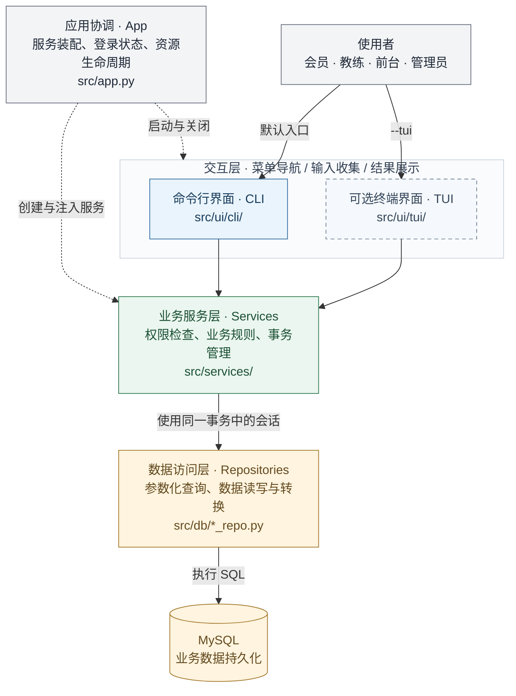

# 系统设计与架构方案

> 更新：2026-09-20
> 
> **阅读建议**：这份文档按"你要做什么 → 怎么做 → 具体规则"组织。先看[你的模块](#你要实现哪个模块)了解任务；需要对接时查看对应的[模块详细说明](#基础框架与公共-cli)；遇到具体问题时查阅[业务规则](#业务规则详解)。

---

## 目录

**快速导航**
- [项目概览](#项目概览) — 这个系统是做什么的
- [你要实现哪个模块](#你要实现哪个模块) — 按负责人分组的任务清单
  - [Jiafeng YE：账号与日志](#jiafeng-ye账号与日志)
  - [Xingzhou PENG：会员与产品](#xingzhou-peng会员与产品)
  - [Weijie ZHOU & Yuxi ZHU：课程与预约](#weijie-zhou--yuxi-zhu课程与预约)
  - [Yihao QIAN：签到与评价](#yihao-qian签到与评价)
  - [Tuao SONG & Mingjin LI：体测与器械](#tuao-song--mingjin-li体测与器械)
  - [Mingjin LI：报表](#mingjin-li报表)
  - [Lvzhen ZHOU：基础框架与其余部分](#lvzhen-zhou基础框架与其余部分)
  - [Guanyu ZHOU：文档与报告](#guanyu-zhou文档与报告)
- [开发前必读](#开发前必读) — 所有人都要遵守的规则

**模块详细说明**
- [基础框架与公共 CLI](#基础框架与公共-cli)
- [账号与日志模块](#账号与日志模块)
- [会员与产品模块](#会员与产品模块)
- [课程与预约模块](#课程与预约模块)
- [签到与评价模块](#签到与评价模块)
- [体测与器械模块](#体测与器械模块)
- [报表模块](#报表模块)

**参考资料**
- [业务规则详解](#业务规则详解) — 产品、门禁、预约、体测的详细规则
- [数据库设计](#数据库设计) — 表结构、字段、约束
- [公共类型定义](#公共类型定义) — 所有模块共用的数据类型

---

## 项目概览

### 这个系统是做什么的

健身房销售私教课和次卡，会员约课上课，教练管理课程。我们做一个命令行程序来管理这些。

**核心业务流程**：
1. 会员买私教课（附赠门禁卡）或买次卡（纯门禁）
2. 会员刷卡入场
3. 会员预约私教课
4. 上课时签到
5. 下课后消课（扣除课节）
6. 会员评价

**配套功能**：
- 教练录入体测数据
- 管理员管理器械
- 查看营收和统计报表

### 技术架构

```
命令行界面（CLI）
    ↓ 调用
业务服务层（Services）
    ↓ 调用
数据访问层（Repositories）
    ↓ 操作
MySQL 数据库
```

**技术选型**：
- Python 3.10+
- MySQL 8.4
- SQLAlchemy 2、PyMySQL
- argon2-cffi（Argon2id 密码哈希）
- 标准库 logging

**交互方式**：
- 默认：命令行界面（CLI）
- 可选：终端界面（TUI，根据时间补充）

---

## 系统架构与目录结构

### 整体架构



实线表示操作与调用方向，虚线表示应用的装配和生命周期管理。各业务服务的文件与职责见下方目录。

### 目录结构详解

<details>
    <summary>点击展开项目目录结构详解</summary>

```
cs2-group3-se/
│
├── main.py                         # 程序入口，解析命令行参数，启动 CLI/TUI
│
├── src/                            # 源代码根目录
│   │
│   ├── app.py                      # 应用协调层：管理服务实例、登录状态
│   ├── config.py                   # 配置读取：数据库连接、日志、时区
│   │
│   ├── cmd/                        # 数据库维护命令（独立于主程序）
│   │   ├── __init__.py
│   │   └── db.py                   # init：建表；seed：生成演示数据
│   │
│   ├── utils/                      # 工具模块（基础设施）
│   │   ├── __init__.py
│   │   └── logging_config.py       # 日志系统：配置、记录、脱敏、查询
│   │
│   ├── errors/                     # 异常定义与统一处理
│   │   ├── __init__.py             # 导出所有异常类型
│   │   ├── base.py                 # 基础异常类
│   │   ├── business.py             # 业务异常（InvalidInput, PermissionDenied 等）
│   │   ├── storage.py              # 存储异常（StorageError 等）
│   │   └── handler.py              # 统一错误处理：异常 → 中文提示
│   │
│   ├── models/                     # 数据模型与类型定义
│   │   ├── __init__.py
│   │   └── contracts.py            # 公共类型：Input（输入）、View（输出）、Page（分页）
│   │
│   ├── services/                   # 业务服务层（核心业务逻辑）
│   │   ├── __init__.py
│   │   ├── auth_service.py         # 账号管理：登录、创建账号、权限校验、日志查询
│   │   ├── member_service.py       # 会员服务：创建档案、更新信息、查询会员
│   │   ├── product_service.py      # 产品服务：销售产品（私教课+门禁）、入场登记
│   │   ├── course_service.py       # 课程服务：教练管理、课程定义、排课
│   │   ├── booking_service.py      # 预约服务：预约课程、取消预约、查询预约
│   │   ├── attendance_service.py   # 签到服务：签到、补签、消课、标记缺席
│   │   ├── review_service.py       # 评价服务：创建评价、查询评价
│   │   ├── measurement_service.py  # 体测服务：录入体测数据、查询历史
│   │   ├── equipment_service.py    # 器械服务：创建器械、报修、维护、退役
│   │   └── report_service.py       # 报表服务：收款统计、会员统计、CSV 导出
│   │
│   ├── db/                         # 数据访问层
│   │   ├── __init__.py
│   │   ├── connection.py           # 数据库连接池管理
│   │   ├── account_repo.py         # 账号表的增删改查
│   │   ├── member_repo.py          # 会员表的增删改查
│   │   ├── membership_repo.py      # 产品与销售表的增删改查
│   │   ├── course_repo.py          # 课程与排课表的增删改查
│   │   ├── booking_repo.py         # 预约表的增删改查
│   │   ├── attendance_repo.py      # 签到与消课表的增删改查
│   │   ├── review_repo.py          # 评价表的增删改查
│   │   ├── measurement_repo.py     # 体测表的增删改查
│   │   ├── equipment_repo.py       # 器械表的增删改查
│   │   ├── payment_repo.py         # 收款表的增删改查
│   │   ├── report_repo.py          # 报表查询
│   │   └── operation_repo.py       # 操作记录表的增删改查
│   │
│   └── ui/                         # 用户界面层
│       ├── __init__.py
│       ├── cli/                    # 命令行界面（默认）
│       │   ├── __init__.py
│       │   ├── app.py              # CLI 主循环：登录 → 菜单 → 操作 → 退出
│       │   ├── menus.py            # 菜单定义：按角色显示不同菜单
│       │   ├── prompts.py          # 输入收集：文本、数字、日期、确认
│       │   ├── formatters.py       # 结果展示：表格、详情、分页
│       │   └── handlers/           # 业务交互处理器（按模块分）
│       │       ├── __init__.py
│       │       ├── member.py       # 会员操作的交互步骤
│       │       ├── product.py      # 产品销售的交互步骤
│       │       ├── booking.py      # 预约操作的交互步骤
│       │       └── ...             # 其他模块的 Handler
│       │
│       └── tui/                    # 终端界面（可选，时间允许时补充）
│           ├── __init__.py
│           └── app.py              # TUI 启动与关闭
│
├── tests/                          # 测试代码
│   ├── models/                     # 数据模型测试
│   ├── services/                   # 业务服务测试
│   ├── db/                         # 数据访问层测试
│   ├── errors/                     # 异常处理测试
│   └── ui/                         # 界面层测试
│
├── sql/                            # SQL 脚本（如果不用 ORM 迁移工具）
│   └── 001_initial_schema.sql      # 初始建表脚本（占位）
│
├── logs/                           # 日志文件目录（运行时生成）
│   ├── app.log                     # 当前日志文件
│   ├── app.log.1                   # 轮转备份 1
│   ├── app.log.2                   # 轮转备份 2
│   └── app.log.3                   # 轮转备份 3
│
├── docs/                           # 文档目录
│   ├── architecture.md             # 本文件：系统设计与架构方案
│   ├── README.md                   # 阅读入口、操作步骤与文档索引
│   ├── project-standards.md        # 代码与文档规范
│   ├── 功能列表.csv                # 功能清单与实现状态
│   └── dev-materials-for-report/   # 报告素材（开发日志、决策记录等）
│
├── README.md                       # 项目概述与快速入口
├── requirements.txt                # 核心运行依赖
├── requirements-dev.txt            # 测试与开发依赖
└── .gitignore                      # Git 忽略规则
```

</details>

### 关键文件说明

#### 启动与配置
- **`main.py`**：程序入口，解析 `--tui` 和 `--config` 参数，启动界面
- **`src/config.py`**：从 JSON 配置文件读取数据库连接、日志目录和时区；`DB_PASSWORD` 可覆盖数据库密码
- **`src/app.py`**：创建所有服务实例，管理登录状态，协调应用生命周期

#### 业务核心
- **`src/services/*.py`**：业务规则、权限检查、事务管理的地方
  - 每个服务对应一个业务领域（会员、产品、预约等）
  - 所有写操作都在服务层开启和提交事务
  - 失败时回滚并抛出自定义异常

#### 数据访问
- **`src/db/*_repo.py`**：封装 SQL 查询，返回 ORM 对象或原始数据
  - 不包含业务规则，只负责数据库操作
  - 服务层调用 Repository，不直接写 SQL
  - 注：当前项目将所有 repo 文件直接放在 `src/db/` 下，未使用子目录

#### 界面层
- **`src/ui/cli/handlers/*.py`**：组织交互步骤
  - 收集用户输入（调用 `prompts`）
  - 调用业务服务
  - 展示结果（调用 `formatters`）
  - 不包含业务逻辑，只负责界面流程

#### 错误处理
- **`src/errors/base.py`**：基础异常类
- **`src/errors/business.py`**：业务异常（InvalidInput, PermissionDenied 等）
- **`src/errors/storage.py`**：存储异常（StorageError 等）
- **`src/errors/handler.py`**：统一错误处理，将异常转为中文提示

#### 日志系统
- **`src/utils/logging_config.py`**：配置日志、记录操作、查询日志
  - 日志文件：`logs/app.log`（5 MiB 轮转，保留 3 份备份）
  - 格式：UTF-8 单行 JSON
  - 脱敏：不记录密码、脱敏电话号码

#### 数据库维护
- **`src/cmd/db.py`**：独立于主程序的数据库命令
  - `python -m src.cmd.db init`：建表
  - `python -m src.cmd.db seed`：生成演示数据（4 个账号 + 2 个档案）

---

## 你要实现哪个模块

### Jiafeng YE：账号与日志

**你的任务**：
- 账号管理：创建账号、登录、权限校验
- 错误处理：统一处理所有模块的错误，生成中文提示
- 日志系统：记录操作日志、查询日志

**你的文件**：
- `src/services/auth_service.py` — 账号业务逻辑
- `src/db/account_repo.py` — 账号数据库操作
- `src/errors/` — 异常定义和处理
- `src/utils/logging_config.py` — 日志配置

**详细说明**：跳转到 [账号与日志模块](#账号与日志模块)

---

### Xingzhou PENG：会员与产品

**你的任务**：
- 会员档案：建档、查询、修改、启用/停用
- 产品销售：卖私教课、卖次卡、记录收款

**你的文件**：
- `src/services/member_service.py` — 会员业务逻辑
- `src/services/product_service.py` — 产品销售业务逻辑
- `src/db/member_repo.py` — 会员数据库操作
- `src/db/membership_repo.py` — 产品销售数据库操作
- `src/models/member.py` — 会员数据结构
- `src/models/membership.py` — 产品、会籍、门禁数据结构

**详细说明**：跳转到 [会员与产品模块](#会员与产品模块)

---

### Weijie ZHOU & Yuxi ZHU：课程与预约

**你们的任务**：
- 教练管理：建档、查询、修改
- 课程模板：创建课程、修改
- 场地管理：创建场地、修改
- 排课：安排具体课次（教练、场地、时间）
- 预约：会员预约课次、取消预约

**你们的文件**：
- `src/services/course_service.py` — 教练、课程、场地、排课
- `src/services/booking_service.py` — 预约、取消
- `src/db/course_repo.py` — 教练、课程、场地、课次数据库操作
- `src/db/booking_repo.py` — 预约数据库操作
- `src/models/course.py` — 课程相关数据结构
- `src/models/booking.py` — 预约数据结构

**详细说明**：跳转到 [课程与预约模块](#课程与预约模块)

---

### Yihao QIAN：签到与评价

**你的任务**：
- 签到：会员签到、教练补签
- 消课：扣除课节
- 缺席处理：释放课节占用
- 评价：会员评价课程

**你的文件**：
- `src/services/attendance_service.py` — 签到、消课、缺席
- `src/services/review_service.py` — 评价
- `src/db/attendance_repo.py` — 签到和消课数据库操作
- `src/db/review_repo.py` — 评价数据库操作
- `src/models/contracts.py` — 预约状态枚举（与预约模块共用）

**详细说明**：跳转到 [签到与评价模块](#签到与评价模块)

---

### Tuao SONG & Mingjin LI：体测与器械

**你们的任务**：
- 体测记录：教练录入体测数据、查询体测历史
- 器械管理：登记器械、报修、完成维修、报废

**你们的文件**：
- `src/services/measurement_service.py` — 体测业务逻辑
- `src/services/equipment_service.py` — 器械业务逻辑
- `src/db/measurement_repo.py` — 体测数据库操作
- `src/db/equipment_repo.py` — 器械数据库操作
- `src/models/measurement.py` — 体测数据结构
- `src/models/equipment.py` — 器械数据结构

**详细说明**：跳转到 [体测与器械模块](#体测与器械模块)

---

### Mingjin LI：报表

**你的任务**：
- 收款查询：查询收款记录
- 统计报表：营收、会员、课程、教练统计
- 数据导出：导出 CSV

**你的文件**：
- `src/services/report_service.py` — 报表业务逻辑
- `src/db/report_repo.py` — 报表数据库查询
- `src/db/payment_repo.py` — 收款数据库操作（被产品销售调用）

**详细说明**：跳转到 [报表模块](#报表模块)

---

### Lvzhen ZHOU：基础框架与其余部分

**你的任务**：
- 程序启动：参数解析、配置加载、数据库连接
- 数据库维护：建表命令、演示数据生成
- 公共 CLI：菜单、输入、格式化
- 门禁入场：会员刷卡入场
- 测试统筹：协调各模块测试、集成验收

**你的文件**：
- `main.py` — 程序入口
- `src/app.py` — 应用生命周期
- `src/config.py` — 配置管理
- `src/cmd/db.py` — 数据库维护命令
- `src/ui/cli/` — 公共 CLI 组件
- `src/services/product_service.py` 的入场部分

**详细说明**：分散在各模块中，重点查看 [开发前必读](#开发前必读)

---

### Guanyu ZHOU：文档与报告

**你的任务**：
- 维护项目文档
- 编写进展报告
- 整理开发素材

**你的文件**：
- `docs/` — 所有文档
- `docs/dev-materials-for-report/` — 报告素材

---

## 开发前必读

### 核心规则（必须遵守）

#### 1. 返回类型规则

**查询单条记录**：
```python
def get_member(self, actor, member_id) -> MemberView:
    # 找到了 → 返回 MemberView 对象
    # 找不到 → 抛 NotFoundError
    # 不要返回 None
```

**查询列表**：
```python
def list_members(self, actor, query) -> Page[MemberView]:
    # 有结果 → 返回 Page(items=[...], total=N)
    # 没结果 → 返回 Page(items=[], total=0)
    # 不要返回 None 或裸列表
```

**修改记录**：
```python
def update_member(self, actor, member_id, data) -> MemberView:
    # 成功 → 返回修改后的 MemberView 对象
    # 失败 → 抛异常
    # 不要返回 True/False
```

#### 2. 错误处理规则

**不要这样**：
```python
# ❌ 错误示例
def get_member(self, actor, member_id):
    try:
        member = self.repo.get(member_id)
        if member is None:
            return None  # ❌ 不要返回 None
    except Exception:
        return {"error": "查询失败"}  # ❌ 不要返回错误字典
```

**要这样**：
```python
# ✅ 正确示例
def get_member(self, actor, member_id):
    member = self.repo.get(member_id)
    if member is None:
        raise NotFoundError("会员不存在")  # ✅ 抛出异常
    return member
```

**异常类型对照表**：

| 情况 | 抛出的异常 | 例子 |
|------|----------|------|
| 输入不合法 | `InvalidInputError` | 姓名为空、金额为负数 |
| 没有权限 | `PermissionDenied` | 会员查询别人的档案 |
| 账号失效 | `AuthenticationError` | 账号被停用 |
| 记录不存在 | `NotFoundError` | 查询不存在的会员编号 |
| 业务冲突 | `ConflictError` | 重复预约同一课次 |
| 状态不允许 | `InvalidState` | 已取消的预约不能签到 |
| 数据库失败 | `StorageError` | 数据库连接断开 |

#### 3. 数据库事务规则

**在哪里提交**：
- 在**业务服务层**（`*_service.py`）提交或回滚
- 不要在**数据访问层**（`*_repo.py`）提交

**错误示例**：
```python
# member_repo.py
class MemberRepository:
    def create(self, data):
        member = Member(**data)
        self.session.add(member)
        self.session.commit()  # ❌ 不要在这里提交
        return member
```

**正确示例**：
```python
# member_service.py
class MemberService:
    def __init__(self, session_factory, auth: AuthService):
        self._session_factory = session_factory
        self._auth = auth

    def create_member(self, actor, data):
        with self._session_factory() as session:
            with session.begin():  # ✅ 在服务层管理事务
                self._auth.verify_actor(session, actor)
                repo = MemberRepository(session)
                member = repo.create(data)
                return member  # 退出 with 时自动提交
```

**为什么**：
- 一个业务操作可能涉及多个表（比如卖产品要同时写产品记录和收款记录）
- 这些操作必须一起成功或一起失败
- 只有业务服务层知道完整的事务边界

#### 4. 字段类型规则

**ID 和编号**：
```python
member_id: int  # 1 到 2^63-1 的整数
request_id: str  # 标准 UUID 字符串
```

**金额**：
```python
from decimal import Decimal
price = Decimal("199.00")  # 必须用字符串构造
# 不要用 float：Decimal(199.0) ❌
```

**日期和时间**：
```python
from datetime import date, datetime
business_date: date  # 纯日期，如 2026-09-20
starts_at: datetime  # 带时区的时刻，内部转 UTC 存储
```

**状态值**：
```python
status: Literal["active", "void"]  # 固定的英文值
# 不要用数字：0/1 ❌
# 不要用中文："启用" ❌
```

**可空字段**：
```python
phone: str | None  # 电话可以为空
# 空值用 None，不要用空字符串 "" ❌
```

### 常用术语解释

| 术语 | 含义 | 例子 |
|------|------|------|
| Actor | 当前操作的人（谁在操作） | 前台帮会员办卡，Actor 是前台账号 |
| View | 返回给界面看的数据 | `MemberView`：会员编号、姓名、电话 |
| Input | 提交给服务的数据 | `MemberInput`：姓名、电话 |
| Page | 分页结果 | `Page[MemberView]`：会员列表 + 总数 |
| Repository（repo） | 数据访问层 | 直接操作数据库的代码 |
| Service | 业务服务层 | 处理业务逻辑、权限、事务 |
| Handler | 界面处理器 | 组织一次用户交互 |
| Session | 数据库会话 | 一次操作使用的数据库连接 |
| 事务 | 一组操作一起成功或失败 | 卖产品 = 写产品记录 + 写收款记录 |

---

## 基础框架与公共 CLI

**负责人**：Lvzhen ZHOU

### 你要实现的功能

#### 1. 配置与程序启动

**配置格式**：
```python
# src/config.py
@dataclass(frozen=True, kw_only=True)
class StartupOptions:
    tui: bool = False
    config_path: str | None = None

@dataclass(frozen=True, kw_only=True)
class DatabaseConfig:
    """数据库配置；密码不参与对象的普通打印，字符集固定使用 utf8mb4。"""
    host: str
    port: int
    database: str
    username: str
    password: str = field(repr=False)
    charset: str = "utf8mb4"
    pool_size: int = 5

@dataclass(frozen=True, kw_only=True)
class LogConfig:
    directory: Path = Path("logs")
    level: str = "INFO"
    max_bytes: int = 5 * 1024 * 1024
    backup_count: int = 3

@dataclass(frozen=True, kw_only=True)
class AppSettings:
    database: DatabaseConfig
    timezone_name: str = "Asia/Shanghai"
    log: LogConfig = field(default_factory=LogConfig)
```

**读取配置**：
```python
# src/config.py
def load_config(config_path: str | None = None) -> AppSettings:
    """
    读取配置文件

    参数：
    - config_path: JSON 文件路径；None 使用当前目录的 config.json
    - database.password 必须是字符串并保留原值，允许为空
    - DB_PASSWORD 变量存在时覆盖数据库密码，包括空字符串
    - log.directory 为相对路径时，以配置文件所在目录为基准并转为绝对路径

    返回：AppSettings

    异常：
    - InvalidInputError: 配置缺失或格式不合法
    """
```

**解析启动参数**：
```python
# main.py
def parse_args(argv: list[str] | None = None) -> StartupOptions:
    """
    解析 --tui、--config 和 --help

    参数：argv 为参数列表；None 使用进程参数
    返回：StartupOptions
    异常：SystemExit（帮助为 0，参数错误为 2）
    """
```

**程序入口**：
```python
# main.py
def main(argv: list[str] | None = None) -> int:
    """
    加载配置、启动应用并在退出时关闭资源

    参数：argv 为参数列表；None 使用进程参数
    返回：正常退出为 0，启动、运行或资源关闭失败为 1，参数错误为 2
    清理：先保留主流程结果和安全提示，再关闭资源；关闭失败追加安全提示。
    """
```

**应用生命周期**：
```python
# src/app.py
class App:
    def __init__(self, settings: AppSettings) -> None:
        """保存应用配置。"""

    def start(self) -> None:
        """配置日志、检查数据库并装配服务；失败抛 GymError。"""

    def run(self, *, tui: bool = False) -> int:
        """运行 CLI 或可选 TUI，返回退出码。"""

    def close(self) -> None:
        """清除身份与界面引用并关闭资源；成功后清空引擎，允许重复调用。

        异常：StorageError（数据库资源关闭失败）；保留引擎供再次 close。
        关闭中断向调用方传播，资源归属同样保留。
        """

    def get_actor(self) -> Actor:
        """取得当前身份；未登录抛 AuthenticationError。"""

    def set_actor(self, actor: Actor) -> None:
        """保存登录服务返回的身份。"""

    def logout(self) -> None:
        """清除身份和私有交互状态。"""
```


#### 2. 数据库维护

**维护命令的数据格式**：
```python
# src/cmd/db.py
@dataclass(frozen=True, kw_only=True)
class InitResult:
    tables_created: int
    schema_version: int

@dataclass(frozen=True, kw_only=True)
class SeedResult:
    accounts_created: int
    members_created: int
    coaches_created: int

@dataclass(frozen=True, kw_only=True)
class DemoPasswordInput:
    member_password: str = field(repr=False)
    coach_password: str = field(repr=False)
    receptionist_password: str = field(repr=False)
    admin_password: str = field(repr=False)
```

**初始化数据库**：
```python
# src/cmd/db.py
def init_database(connection: Connection) -> InitResult:
    """
    按依赖顺序建表并记录结构版本

    参数：connection 为命令持有的专用数据库连接；获取命名锁、建表和记录版本使用同一连接
    返回：InitResult
    异常：
    - InvalidState: 目标数据库非空
    - InitializationError: 建表失败，携带已完成表名、失败步骤和结果未知标记
    """
```

**生成演示数据**：
```python
# src/cmd/db.py
def seed_demo_data(
    session: Session,
    passwords: DemoPasswordInput,
    *,
    seed: int | None = None,
) -> SeedResult:
    """
    创建四个账号、一个会员档案和一个教练档案

    参数：
    - session: 调用方提供的事务会话，由调用方提交或回滚
    - passwords: 四个账号的初始密码
    - seed: 电话生成的随机种子；None 使用本次随机值

    返回：SeedResult
    异常：InvalidState（未初始化）、ConflictError（数据已存在）、
          InvalidInputError（密码不合法）、StorageError（写入失败）
    """
```

演示电话只写入会员档案；教练表没有电话字段，因此不生成或写入教练电话。

**数据库命令入口**：
```python
# src/cmd/db.py
def main(argv: list[str] | None = None) -> int:
    """
    执行 init 或 seed 命令

    参数：支持 --config；seed 另接受 --seed
    返回：成功为 0，失败为 1，参数错误为 2
    """
```

**数据库连接与事务接口**：
```python
# src/db/connection.py
def check_connection(engine: Engine) -> None:
    """执行只读连通性检查；失败抛 StorageError。"""

def check_schema(engine: Engine, required_version: int) -> None:
    """只读检查结构版本和 18 张必需表；不提交事务。"""

def close_engine(engine: Engine) -> None:
    """调用 dispose 释放连接池，成功返回 None。

    异常：StorageError（关闭失败，固定安全提示，原异常作为 cause）；
          EOFError、KeyboardInterrupt 向调用方传播。
    调用方负责保留主流程错误，并单独报告关闭失败。
    """

def create_engine(settings: AppSettings) -> Engine:
    """创建 MySQL 连接池；连接超时 5 秒、读写超时 30 秒、池等待 5 秒，溢出连接数为 0。"""

def create_session_factory(engine: Engine) -> Callable[[], Session]:
    """每次调用返回独立会话，由调用方关闭。"""

def transaction(session: Session) -> AbstractContextManager[Session]:
    """成功提交；事务体失败或中断时回滚；提交确认丢失抛 OutcomeUnknownError。"""
```

应用、数据库维护和测试命令在关闭前保存主流程结果；关闭失败或关闭中断时返回 1，
保留已有安全提示并追加资源关闭提示。数据库写入的已提交结果保持原义。
App 关闭失败后保留引擎，成功重试关闭后才允许重新启动；pytest 将 fixture 关闭失败记为清理错误。


#### 3. 公共交互

**密码输入**：
```python
# src/ui/cli/prompts.py
def prompt_password(label: str) -> str:
    """
    不回显读取密码

    参数：label 为输入提示
    返回：原始密码字符串，q 和 Q 也作为密码字符
    异常：EOFError、KeyboardInterrupt（结束输入）、ResourceError（无法隐藏输入）
    """
```

**执行交互操作**：
```python
# src/ui/cli/app.py
def invoke_action(
    action: Callable[[], None],
    *,
    operation: str,
    actor_id: int | None = None,
    request_id: str | None = None,
) -> ErrorResult:
    """
    执行操作并统一处理异常

    参数：action 为交互函数，其余参数为操作名称、操作人和请求编号
    返回：ErrorResult，保留错误处理返回的 request_id 和 record_id
          成功或取消时 message=""、action="continue"
    异常：EOFError、KeyboardInterrupt 传播到程序入口，清理后正常退出
    """
```

**菜单数据格式**：
```python
# src/ui/cli/menus.py
@dataclass(frozen=True, kw_only=True)
class MenuItem:
    key: str
    label: str
    operation: str
    action: Callable[[], None]

@dataclass(frozen=True, kw_only=True)
class CliHandlers:
    auth: AuthHandler
    member: MemberHandler
    product: ProductHandler
    course: CourseHandler
    booking: BookingHandler
    attendance: AttendanceHandler
    review: ReviewHandler
    equipment: EquipmentHandler
    measurement: MeasurementHandler
    report: ReportHandler
```

**产品菜单**：
```python
# src/ui/cli/menus.py
def product_menu(handler: ProductHandler) -> list[MenuItem]:
    """
    创建产品模块的菜单项

    参数：handler 为产品交互处理器
    返回：list[MenuItem]
    """
```

**统一测试命令**：
```python
# src/cmd/test.py
@dataclass(frozen=True, kw_only=True)
class TestSettings:
    test_database: bool
    app: AppSettings

def load_test_config(config_path: str) -> TestSettings:
    """读取测试配置；根对象必须包含 test_database=true 和 app 配置。"""

def main(argv: list[str] | None = None) -> int:
    """运行 pytest；默认排除 mysql 标记，mysql/all 模式需显式测试配置。"""
```

`python -m src.cmd.test` 运行不依赖 MySQL 的测试；`mysql --config PATH` 运行 MySQL
测试；`all --config PATH` 运行全部测试。测试命令自身的参数错误返回 2，测试或环境失败返回 1。

测试库名以 `_test` 结尾，只使用 `TEST_DB_PASSWORD` 覆盖密码（包含空字符串）。
控制连接持有 `cs2g3:test:` 加库名 SHA-256 摘要前 40 位的命名锁，等待时间为 0，
保持到 pytest 子进程结束。子进程通过 `GYM_TEST_CONFIG`、`GYM_TEST_MODE` 和
`GYM_TEST_LOCK_OWNER` 接收绝对配置路径、模式和持锁连接编号；fixture 核验持锁者。
默认模式清除上述变量及两个数据库密码变量。MySQL 模式也清除 `DB_PASSWORD`。
清理前核验测试标记、当前数据库名和对象集合；按固定逆外键顺序清理设计中的表。
未知表或视图使测试失败。`empty_mysql_database` 提供空库；
`initialized_mysql_database` 提供版本 1 结构，清除业务记录并保留版本行。

**CLI 测试进程**：
```python
# tests/conftest.py：run_cli fixture 提供的调用接口
def run_cli_process(
    argv: list[str], *, env: dict[str, str] | None = None,
    timeout: float = 120.0,
) -> CompletedProcess[str]:
    """从仓库根目录使用当前解释器运行 main.py，发送 0\\n 并关闭标准输入。

    返回：退出码、UTF-8 stdout 和 stderr；超时必须为有限正数。
    异常：TimeoutExpired、KeyboardInterrupt 等在子进程回收后传播。
    失败清理：terminate 后等待 5 秒；仍未结束则 kill，再 wait 确认退出。
    所有退出路径关闭管道；测试在返回后检查登录菜单文字和退出码。
    """
```

run_cli fixture 在自身结束时回收尚存进程；数据库测试同时依赖 run_cli 和数据库 fixture，
数据库清理前再次回收本用例进程。pytest 运行在独立进程组；Windows 的 Ctrl+Break
由测试钩子转换为 KeyboardInterrupt，POSIX 使用 SIGINT。测试父进程中断时，统一测试命令给 pytest 10 秒完成
进程回收和 fixture 清理，超时后终止 pytest 进程树并确认结束，再释放测试库命名锁。
主入口集成测试从测试配置解析 AppSettings，以临时普通应用 JSON 和子进程独立环境启动；
密码经子进程 DB_PASSWORD 提供。只有登录菜单输出及退出码均正确，才算启动验收通过。

**普通输入与分页**：
```python
# src/ui/cli/prompts.py
def prompt_text(label: str, *, allow_empty: bool = False) -> str:
    """去首尾空白；q/Q 抛 InputCancelled；非法空值提示重输。"""

def prompt_optional_text(label: str) -> str | None:
    """空输入返回 None；q/Q 取消。"""

def prompt_int(label: str, *, minimum: int | None = None, maximum: int | None = None) -> int:
    """读取十进制整数，检查包含边界，非法时重输。"""

def prompt_decimal(label: str, *, minimum: Decimal | None = None) -> Decimal:
    """读取有限十进制数，最多两位小数，检查包含下界，非法时重输。"""

def prompt_date(label: str) -> date:
    """按 YYYY-MM-DD 读取有效日期。"""

def prompt_datetime(label: str, *, timezone_name: str) -> datetime:
    """按 YYYY-MM-DD HH:MM 读取门店时刻，返回 UTC；夏令时重复或不存在的时刻重输。"""

def prompt_confirm(label: str) -> bool:
    """y 返回 True，n 返回 False，q/Q 取消；其余重输。"""

def prompt_member_id() -> int:
    """读取正整数会员编号。"""

# src/ui/cli/menus.py
def browse_pages(fetch_page: Callable[[PageRequest], Page[T]], format_page: Callable[[Page[T]], str], *, page_size: int = 20) -> None:
    """从第一页查询并展示；n/p 翻页、0 返回；每页 1～100 条，非法大小抛 InvalidInputError。"""

# src/ui/cli/app.py
class GymCLI:
    def __init__(self, handlers: CliHandlers, get_actor: Callable[[], Actor], logout: Callable[[], None]) -> None:
        """保存交互处理器及身份回调。"""

    def run(self) -> int:
        """运行登录、主菜单及子菜单；顶层 0 退出，子菜单 0 返回，退出登录清除身份。"""
```

**构造接口**：
```python
# src/services/attendance_service.py
class AttendanceService:
    def __init__(self, session_factory: Callable[[], Session], auth: AuthService) -> None:
        """保存依赖，由 App 统一装配。"""

# src/services/auth_service.py
class AuthService:
    def __init__(self, session_factory: Callable[[], Session]) -> None:
        """保存数据库会话依赖，由 App 统一装配；日志接口的资源由日志模块负责。"""

# src/services/booking_service.py
class BookingService:
    def __init__(self, session_factory: Callable[[], Session], auth: AuthService, *, timezone_name: str) -> None:
        """保存依赖，由 App 统一装配。"""

# src/services/course_service.py
class CourseService:
    def __init__(self, session_factory: Callable[[], Session], auth: AuthService) -> None:
        """保存依赖，由 App 统一装配。"""

# src/services/equipment_service.py
class EquipmentService:
    def __init__(self, session_factory: Callable[[], Session], auth: AuthService) -> None:
        """保存依赖，由 App 统一装配。"""

# src/services/measurement_service.py
class MeasurementService:
    def __init__(self, session_factory: Callable[[], Session], auth: AuthService) -> None:
        """保存依赖，由 App 统一装配。"""

# src/services/member_service.py
class MemberService:
    def __init__(self, session_factory: Callable[[], Session], auth: AuthService) -> None:
        """保存依赖，由 App 统一装配。"""

# src/services/product_service.py
class ProductService:
    def __init__(self, session_factory: Callable[[], Session], auth: AuthService, *, timezone_name: str) -> None:
        """保存依赖，由 App 统一装配。"""

# src/services/report_service.py
class ReportService:
    def __init__(self, session_factory: Callable[[], Session], auth: AuthService, *, timezone_name: str) -> None:
        """保存依赖，由 App 统一装配。"""

# src/services/review_service.py
class ReviewService:
    def __init__(self, session_factory: Callable[[], Session], auth: AuthService) -> None:
        """保存依赖，由 App 统一装配。"""

# src/ui/cli/handlers/attendance.py
class AttendanceHandler:
    def __init__(self, service: AttendanceService, get_actor: Callable[[], Actor], *, timezone_name: str) -> None:
        """保存依赖，由 App 统一装配。"""

# src/ui/cli/handlers/auth.py
class AuthHandler:
    def __init__(self, service: AuthService, get_actor: Callable[[], Actor], set_actor: Callable[[Actor], None], logout: Callable[[], None], *, timezone_name: str) -> None:
        """保存依赖，由 App 统一装配。"""

# src/ui/cli/handlers/booking.py
class BookingHandler:
    def __init__(self, service: BookingService, get_actor: Callable[[], Actor], course_service: CourseService, product_service: ProductService, *, timezone_name: str) -> None:
        """保存依赖，由 App 统一装配。"""

# src/ui/cli/handlers/course.py
class CourseHandler:
    def __init__(self, service: CourseService, get_actor: Callable[[], Actor], *, timezone_name: str) -> None:
        """保存依赖，由 App 统一装配。"""

# src/ui/cli/handlers/equipment.py
class EquipmentHandler:
    def __init__(self, service: EquipmentService, get_actor: Callable[[], Actor], *, timezone_name: str) -> None:
        """保存依赖，由 App 统一装配。"""

# src/ui/cli/handlers/measurement.py
class MeasurementHandler:
    def __init__(self, service: MeasurementService, get_actor: Callable[[], Actor], *, timezone_name: str) -> None:
        """保存依赖，由 App 统一装配。"""

# src/ui/cli/handlers/member.py
class MemberHandler:
    def __init__(self, service: MemberService, get_actor: Callable[[], Actor], *, timezone_name: str) -> None:
        """保存依赖，由 App 统一装配。"""

# src/ui/cli/handlers/product.py
class ProductHandler:
    def __init__(self, service: ProductService, get_actor: Callable[[], Actor], *, timezone_name: str) -> None:
        """保存依赖，由 App 统一装配。"""

# src/ui/cli/handlers/report.py
class ReportHandler:
    def __init__(self, service: ReportService, get_actor: Callable[[], Actor], *, timezone_name: str) -> None:
        """保存依赖，由 App 统一装配。"""

# src/ui/cli/handlers/review.py
class ReviewHandler:
    def __init__(self, service: ReviewService, get_actor: Callable[[], Actor], *, timezone_name: str) -> None:
        """保存依赖，由 App 统一装配。"""
```

**服务和处理器装配**：各构造函数保存现有参数，分别使用 `_session_factory`、`_auth`、
`_service`、`_get_actor`、`_set_actor`、`_logout`、`_timezone_name` 等同名私有属性。
`App.start` 检查版本 1，再创建固定的 `ServiceBundle` 和 `CliHandlers`。
`App.close` 清除身份和界面引用、释放引擎；成功后清空引擎，失败时保留以便重试。
部分启动和重复清理均可调用；主流程错误与关闭错误分别保留安全提示。
菜单函数返回已交付操作的 `list[MenuItem]`，空列表显示待接入提示。
账号管理面向管理员，报表面向管理员和前台，体测面向会员和教练；各服务继续验证实际权限。

**格式化接口**：
```python
# src/ui/cli/formatters.py
def format_account(view: AccountView, *, timezone_name: str) -> str:
    """将固定数据格式转为中文文本，异常向调用方传播。"""

def format_member(member: MemberView, *, timezone_name: str) -> str:
    """将固定数据格式转为中文文本，异常向调用方传播。"""

def format_card_product(view: CardProductView, *, timezone_name: str) -> str:
    """将固定数据格式转为中文文本，异常向调用方传播。"""

def format_card(view: CardView, *, timezone_name: str) -> str:
    """将固定数据格式转为中文文本，异常向调用方传播。"""

def format_sale(view: SaleView, *, timezone_name: str) -> str:
    """将固定数据格式转为中文文本，异常向调用方传播。"""

def format_entry(view: EntryView, *, timezone_name: str) -> str:
    """将固定数据格式转为中文文本，异常向调用方传播。"""

def format_coach(view: CoachView, *, timezone_name: str) -> str:
    """将固定数据格式转为中文文本，异常向调用方传播。"""

def format_course(view: CourseView, *, timezone_name: str) -> str:
    """将固定数据格式转为中文文本，异常向调用方传播。"""

def format_room(view: RoomView, *, timezone_name: str) -> str:
    """将固定数据格式转为中文文本，异常向调用方传播。"""

def format_session(view: SessionView, *, timezone_name: str) -> str:
    """将固定数据格式转为中文文本，异常向调用方传播。"""

def format_booking(view: BookingView, *, timezone_name: str) -> str:
    """将固定数据格式转为中文文本，异常向调用方传播。"""

def format_consumption(view: ConsumptionView, *, timezone_name: str) -> str:
    """将固定数据格式转为中文文本，异常向调用方传播。"""

def format_review(view: ReviewView, *, timezone_name: str) -> str:
    """将固定数据格式转为中文文本，异常向调用方传播。"""

def format_equipment(view: EquipmentView, *, timezone_name: str) -> str:
    """将固定数据格式转为中文文本，异常向调用方传播。"""

def format_maintenance(view: MaintenanceView, *, timezone_name: str) -> str:
    """将固定数据格式转为中文文本，异常向调用方传播。"""

def format_measurement(view: MeasurementView, *, timezone_name: str) -> str:
    """将固定数据格式转为中文文本，异常向调用方传播。"""

def format_measurement_comparison(view: MeasurementComparison, *, timezone_name: str) -> str:
    """将固定数据格式转为中文文本，异常向调用方传播。"""

def format_payment(view: PaymentView, *, timezone_name: str) -> str:
    """将固定数据格式转为中文文本，异常向调用方传播。"""

def format_revenue(view: RevenueView, *, timezone_name: str) -> str:
    """将固定数据格式转为中文文本，异常向调用方传播。"""

def format_membership_stats(view: MembershipStats, *, timezone_name: str) -> str:
    """将固定数据格式转为中文文本，异常向调用方传播。"""

def format_session_stats(view: SessionStatsView, *, timezone_name: str) -> str:
    """将固定数据格式转为中文文本，异常向调用方传播。"""

def format_coach_stats(view: CoachStatsView, *, timezone_name: str) -> str:
    """将固定数据格式转为中文文本，异常向调用方传播。"""

def format_accounts(page: Page[AccountView], *, timezone_name: str) -> str:
    """将固定数据格式转为中文文本，异常向调用方传播。"""

def format_members(page: Page[MemberView], *, timezone_name: str) -> str:
    """将固定数据格式转为中文文本，异常向调用方传播。"""

def format_products(page: Page[CardProductView], *, timezone_name: str) -> str:
    """将固定数据格式转为中文文本，异常向调用方传播。"""

def format_cards(page: Page[CardView], *, timezone_name: str) -> str:
    """将固定数据格式转为中文文本，异常向调用方传播。"""

def format_coaches(page: Page[CoachView], *, timezone_name: str) -> str:
    """将固定数据格式转为中文文本，异常向调用方传播。"""

def format_courses(page: Page[CourseView], *, timezone_name: str) -> str:
    """将固定数据格式转为中文文本，异常向调用方传播。"""

def format_rooms(page: Page[RoomView], *, timezone_name: str) -> str:
    """将固定数据格式转为中文文本，异常向调用方传播。"""

def format_sessions(page: Page[SessionView], *, timezone_name: str) -> str:
    """将固定数据格式转为中文文本，异常向调用方传播。"""

def format_bookings(page: Page[BookingView], *, timezone_name: str) -> str:
    """将固定数据格式转为中文文本，异常向调用方传播。"""

def format_reviews(page: Page[ReviewView], *, timezone_name: str) -> str:
    """将固定数据格式转为中文文本，异常向调用方传播。"""

def format_equipment_list(page: Page[EquipmentView], *, timezone_name: str) -> str:
    """将固定数据格式转为中文文本，异常向调用方传播。"""

def format_maintenance_records(page: Page[MaintenanceView], *, timezone_name: str) -> str:
    """将固定数据格式转为中文文本，异常向调用方传播。"""

def format_measurements(page: Page[MeasurementView], *, timezone_name: str) -> str:
    """将固定数据格式转为中文文本，异常向调用方传播。"""

def format_payments(page: Page[PaymentView], *, timezone_name: str) -> str:
    """将固定数据格式转为中文文本，异常向调用方传播。"""

def format_session_stats_page(page: Page[SessionStatsView], *, timezone_name: str) -> str:
    """将固定数据格式转为中文文本，异常向调用方传播。"""

def format_coach_stats_page(page: Page[CoachStatsView], *, timezone_name: str) -> str:
    """将固定数据格式转为中文文本，异常向调用方传播。"""
```

**格式化规则**：`src/ui/cli/formatters.py` 的详情函数显式读取对应 View 字段，
分页函数接收 `Page[View]`，返回中文文本。金额两位小数，状态译成中文，空值显示“—”，
时刻按 `timezone_name` 转换并显示时区偏移，日期原样显示。会员联系方式遮住中间四位；
卡的 `valid_until` 标为“不含当日”，剩余和占用分别显示。分页显示页码、总数及空页提示。
业务说明和备注中的控制字符转为可见转义文本。

---

## 账号与日志模块

**负责人**：Jiafeng YE

### 你要实现的功能

#### 1. 账号管理

**创建账号**：
```python
def create_account(self, actor: Actor, data: AccountInput) -> AccountView:
    """
    创建新账号
    
    参数：
    - actor: 当前操作人（必须是管理员）
    - data: AccountInput
      - username: 用户名（3-50 位 ASCII 字母、数字或下划线）
      - password: 密码（6-32 位 ASCII 字母、数字、下划线或短横线）
      - role: 角色（"member" | "coach" | "receptionist" | "admin"）
    
    返回：AccountView（新账号信息，不含密码）
    
    可能的错误：
    - 不是管理员 → PermissionDenied
    - 用户名重复 → ConflictError
    - 用户名或密码不符合格式 → InvalidInputError
    
    注意：
    - 密码要用哈希算法加密后存储
    - 用户名转小写并去首尾空白
    - 密码按原值校验并哈希（不转小写、不去空白）
    """
```

**登录**：
```python
def login(self, username: str, password: str) -> Actor:
    """
    用户登录
    
    参数：
    - username: 用户名
    - password: 密码（明文）
    
    返回：Actor
      - account_id: 账号编号
      - role: 角色
      - member_id: 会员编号（如果是会员）
      - coach_id: 教练编号（如果是教练）
    
    可能的错误：
    - 用户名或密码错误 → AuthenticationError
    - 账号已停用 → AuthenticationError
    
    注意：
    - 登录成功后，App 会保存 Actor
    - 后续每次操作都会传入这个 Actor
    """
```

**身份校验（内部方法）**：
```python
def verify_actor(self, session: Session, actor: Actor) -> Actor:
    """
    校验当前身份是否仍然有效
    
    用途：
    - 每个业务操作开始时调用
    - 检查账号是否被停用
    - 检查档案关联是否变化
    
    参数：
    - session: 数据库会话（调用方提供）
    - actor: 当前身份
    
    返回：Actor（最新的身份信息）
    
    可能的错误：
    - 账号已停用 → AuthenticationError
    - 权限变化 → AuthenticationError
    
    注意：
    - 这个方法会被其他所有服务调用
    - 不要在这里提交事务
    """
```

**创建账号服务**：
```python
def __init__(self, session_factory: Callable[[], Session]) -> None:
    """
    创建账号服务

    参数：session_factory 为数据库会话工厂
    返回：None
    """
```

**查询账号**：
```python
def get_account(self, actor: Actor, account_id: int) -> AccountView:
    """
    查询账号详情

    参数：actor 为管理员身份，account_id 为目标账号编号
    返回：AccountView
    异常：PermissionDenied（非管理员）、NotFoundError（账号不存在）
    """

def list_accounts(self, actor: Actor, query: NamedQuery) -> Page[AccountView]:
    """
    分页查询账号

    参数：actor 为管理员身份，query 为用户名、启用状态和分页条件
    返回：Page[AccountView]
    异常：PermissionDenied（非管理员）、InvalidInputError（查询条件不合法）
    """
```

**启用/停用账号**：
```python
def set_account_active(self, actor: Actor, account_id: int, active: bool) -> AccountView:
    """
    修改账号启用状态

    参数：actor 为管理员身份，active 为目标状态
    返回：AccountView
    异常：PermissionDenied（非管理员）、NotFoundError（账号不存在）、
          InvalidState（停用最后一名启用管理员）
    """
```

**关联账号与档案**：
```python
def link_profile(self, actor: Actor, account_id: int, data: AccountLinkInput) -> AccountView:
    """
    将指定会员或教练档案关联到目标账号

    参数：actor 为管理员身份；data 中 member_id 和 coach_id 恰有一项非空
    返回：目标账号的 AccountView
    异常：PermissionDenied（非管理员）、NotFoundError（记录不存在）、
          InvalidState（角色不匹配）、ConflictError（目标账号已关联其他档案）
    """
```

**账号仓储接口**：
```python
# src/db/account_repo.py
class AccountRepository:
    def __init__(self, session: Session) -> None: ...
    def get(self, account_id: int) -> Account | None: ...
    def lock(self, account_id: int) -> Account | None: ...
    def find_by_username(self, username: str) -> Account | None: ...
    def get_actor(self, account_id: int) -> Actor | None: ...
    def create(self, *, username: str, password_hash: str, role: Role) -> Account: ...
    def list(self, query: NamedQuery) -> Page[AccountView]: ...
    def set_active(self, account_id: int, active: bool) -> AccountView: ...
```

**密码哈希与验证**：
```python
# src/utils/passwords.py
def hash_password(password: str) -> str:
    """
    校验密码并生成带随机盐的哈希

    参数：password 为原始密码，允许 ASCII 字母、数字、短横线和下划线，共 6-32 位
    返回：包含算法、参数和盐的哈希字符串
    异常：InvalidInputError（密码格式不合法）、ResourceError（哈希工具不可用）
    """

def verify_password(password: str, password_hash: str) -> bool:
    """
    核对密码与存储的哈希

    参数：password 为原始密码，password_hash 为已存储的哈希字符串
    返回：匹配为 True，不匹配或密码格式不合法为 False
    异常：StorageError（已存哈希损坏）、ResourceError（哈希工具不可用）
    """
```

#### 2. 错误处理

**统一处理入口**：
```python
def handle_error(
    error: Exception, 
    *, 
    operation: str,
    actor_id: int | None = None,
    request_id: str | None = None,
    fatal: bool = False
) -> ErrorResult:
    """
    统一处理所有模块的错误
    
    参数：
    - error: 捕获到的异常
    - operation: 操作名称（如 "member.create"）
    - actor_id: 操作人编号
    - request_id: 请求编号（如果有）
    - fatal: 是否致命错误（如启动失败）
    
    返回：ErrorResult
      - message: 中文提示（给用户看）
      - action: 下一步动作（"continue" | "login" | "exit" | "verify"）
      - request_id: 请求编号（如果有）
      - record_id: 原记录编号（如果有）
    
    功能：
    1. 根据异常类型生成中文提示
    2. 决定下一步动作（继续、重新登录、退出、核实结果）
    3. 记录脱敏日志
    4. 返回处理结果（界面显示）
    
    注意：
    - 不要在日志中记录密码、体测明细、完整联系方式
    - 数据库错误不要暴露 SQL 或连接信息
    """
```

**异常定义**：
```python
# src/errors/base.py
class GymError(Exception):
    """所有业务异常的基类"""
    
# src/errors/business.py
class InvalidInputError(GymError): pass  # 输入不合法
class AuthenticationError(GymError): pass  # 账号失效
class PermissionDenied(GymError): pass  # 没权限
class NotFoundError(GymError): pass  # 记录不存在
class InvalidState(GymError): pass  # 状态不允许
class ConflictError(GymError): pass  # 业务冲突

# src/errors/storage.py
class StorageError(GymError): pass  # 数据库失败
class OutcomeUnknownError(StorageError):
    """提交结果未知，携带核实所需的编号。"""

    request_id: str | None
    record_id: int | None

    def __init__(
        self, message: str, *, request_id: str | None = None,
        record_id: int | None = None,
    ) -> None:
        """保存安全提示、原请求编号及原业务记录编号。"""

class InitializationError(StorageError):
    """初始化失败，携带已完成步骤和结果是否未知。"""

    completed_tables: tuple[str, ...]
    failed_step: str
    outcome_unknown: bool

    def __init__(
        self, message: str, *, completed_tables: tuple[str, ...], failed_step: str,
        outcome_unknown: bool = False,
    ) -> None:
        """保存安全提示、已完成表名、失败步骤和结果状态。

        completed_tables 只记录已经收到 CREATE TABLE 成功响应的表。
        """

# src/errors/business.py
class ResourceError(GymError): pass  # 文件或工具不可用
```

**错误处理结果**：
```python
# src/errors/base.py
ErrorAction = Literal["continue", "login", "exit", "verify"]

@dataclass(frozen=True, kw_only=True)
class ErrorResult:
    message: str
    action: ErrorAction
    request_id: str | None = None
    record_id: int | None = None
```

#### 3. 日志系统

**日志记录**：
```python
def log_event(
    level: int,
    *,
    operation: str,
    outcome: str,
    actor_id: int | None = None,
    request_id: str | None = None,
    result_id: int | None = None,
    error: Exception | None = None,
    attendance_change: AttendanceChange | None = None,
) -> bool:
    """
    记录操作日志
    
    参数：
    - level: 日志级别（logging.INFO / WARNING / ERROR）
    - operation: 操作名称（如 "member.create"）
    - outcome: 结果（"success" | "rejected" | "failed" | "unknown"）
    - actor_id: 操作人编号
    - request_id: 请求编号
    - result_id: 结果记录编号
    - error: 异常对象（如果有）
    - attendance_change: 更正签到前后的状态；其他操作为 None
    
    返回：是否记录成功
    
    格式：UTF-8 单行 JSON
    {
      "timestamp": "2026-09-20T10:30:00.123456+00:00",
      "level": "INFO",
      "operation": "member.create",
      "outcome": "success",
      "actor_id": 1,
      "request_id": "123e4567-e89b-12d3-a456-426614174000",
      "result_id": 42,
      "error_type": null,
      "error_message": null,
      "attendance_change": null,
      "frames": [],
      "truncated": false
    }
    
    注意：
    - 单条日志最大 16 KiB，超长截断并标记
    - 不记录敏感信息（密码、体测、联系方式）
    - 不记录完整的异常消息（可能含 SQL）
    - 只记录堆栈的文件名、行号、函数名
    """
```

**配置与关闭日志**：
```python
# src/utils/logging_config.py
def configure_logging(settings: AppSettings) -> None:
    """
    按应用配置建立日志处理器

    参数：settings.log 提供目录、级别和轮转容量
    返回：None
    异常：ResourceError（日志资源无法初始化）
    """

def close_logging() -> None:
    """
    刷新并关闭日志资源

    返回：None；允许重复调用，关闭失败向标准错误输出安全提示
    """
```

**日志轮转**：
- 日志文件：`logs/app.log`
- 单文件大小：5 MiB
- 保留份数：4 份（当前 + 3 份备份）
- 总大小：约 20 MiB

**日志查询**：
```python
def query_logs(
    self,
    actor: Actor,
    query: LogQuery,
    *,
    snapshot: LogSnapshot,
) -> Page[LogEntry]:
    """
    查询日志记录
    
    参数：
    - actor: 当前操作人（必须是管理员）
    - query: 查询条件（LogQuery 对象，包含时间范围、日志级别、操作名称等）
    - snapshot: 本次浏览的快照，筛选和翻页沿用同一份
    
    返回：Page[LogEntry]
    
    异常：
    - PermissionDenied: 非管理员调用时抛出

    注意：
    - 按时间倒序分页；时间相同时按文件中的记录顺序倒序
    - 刷新时重新取得快照并回到第一页
    - 每次查询重新校验管理员身份
    """
```

**取得日志快照**：
```python
# AuthService
def open_log_snapshot(self, actor: Actor) -> LogSnapshot:
    """
    取得一次日志浏览的快照

    参数：actor 为管理员身份；日志资源按既定日志模块接口取得
    返回：LogSnapshot
    异常：PermissionDenied（非管理员）、ResourceError（读取失败）
    """
```

**读取与筛选日志文件**：
```python
# src/utils/logging_config.py
def read_log_snapshot(directory: Path) -> LogSnapshot:
    """
    读取当前日志和三份备份

    参数：directory 为日志目录
    返回：LogSnapshot；无日志时 entries 为空，损坏行计入 skipped_lines
    异常：ResourceError（文件或文件锁不可用）
    注意：文件锁内复制内容，释放锁后解析
    """

def query_log_snapshot(snapshot: LogSnapshot, query: LogQuery) -> Page[LogEntry]:
    """
    筛选快照中的记录并分页

    参数：snapshot 为固定快照，query 为筛选条件和分页参数
    返回：Page[LogEntry]
    异常：InvalidInputError（查询条件不合法）
    """
```

**日志查询交互**：
```python
# src/ui/cli/handlers/auth.py：AuthHandler
def query_logs(self) -> None:
    """
    组织管理员日志查询、筛选、翻页、详情和刷新

    返回：None
    异常：由 CLI 的 invoke_action 统一处理
    """
```

**本机日志命令入口**：
```python
# src/cmd/logs.py
def main(argv: list[str] | None = None) -> int:
    """
    从配置目录读取日志并进入查询交互

    参数：支持 --config，按本机文件读取权限访问日志
    返回：正常退出为 0，读取失败为 1，参数错误为 2
    """
```

### 与其他模块的对接

**其他服务调用你的方法**：
```python
# 在 MemberService 中
class MemberService:
    def __init__(self, session_factory, auth: AuthService):
        self._session_factory = session_factory
        self._auth = auth  # 注入 AuthService
    
    def create_member(self, actor, data):
        with self._session_factory() as session:
            with session.begin():
                # 1. 调用你的身份校验
                current = self._auth.verify_actor(session, actor)
                
                # 2. 检查权限
                if current.role not in ("admin", "receptionist"):
                    raise PermissionDenied("只有管理员和前台能建档")
                
                # 3. 执行业务逻辑
                ...
```

**界面调用你的错误处理**：
```python
# 在 CLI 主循环中
from src.errors import handle_error

try:
    handler.create_member()  # 调用某个操作
except Exception as error:
    result = handle_error(
        error,
        operation="member.create",
        actor_id=current_user.account_id
    )
    print(result.message)  # 显示中文提示
    
    if result.action == "exit":
        sys.exit(1)  # 退出程序
    elif result.action == "login":
        clear_session()  # 重新登录
```

### 测试要点

1. **密码哈希**：
   - 同一密码生成不同哈希（每次随机盐）
   - 正确密码可以验证通过
   - 错误密码验证失败

2. **身份校验**：
   - 账号停用后，verify_actor 抛出 AuthenticationError
   - 档案解绑后，verify_actor 抛出 AuthenticationError

3. **错误处理**：
   - InvalidInputError → action="continue", 警告级别
   - AuthenticationError → action="login", 警告级别
   - StorageError → action="exit", 错误级别
   - OutcomeUnknownError → action="verify", 错误级别

4. **日志系统**：
   - 轮转：文件超过 5 MiB 后自动切换
   - 脱敏：日志中不含密码、SQL、完整电话
   - 并发：多进程同时写入不会互相覆盖
   - 查询：按时间、级别、操作筛选正确

---

## 会员与产品模块

**负责人**：Xingzhou PENG

### 你要实现的功能

#### 1. 会员档案管理

**建档**：
```python
def create_member(self, actor: Actor, data: MemberInput) -> MemberView:
    """
    创建会员档案
    
    权限：管理员、前台
    
    参数：
    - actor: 当前操作人
    - data: MemberInput
      - name: 姓名（1-100 字，去首尾空白）
      - phone: 电话（字段必须传入；值可以为空，非空时为 1-32 位）
    
    返回：MemberView
      - id: 会员编号
      - account_id: 关联账号编号（可能为空）
      - name: 姓名
      - phone: 电话
      - is_active: 是否启用
    
    业务规则：
    - 姓名不能为空
    - 电话可以为空（None），但不能是空字符串
    - 初始状态为启用
    - 可以先建档后开账号
    """
```

**查询单个会员**：
```python
def get_member(self, actor: Actor, member_id: int) -> MemberView:
    """
    查询会员详情
    
    权限：
    - 会员：只能查自己
    - 管理员、前台：可以查所有人
    
    参数：
    - actor: 当前操作人
    - member_id: 会员编号
    
    返回：MemberView
    
    可能的错误：
    - 会员不存在 → NotFoundError
    - 会员查询别人 → NotFoundError（不暴露是否存在）
    """
```

**查询会员列表**：
```python
def list_members(self, actor: Actor, query: MemberQuery) -> Page[MemberView]:
    """
    分页查询会员列表
    
    权限：
    - 会员：只能查自己（返回单条记录的列表）
    - 管理员、前台：可以查所有人
    
    参数：
    - actor: 当前操作人
    - query: MemberQuery
      - member_id: 会员编号（可选，精确匹配）
      - keyword: 关键词（可选，姓名模糊匹配）
      - is_active: 是否启用（可选，True/False/None）
      - paging: 分页参数（页码、每页条数）
    
    返回：Page[MemberView]
      - items: 会员列表
      - total: 总数
      - page: 当前页码
      - page_size: 每页条数
    
    注意：
    - 空结果返回 Page(items=[], total=0)
    - 不要返回 None 或裸列表
    """
```

**修改会员**：
```python
def update_member(
    self, 
    actor: Actor, 
    member_id: int, 
    data: MemberInput
) -> MemberView:
    """
    修改会员档案
    
    权限：管理员、前台
    
    参数：
    - actor: 当前操作人
    - member_id: 会员编号
    - data: MemberInput（完整提交，phone=None 表示清空）
    
    返回：MemberView（修改后的会员信息）
    
    注意：
    - 必须提交完整数据（姓名 + 电话）
    - phone=None 表示清空电话
    - 不能只传 {"name": "新姓名"} 而不传 phone
    """
```

**启用/停用会员**：
```python
def set_member_active(
    self, 
    actor: Actor, 
    member_id: int, 
    active: bool
) -> MemberView:
    """
    启用或停用会员
    
    权限：管理员
    
    参数：
    - actor: 当前操作人
    - member_id: 会员编号
    - active: True=启用, False=停用
    
    返回：MemberView（修改后的会员信息）
    
    业务规则：
    - 停用前检查：
      - 是否有未结束的预约？
      - 是否有未完成的签到？
    - 如果有，先处理完再停用
    - 停用后不能登录、不能预约、不能入场
    """
```

#### 2. 产品销售

**创建产品服务**：
```python
def __init__(
    self, session_factory: Callable[[], Session], auth: AuthService,
    *, timezone_name: str,
) -> None:
    """接收会话工厂、身份校验服务和 App 提供的门店时区。"""
```

**创建产品**：
```python
def create_product(self, actor: Actor, terms: CardTerms) -> CardProductView:
    """
    创建私教课产品或入场次卡

    参数：actor 为管理员身份，terms 为完整产品规则
    返回：CardProductView
    异常：PermissionDenied（非管理员）、InvalidInputError（产品规则不合法）
    """
```

**修改产品**：
```python
def update_product(self, actor: Actor, product_id: int, terms: CardTerms) -> CardProductView:
    """
    修改产品的后续销售规则

    参数：actor 为管理员身份，product_id 为产品编号，terms 为完整新规则
    返回：CardProductView；已售产品继续使用购买时的快照
    异常：PermissionDenied（非管理员）、NotFoundError（产品不存在）、
          InvalidInputError（产品规则不合法）
    """
```

**查询产品详情**：
```python
def get_product(self, actor: Actor, product_id: int) -> CardProductView:
    """
    查询产品规则

    参数：actor 为当前身份，product_id 为产品编号
    返回：CardProductView
    异常：NotFoundError（产品不存在或不可见）
    """
```

**启用/停用产品**：
```python
def set_product_active(self, actor: Actor, product_id: int, active: bool) -> CardProductView:
    """
    停售或恢复产品

    参数：actor 为管理员身份，active 为目标状态
    返回：CardProductView；保留已售产品的权益
    异常：PermissionDenied（非管理员）、NotFoundError（产品不存在）
    """
```

**查询会员产品详情**：
```python
def get_card(self, actor: Actor, membership_id: int) -> CardView:
    """
    查询会员购买后的权益

    参数：actor 为当前身份，membership_id 为已售产品编号
    返回：CardView
    异常：PermissionDenied（角色无权限）、NotFoundError（记录不存在或不可见）
    """
```

**销售产品（核心业务）**：
```python
def sell_product(
    self, 
    actor: Actor, 
    data: SaleInput, 
    request_id: str
) -> SaleView:
    """
    销售产品（私教课或次卡）
    
    权限：管理员、前台
    
    参数：
    - actor: 当前操作人
    - data: SaleInput
      - member_id: 会员编号
      - product_id: 产品编号
      - method: 收款方式（"cash" | "card" | "transfer"）
    - request_id: 请求编号（UUID，防重复提交）
    
    返回：SaleView
      - card: CardView（产品记录）
      - payment: PaymentView（收款记录）
    
    业务规则（重要）：
    1. 检查会员存在且启用
    2. 检查产品存在且启用
    3. 锁定会员（防并发）
    4. 如果是私教课产品，计算生效日期：
       - 查询会员所有未作废私教课产品的最晚到期日
       - 新产品从最晚到期日的次日开始
       - 如果没有未到期产品，从今天开始
    5. 如果是次卡，从今天开始
    6. 创建产品快照（memberships 表）
    7. 记录收款（payments 表）
    8. 记录操作（operation_records 表）
    9. 一起提交
    
    并发控制：
    - 锁定会员（FOR UPDATE）
    - 锁定产品（FOR UPDATE）
    - 在锁内读取最新到期日
    
    防重复：
    - 相同 request_id + actor_id + 相同输入 → 返回原结果
    - 相同 request_id + 不同输入 → ConflictError
    
    可能的错误：
    - 会员不存在/停用 → NotFoundError / InvalidState
    - 产品不存在/停用 → NotFoundError / InvalidState
    - 请求冲突 → ConflictError
    - 提交结果未知 → OutcomeUnknownError（带 request_id）
    
    提交结果未知的处理：
    - 捕获提交阶段的数据库异常
    - 抛出 OutcomeUnknownError，带上 request_id
    - 界面提示用户按 request_id 核实结果
    - 不要自动重试（可能重复收款）
    """
```

**核实销售结果**：
```python
def get_sale_by_request(self, actor: Actor, request_id: str) -> SaleView:
    """
    按请求编号核实销售结果
    
    用途：提交结果未知时，用户按原 request_id 查询
    
    权限：只能查询自己的操作记录
    
    参数：
    - actor: 当前操作人
    - request_id: 原请求编号
    
    返回：SaleView
    
    可能的错误：
    - 操作记录不存在 → NotFoundError（可能确实失败了）
    - 操作记录属于别人 → NotFoundError（不暴露）
    """
```

**查询产品列表**：
```python
def list_products(self, actor: Actor, query: NamedQuery) -> Page[CardProductView]:
    """
    查询产品列表
    
    权限：所有角色都可以查询
    
    参数：
    - actor: 当前操作人
    - query: NamedQuery
      - keyword: 产品名称模糊匹配
      - is_active: 是否启用
      - paging: 分页参数
    
    返回：Page[CardProductView]
    
    注意：
    - 普通会员只能看启用的产品
    - 管理员可以看所有产品（包括停用的）
    """
```

**查询会员的产品**：
```python
def list_cards(self, actor: Actor, query: CardQuery) -> Page[CardView]:
    """
    查询会员持有的产品
    
    权限：
    - 会员：只能查自己的
    - 管理员、前台：可以查所有人的
    
    参数：
    - actor: 当前操作人
    - query: CardQuery
      - member_id: 会员编号
      - status: 状态（"active" | "void"）
      - valid_on: 在指定日期有效
      - expires_before: 在指定日期前到期
      - private_lessons_at_most: 可用课节不超过
      - paging: 分页参数
    
    返回：Page[CardView]
    
    业务规则：
    - valid_on: 
      - 私教课产品：valid_from <= 指定日期 < valid_until
      - 次卡：valid_from <= 指定日期 且 remaining_accesses > 0
    - expires_before:
      - 只筛选有到期日的产品（排除次卡）
      - valid_until < 指定日期
    - private_lessons_at_most:
      - 只筛选私教课产品（排除次卡）
      - remaining_private_lessons - reserved_private_lessons <= 阈值
    
    用途示例：
    - 查询快到期的产品：valid_on=今天, expires_before=7天后
    - 查询课节不足的产品：valid_on=今天, private_lessons_at_most=3
    """
```

#### 3. 门禁入场

**查询今日入场记录**：
```python
def get_today_entry(self, actor: Actor, member_id: int) -> EntryView:
    """
    查询会员今日入场记录
    
    权限：
    - 会员：只能查自己
    - 管理员、前台：可以查所有人
    
    参数：
    - actor: 当前操作人
    - member_id: 会员编号
    
    返回：EntryView
      - id: 入场记录编号
      - member_id: 会员编号
      - membership_id: 使用的产品编号
      - business_date: 门店日期
      - entered_at: 登记时刻
      - accesses_used: 扣除次数（0 或 1）
      - operator_id: 操作人编号
    
    可能的错误：
    - 今天没有入场记录 → NotFoundError
    """
```

**登记入场**：
```python
def register_entry(
    self, 
    actor: Actor, 
    data: EntryInput, 
    request_id: str
) -> EntryView:
    """
    登记会员入场
    
    权限：
    - 会员：只能登记自己
    - 管理员、前台：可以代登记
    
    参数：
    - actor: 当前操作人
    - data: EntryInput
      - member_id: 会员编号
      - membership_id: 使用的产品编号
    - request_id: 请求编号（防重复）
    
    返回：EntryView
    
    业务规则：
    1. 检查会员存在且启用
    2. 检查产品属于该会员
    3. 锁定会员
    4. 生成门店日期（按门店时区的今天）
    5. 查询当日入场记录：
       - 如果已有记录 → 返回原记录（不再扣次）
       - 如果没有记录 → 继续
    6. 检查产品有效性：
       - 私教课产品：检查日期在有效期内
       - 次卡：检查剩余次数 > 0
    7. 扣除次数：
       - 私教课产品：accesses_used = 0
       - 次卡：accesses_used = 1，更新 remaining_accesses
    8. 创建入场记录
    9. 记录操作
    10. 一起提交
    
    防重复：
    - 同一天同一会员只能有一条入场记录
    - 重复提交返回原记录
    
    可能的错误：
    - 产品不属于该会员 → PermissionDenied
    - 产品已作废 → InvalidState
    - 私教课产品日期不在有效期内 → CardNotEligible
    - 次卡余额不足 → InsufficientCredits
    """
```

**核实入场结果**：
```python
def get_entry_by_request(self, actor: Actor, request_id: str) -> EntryView:
    """
    按原入场请求编号查询结果

    参数：actor 为当前身份，request_id 为本人原 register_entry 请求编号
    返回：原日期的 EntryView，查询不扣次
    异常：NotFoundError（无记录或不可见）、ConflictError（操作类型不符）
    """
```

### 与其他模块的对接

**你需要调用的方法**：
```python
# 调用账号模块
from src.services.auth_service import AuthService

class MemberService:
    def __init__(self, session_factory, auth: AuthService):
        self._session_factory = session_factory
        self._auth = auth
    
    def create_member(self, actor, data):
        with self._session_factory() as session:
            with session.begin():
                # 1. 校验身份
                self._auth.verify_actor(session, actor)
                
                # 2. 检查权限
                if actor.role not in ("admin", "receptionist"):
                    raise PermissionDenied("...")
                
                # 3. 执行业务
                ...

# 调用报表模块（收款）
from src.db.payment_repo import PaymentRepository

class ProductService:
    def sell_product(self, actor, data, request_id):
        with self._session_factory() as session:
            with session.begin():
                # ... 创建产品快照 ...
                
                # 记录收款
                payment_repo = PaymentRepository(session)
                payment = payment_repo.create(
                    membership_id=card.id,
                    member_id=data.member_id,
                    amount=card.terms.price,
                    method=data.method,
                    paid_at=datetime.now(UTC),
                    operator_id=actor.account_id
                )
                
                return SaleView(card=card, payment=payment)
```

**其他模块调用你的方法**：
```python
# 预约模块在自己的事务中读取会员卡
from src.db.membership_repo import MembershipRepository

class BookingService:
    def __init__(self, session_factory, auth: AuthService, *, timezone_name: str):
        self._session_factory = session_factory
        self._auth = auth
    
    def book(self, actor, data, request_id):
        with self._session_factory() as session:
            with session.begin():
                # 卡、预约及课次均在此事务中通过对应 Repository 检查和锁定
                card_repo = MembershipRepository(session)
                card = card_repo.lock(data.membership_id)
                if card is None or card.remaining_private_lessons <= card.reserved_private_lessons:
                    raise InsufficientCredits("课节余额不足")
        
        # 继续预约流程...
```

### 测试要点

1. **会员档案**：
   - 创建：姓名为空 → InvalidInputError
   - 查询：会员查询别人 → NotFoundError
   - 列表：会员只能看到自己（items 只有一条）
   - 停用：有未结束预约 → InvalidState

2. **产品销售**：
   - 续购接续：
     - 9/20 买 20 节课（到 10/19）
     - 9/25 再买 64 节课（从 10/20 开始）
   - 次卡：今天生效，不接续
   - 并发：两个前台同时卖给同一会员 → 一个成功，一个等待
   - 防重复：相同 request_id → 返回原结果
   - 提交未知：模拟数据库断线 → OutcomeUnknownError

3. **门禁入场**：
   - 同一天重复入场 → 返回原记录，不再扣次
   - 次卡余额不足 → InsufficientCredits
   - 私教课产品过期 → CardNotEligible
   - 跨午夜：
     - 昨天入场用 request_id=A
     - 今天真实入场用 request_id=B（新记录）
     - 今天重试 request_id=A → 返回昨天的记录

---

## 课程与预约模块

**负责人**：Weijie ZHOU & Yuxi ZHU

### 你们要实现的功能

这个模块分为两部分：
- **Weijie ZHOU**：教练管理、课程模板、场地管理、排课
- **共同负责**：预约、取消预约

#### 1. 教练管理（Weijie ZHOU）

**建立教练档案**：
```python
def create_coach(self, actor: Actor, data: CoachInput) -> CoachView:
    """
    创建教练档案
    
    权限：管理员
    
    参数：
    - actor: 当前操作人
    - data: CoachInput
      - account_id: 教练账号编号（必须先创建账号）
      - name: 姓名（1-100 字）
      - specialty: 专长（0-200 字，可以为空字符串）
    
    返回：CoachView
      - id: 教练编号
      - account_id: 账号编号
      - name: 姓名
      - specialty: 专长
      - is_active: 是否启用
    
    业务规则：
    - 必须先有教练账号（role="coach"）
    - 一个账号只能绑定一个教练档案
    - 账号已绑定其他档案 → ConflictError
    """
```

**查询教练**：
```python
def get_coach(self, actor: Actor, coach_id: int) -> CoachView:
    """查询教练详情"""
    
def list_coaches(self, actor: Actor, query: NamedQuery) -> Page[CoachView]:
    """
    查询教练列表
    
    权限：所有角色都可以查询
    
    参数：
    - query: NamedQuery
      - keyword: 姓名模糊匹配
      - is_active: 是否启用
      - paging: 分页参数
    
    返回：Page[CoachView]
    """
```

**修改教练**：
```python
def update_coach(
    self, 
    actor: Actor, 
    coach_id: int, 
    data: CoachUpdateInput
) -> CoachView:
    """
    修改教练资料
    
    权限：管理员
    
    参数：
    - data: CoachUpdateInput
      - name: 姓名
      - specialty: 专长
    
    注意：不能修改账号绑定，只能修改资料
    """
```

**启用/停用教练**：
```python
def set_coach_active(self, actor: Actor, coach_id: int, active: bool) -> CoachView:
    """
    修改教练的启用状态

    参数：actor 为管理员身份，coach_id 为目标编号，active 为目标状态
    返回：CoachView
    异常：PermissionDenied（非管理员）、NotFoundError（记录不存在）
    """
```

#### 2. 课程模板管理（Weijie ZHOU）

**什么是课程模板**：
- "瑜伽入门"是一个课程模板
- 模板定义课程名称、时长
- 排课时选择模板，填入教练、场地、具体时间

**创建课程模板**：
```python
def create_course(self, actor: Actor, data: CourseInput) -> CourseView:
    """
    创建课程模板
    
    权限：管理员
    
    参数：
    - data: CourseInput
      - name: 课程名称（1-100 字）
      - kind: 课程类型（固定为 "private"，私教课）
      - duration_minutes: 时长（1-150 分钟）
    
    返回：CourseView
      - id: 课程编号
      - name: 课程名称
      - kind: 课程类型
      - duration_minutes: 时长
      - is_active: 是否启用
    
    业务规则：
    - 当前只做私教课，kind 只能是 "private"
    - 时长最长 150 分钟（2.5 小时）
    - 其他值 → InvalidInputError
    """
```

**查询和修改课程模板**：
```python
def get_course(self, actor: Actor, course_id: int) -> CourseView:
    """查询课程模板详情"""
    
def list_courses(self, actor: Actor, query: CourseQuery) -> Page[CourseView]:
    """
    查询课程模板列表
    
    参数：
    - query: CourseQuery
      - keyword: 课程名称模糊匹配
      - kind: 课程类型（固定为 "private"）
      - is_active: 是否启用
      - paging: 分页参数
    """
    
def update_course(
    self, 
    actor: Actor, 
    course_id: int, 
    data: CourseInput
) -> CourseView:
    """
    修改课程模板
    
    权限：管理员
    
    注意：只影响新排的课次，已排的课次保留原来的名称和时长
    """
```

**启用/停用课程模板**：
```python
def set_course_active(self, actor: Actor, course_id: int, active: bool) -> CourseView:
    """
    修改课程模板的启用状态

    参数：actor 为管理员身份，course_id 为目标编号，active 为目标状态
    返回：CourseView
    异常：PermissionDenied（非管理员）、NotFoundError（记录不存在）
    """
```

#### 3. 场地管理（Weijie ZHOU）

**创建场地**：
```python
def create_room(self, actor: Actor, data: RoomInput) -> RoomView:
    """
    创建场地
    
    权限：管理员
    
    参数：
    - data: RoomInput
      - name: 场地名称（1-100 字，如 "A 教室"）
      - capacity: 容量（正整数）
    
    返回：RoomView
      - id: 场地编号
      - name: 场地名称
      - capacity: 容量
      - is_active: 是否启用
    
    业务规则：
    - 私教课固定容量为 1
    - 场地容量必须 >= 1
    """
```

**查询和修改场地**：
```python
def get_room(self, actor: Actor, room_id: int) -> RoomView:
    """查询场地详情"""
    
def list_rooms(self, actor: Actor, query: NamedQuery) -> Page[RoomView]:
    """查询场地列表"""
    
def update_room(self, actor: Actor, room_id: int, data: RoomInput) -> RoomView:
    """修改场地"""
```

**启用/停用场地**：
```python
def set_room_active(self, actor: Actor, room_id: int, active: bool) -> RoomView:
    """
    修改场地的启用状态

    参数：actor 为管理员身份，room_id 为目标编号，active 为目标状态
    返回：RoomView
    异常：PermissionDenied（非管理员）、NotFoundError（记录不存在）
    """
```

#### 4. 排课（Weijie ZHOU）

**什么是排课**：
- 选择课程模板（如"瑜伽入门"）
- 指定教练、场地、具体时间
- 生成一个具体的课次（如"周三 14:00-15:00，张教练，A 教室"）

**排课（创建课次）**：
```python
def create_session(
    self, 
    actor: Actor, 
    data: SessionInput, 
    request_id: str
) -> SessionView:
    """
    排课（创建课次）
    
    权限：管理员
    
    参数：
    - data: SessionInput
      - course_id: 课程模板编号
      - coach_id: 教练编号
      - room_id: 场地编号
      - starts_at: 开始时间（带时区的时刻）
      - ends_at: 结束时间（带时区的时刻）
      - capacity: 容量（私教课固定为 1）
    - request_id: 请求编号（防重复）
    
    返回：SessionView
      - id: 课次编号
      - course_id: 课程模板编号
      - course_name: 课程名称（排课时的快照）
      - kind: 课程类型（"private"）
      - coach_id: 教练编号
      - coach_name: 教练姓名（当前档案）
      - room_id: 场地编号
      - room_name: 场地名称（当前档案）
      - starts_at: 开始时间
      - ends_at: 结束时间
      - capacity: 容量
      - occupied_count: 已预约人数
      - available_count: 可预约人数
      - status: 状态（"scheduled" | "completed" | "cancelled"）
    
    业务规则：
    1. 检查课程、教练、场地都存在且启用
    2. 检查时长：ends_at - starts_at 必须等于课程模板时长，且不超过 150 分钟
    3. 检查教练时间冲突：
       - 锁定教练
       - 查询教练在 [starts_at, ends_at) 是否有其他课次
       - 有冲突 → ScheduleConflict
    4. 检查场地时间冲突：
       - 锁定场地
       - 查询场地在 [starts_at, ends_at) 是否有其他课次
       - 有冲突 → ScheduleConflict
    5. 私教课容量必须为 1
    6. 保存课程名称快照（course_name）
    7. 初始状态为 "scheduled"
    8. 记录操作
    9. 提交
    
    时间区间规则：
    - [starts_at, ends_at) 前含后不含
    - 14:00-15:00 和 15:00-16:00 不冲突
    - 14:00-15:00 和 14:30-15:30 冲突
    
    并发控制：
    - 锁顺序：教练 → 场地（按 ID 排序）
    - 在锁内读取最新课次列表
    
    可能的错误：
    - 教练或场地时间冲突 → ScheduleConflict
    - 时长超过 150 分钟 → InvalidInputError
    - 容量不为 1 → InvalidInputError
    """
```

**查询课次**：
```python
def get_session(self, actor: Actor, session_id: int) -> SessionView:
    """
    查询课次详情
    
    权限：
    - 会员：可以查看可预约课次的公开详情；已预约课次可查看自己的预约状态
    - 教练：可以看自己的课次
    - 管理员、前台：可以看所有课次
    
    注意：会员查询时不显示其他会员的预约信息
    """
    
def list_sessions(self, actor: Actor, query: SessionQuery) -> Page[SessionView]:
    """
    查询课次列表
    
    参数：
    - query: SessionQuery
      - window: 时间范围（按 starts_at 筛选）
      - kind: 课程类型（固定为 "private"）
      - coach_id: 教练编号
      - room_id: 场地编号
      - status: 状态
      - paging: 分页参数
    
    用途示例：
    - 教练查看自己的课表：coach_id=自己的编号
    - 查看场地安排：room_id=场地编号
    - 会员查看可预约课程：status="scheduled", available_count > 0
    """
```

**核实课次操作结果**：
```python
def get_session_by_request(self, actor: Actor, request_id: str) -> SessionView:
    """
    按原排课或取消课次请求核实结果

    参数：actor 为当前身份，request_id 为本人原请求编号
    返回：当前 SessionView
    异常：NotFoundError（无记录或不可见）、ConflictError（操作类型不符）
    """
```

**取消课次**：
```python
def cancel_session(
    self, 
    actor: Actor, 
    session_id: int, 
    request_id: str
) -> SessionView:
    """
    取消课次
    
    权限：管理员
    
    参数：
    - session_id: 课次编号
    - request_id: 请求编号（防重复）
    
    返回：SessionView（status 变为 "cancelled"）
    
    业务规则：
    1. 检查课次存在、为 "scheduled" 且当前时刻早于 starts_at
    2. 收集所有预约：
       - 查询该课次的所有 reserved/checked_in 预约
       - 按会员 ID 排序
    3. 逐个取消预约：
       - 锁定会员和产品
       - 释放课节占用
       - 更新预约状态为 "cancelled"
    4. 更新课次状态为 "cancelled"
    5. 记录操作
    6. 提交
    
    并发控制：
    - 锁顺序：会员 → 产品（按 ID 排序）
    - 先收集预约列表，再逐个处理
    - 如果处理期间预约列表变化，回滚重试
    
    可能的错误：
    - 课次已完成/已取消 → InvalidState
    """
```

**完成课次**：
```python
def complete_session(self, actor: Actor, session_id: int) -> SessionView:
    """
    完成课次（收尾）
    
    权限：管理员、教练（本课教练）
    
    用途：
    - 课次结束后，所有预约都已处理（消课或缺席）
    - 调用此方法将课次状态改为 "completed"
    
    业务规则：
    - 已为 "completed" 时返回当前 SessionView
    - 首次完成必须是 "scheduled"；已取消 → InvalidState
    - 必须没有 reserved/checked_in 预约
    - 有未处理预约 → InvalidState
    """
```

#### 5. 预约（Weijie ZHOU & Yuxi ZHU 共同负责）

**预约课次**：
```python
def book(
    self, 
    actor: Actor, 
    data: BookingInput, 
    request_id: str
) -> BookingView:
    """
    预约课次
    
    权限：
    - 会员：只能预约自己的
    - 前台、管理员：可以代预约
    
    参数：
    - data: BookingInput
      - member_id: 会员编号
      - session_id: 课次编号
      - membership_id: 使用的产品编号（提供课节和日期资格）
    - request_id: 请求编号（防重复）
    
    返回：BookingView
      - id: 预约编号
      - member_id: 会员编号
      - member_name: 会员姓名
      - membership_id: 产品编号
      - session: SessionView（课次详情）
      - status: 状态（"reserved"）
      - booked_at: 预约时间
      - checked_in_at: 签到时间（null）
      - closed_at: 关闭时间（null）
    
    业务规则：
    1. 检查会员、课次、产品都存在且启用
    2. 检查产品属于该会员
    3. 锁定：会员 → 课次 → 产品（按 ID 排序）
    4. 检查课次状态：
       - 必须是 "scheduled"
       - 已完成/已取消 → InvalidState
    5. 检查容量：
       - 查询该课次的非取消预约数
       - 已满员 → CapacityExceeded
    6. 检查会员是否已预约此课次：
       - 已有预约（任何状态） → ConflictError
    7. 检查会员时间冲突：
       - 查询会员在 [starts_at, ends_at) 是否有其他非取消预约
       - 有冲突 → ScheduleConflict
    8. 检查产品类型：
       - 次卡不能预约私教课 → CardNotEligible
    9. 检查产品日期资格：
       - 课次开始时间转为门店日期
       - 检查 valid_from <= 上课日期 < valid_until
       - 未来生效的产品可以提前预约其有效期内的课
       - 不符合 → CardNotEligible
    10. 检查课节余额：
        - available_private_lessons = remaining - reserved
        - 余额 <= 0 → InsufficientCredits
    11. 占用课节：
        - reserved_private_lessons += 1
    12. 创建预约：
        - status = "reserved"
        - booked_at = 当前时刻
    13. 记录操作
    14. 提交
    
    并发控制：
    - 必须在锁内重新读取容量、余额
    - 两人同时预约最后一个名额 → 一个成功，一个等待
    
    防重复：
    - 相同 request_id + actor_id + 相同输入 → 返回原预约
    - 相同 request_id + 不同输入 → ConflictError
    
    可能的错误：
    - 次卡预约私教课 → CardNotEligible
    - 产品日期不符合 → CardNotEligible
    - 课节不足 → InsufficientCredits
    - 时间冲突 → ScheduleConflict
    - 满员 → CapacityExceeded
    - 已有预约 → ConflictError
    """
```

**核实预约操作结果**：
```python
def get_booking_by_request(self, actor: Actor, request_id: str) -> BookingView:
    """
    按原预约或取消预约请求核实结果

    参数：actor 为当前身份，request_id 为本人原请求编号
    返回：当前 BookingView
    异常：NotFoundError（无记录或不可见）、ConflictError（操作类型不符）
    """
```

**取消预约**：
```python
def cancel(
    self, 
    actor: Actor, 
    booking_id: int, 
    request_id: str
) -> BookingView:
    """
    取消预约
    
    权限：
    - 会员：只能取消自己的
    - 前台、管理员：可以代取消
    
    参数：
    - booking_id: 预约编号
    - request_id: 请求编号（防重复）
    
    返回：BookingView（status 变为 "cancelled"）
    
    业务规则：
    1. 检查预约存在
    2. 检查权限（会员只能取消自己的）
    3. 锁定：会员 → 产品 → 预约
    4. 检查预约状态：
       - 已签到 → 返回当前 BookingView
       - 已完成/已取消 → InvalidState
       - 首次签到必须是 "reserved"
    5. 检查时间：
       - 只能在课次开始前取消
       - 已到开课时间 → InvalidState
    6. 释放课节占用：
       - reserved_private_lessons -= 1
    7. 更新预约状态：
       - status = "cancelled"
       - closed_at = 当前时刻
    8. 记录操作
    9. 提交
    
    防重复：
    - 相同 request_id → 返回原预约状态
    
    可能的错误：
    - 已到开课时间 → InvalidState
    - 已签到/已完成 → InvalidState
    """
```

**查询预约**：
```python
def get_booking(self, actor: Actor, booking_id: int) -> BookingView:
    """
    查询预约详情
    
    权限：
    - 会员：只能查自己的
    - 教练：可以查自己课次的预约
    - 前台、管理员：可以查所有预约
    """
    
def list_bookings(self, actor: Actor, query: BookingQuery) -> Page[BookingView]:
    """
    查询预约列表
    
    参数：
    - query: BookingQuery
      - member_id: 会员编号
      - session_id: 课次编号
      - window: 时间范围（按课次 starts_at 筛选）
      - status: 预约状态
      - paging: 分页参数
    
    权限：
    - 会员：只能查自己的预约
    - 教练：可以查自己课次的学员名单
    - 前台、管理员：可以查所有预约
    
    用途示例：
    - 会员查看我的预约：member_id=自己的编号
    - 教练查看学员名单：session_id=课次编号
    - 前台查询某会员的预约记录：member_id=会员编号
    """
```

### 与其他模块的对接

**你们需要调用的方法**：
```python
# 调用账号模块
from src.services.auth_service import AuthService

class CourseService:
    def __init__(self, session_factory, auth: AuthService):
        self._session_factory = session_factory
        self._auth = auth
    
    def create_coach(self, actor, data):
        with self._session_factory() as session:
            with session.begin():
                # 1. 校验身份
                self._auth.verify_actor(session, actor)
                
                # 2. 检查权限
                if actor.role != "admin":
                    raise PermissionDenied("...")
                
                # 3. 执行业务
                ...

# 在预约事务中通过数据访问层锁定会员卡
from src.db.membership_repo import MembershipRepository

class BookingService:
    def __init__(self, session_factory, auth: AuthService, *, timezone_name: str):
        self._session_factory = session_factory
        self._auth = auth
    
    def book(self, actor, data, request_id):
        with self._session_factory() as session:
            with session.begin():
                # 在当前事务中锁定预约使用的会员卡
                card_repo = MembershipRepository(session)
                card = card_repo.lock(data.membership_id)
                
                # 检查课节余额
                if card is None or card.remaining_private_lessons <= card.reserved_private_lessons:
                    raise InsufficientCredits("...")
                
                # 继续预约...
```

**其他模块调用你们的方法**：
```python
# 签到模块在自己的事务中读取预约
from src.db.booking_repo import BookingRepository

class AttendanceService:
    def __init__(self, session_factory, auth: AuthService):
        self._session_factory = session_factory
        self._auth = auth
    
    def check_in(self, actor, booking_id):
        with self._session_factory() as session:
            with session.begin():
                booking = BookingRepository(session).lock(booking_id)
                # 先处理已签到重试，再校验首次签到状态和课次开始时间
```

### 测试要点

1. **教练管理**：
   - 创建：账号已绑定其他档案 → ConflictError
   - 停用：有未完成课次 → InvalidState

2. **排课**：
   - 教练时间冲突：14:00-15:00 和 14:30-15:30 → ScheduleConflict
   - 场地时间冲突：同上
   - 时长超过 150 分钟 → InvalidInputError
   - 并发排课：两个管理员同时给同一教练排同一时间 → 一个成功，一个失败

3. **预约**：
   - 次卡预约私教课 → CardNotEligible
   - 产品过期 → CardNotEligible
   - 未来生效产品预约其有效期内的课 → 成功
   - 课节不足 → InsufficientCredits
   - 时间冲突：已预约 14:00-15:00，再约 14:30-15:30 → ScheduleConflict
   - 满员：最后一个名额被抢 → CapacityExceeded
   - 并发预约：两人同时预约最后一个名额 → 一个成功，一个失败
   - 防重复：相同 request_id → 返回原预约

4. **取消预约**：
   - 已到开课时间 → InvalidState
   - 已签到 → InvalidState
   - 取消后课节占用释放

5. **取消课次**：
   - 有预约的课次 → 所有预约都被取消
   - 课节占用都被释放
   - 并发：取消课次和新预约同时发生 → 正确处理

---

## 签到与评价模块

**负责人**：Yihao QIAN

### 你要实现的功能

#### 1. 签到

**会员签到**：
```python
def check_in(self, actor: Actor, booking_id: int) -> BookingView:
    """
    会员签到
    
    权限：
    - 会员：只能给自己签到
    - 本课教练、前台、管理员：可以代签到
    
    参数：
    - booking_id: 预约编号
    
    返回：BookingView（status 变为 "checked_in"）
    
    业务规则：
    1. 检查预约存在
    2. 检查权限（会员只能签到自己的；本课教练、前台和管理员可代签到）
    3. 锁定预约
    4. 检查预约状态：
       - 已签到 → 返回当前 BookingView
       - 已完成/已取消 → InvalidState
       - 首次签到必须是 "reserved"
    5. 检查时间：
       - 必须从课次开始时间起才能签到
       - 早于开课时间 → InvalidState
    6. 更新预约状态：
       - status = "checked_in"
       - checked_in_at = 当前时刻
    7. 提交
    
    重复签到：
    - 已签到 → 返回当前 BookingView
    - 不再修改，不报错
    
    可能的错误：
    - 早于开课时间 → InvalidState
    - 已取消 → InvalidState
    """
```

**教练更正签到（补签或取消签到）**：
```python
def correct_attendance(
    self, 
    actor: Actor, 
    booking_id: int, 
    present: bool
) -> BookingView:
    """
    教练更正签到情况
    
    权限：
    - 教练：只能更正自己课次的预约
    - 管理员：可以更正所有预约
    
    参数：
    - booking_id: 预约编号
    - present: True=到场（补签），False=未到场（取消签到）
    
    返回：BookingView
    
    业务规则：
    1. 检查预约存在
    2. 检查权限：
       - 教练只能更正自己课次的预约
       - 管理员可以更正所有预约
    3. 锁定预约
    4. 检查预约状态：
       - 只能更正 reserved 或 checked_in
       - 已完成/已取消/缺席 → InvalidState
    5. 检查时间：
       - 必须从课次开始时间起才能更正
       - 早于开课时间 → InvalidState
    6. 更新状态：
       - present=True 且当前是 reserved：
         - status = "checked_in"
         - checked_in_at = 当前时刻
       - present=True 且当前是 checked_in：
         - 不变（已经是签到状态）
       - present=False 且当前是 checked_in：
         - status = "reserved"
         - checked_in_at = null
       - present=False 且当前是 reserved：
         - 不变（本来就是未签到）
    7. 记录日志：
       - 记录签到前后状态
       - 记录操作人
    8. 提交
    
    用途：
    - 会员忘记签到，教练课后补签
    - 会员误签到，教练更正为未到场
    
    注意：
    - 只能在消课前更正
    - 已消课的预约不能更正
    
    可能的错误：
    - 已消课 → InvalidState
    - 教练更正别的教练的课 → PermissionDenied
    """
```

#### 2. 消课

**消课（扣除课节）**：
```python
def complete(self, actor: Actor, booking_id: int) -> ConsumptionView:
    """
    消课（扣除课节）
    
    权限：
    - 教练：只能消自己课次的预约
    - 管理员：可以消所有预约
    
    参数：
    - booking_id: 预约编号
    
    返回：ConsumptionView（消课记录）
      - id: 消课记录编号
      - booking_id: 预约编号
      - membership_id: 产品编号
      - lessons_used: 扣除课节数（固定为 1）
      - completed_at: 消课时间
      - operator_id: 操作人编号
    
    业务规则：
    1. 检查预约存在
    2. 检查权限（教练只能消自己课次的）
    3. 锁定：产品 → 预约
    4. 检查预约状态：
       - 已完成且存在消课记录 → 返回原 ConsumptionView
       - 首次消课必须是 "checked_in"（已签到）
       - 未签到/已取消 → InvalidState
    5. 检查时间：
       - 当前时刻必须大于或等于课次 ends_at；否则抛 InvalidState
    6. 完成首次消课并写入消课记录
    7. 扣除课节：
       - remaining_private_lessons -= 1
       - reserved_private_lessons -= 1
    8. 创建消课记录：
       - lessons_used = 1
       - completed_at = 当前时刻
    9. 更新预约状态：
       - status = "completed"
       - closed_at = 当前时刻
    10. 提交
    
    重复消课：
    - 已消课 → 返回原 ConsumptionView
    - 不重复扣课节
    
    并发控制：
    - 锁定产品，防止同时消多个预约导致余额错误
    
    可能的错误：
    - 未签到 → InvalidState
    - 已取消 → InvalidState
    - 课次尚未结束 → InvalidState
    """
```

#### 3. 缺席处理

**标记缺席**：
```python
def mark_no_show(self, actor: Actor, booking_id: int) -> BookingView:
    """
    标记缺席
    
    权限：
    - 教练：只能标记自己课次的预约
    - 管理员：可以标记所有预约
    
    参数：
    - booking_id: 预约编号
    
    返回：BookingView（status 变为 "no_show"）
    
    业务规则：
    1. 检查预约存在
    2. 检查权限（教练只能标记自己课次的）
    3. 锁定：产品 → 预约
    4. 检查预约状态：
       - 已缺席 → 返回当前 BookingView
       - 首次标记必须是 "reserved"（未签到）
       - 已签到/已完成/已取消 → InvalidState
    5. 检查时间：
       - 当前时刻必须大于或等于课次 ends_at；否则抛 InvalidState
    6. 释放课节占用（不扣除课节）：
       - reserved_private_lessons -= 1
       - remaining_private_lessons 不变
    7. 更新预约状态：
       - status = "no_show"
       - closed_at = 当前时刻
    8. 提交
    
    重复标记：
    - 已标记缺席 → 返回当前 BookingView
    
    注意：
    - 缺席只释放占用，不扣课节
    - 会员还可以用这节课预约其他课次
    
    可能的错误：
    - 已签到 → InvalidState（应该消课而不是标记缺席）
    """
```

#### 4. 评价

**创建评价**：
```python
def create_review(self, actor: Actor, data: ReviewInput) -> ReviewView:
    """
    创建评价
    
    权限：会员只能评价自己已完成的预约
    
    参数：
    - data: ReviewInput
      - booking_id: 预约编号
      - rating: 评分（1-5 分）
      - comment: 评价内容（0-1000 字）
    
    返回：ReviewView
      - id: 评价编号
      - booking_id: 预约编号
      - member_id: 会员编号
      - session_id: 课次编号
      - rating: 评分
      - comment: 评价内容
      - created_at: 评价时间
    
    业务规则：
    1. 检查预约存在
    2. 检查预约属于当前会员
    3. 检查预约状态：
       - 必须是 "completed"（已完成）
       - 未完成 → InvalidState
    4. 检查是否已评价：
       - 查询该预约的评价记录
       - 已评价 → ConflictError（不允许重复评价）
    5. 校验评分：
       - 必须是 1-5 的整数
       - 其他值 → InvalidInputError
    6. 校验评价内容：
       - 0-1000 字
       - 可以为空字符串
    7. 创建评价记录
    8. 提交
    
    可能的错误：
    - 预约不属于当前会员 → PermissionDenied
    - 预约未完成 → InvalidState
    - 已评价 → ConflictError
    - 评分不在 1-5 → InvalidInputError
    """
```

**查询评价**：
```python
def get_review(self, actor: Actor, review_id: int) -> ReviewView:
    """
    查询评价详情
    
    权限：
    - 会员：只能查自己的评价
    - 管理员：首版不提供评价查询入口
    """
    
def list_reviews(self, actor: Actor, paging: PageRequest) -> Page[ReviewView]:
    """
    查询评价列表
    
    权限：
    - 会员：只能查自己的评价
    - 管理员：首版不提供评价查询入口
    
    参数：
    - paging: 分页参数
    
    返回：Page[ReviewView]
    
    注意：按评价时间降序排列
    """
```

### 预约状态流转图

```
新建 → reserved（已预约）
         ↓ check_in
         ↓
    checked_in（已签到）
         ↓ complete
         ↓
    completed（已完成）→ 可以评价

reserved → cancelled（已取消）
reserved → no_show（缺席）

教练更正：
- reserved ⇄ checked_in（correct_attendance）
- 只能在消课前更正
```

### 与其他模块的对接

**你需要调用的方法**：
```python
# 预约状态通过同一事务中的 Repository 读取和更新
from src.db.booking_repo import BookingRepository

class AttendanceService:
    def __init__(self, session_factory, auth: AuthService):
        self._session_factory = session_factory
        self._auth = auth
    
    def check_in(self, actor, booking_id):
        with self._session_factory() as session:
            with session.begin():
                booking_repo = BookingRepository(session)
                booking = booking_repo.lock(booking_id)
                # 先检查已签到重试，再校验首次签到状态和开课时间
```

### 测试要点

1. **签到**：
   - 早于开课时间 → InvalidState
   - 已签到 → 返回当前状态（不报错）
   - 已取消的预约 → InvalidState

2. **教练更正**：
   - 补签：reserved → checked_in
   - 取消签到：checked_in → reserved
   - 已消课的预约 → InvalidState
   - 教练更正别的教练的课 → PermissionDenied

3. **消课**：
   - 未签到 → InvalidState
   - 已消课 → 返回原 ConsumptionView（不重复扣）
   - 扣课节：remaining -= 1, reserved -= 1
   - 并发：两个教练同时消同一会员的不同预约 → 正确扣课节

4. **缺席**：
   - 已签到 → InvalidState（应该消课）
   - 释放占用：reserved -= 1, remaining 不变
   - 已标记缺席 → 返回当前状态

5. **评价**：
   - 未完成的预约 → InvalidState
   - 已评价 → ConflictError
   - 评分不在 1-5 → InvalidInputError
   - 评价别人的预约 → PermissionDenied

---

## 体测与器械模块

**负责人**：Tuao SONG & Mingjin LI

### 你们要实现的功能

这个模块分为两部分：
- **体测**（Tuao SONG & Mingjin LI 共同负责）
- **器械**（Tuao SONG）

#### 1. 体测记录

**录入体测数据**：
```python
def record(self, actor: Actor, data: MeasurementInput) -> MeasurementView:
    """
    录入体测数据
    
    权限：教练只能录入有权限的会员的体测
    
    参数：
    - data: MeasurementInput
      - member_id: 会员编号
      - measured_at: 测量时刻（可以补录历史数据）
      - height_cm: 身高（100.00-250.00 厘米）
      - weight_kg: 体重（30.00-150.00 千克）
      - body_fat_pct: 体脂率（0.00-100.00，可选）
    
    返回：MeasurementView
      - id: 体测记录编号
      - member_id: 会员编号
      - coach_id: 教练编号（从操作人获取）
      - measured_at: 测量时刻
      - height_cm: 身高
      - weight_kg: 体重
      - body_fat_pct: 体脂率
    
    业务规则：
    1. 检查会员存在且启用
    2. 检查权限：
       - 教练必须有权限录入该会员的体测
       - 权限规则见下方"体测权限规则"
    3. 校验数值范围：
       - 身高：100.00-250.00 cm
       - 体重：30.00-150.00 kg
       - 体脂：0.00-100.00%（可选）
       - 超出范围 → InvalidInputError
    4. 锁定会员
    5. 从操作人获取 coach_id：
       - actor.role 必须是 "coach"
       - actor.coach_id 不能为空
    6. 创建体测记录：
       - created_at = 当前时刻（实际录入时间）
       - measured_at = 输入的测量时刻（可以补录）
    7. 提交
    
    注意：
    - coach_id 从操作人获取，不由表单指定
    - measured_at 可以补录历史时间
    - created_at 是实际录入时间，用于权限判断
    
    可能的错误：
    - 不是教练 → PermissionDenied
    - 没有权限录入该会员 → PermissionDenied
    - 数值超出范围 → InvalidInputError
    """
```

**查询体测记录**：
```python
def get_measurement(
    self, 
    actor: Actor, 
    measurement_id: int
) -> MeasurementView:
    """
    查询体测记录详情
    
    权限：
    - 会员：只能查自己的
    - 教练：只能查有权限的会员的
    - 前台、管理员：不能查看个人体测明细
    
    注意：教练查看权限按"体测权限规则"判断
    """
    
def list_measurements(
    self, 
    actor: Actor, 
    query: MeasurementQuery
) -> Page[MeasurementView]:
    """
    查询体测记录列表
    
    参数：
    - query: MeasurementQuery
      - member_id: 会员编号（必填）
      - window: 时间范围（按 measured_at 筛选）
      - paging: 分页参数
    
    返回：Page[MeasurementView]
    
    权限：
    - 会员：只能查自己的（member_id 必须是自己）
    - 教练：只能查有权限的会员的，按权限过滤记录
    - 前台、管理员：不能查看个人体测明细
    
    排序：按 measured_at 降序、id 降序
    
    注意：
    - member_id 是必填的，不允许查询全部会员的体测
    - 教练查看时，按"体测权限规则"过滤记录
    """
```

**对比体测数据**：
```python
def compare(
    self, 
    actor: Actor, 
    before_id: int, 
    after_id: int
) -> MeasurementComparison:
    """
    对比两次体测数据
    
    参数：
    - before_id: 前一次体测记录编号
    - after_id: 后一次体测记录编号
    
    返回：MeasurementComparison
      - before: MeasurementView（前一次）
      - after: MeasurementView（后一次）
      - height_delta_cm: 身高变化（后-前）
      - weight_delta_kg: 体重变化（后-前）
      - body_fat_delta_pct: 体脂率变化（后-前，可选）
    
    业务规则：
    1. 检查两条记录都存在
    2. 检查权限（同 get_measurement）
    3. 检查是同一会员的记录：
       - before.member_id == after.member_id
       - 不同会员 → InvalidInputError
    4. 检查时间顺序：
       - before.measured_at <= after.measured_at
       - 顺序错误 → InvalidInputError
    5. 计算差值：
       - 后 - 前
       - 体脂率任一为空时，体脂差值为 None
    
    用途：
    - 会员查看自己的进步
    - 教练查看学员的变化
    
    可能的错误：
    - 不是同一会员 → InvalidInputError
    - 时间顺序错误 → InvalidInputError
    """
```

**体测权限规则（重要）**：

教练查看体测数据的权限规则：

1. **历史查看权永久保留**：
   - 只要成功预约过该教练的私教课，该教练就可以查看会员的体测历史
   - 即使预约后来被取消，查看权仍保留

2. **数据更新权限随预约状态变化**：
   - **有有效预约期间**：教练可以查看最新数据
   - **预约结束后**：教练停止看到新增的数据
   - **再次预约该教练**：恢复查看最新数据

3. **具体判断逻辑**：
   - 查询该会员对该教练的所有历史预约
   - 计算最晚的授权截止时刻：
     - 已取消的预约：min(取消时刻, 课次结束时刻)
     - 其他预约：课次结束时刻
     - 取所有预约的最大值
   - 只返回 created_at <= 授权截止时刻的体测记录

4. **例子**：
   - 9 月 1 日：会员预约张教练 9 月 15 日 14:00-15:00 的课
   - 9 月 1 日起：张教练可以查看该会员的所有当前体测
   - 9 月 10 日：录入新体测 → 张教练可见
   - 9 月 15 日 15:00：课程结束
   - 9 月 16 日：录入新体测 → 张教练**不可见**
   - 9 月 20 日：会员再次预约张教练 10 月 1 日的课
   - 9 月 20 日起：张教练可以查看所有最新体测（包括 9 月 16 日的）

5. **实现要点**：
   - 体测记录不可修改或删除
   - 权限按 created_at（实际录入时刻）判断
   - 不能按 measured_at（测量时刻）判断，否则可以通过补录绕过权限

#### 2. 器械管理

**登记器械**：
```python
def create_equipment(self, actor: Actor, data: EquipmentInput) -> EquipmentView:
    """
    登记器械
    
    权限：管理员
    
    参数：
    - data: EquipmentInput
      - asset_code: 资产编号（1-50 字，区分大小写）
      - name: 器械名称（1-100 字）
      - location: 位置（1-100 字）
    
    返回：EquipmentView
      - id: 器械编号
      - asset_code: 资产编号
      - name: 器械名称
      - location: 位置
      - status: 状态（"available"）
    
    业务规则：
    - 资产编号唯一，区分大小写
    - 初始状态为 "available"（可用）
    - 重复资产编号 → ConflictError
    """
```

**查询器械**：
```python
def get_equipment(self, actor: Actor, equipment_id: int) -> EquipmentView:
    """查询器械详情"""
    
def list_equipment(
    self, 
    actor: Actor, 
    query: EquipmentQuery
) -> Page[EquipmentView]:
    """
    查询器械列表
    
    参数：
    - query: EquipmentQuery
      - keyword: 关键词（匹配资产编号、名称、位置）
      - status: 状态
      - paging: 分页参数
    
    返回：Page[EquipmentView]
    """
```

**修改器械**：
```python
def update_equipment(
    self, 
    actor: Actor, 
    equipment_id: int, 
    data: EquipmentUpdateInput
) -> EquipmentView:
    """
    修改器械信息
    
    权限：管理员
    
    参数：
    - data: EquipmentUpdateInput
      - name: 器械名称
      - location: 位置
    
    注意：不能修改资产编号
    """
```

**报修**：
```python
def report_fault(
    self, 
    actor: Actor, 
    equipment_id: int, 
    description: str
) -> MaintenanceView:
    """
    报修器械
    
    权限：所有角色都可以报修
    
    参数：
    - equipment_id: 器械编号
    - description: 故障描述（1-1000 字）
    
    返回：MaintenanceView
      - id: 维修记录编号
      - equipment_id: 器械编号
      - description: 故障描述
      - reported_at: 报修时间
      - resolved_at: 解决时间（null）
      - operator_id: 报修人编号
      - resolved_by: 解决人编号（null）
    
    业务规则：
    1. 检查器械存在
    2. 锁定器械
    3. 检查当前状态：
       - 如果已在维修中，先完成旧维修再报新故障
       - 已报废的器械不能报修 → InvalidState
    4. 更新器械状态 → "maintenance"
    5. 创建维修记录：
       - reported_at = 当前时刻
       - operator_id = 报修人编号
    6. 提交
    
    并发控制：
    - 锁定器械
    - 同一器械最多一条未完成的维修记录
    
    可能的错误：
    - 器械已报废 → InvalidState
    - 已有未完成的维修 → ConflictError
    """
```

**完成维修**：
```python
def finish_maintenance(
    self, 
    actor: Actor, 
    maintenance_id: int
) -> MaintenanceView:
    """
    完成维修
    
    权限：管理员
    
    参数：
    - maintenance_id: 维修记录编号
    
    返回：MaintenanceView（resolved_at 和 resolved_by 被填充）
    
    业务规则：
    1. 检查维修记录存在
    2. 检查维修记录未完成：
       - resolved_at 为空
       - 已完成 → InvalidState
    3. 锁定器械
    4. 更新维修记录：
       - resolved_at = 当前时刻
       - resolved_by = 操作人编号
    5. 更新器械状态 → "available"
    6. 提交
    
    可能的错误：
    - 维修已完成 → InvalidState
    """
```

**报废器械**：
```python
def retire_equipment(self, actor: Actor, equipment_id: int) -> EquipmentView:
    """
    报废器械
    
    权限：管理员
    
    参数：
    - equipment_id: 器械编号
    
    返回：EquipmentView（status 变为 "retired"）
    
    业务规则：
    1. 检查器械存在
    2. 锁定器械
    3. 检查维修状态：
       - 如果有未完成的维修 → InvalidState
    4. 更新器械状态 → "retired"
    5. 提交
    
    注意：
    - 报废后的器械不能恢复
    - 报废后不能报修
    - 历史维修记录保留
    
    可能的错误：
    - 有未完成的维修 → InvalidState
    """
```

**查询维修历史**：
```python
def list_maintenance(
    self, 
    actor: Actor, 
    equipment_id: int, 
    paging: PageRequest
) -> Page[MaintenanceView]:
    """
    查询器械的维修历史
    
    参数：
    - equipment_id: 器械编号
    - paging: 分页参数
    
    返回：Page[MaintenanceView]
    
    排序：按 reported_at 降序、id 降序
    """
```

### 与其他模块的对接

**体测录入授权**：会员锁定与身份范围检查在体测服务的同一事务中完成。教练新增体测前，使用 `BookingRepository.has_current_coaching_booking(member_id, coach_id, at)` 检查当前有效授课关系；历史查看权不授予新增权。

### 测试要点

1. **体测录入**：
   - 数值超出范围 → InvalidInputError
   - 教练录入无权限的会员 → PermissionDenied
   - coach_id 从操作人获取，不从表单获取

2. **体测权限**：
   - 预约后录入 → 教练可见
   - 预约结束后录入 → 教练不可见
   - 再次预约后 → 教练可见所有最新数据
   - 按 created_at 判断，不按 measured_at

3. **器械报修**：
   - 报修后状态变为 "maintenance"
   - 已在维修中 → ConflictError
   - 报废的器械 → InvalidState

4. **完成维修**：
   - 维修完成后状态变为 "available"
   - 重复完成 → InvalidState

5. **报废器械**：
   - 有未完成维修 → InvalidState
   - 报废后不能报修

---

## 报表模块

**负责人**：Mingjin LI

### 你要实现的功能

#### 1. 收款查询

**查询收款记录详情**：
```python
def get_payment(self, actor: Actor, payment_id: int) -> PaymentView:
    """
    查询收款记录详情
    
    权限：管理员、前台
    
    返回：PaymentView
      - id: 收款记录编号
      - membership_id: 产品编号
      - member_id: 会员编号
      - amount: 金额
      - method: 收款方式
      - paid_at: 收款时间
      - operator_id: 操作人编号
    """
```

**查询收款记录列表**：
```python
def list_payments(
    self, 
    actor: Actor, 
    query: PaymentQuery
) -> Page[PaymentView]:
    """
    查询收款记录列表
    
    权限：管理员、前台
    
    参数：
    - query: PaymentQuery
      - window: 时间范围（按 paid_at 筛选）
      - member_id: 会员编号
      - method: 收款方式
      - paging: 分页参数
    
    返回：Page[PaymentView]
    
    排序：按 paid_at 降序、id 降序
    """
```

#### 2. 营收报表

**营收统计**：
```python
def revenue(self, actor: Actor, window: DateWindow) -> RevenueView:
    """
    营收统计
    
    权限：管理员
    
    参数：
    - window: 时间范围
      - start: 开始时间（包含）
      - end: 结束时间（不包含）
    
    返回：RevenueView
      - window: 时间范围
      - payment_count: 收款笔数
      - total_amount: 总金额
    
    业务规则：
    - 按 paid_at 筛选
    - [start, end) 前含后不含
    - 没有数据时返回 payment_count=0, total_amount=0.00
    - 不要返回 None
    """
```

#### 3. 会员统计

**会员卡统计**：
```python
def membership_stats(self, actor: Actor) -> MembershipStats:
    """
    会员卡统计
    
    权限：管理员
    
    返回：MembershipStats
      - as_of: 统计时刻（当前时刻）
      - active_members: 启用会员数
      - inactive_members: 停用会员数
      - valid_cards: 有效产品数
      - expired_cards: 已过期产品数
      - future_cards: 未生效产品数
      - void_cards: 已作废产品数
      - exhausted_cards: 已用尽次卡数
    
    业务规则：
    1. 会员统计：
       - active_members: is_active=True 的会员数
       - inactive_members: is_active=False 的会员数
    
    2. 产品统计（按门禁状态分类）：
       - void_cards: status="void" 的产品数
       - 其余按以下顺序分类：
         - future_cards: valid_from > 门店今天
         - expired_cards: 
           - 私教课产品：valid_until <= 门店今天
           - 不含次卡（次卡无到期日）
         - exhausted_cards: 
           - 次卡：remaining_accesses = 0
         - valid_cards: 
           - 私教课产品：valid_from <= 门店今天 < valid_until
           - 次卡：remaining_accesses > 0
    
    3. 五类互斥且合计等于所有已售产品数
    
    4. 私教课节余额不影响门禁分类
    
    注意：
    - 只反映当前状态，不支持历史回放
    - as_of 由服务生成，不接受用户输入
    - 在一个读取事务中完成所有统计
    """
```

#### 4. 课程统计

**课次统计**：
```python
def session_stats(
    self, 
    actor: Actor, 
    query: SessionQuery
) -> Page[SessionStatsView]:
    """
    课次统计
    
    权限：管理员
    
    参数：
    - query: SessionQuery（复用课次查询条件）
      - window: 时间范围（按 starts_at 筛选）
      - coach_id: 教练编号
      - room_id: 场地编号
      - paging: 分页参数
    
    返回：Page[SessionStatsView]
      - session_id: 课次编号
      - starts_at: 开始时间
      - reserved_count: 已预约人数（当前状态）
      - checked_in_count: 已签到人数（当前状态）
      - completed_count: 已完成人数（当前状态）
      - no_show_count: 缺席人数（当前状态）
      - cancelled_count: 已取消人数（当前状态）
      - attendance_rate: 到课率（保留 4 位小数）
    
    业务规则：
    1. 五项数量按预约当前状态计数：
       - reserved_count: status="reserved"
       - checked_in_count: status="checked_in"
       - completed_count: status="completed"
       - no_show_count: status="no_show"
       - cancelled_count: status="cancelled"
    
    2. 到课率计算：
       - 分子 = checked_in_count + completed_count
       - 分母 = 非取消预约数 = reserved + checked_in + completed + no_show
       - 到课率 = 分子 / 分母，ROUND_HALF_UP，保留 4 位小数
       - 分母为 0 时（全部取消或无预约），到课率为 None
       - 显示为"暂无数据"
    
    排序：按 starts_at 降序、session_id 降序
    """
```

**教练统计**：
```python
def coach_stats(
    self, 
    actor: Actor, 
    window: DateWindow, 
    paging: PageRequest
) -> Page[CoachStatsView]:
    """
    教练统计
    
    权限：管理员
    
    参数：
    - window: 时间范围（按课次 starts_at 筛选）
    - paging: 分页参数
    
    返回：Page[CoachStatsView]
      - coach_id: 教练编号
      - coach_name: 教练姓名
      - completed_sessions: 已完成课次数
      - attended_members: 到课人次
    
    业务规则：
    1. 只统计已完成的课次（session.status="completed"）
    2. 按课次 starts_at 归属时间范围
    3. 到课人次：
       - 统计这些课次中有签到时间的预约数
       - booking.checked_in_at IS NOT NULL
       - 同一会员上两节课计两人次
    4. 无已完成课次的教练也返回，数量为 0
    
    排序：按 coach_id 升序
    """
```

#### 5. CSV 导出

**导出收款记录**：
```python
def export_payments(
    self, 
    actor: Actor, 
    query: PaymentQuery
) -> CsvExport:
    """
    导出收款记录
    
    权限：管理员
    
    参数：
    - query: PaymentQuery（同 list_payments，但不分页）
    
    返回：CsvExport
      - filename: 建议文件名（如 "payments_20260920.csv"）
      - content: UTF-8 BOM CSV 字节内容
      - row_count: 数据行数（不含表头）
    
    CSV 格式：
    表头：id,membership_id,member_id,amount,method,paid_at,operator_id
    
    业务规则：
    1. 导出全部符合条件的记录（不分页）
    2. 内部可以分批读取，使用同一读取事务的快照
    3. 金额保留两位小数
    4. 时间使用 ISO 格式（带时区）
    5. 缺值为空字段
    6. 处理 CSV 注入：
       - 用户文本开头的 =、+、-、@ 转义为 ' 开头
       - 防止表格软件执行公式
    7. UTF-8 BOM（兼容 Excel）
    
    注意：
    - 服务返回 CsvExport，界面选择保存路径
    - 用户取消保存不影响业务数据
    """
```

**导出其他报表**：
```python
def export_revenue(
    self, 
    actor: Actor, 
    window: DateWindow
) -> CsvExport:
    """
    导出营收报表
    
    CSV 格式：
    表头：start,end,payment_count,total_amount
    数据：一行汇总数据
    """
    
def export_memberships(self, actor: Actor) -> CsvExport:
    """
    导出会员卡统计
    
    CSV 格式：
    表头：as_of,active_members,inactive_members,valid_cards,expired_cards,future_cards,void_cards,exhausted_cards
    数据：一行快照数据
    """
    
def export_sessions(
    self, 
    actor: Actor, 
    query: SessionQuery
) -> CsvExport:
    """
    导出课次统计
    
    CSV 格式：
    表头：session_id,starts_at,reserved_count,checked_in_count,completed_count,no_show_count,cancelled_count,attendance_rate
    数据：多行课次统计
    """
    
def export_coaches(
    self, 
    actor: Actor, 
    window: DateWindow
) -> CsvExport:
    """
    导出教练统计
    
    CSV 格式：
    表头：coach_id,coach_name,completed_sessions,attended_members
    数据：多行教练统计
    """
```

#### 6. 收款数据访问（供产品销售调用）

**这部分提供给 Xingzhou PENG 的产品销售模块调用**：

```python
# src/db/payment_repo.py
class PaymentRepository:
    def __init__(self, session: Session):
        self.session = session
    
    def create(
        self,
        *,
        membership_id: int,
        member_id: int,
        amount: Decimal,
        method: PaymentMethod,
        paid_at: datetime,
        operator_id: int
    ) -> PaymentView:
        """
        创建收款记录
        
        用途：被产品销售模块调用，记录收款
        
        参数：
        - membership_id: 产品编号
        - member_id: 会员编号
        - amount: 金额
        - method: 收款方式
        - paid_at: 收款时间
        - operator_id: 操作人编号
        
        返回：PaymentView
        
        注意：
        - 不提交事务，由调用方（ProductService）统一提交
        - 使用调用方传入的 session
        - 一个产品只能有一笔收款（唯一约束）
        """
```

### 与其他模块的对接

**产品销售模块调用你的方法**：
```python
# 在 ProductService 中
from src.db.payment_repo import PaymentRepository

class ProductService:
    def sell_product(self, actor, data, request_id):
        with self._session_factory() as session:
            with session.begin():
                # 1. 创建产品快照
                card = membership_repo.create(...)
                
                # 2. 记录收款（调用你的方法）
                payment_repo = PaymentRepository(session)
                payment = payment_repo.create(
                    membership_id=card.id,
                    member_id=data.member_id,
                    amount=card.terms.price,
                    method=data.method,
                    paid_at=datetime.now(UTC),
                    operator_id=actor.account_id
                )
                
                # 3. 记录操作
                ...
                
                # 4. 一起提交
                return SaleView(card=card, payment=payment)
```

### 测试要点

1. **收款查询**：
   - 按时间范围筛选
   - 按会员筛选
   - 按收款方式筛选

2. **营收报表**：
   - 空数据返回 payment_count=0, total_amount=0.00
   - 不返回 None

3. **会员卡统计**：
   - 五类互斥且合计正确
   - 次卡用尽计入 exhausted_cards
   - 次卡不计入 expired_cards
   - 私教课节余额不影响门禁分类

4. **课次统计**：
   - 到课率计算正确
   - 全部取消的课次到课率为 None
   - 无预约的课次到课率为 None

5. **教练统计**：
   - 只统计已完成课次
   - 同一会员上两节课计两人次
   - 无已完成课次的教练返回 0

6. **CSV 导出**：
   - UTF-8 BOM（兼容 Excel）
   - CSV 注入防护（=、+、-、@ 转义）
   - 金额两位小数
   - 时间 ISO 格式
    - 空明细导出只有表头；汇总报表在无业务记录时输出一行零值快照

---

## 业务规则详解

这部分是参考资料，遇到具体问题时查阅。

### 产品规则

#### 私教课产品

**三种产品**：
- 20 节课 + 30 天门禁
- 64 节课 + 90 天门禁  
- 256 节课 + 365 天门禁

**随私教课购买的权益**：
- 购买 20/64/256 节私教课时，分别获得 30/90/365 天门禁
- 节数和门禁天数固定，数据库有约束检查

**有效期计算**：
- valid_from 是生效日（包含）
- valid_from 算第 1 天
- valid_until = valid_from + 天数（不包含）
- 例子：
  - 9 月 20 日生效的 20 节课产品
  - valid_from = 2026-09-20
  - valid_until = 2026-10-20
  - 最后有效日是 10 月 19 日
  - 10 月 19 日 23:59:59 仍有效
  - 10 月 20 日 00:00:00 失效

**续购接续规则**：
- 查询会员所有未作废私教课产品的最晚 valid_until
- 包括尚未生效的产品
- 新产品从最晚 valid_until 开始（不加一天）
- 例子：
  - 旧产品：9/20 生效，valid_until = 10/20
  - 9/25 购买新产品
  - 新产品：valid_from = 10/20，valid_until = 11/19
- 没有未到期产品时，今天生效

**课节初始化**：
- 购买时：
  - remaining_private_lessons = 购买的私教课节数（20/64/256）
  - reserved_private_lessons = 0
- 旧产品余额不转入新产品
- 每个产品的课节独立计算

**课节随产品到期失效**：
- 产品到期后，剩余课节不能用于新预约
- 已预约的到期前课程，可以在事后补签或结算
- 例子：
  - 产品到期日：9 月 30 日
  - 9 月 29 日预约了 9 月 30 日 14:00 的课 → 可以
  - 10 月 1 日去结算 9 月 30 日的课 → 可以（核对原上课日期）
  - 10 月 1 日预约 10 月 5 日的课 → 不可以（产品已过期）

#### 入场次卡

**规格**：
- 10 次入场
- 无有效期
- 不赠私教课

**数据特征**：
- valid_days = None
- valid_until = None
- access_uses = 10
- remaining_accesses = 10（初始）
- private_lesson_credits = 0
- remaining_private_lessons = 0
- reserved_private_lessons = 0

**生效日期**：
- 购买当天生效
- 不参与续购接续

**使用规则**：
- 只能用于门禁入场
- 不能预约私教课
- 用尽后不能再入场

### 门禁规则

#### 每日首次入场

**去重规则**：
- 按 (member_id, business_date) 唯一
- business_date 是门店时区的日期
- 同一会员同一天只有一条入场记录

**扣次规则**：
- 首次用私教课产品入场：accesses_used = 0
- 首次用次卡入场：accesses_used = 1，remaining_accesses -= 1
- 同一天后续入场：沿用同一条记录，不再扣次

**例子**：
- 9 月 20 日上午 10:00：会员用剩余 1 次的次卡入场
  - 创建入场记录，accesses_used = 1
  - 次卡 remaining_accesses 从 1 变为 0
- 9 月 20 日下午 15:00：会员再次入场（选任意卡）
  - 返回上午的入场记录
  - 不再扣次
- 9 月 21 日：会员入场
  - 次卡已用尽 → InsufficientCredits

**提前预约不提前入场**：
- 会员 9 月 20 日购买了 10 月 1 日生效的产品
- 可以提前预约 10 月 5 日的课
- 但 9 月 25 日不能用这个产品入场（未生效）

#### 门禁与私教课签到分离

- 独自锻炼也要入场（刷门禁卡）
- 约私教课也要入场
- 约课、签到、消课**不自动扣门禁次数**
- 有私教课产品的会员上私教按产品日期入场，不消耗次卡

### 预约规则

#### 预约资格检查

**产品类型**：
- 次卡不能预约私教课 → CardNotEligible
- 私教课产品可以预约

**产品日期资格**：
- 课次开始时刻转为门店日期
- 检查：valid_from <= 上课日期 < valid_until
- 未来生效的产品可以提前预约其有效期内的课
- 例子：
  - 产品有效期：10/1 - 10/30
  - 9/25 预约 10/5 的课 → 可以（提前预约）
  - 9/25 预约 9/28 的课 → 不可以（产品未生效）
  - 9/25 预约 11/1 的课 → 不可以（超出有效期）

**课节余额**：
- available_private_lessons = remaining_private_lessons - reserved_private_lessons
- 必须 > 0
- 余额不足 → InsufficientCredits

**时间冲突**：
- 查询会员在 [课次开始, 课次结束) 是否有其他非取消预约
- 有冲突 → ScheduleConflict
- 区间规则：
  - [14:00, 15:00) 和 [15:00, 16:00) 不冲突
  - [14:00, 15:00) 和 [14:30, 15:30) 冲突

**容量检查**：
- 私教课容量固定为 1
- 查询该课次的非取消预约数
- 已满员 → CapacityExceeded

**重复预约**：
- 同一会员已预约同一课次（任何状态）→ ConflictError
- 包括已取消的预约也不能重新预约同一课次
- 要重新预约，必须是新的课次

#### 预约占用课节

- 预约成功：reserved_private_lessons += 1
- 取消预约：reserved_private_lessons -= 1
- 消课：remaining_private_lessons -= 1, reserved_private_lessons -= 1
- 缺席：reserved_private_lessons -= 1, remaining_private_lessons 不变

#### 预约取消规则

**取消时机**：
- 只能在课次开始前取消
- 只能取消 reserved 状态的预约
- 已签到/已完成/已取消/缺席 → InvalidState
- 恰好到达 starts_at 后不能取消

**谁能取消**：
- 会员：只能取消自己的
- 前台、管理员：可以代取消

#### 取消课次的处理

**业务规则**：
1. 当前时刻早于 starts_at 才允许首次取消
2. 收集该课次的所有 reserved/checked_in 预约
3. 按会员 ID 排序（固定锁顺序）
4. 逐个锁定会员和产品
5. 释放课节占用
6. 更新预约状态为 cancelled
7. 更新课次状态为 cancelled

**并发问题**：
- 取消课次和新预约可能同时发生
- 先收集预约列表，再逐个处理
- 如果处理期间预约列表变化，回滚重试
- 不能持有课次锁再反向等待会员锁（死锁）

### 签到与消课规则

#### 签到时机

**什么时候可以签到**：
- 从课次 starts_at 起可以签到
- 早于 starts_at → InvalidState
- 没有签到截止时间（可以课后补签）

**谁能签到**：
- 会员：自己签到（扫码或手动）
- 本课教练：代为签到
- 前台、管理员：代签到
- 教练、管理员：更正签到（补签或取消签到）

**教练更正规则**：
- 只能更正自己课次的预约
- 只能更正 reserved 或 checked_in 状态
- 已完成/已取消/缺席 → InvalidState（不能更正）
- present=True：补签（reserved → checked_in）
- present=False：取消签到（checked_in → reserved）
- 重复更正返回当前状态

#### 消课时机

**什么时候消课**：
- 当前时刻必须大于或等于课次 ends_at；否则抛 InvalidState
- 必须已签到（checked_in）

**扣课节逻辑**：
- remaining_private_lessons -= 1
- reserved_private_lessons -= 1
- 写入唯一消课记录

**重复消课**：
- 已消课 → 返回原 ConsumptionView
- 不重复扣课节

#### 缺席处理

**标记缺席**：
- 必须是 reserved（未签到）
- 重复标记已为 no_show 的预约，返回当前状态
- 已签到应该消课，不应该标记缺席

**释放占用**：
- reserved_private_lessons -= 1
- remaining_private_lessons 不变（不扣课节）

**会员影响**：
- 课节归还，可以预约其他课次
- 不影响会员信用（首版不做信用系统）

#### 已结算预约不能更正

**首版规则**：
- 消课或标记缺席后，状态变为 completed 或 no_show
- 这是终态，不能再更正
- 如果结算错误，首版没有冲正入口
- 管理员冲正功能留待 P2

**界面提示**：
- 消课和标记缺席前明确提示
- 要求操作人确认
- 一旦确认，不能撤销

### 体测权限规则

#### 历史查看权永久保留

**获得条件**：
- 会员成功预约过该教练的私教课
- 包括后来取消的预约

**保留规则**：
- 即使预约取消，查看权仍保留
- 即使教练账号停用，历史数据仍可见（当账号恢复时）

#### 数据更新权限随预约变化

**有有效预约期间**：
- 教练可以查看该会员的最新体测数据
- "有效预约"：预约成功起至课次结束时刻

**预约结束后**：
- 教练停止看到新增的体测数据
- 已看到的历史数据仍可见

**再次预约恢复**：
- 会员再次成功预约该教练
- 教练恢复查看最新数据（包括暂停期间的）

#### 授权截止时刻计算

**单个预约的截止时刻**：
- 已取消：min(取消时刻, 课次结束时刻)
- 其他状态：课次结束时刻

**会员对教练的授权截止**：
- 查询该会员对该教练的所有历史预约
- 计算每个预约的截止时刻
- 取最大值
- 再与当前查询时刻取 min

**权限判断**：
- 只返回 created_at <= 授权截止时刻的体测记录
- created_at 是实际录入时刻（不可修改）
- measured_at 是测量时刻（可以补录）
- **必须按 created_at 判断，不能按 measured_at**

**为什么按 created_at**：
- 如果按 measured_at，可以通过补录绕过权限
- 例子：
  - 预约截止：9 月 15 日 15:00
  - 9 月 20 日录入，measured_at 填 9 月 10 日
  - 如果按 measured_at，这条记录会被错误地允许查看

#### 例子：完整的权限演变

**时间线**：
- 9/1：会员预约张教练 9/15 14:00-15:00 的课
  - 张教练授权截止：9/15 15:00
  - 张教练可见：截至 9/15 15:00 录入的所有体测

- 9/5：录入体测（created_at = 9/5 10:00）
  - 张教练可见

- 9/15 15:00：课程结束
  - 张教练授权截止：仍是 9/15 15:00

- 9/16：录入体测（created_at = 9/16 10:00）
  - 张教练**不可见**（9/16 > 9/15 15:00）

- 9/20：会员再次预约张教练 10/1 14:00-15:00 的课
  - 张教练授权截止：10/1 15:00
  - 张教练可见：截至 10/1 15:00 录入的所有体测（包括 9/16 的）

- 9/25：录入体测（created_at = 9/25 10:00）
  - 张教练可见

- 9/28：取消 10/1 的预约（closed_at = 9/28 10:00）
  - 张教练授权截止：min(9/28 10:00, 10/1 15:00) = 9/28 10:00
  - 张教练可见：截至 9/28 10:00 录入的体测（包括 9/25 的）
  - 张教练不可见：9/28 10:00 之后录入的

#### 前台和管理员的权限

- 前台和管理员不能通过体测接口查看个人体测明细
- 体测明细只有会员本人和获授权教练可见

### 并发控制规则

#### 锁顺序（防止死锁）

**固定顺序**：
1. 账号
2. 会员
3. 教练
4. 课程模板
5. 场地
6. 课次
7. 产品
8. 预约

**同类按 ID 升序**：
- 多个会员：按 member_id 升序锁定
- 多个产品：按 membership_id 升序锁定

**只锁需要的资源**：
- 不要"为了保险"锁不需要的资源
- 例如：查询会员列表不需要锁定会员

#### 办卡并发

**场景**：两个前台同时给会员办卡

**处理**：
1. 两个请求都锁会员（FOR UPDATE）
2. 先到的获得锁，后到的等待
3. 先到的读取最新期限、计算生效日、写入产品、提交
4. 后到的获得锁，读取最新期限（包含刚才的产品）、计算新的生效日、写入产品、提交
5. 两个产品正确接续

**关键**：
- 必须在锁内读取最新期限
- 不能在等锁前使用旧快照

#### 预约并发

**场景**：两人同时预约最后一个名额

**处理**：
1. 两个请求都锁课次（FOR UPDATE）
2. 先到的获得锁，检查容量（available = 1）、创建预约、提交
3. 后到的获得锁，检查容量（available = 0）、抛出 CapacityExceeded

**关键**：
- 必须在锁内重新读取容量
- 不能在等锁前使用旧快照

#### 消课并发

**场景**：教练同时消同一会员的两个预约

**处理**：
1. 两个请求都需要锁产品（扣课节）
2. 先到的获得锁，扣课节（remaining -= 1）、提交
3. 后到的获得锁，读取最新余额、扣课节（remaining -= 1）、提交
4. 两次正确扣除

**关键**：
- 必须锁定产品
- 不能让两个消课同时读取余额、同时扣除（丢失更新）

### 防重复提交规则

#### 请求编号（request_id）

**生成规则**：
- 标准 UUID 字符串（小写带短横线）
- 由界面在确认操作时生成
- 重试时沿用原 request_id

**适用操作**：
- 销售产品：sell_product
- 登记入场：register_entry
- 排课：create_session
- 取消课次：cancel_session
- 预约：book
- 取消预约：cancel

#### 操作记录（operation_records）

**记录内容**：
- request_id：请求编号
- actor_id：操作人编号
- operation：操作名称（固定枚举值）
- payload_hash：输入数据的哈希
- result_id：结果记录编号
- created_at：操作时间

**payload_hash 计算**：
1. 将输入数据序列化为 JSON：
   - sort_keys=True
   - separators=(",", ":")
   - ensure_ascii=False
2. 不含 request_id
3. 不含密码或敏感信息
4. Decimal 转两位小数字符串
5. date 用 YYYY-MM-DD
6. datetime 转 UTC 后用 ISO 格式（带 +00:00）
7. 对 UTF-8 字节计算 SHA-256
8. 小写十六进制

**幂等性判断**：
- 相同 request_id + actor_id + payload_hash：
  - 返回原 result_id 对应的记录
  - 不重复执行
- 相同 request_id + 不同 payload_hash：
  - ConflictError（请求编号冲突）

#### 提交结果未知处理

**什么时候发生**：
- 数据库提交时网络断开
- 客户端不知道是否已提交成功

**处理流程**：
1. 捕获提交阶段的数据库异常
2. 抛出 OutcomeUnknownError（带 request_id）
3. 界面显示"操作结果待核实"
4. 提示用户按原 request_id 查询结果
5. 提供 get_*_by_request 方法核实

**不要自动重试**：
- 可能已经成功，重试会重复收款/扣次
- 必须先核实，再决定是否重试

**查询结果方法**：
- get_sale_by_request：查询办卡结果
- get_entry_by_request：查询入场结果
- get_session_by_request：查询排课结果
- get_booking_by_request：查询预约结果

#### 无请求编号的操作

**例子**：
- 签到：check_in（用 booking_id 核实）
- 消课：complete（重复调用返回原 ConsumptionView）
- 修改资料：update_member（资料更新不需要防重复）

**处理**：
- 幂等方法：重复调用返回当前状态
- 非幂等方法：提交未知时手工核实

### 数据边界规则

#### 数值范围

**ID 和编号**：
- 数据库 ID：1 到 2^63-1（BIGINT 有符号）
- 不接受 bool 冒充整数
- 不接受 0 或负数

**金额**：
- 单笔：0.01 到 99999999.99 元
- 报表总和：可以超过单笔上限
- 必须用 Decimal，不能用 float
- 必须有限数，拒绝 NaN 和 Infinity

**体测数值**：
- 身高：100.00 到 250.00 cm
- 体重：30.00 到 150.00 kg
- 体脂率：0.00 到 100.00%（可选）
- 两位小数，Decimal 类型

**数量**：
- 容量、课节数：1 到 2^31-1（INT 正数）
- 余额、阈值：0 到 2^31-1（INT 非负）
- 页码：>= 1
- 每页条数：1 到 100
- 评分：1 到 5
- 不接受 bool

#### 文字长度

**去首尾空白后校验**：
- 姓名/名称/位置：1-100 字
- 资产编号：1-50 字
- 电话：1-32 字（可空）
- 专长：0-200 字（可空字符串）
- 评价：0-1000 字（可空字符串）
- 故障描述：1-1000 字

**特殊规则**：
- 专长和评价允许空字符串（非空字段）
- 电话可空用 None，不用空字符串
- 资产编号保留大小写且区分大小写

#### 用户名规则

- 去首尾空白并转为小写后校验和保存
- 只允许 ASCII 字母、数字和下划线 `_`
- 长度为 3-50 位
- 规范化后的正则为：`^[a-z0-9_]{3,50}$`
- 创建、修改账号时格式不合法抛 `InvalidInputError`
- 登录时使用相同方式规范化用户名，再按规范化结果查询账号

#### 密码规则

**字符限制**：
- 只允许 ASCII 字母、数字、短横线 `-`、下划线 `_`
- 长度：6-32 位
- 正则：`^[A-Za-z0-9_-]{6,32}$`

**不允许**：
- 空密码
- 空格、中文、其他符号
- 末尾换行

**处理**：
- 输入原样处理
- 不去首尾空白
- 不转小写
- 用户名转小写，密码不转

**哈希存储**：
- 使用 argon2-cffi 提供的 Argon2id 哈希算法
- 32 位限制针对输入密码
- 哈希长度不限制，数据库用 VARCHAR(255)

#### 日期和时间

**日期范围**：
- MySQL 支持 1000-9999 年
- 日期加天数的结果也要检查溢出
- 不接受超出范围的日期

**时刻要求**：
- 业务时刻必须带时区
- 内部统一转 UTC 存储
- MySQL DATETIME(6) 不带时区，需手工处理：
  - 写入：转 UTC 后去掉时区信息
  - 读取：补上 UTC 时区

**时间窗口**：
- DateWindow.start < DateWindow.end
- 拒绝空区间、反向区间
- 不接受无时区的时刻

### 特殊情况处理

#### 最后一个启用管理员

**问题**：如果停用最后一个管理员，系统无法管理

**规则**：
- 停用管理员前，检查是否是最后一个启用管理员
- 如果是，拒绝停用 → InvalidState
- 提示：至少保留一个启用管理员

#### 停用有业务的账号或档案

**会员**：
- 有未结束的预约 → InvalidState
- 有未完成的签到 → InvalidState
- 先处理完业务，再停用

**教练**：
- 有未结束的课次 → InvalidState
- 先完成或取消课次，再停用

**账号**：
- 停用账号时，档案也自动不可用
- 账号停用后，verify_actor 抛出 AuthenticationError

#### 未来排课与开课前预约

**未来排课**：
- 可以排很远的课次（如明年的课）
- 没有排课截止时间限制

**开课前预约**：
- 可以预约未来生效产品有效期内的课
- 例子：
  - 产品有效期：10/1 - 10/30
  - 9/25 可以预约 10/5 的课
  - 预约时产品尚未生效，但课次在有效期内

**限制**：
- 预约时必须检查上课日期在产品有效期内
- 不能预约产品有效期外的课

#### EOF 正常退出

**Ctrl+C**：
- 捕获 KeyboardInterrupt
- 关闭资源，成功返回 0；关闭失败或再次中断返回 1

**EOF**（输入结束）：
- 捕获 EOFError
- 关闭资源，成功返回 0；关闭失败或关闭中断返回 1

**不是系统故障**：
- 不记录 ERROR 级别日志
- 可以记录 INFO 级别："用户退出"

---


## 数据库设计

这部分是参考资料，实现数据访问层时查阅。

### 设计原则

1. **InnoDB 引擎**：提供事务支持
2. **utf8mb4 字符集**：支持中文和 emoji
3. **DATETIME(6)**：微秒精度时间戳
4. **CHECK 约束**：数据库层校验（MySQL 8.0.16+）
5. **外键约束**：保证引用完整性
6. **唯一约束**：防止重复
7. **索引**：加速查询

### 核心表结构

#### schema_versions（版本管理）

```sql
CREATE TABLE schema_versions (
    version INT PRIMARY KEY,
    applied_at DATETIME(6) NOT NULL DEFAULT CURRENT_TIMESTAMP(6)
) ENGINE=InnoDB DEFAULT CHARSET=utf8mb4;
```

**用途**：记录已应用的数据库版本

#### accounts（账号表）

```sql
CREATE TABLE accounts (
    id BIGINT PRIMARY KEY AUTO_INCREMENT,
    username VARCHAR(50) COLLATE utf8mb4_bin NOT NULL UNIQUE,
    password_hash VARCHAR(255) NOT NULL,
    role VARCHAR(16) NOT NULL,
    is_active BOOLEAN NOT NULL DEFAULT TRUE,
    created_at DATETIME(6) NOT NULL DEFAULT CURRENT_TIMESTAMP(6),
    updated_at DATETIME(6) NOT NULL DEFAULT CURRENT_TIMESTAMP(6) ON UPDATE CURRENT_TIMESTAMP(6),
    CHECK (username REGEXP '^[a-z0-9_]{3,50}$'),
    CHECK (role IN ('member', 'coach', 'receptionist', 'admin')),
    CHECK (is_active IN (0, 1))
) ENGINE=InnoDB DEFAULT CHARSET=utf8mb4;
```

**说明**：
- username 使用 utf8mb4_bin 排序规则，并只保存规范化后的小写值
- password_hash 存储哈希后的密码，不存储明文
- role 限定为四个固定值
- is_active 用 BOOLEAN（实际是 TINYINT(1)）

#### members（会员表）

```sql
CREATE TABLE members (
    id BIGINT PRIMARY KEY AUTO_INCREMENT,
    account_id BIGINT NULL UNIQUE,
    name VARCHAR(100) NOT NULL,
    phone VARCHAR(32) NULL,
    is_active BOOLEAN NOT NULL DEFAULT TRUE,
    created_at DATETIME(6) NOT NULL DEFAULT CURRENT_TIMESTAMP(6),
    updated_at DATETIME(6) NOT NULL DEFAULT CURRENT_TIMESTAMP(6) ON UPDATE CURRENT_TIMESTAMP(6),
    FOREIGN KEY (account_id) REFERENCES accounts(id),
    CHECK (CHAR_LENGTH(TRIM(name)) > 0),
    CHECK (is_active IN (0, 1))
) ENGINE=InnoDB DEFAULT CHARSET=utf8mb4;
```

**说明**：
- account_id 可空且唯一（可以先建档后开账号）
- name 去首尾空白后不能为空
- phone 可空

（其余表结构见 [`sql/001_initial_schema.sql`](../sql/001_initial_schema.sql)）

### 索引策略

**主键索引**：业务表使用 BIGINT AUTO_INCREMENT 主键；`schema_versions` 使用 INT 版本号主键

**唯一索引**：
- accounts.username
- members.account_id
- coaches.account_id
- equipment.asset_code
- payments.membership_id
- gym_entries.(member_id, business_date)
- bookings.(member_id, session_id)
- operation_records.request_id

`gym_entries` 使用 `(membership_id, member_id)` 复合外键引用
`memberships.(id, member_id)`；会员卡记录再通过 `member_id` 引用 `members`，
因此入场记录中的会员必须存在，且必须是该会员卡的持有人。

**查询索引**：
- payments.(paid_at, id) — 时间范围查询
- course_sessions.(coach_id, starts_at, id) — 教练课表
- course_sessions.(room_id, starts_at, id) — 场地安排
- bookings.(session_id, status, id) — 课次学员名单
- body_measurements.(member_id, created_at, id) — 体测权限判断

### 数据库初始化

**初始化流程**：
1. 检查数据库连接
2. 检查目标是否为空库（无业务表）
3. 逐表执行 `sql/001_initial_schema.sql` 中的 CREATE TABLE
4. 记录版本号到 schema_versions
5. 失败时报告已完成步骤，不删除已有数据
6. 建表期间中断时标记结果未知；尚未执行建表前取消则正常退出

**注意事项**：
- MySQL 建表会隐式提交，不能回滚
- 脚本检查空库，避免覆盖已有数据
- 不使用 DROP TABLE IF EXISTS
- `sql/001_initial_schema.sql` 是初始化 DDL 的唯一执行来源；本文件中的 SQL 仅作阅读说明

---

## 公共类型定义

这部分是参考资料，写代码时从 `src/models/contracts.py` 导入。

### 基础类型

```python
from dataclasses import dataclass, field
from datetime import date, datetime
from decimal import Decimal
from typing import Generic, Literal, TypeVar

T = TypeVar("T")  # 泛型参数
```

### 角色和状态

```python
# 角色
Role = Literal["member", "coach", "receptionist", "admin"]

# 产品类型
CardKind = Literal["monthly", "quarterly", "yearly", "count"]

# 课程类型（当前只做私教）
CourseKind = Literal["private"]

# 产品状态
CardStatus = Literal["active", "void"]

# 课次状态
SessionStatus = Literal["scheduled", "completed", "cancelled"]

# 预约状态
BookingStatus = Literal["reserved", "cancelled", "checked_in", "completed", "no_show"]

# 器械状态
EquipmentStatus = Literal["available", "maintenance", "retired"]

# 收款方式
PaymentMethod = Literal["cash", "card", "transfer"]

# 操作名称（防重复）
OperationName = Literal["sell_product", "create_session", "cancel_session", "book", "cancel_booking", "register_entry"]
```

### 分页和查询

```python
@dataclass(frozen=True, kw_only=True)
class PageRequest:
    """分页请求"""
    page: int = 1  # 页码，从 1 开始
    page_size: int = 20  # 每页条数，默认 20

@dataclass(frozen=True, kw_only=True)
class Page(Generic[T]):
    """分页结果"""
    items: list[T]  # 当前页的数据
    total: int  # 总条数
    page: int  # 当前页码
    page_size: int  # 每页条数

@dataclass(frozen=True, kw_only=True)
class DateWindow:
    """时间窗口"""
    start: datetime  # 开始时间（包含）
    end: datetime  # 结束时间（不包含）

@dataclass(frozen=True, kw_only=True)
class NamedQuery:
    """通用名称查询"""
    keyword: str = ""  # 关键词（模糊匹配）
    is_active: bool | None = None  # 是否启用（None=不过滤）
    paging: PageRequest = field(default_factory=PageRequest)

@dataclass(frozen=True, kw_only=True)
class Actor:
    """当前操作人"""
    account_id: int  # 账号编号
    role: Role  # 角色
    member_id: int | None  # 会员编号（如果是会员）
    coach_id: int | None  # 教练编号（如果是教练）
```

### 账号、会员与教练

```python
@dataclass(frozen=True, kw_only=True)
class AccountInput:
    username: str  # 去首尾空白并转小写后，只允许 3–50 位 ASCII 字母、数字和下划线
    password: str = field(repr=False)  # 避免普通对象打印带出密码
    role: Role

@dataclass(frozen=True, kw_only=True)
class AccountView:
    id: int
    username: str
    role: Role
    is_active: bool
    member_id: int | None
    coach_id: int | None

@dataclass(frozen=True, kw_only=True)
class AccountLinkInput:
    member_id: int | None
    coach_id: int | None  # 恰好一项有值；将指定档案移交给空闲且角色匹配的目标账号

@dataclass(frozen=True, kw_only=True)
class MemberInput:
    name: str
    phone: str | None  # 电话号码必须传入；None 表示明确留空或清空

@dataclass(frozen=True, kw_only=True)
class MemberView:
    id: int
    account_id: int | None
    name: str
    phone: str | None
    is_active: bool

@dataclass(frozen=True, kw_only=True)
class MemberQuery:
    member_id: int | None = None
    keyword: str = ""  # 姓名包含匹配，同名用 ID 区分
    is_active: bool | None = None
    paging: PageRequest = field(default_factory=PageRequest)

@dataclass(frozen=True, kw_only=True)
class CoachInput:
    account_id: int
    name: str
    specialty: str

@dataclass(frozen=True, kw_only=True)
class CoachUpdateInput:
    name: str
    specialty: str  # 资料编辑不改变账号关联

@dataclass(frozen=True, kw_only=True)
class CoachView:
    id: int
    account_id: int
    name: str
    specialty: str
    is_active: bool
```

### 产品、已售权益与入场

```python
@dataclass(frozen=True, kw_only=True)
class CardTerms:
    name: str
    kind: CardKind
    price: Decimal
    private_lesson_credits: int  # 月/季/年私教课产品固定包含 20/64/256 节；次卡为 0
    access_uses: int | None  # 次卡为总入场次数；期限卡为 None
    valid_days: int | None  # 月/季/年固定为 30/90/365；次卡无期限，为 None

@dataclass(frozen=True, kw_only=True)
class CardProductView:
    id: int
    terms: CardTerms
    is_active: bool

@dataclass(frozen=True, kw_only=True)
class CardView:
    id: int
    member_id: int
    product_id: int
    terms: CardTerms  # 售出快照，不实时读取产品
    valid_from: date
    valid_until: date | None  # 不含此日期；次卡无期限，为 None
    remaining_accesses: int | None
    remaining_private_lessons: int
    reserved_private_lessons: int
    status: CardStatus

    @property
    def available_private_lessons(self) -> int:
        """返回账面剩余减占用；卡过期时该余额不可新预约，日期资格另由服务检查。"""
        raise NotImplementedError("CardView.available_private_lessons 尚未实现")

@dataclass(frozen=True, kw_only=True)
class CardQuery:
    member_id: int | None = None
    status: CardStatus | None = None
    valid_on: date | None = None  # 仅筛在该门店日期有效且未作废的卡
    expires_before: date | None = None  # valid_until 严格早于此日期
    private_lessons_at_most: int | None = None  # 只筛私教课产品，按剩余减占用筛选，包含阈值
    paging: PageRequest = field(default_factory=PageRequest)

@dataclass(frozen=True, kw_only=True)
class SaleInput:
    member_id: int
    product_id: int
    method: PaymentMethod

@dataclass(frozen=True, kw_only=True)
class EntryInput:
    member_id: int
    membership_id: int  # 当日首次入场选择的卡；再次入场沿用当日记录

@dataclass(frozen=True, kw_only=True)
class EntryView:
    id: int
    member_id: int
    membership_id: int
    business_date: date  # 服务按门店时区生成，不由界面指定
    entered_at: datetime  # 当日首次登记的 UTC 时刻
    accesses_used: int  # 首次用次卡为 1，用期限卡为 0；重复调用仍返回原值
    operator_id: int

@dataclass(frozen=True, kw_only=True)
class PaymentView:
    id: int
    membership_id: int
    member_id: int
    amount: Decimal
    method: PaymentMethod
    paid_at: datetime
    operator_id: int

@dataclass(frozen=True, kw_only=True)
class SaleView:
    card: CardView
    payment: PaymentView

@dataclass(frozen=True, kw_only=True)
class PaymentQuery:
    window: DateWindow | None = None  # 按 paid_at 筛选
    member_id: int | None = None
    method: PaymentMethod | None = None
    paging: PageRequest = field(default_factory=PageRequest)
```

### 课程、预约、签到与评价

```python
@dataclass(frozen=True, kw_only=True)
class CourseInput:
    name: str
    kind: CourseKind
    duration_minutes: int  # 整数分钟，1–150；最长 2.5 小时

@dataclass(frozen=True, kw_only=True)
class CourseView:
    id: int
    name: str
    kind: CourseKind
    duration_minutes: int
    is_active: bool

@dataclass(frozen=True, kw_only=True)
class CourseQuery:
    keyword: str = ""
    kind: CourseKind | None = None
    is_active: bool | None = None
    paging: PageRequest = field(default_factory=PageRequest)

@dataclass(frozen=True, kw_only=True)
class RoomInput:
    name: str
    capacity: int

@dataclass(frozen=True, kw_only=True)
class RoomView:
    id: int
    name: str
    capacity: int
    is_active: bool

@dataclass(frozen=True, kw_only=True)
class SessionInput:
    course_id: int
    coach_id: int
    room_id: int
    starts_at: datetime
    ends_at: datetime
    capacity: int

@dataclass(frozen=True, kw_only=True)
class SessionView:
    id: int
    course_id: int
    course_name: str
    kind: CourseKind
    coach_id: int
    coach_name: str
    room_id: int
    room_name: str
    starts_at: datetime
    ends_at: datetime
    capacity: int
    occupied_count: int
    available_count: int
    status: SessionStatus

@dataclass(frozen=True, kw_only=True)
class SessionQuery:
    window: DateWindow | None = None  # 按 starts_at 筛选
    kind: CourseKind | None = None
    coach_id: int | None = None
    room_id: int | None = None
    status: SessionStatus | None = None
    paging: PageRequest = field(default_factory=PageRequest)

@dataclass(frozen=True, kw_only=True)
class BookingInput:
    member_id: int
    session_id: int
    membership_id: int  # 同一张卡提供日期资格及购买课节；旧课节不得搭配新卡

@dataclass(frozen=True, kw_only=True)
class BookingView:
    id: int
    member_id: int
    member_name: str
    membership_id: int
    session: SessionView
    status: BookingStatus
    booked_at: datetime
    checked_in_at: datetime | None
    closed_at: datetime | None

@dataclass(frozen=True, kw_only=True)
class BookingQuery:
    member_id: int | None = None
    session_id: int | None = None
    window: DateWindow | None = None  # 按关联课次 starts_at 筛选
    status: BookingStatus | None = None
    paging: PageRequest = field(default_factory=PageRequest)

@dataclass(frozen=True, kw_only=True)
class ConsumptionView:
    id: int
    booking_id: int
    membership_id: int
    lessons_used: int
    completed_at: datetime
    operator_id: int

@dataclass(frozen=True, kw_only=True)
class ReviewInput:
    booking_id: int
    rating: int
    comment: str

@dataclass(frozen=True, kw_only=True)
class ReviewView:
    id: int
    booking_id: int
    member_id: int
    session_id: int
    rating: int
    comment: str
    created_at: datetime
```

### 器械与体测

```python
@dataclass(frozen=True, kw_only=True)
class EquipmentInput:
    asset_code: str
    name: str
    location: str

@dataclass(frozen=True, kw_only=True)
class EquipmentUpdateInput:
    name: str
    location: str

@dataclass(frozen=True, kw_only=True)
class EquipmentView:
    id: int
    asset_code: str
    name: str
    location: str
    status: EquipmentStatus

@dataclass(frozen=True, kw_only=True)
class EquipmentQuery:
    keyword: str = ""  # 匹配资产编号、名称、位置
    status: EquipmentStatus | None = None
    paging: PageRequest = field(default_factory=PageRequest)

@dataclass(frozen=True, kw_only=True)
class MaintenanceView:
    id: int
    equipment_id: int
    description: str
    reported_at: datetime
    resolved_at: datetime | None
    operator_id: int
    resolved_by: int | None

@dataclass(frozen=True, kw_only=True)
class MeasurementInput:
    member_id: int
    measured_at: datetime
    height_cm: Decimal
    weight_kg: Decimal
    body_fat_pct: Decimal | None

@dataclass(frozen=True, kw_only=True)
class MeasurementView:
    id: int
    member_id: int
    coach_id: int  # 从可信操作者取得，不由表单指定
    measured_at: datetime
    height_cm: Decimal
    weight_kg: Decimal
    body_fat_pct: Decimal | None

@dataclass(frozen=True, kw_only=True)
class MeasurementQuery:
    member_id: int
    window: DateWindow | None = None  # 按 measured_at 筛选
    paging: PageRequest = field(default_factory=PageRequest)

@dataclass(frozen=True, kw_only=True)
class MeasurementComparison:
    before: MeasurementView
    after: MeasurementView
    height_delta_cm: Decimal
    weight_delta_kg: Decimal
    body_fat_delta_pct: Decimal | None
```

### 报表与导出

```python
@dataclass(frozen=True, kw_only=True)
class RevenueView:
    window: DateWindow
    payment_count: int
    total_amount: Decimal

@dataclass(frozen=True, kw_only=True)
class MembershipStats:
    as_of: datetime  # 本次快照的统计时刻，由服务生成；不支持历史状态回放
    active_members: int
    inactive_members: int
    valid_cards: int
    expired_cards: int
    future_cards: int
    void_cards: int
    exhausted_cards: int  # 已生效但入场次数为 0 的次卡

@dataclass(frozen=True, kw_only=True)
class SessionStatsView:
    session_id: int
    starts_at: datetime
    reserved_count: int
    checked_in_count: int
    completed_count: int
    no_show_count: int
    cancelled_count: int
    attendance_rate: Decimal | None

@dataclass(frozen=True, kw_only=True)
class CoachStatsView:
    coach_id: int
    coach_name: str
    completed_sessions: int
    attended_members: int

@dataclass(frozen=True, kw_only=True)
class CsvExport:
    filename: str  # 建议文件名，不含路径
    content: bytes  # 已编码的 UTF-8 BOM CSV
    row_count: int  # 不含表头在内的行数
```

### 日志查询

```python
@dataclass(frozen=True, kw_only=True)
class LogFrame:
    filename: str
    line_number: int
    function_name: str

@dataclass(frozen=True, kw_only=True)
class AttendanceChange:
    before: Literal["reserved", "checked_in"]
    after: Literal["reserved", "checked_in"]

@dataclass(frozen=True, kw_only=True)
class LogEntry:
    timestamp: datetime
    level: str  # "INFO" | "WARNING" | "ERROR"
    operation: str
    outcome: str  # "success" | "rejected" | "failed" | "unknown"
    actor_id: int | None
    request_id: str | None
    result_id: int | None
    error_type: str | None
    error_message: str | None
    attendance_change: AttendanceChange | None = None
    frames: tuple[LogFrame, ...] = ()
    truncated: bool = False

@dataclass(frozen=True, kw_only=True)
class LogQuery:
    window: DateWindow | None = None
    level: str | None = None
    operation: str | None = None
    actor_id: int | None = None
    request_id: str | None = None
    paging: PageRequest = field(default_factory=PageRequest)

@dataclass(frozen=True, kw_only=True)
class LogSnapshot:
    captured_at: datetime
    entries: tuple[LogEntry, ...]
    skipped_lines: int
```

### 使用说明

**导入方式**：
```python
from src.models.contracts import Page, Role, Actor, PageRequest
```

**不要复制定义**：
- 所有模块都从 contracts.py 导入
- 不要在业务文件中复制一套同名类

**frozen=True 的含义**：
- 不能重新赋值字段（如 `page.items = [...]`）
- 但 items 仍是 list，调用方应只读使用
- 界面排序时另复制列表
