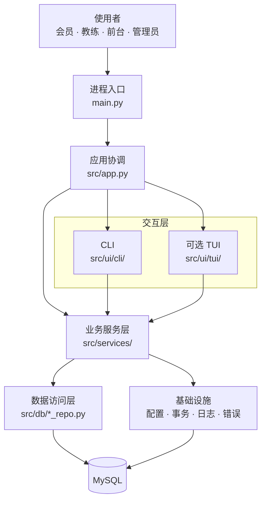

# 系统设计与架构方案

> **版本：v3** · 更新：2026-09-25

## 文档的用意

这是健身房管理系统的**完整设计说明书**。在开发功能时，需要来这里查：

- 我负责的功能要**保存哪些数据**，数据库表叫什么名字
- 我写的方法要**接收什么参数、返回什么结果**
- 出错了要**抛出什么异常**，给用户显示什么提示
- 我的功能和**别人的功能怎么配合**（比如：预约要用到课包的余额）

## 文档用法

**查具体功能的设计**  
→ 跳到对应章节。会员、销售、健身房卡在[第 12 章](#12-会员产品销售与权益领域)；课程、预约、签到在[第 13 章](#13-课程预约到课与关联业务)

**看数据库表结构**  
→ 每个业务章节最后有完整的建表 SQL。比如会员表在 [12.6.1 members](#61-members)

**不知道从哪开始**  
→ 看下面的"第一次开发功能"，或者直接去 [`docs/README.md`](README.md#从这里开始) 看完整参与指引

**查代码放哪个文件**  
→ 看[第 3 章：目录与文件职责](#3-目录与文件职责)

## 第一次开发功能

假设你要做"会员建档"，简单 3 步：

1. **在下面的目录找到你负责开发的模块**，找到方法说明（输入什么、返回什么）
2. **写代码**：`member_repo.py` 保存数据 → `member_service.py` 检查规则 → `member.py` 接收用户输入
3. **测试**：正常情况、错误情况都要测

详细步骤和示例见 [`docs/README.md`](README.md#怎样在骨架中完成一个功能)。

---

## 目录

### 📖 开发前必读

- [1. 项目基本情况](#1-项目基本情况) — 我们要做什么、用什么技术
- [2. 代码怎么组织（分层架构）](#2-代码怎么组织分层架构) — CLI、Service、Repository 各负责什么
- [3. 目录与文件职责](#3-目录与文件职责) — 代码文件放哪里

### 🎯 业务功能（按负责人分工）

- [12. 会员、产品、销售与权益](#12-会员产品销售与权益领域) — **Xingzhou PENG、Mingjin LI**
  - 会员建档、健身房卡、私教课包、销售订单、收款、门禁入场
- [13. 课程、预约、到课与关联业务](#13-课程预约到课与关联业务) — **Weijie ZHOU、Yuxi ZHU、Yihao QIAN、Tuao SONG**
  - 教练管理、课程排期、预约、签到、评价、体测
- [14. 器械与维修](#14-器械与维修) — **Tuao SONG**
  - 器械登记、维修记录

### 🔧 技术参考（开发时查阅）

- [4. 公共接口约定](#4-公共接口约定) — Input、View、Page 等数据类型
- [5. 配置与程序启动](#5-配置与程序启动) — config.json 怎么写
- [6. 数据库连接与事务](#6-数据库连接与事务) — 怎么开事务、提交、回滚
- [7. 数据库维护命令](#7-数据库维护命令) — `python -m src.cmd.db init/migrate/seed`
- [8. 公共 CLI](#8-公共-cli) — 怎么收集用户输入、显示分页结果
- [9. 账号、身份与权限](#9-账号身份与权限) — 登录、角色检查 — **Jiafeng YE**
- [10. 错误处理](#10-错误处理) — 抛什么异常、怎么处理
- [11. 日志系统](#11-日志系统) — 怎么记录日志

### 📋 实施与迁移

- [15. v3 迁移与实施同步](#15-v3-迁移与实施同步) — 数据库版本升级

## 1. 项目基本情况

本系统用于管理健身房会员、账号、产品销售、门禁入场、课程排期、预约、签到、消课、评价、体测、器械和经营报表。默认交互入口为命令行界面（CLI），可选终端界面（TUI）与 CLI 共用同一组业务服务。

### 用什么技术

- **编程语言**：Python 3.10+
- **数据库**：MySQL 8.4
- **界面**：命令行（CLI），有时间再做终端界面（TUI）
- **测试**：pytest

时间存储统一用 UTC，显示时转成上海时区。日期区间是 `[开始, 结束)`，包含开始那天，不包含结束那天。

---

## 2. 代码怎么组织（分层架构）


```mermaid
flowchart TB
    User["使用者<br/>会员 · 教练 · 前台 · 管理员"]
    Main["进程入口<br/>main.py"]
    App["应用协调<br/>src/app.py"]

    subgraph UI["交互层"]
        CLI["CLI<br/>src/ui/cli/"]
        TUI["可选 TUI<br/>src/ui/tui/"]
    end

    Services["业务服务层<br/>src/services/"]
    Repositories["数据访问层<br/>src/db/*_repo.py"]
    Infrastructure["基础设施<br/>配置 · 事务 · 日志 · 错误"]
    Database[(MySQL)]

    User --> Main
    Main --> App
    App --> CLI
    App --> TUI
    App --> Services
    CLI --> Services
    TUI --> Services
    Services --> Repositories
    Services --> Infrastructure
    Repositories --> Database
    Infrastructure --> Database
```

### 举个例子：会员买健身房卡

1. **用户在 CLI 输入**：买哪种卡、付多少钱
2. **CLI 调用 Service**：`SalesService.sell_gym_card(...)`
3. **Service 检查规则**：这个人有没有权限买、钱够不够
4. **Service 调用 Repository**：往数据库写订单、收款记录、健身房卡
5. **返回结果给用户**：显示订单编号、卡的有效期

### 每层的职责

| 层 | 文件位置 | 负责什么 |
|---|---|---|
| **CLI** | `src/ui/cli/` | 收集用户输入、显示结果 |
| **Service** | `src/services/` | 检查权限、检查业务规则、开启和提交事务 |
| **Repository** | `src/db/` | 执行 SQL 查询、保存数据 |

**重要规则：**
- Service 检查权限和业务规则，Repository 只负责保存数据
- 一次完整操作（买卡 + 收款 + 发卡）要在 Service 用一个事务完成
- Repository 不提交事务，由 Service 统一管理
- 要么全部成功，要么全部回滚（不能出现"钱收了但卡没发"）

### 具体文件的作用

- `main.py`：程序入口
- `src/app.py`：管理数据库连接、装配服务、管理登录状态
- `src/config.py`：读取配置文件
- `src/ui/cli/prompts.py`：从终端读取用户输入
- `src/ui/cli/handlers/*.py`：处理具体的业务操作
- `src/services/*_service.py`：各业务模块的服务类
- `src/db/*_repo.py`：各数据表的访问类
- `src/errors/`：定义统一的异常类型
- `src/models/`：定义数据类型（Input、View、Query）


## 3. 目录与文件职责

| 路径 | 职责 |
|---|---|
| `main.py`、`src/app.py`、`src/config.py` | 入口、生命周期、装配和配置 |
| `src/db/` | 连接、事务、结构检查和 Repository |
| `src/errors/` | 项目异常、错误结果和安全转换 |
| `src/models/` | 公共合同和内部存储模型 |
| `src/services/` | 权限、规则、并发和业务事务 |
| `src/ui/cli/`、`src/ui/tui/` | 默认 CLI 和可选 TUI |
| `sql/`、`tests/`、`docs/` | 迁移、自动化验证和项目文档 |

设计集中维护在 `docs/architecture.md`，参与步骤维护在 `docs/README.md`，工程规范维护在 `docs/project-standards.md`。开发进度、设计决策和测试发现分别记录到 `docs/dev-materials-for-report/development-log.md`、`design-decisions.md` 和 `testing-notes.md`。

## 4. 公共接口约定

### 4.1 返回类型

- 详情方法返回对应的 `View`；目标不存在或对当前操作者不可见时抛 `NotFoundError`。
- 列表方法返回 `Page[T]`；空结果为 `Page(items=[], total=0, page=..., page_size=...)`。
- 创建和修改方法返回写入后的 View 或专用结果 View。
- 失败通过项目异常表达，返回类型在所有执行分支保持一致。

```python
T = TypeVar("T")

@dataclass(frozen=True, kw_only=True)
class PageRequest:
    page: int = 1
    page_size: int = 20

@dataclass(frozen=True, kw_only=True)
class Page(Generic[T]):
    items: list[T]
    total: int
    page: int
    page_size: int

@dataclass(frozen=True, kw_only=True)
class DateWindow:
    start: datetime
    end: datetime

@dataclass(frozen=True, kw_only=True)
class NamedQuery:
    keyword: str = ""
    is_active: bool | None = None
    paging: PageRequest = field(default_factory=PageRequest)
```

`PageRequest.page` 从 1 开始，`page_size` 取 1～100。列表在唯一且稳定的排序规则下分页；默认使用 `id` 升序。报表等需要业务排序的接口在对应模块明确次级唯一排序键。

### 4.2 字段规则

- 数据库编号和关联编号使用正整数 `int`。
- 金额和精确业务小数使用 `Decimal`，从十进制字符串构造，并按字段精度量化。
- 时刻使用带时区 `datetime`，进入持久层前转换为 UTC。
- 纯日期使用 `date`。
- 有限状态使用 `Literal` 或 `Enum` 的固定英文值。
- 可空字段使用 `T | None`；文本进入服务后按字段规则去除首尾空白并校验长度。
- `request_id` 使用标准 UUID 字符串，并在进入事务前完成格式校验。

### 4.3 方法文档

每个公开服务方法的类型签名和文档需明确：

1. 输入字段及完整提交语义；
2. 返回类型；
3. 角色权限和数据可见范围；
4. 可抛出的项目异常；
5. 写入、更新或删除的数据；
6. 事务、幂等和并发锁定规则。

## 5. 配置与程序启动

### 5.1 配置类型

```python
@dataclass(frozen=True, kw_only=True)
class StartupOptions:
    tui: bool = False
    config_path: str | None = None

@dataclass(frozen=True, kw_only=True)
class DatabaseConfig:
    host: str
    port: int
    database: str
    username: str
    password: str = field(repr=False)
    charset: str = "utf8mb4"
    pool_size: int = 5

@dataclass(frozen=True, kw_only=True)
class LogConfig:
    directory: Path = Path("logs")
    level: str = "INFO"
    max_bytes: int = 5 * 1024 * 1024
    backup_count: int = 3

@dataclass(frozen=True, kw_only=True)
class AppSettings:
    database: DatabaseConfig
    timezone_name: str = "Asia/Shanghai"
    log: LogConfig = field(default_factory=LogConfig)
```

配置文件为 UTF-8 JSON。根对象只接受 `database`、`timezone_name` 和 `log`；各子对象也只接受已定义字段，以便把拼写错误在启动阶段转为明确错误。

配置约束：

- `database.port` 为 1～65535。
- `database.charset` 固定为 `utf8mb4`。
- `database.pool_size` 为 1～20。
- `log.level` 为 `DEBUG`、`INFO`、`WARNING`、`ERROR` 或 `CRITICAL`。
- `log.max_bytes` 为 1 字节～5 MiB，`backup_count` 为 0～3，日志文件总容量上限为 20 MiB。
- `timezone_name` 必须是 `zoneinfo` 可识别的 IANA 时区名称。
- 相对日志目录以配置文件所在目录为基准解析为绝对路径。
- 环境变量 `DB_PASSWORD` 存在时覆盖配置文件中的数据库密码。

### 5.2 `load_config`

```python
def load_config(config_path: str | None = None) -> AppSettings: ...
```

- 输入：可选 JSON 路径；`None` 表示当前目录下的 `config.json`。
- 返回：完成类型、范围、未知字段和时区校验的 `AppSettings`。
- 异常：文件缺失、UTF-8 解码失败、JSON 语法错误、字段缺失或取值非法时抛 `InvalidInputError`。
- 数据变更：无；读取配置不会创建目录、文件或数据库资源。

### 5.3 主入口

```python
def parse_args(argv: list[str] | None = None) -> StartupOptions: ...
def main(argv: list[str] | None = None) -> int: ...
```

`parse_args` 接受 `--config PATH`、`--tui` 和 `--help`，返回 `StartupOptions`；帮助退出码为 0，参数错误退出码为 2。

`main` 按以下顺序运行：

1. 解析参数；
2. 加载配置；
3. 创建 `App`；
4. 启动基础设施与业务服务；
5. 运行默认 CLI 或可选 TUI；
6. 关闭应用资源。

正常退出、EOF 和 Ctrl+C 返回 0；配置、启动、运行或资源关闭失败返回 1。对终端输出项目异常的安全中文消息；未知异常输出固定提示，详细信息交给日志系统。

### 5.4 `App` 生命周期

```python
class App:
    def __init__(self, settings: AppSettings) -> None: ...
    def start(self) -> None: ...
    def run(self, *, tui: bool = False) -> int: ...
    def close(self) -> None: ...
    def get_actor(self) -> Actor: ...
    def set_actor(self, actor: Actor) -> None: ...
    def logout(self) -> None: ...
```

#### `App.__init__`

- 输入：已校验的 `AppSettings`。
- 返回：新应用实例。
- 异常：无业务异常。
- 数据变更：只保存配置并初始化空资源引用。

#### `App.start`

- 输入：无。
- 返回：`None`。
- 异常：重复启动抛 `InvalidState`；日志资源不可用抛 `ResourceError`；数据库连接失败抛 `StorageError`；结构不完整或版本不匹配抛 `InvalidState`。
- 数据变更：配置日志，创建数据库引擎和会话工厂，检查数据库结构，创建 `ServiceBundle`、CLI Handlers 和 `GymCLI`。结构升级由数据库维护命令执行，普通启动只读检查结构。

#### `App.run`

- 输入：`tui` 指定交互模式。
- 返回：界面进程退出码。
- 异常：应用尚未启动抛 `InvalidState`；交互运行异常向主入口传播并由主入口转换。
- 数据变更：业务数据变更由界面调用的服务方法完成；`App.run` 只管理交互流程。

#### `App.close`

- 输入：无。
- 返回：`None`。
- 异常：数据库连接池释放失败抛 `StorageError`；中断异常向主入口传播。
- 数据变更：清除当前身份、界面和服务引用，关闭日志资源并释放数据库引擎。引擎成功释放后清空引用。

#### `App.get_actor`

- 输入：无。
- 返回：当前 `Actor`。
- 异常：未登录时抛 `AuthenticationError`。
- 数据变更：无。

#### `App.set_actor`

- 输入：`AuthService.login` 返回的可信 `Actor`。
- 返回：`None`。
- 异常：无业务异常。
- 数据变更：更新进程内当前身份，不写数据库。

#### `App.logout`

- 输入：无。
- 返回：`None`。
- 异常：无业务异常。
- 数据变更：清除进程内当前身份和与登录会话关联的界面状态，不写数据库。

## 6. 数据库连接与事务

### 6.1 引擎和会话

```python
CURRENT_SCHEMA_VERSION: int = 3

def create_engine(settings: AppSettings) -> Engine: ...
def create_session_factory(engine: Engine) -> Callable[[], Session]: ...
def check_connection(engine: Engine) -> None: ...
def check_schema(engine: Engine, required_version: int = 3) -> None: ...
def close_engine(engine: Engine) -> None: ...
```

`create_engine` 使用 `mysql+pymysql` URL 对象创建连接池，连接字符串不会进入普通日志。连接池配置为：

- `pool_size` 取配置值；
- `max_overflow=0`；
- 池等待和连接超时为 5 秒；
- 读写超时为 30 秒；
- `pool_pre_ping=True`；
- 隔离级别为 `REPEATABLE READ`；
- 新连接使用 UTC；
- SQL 模式使用严格事务表模式并拒绝零日期。

接口契约：

- `create_engine` 输入 `AppSettings`，返回 `Engine`；创建失败抛 `StorageError`；只创建连接池对象。
- `create_session_factory` 输入 `Engine`，返回每次调用产生独立 Session 的工厂；数据变更为无。
- `check_connection` 执行 `SELECT 1`，成功返回 `None`，失败抛 `StorageError`；数据变更为无。
- `check_schema` 读取必需表和最新结构版本，成功返回 `None`；缺表、缺版本或版本不符抛 `InvalidState`，查询失败抛 `StorageError`；数据变更为无。
- `close_engine` 释放连接池并返回 `None`；失败抛 `StorageError`，EOF 和 KeyboardInterrupt 继续传播。

### 6.2 事务接口

```python
def transaction(
    session: Session,
    *,
    request_id: str | None = None,
    record_id: int | None = None,
) -> AbstractContextManager[Session]: ...
```

- 输入：当前业务 Session，以及提交结果未知时用于核实的请求编号或记录编号。
- 返回：事务上下文管理器。
- 异常：事务体或 `flush()` 失败时回滚并传播原异常；`commit()` 失败时回滚本地会话并抛 `OutcomeUnknownError`，携带核实编号。
- 数据变更：上下文正常结束时先 `flush()` 再 `commit()`；异常路径回滚当前事务。

带 `request_id` 的幂等写操作把原请求编号传入 `transaction`。对既有记录进行状态变更的操作可以传入 `record_id`。提交结果未知时，界面引导用户使用原编号查询结果。

## 7. 数据库维护命令

### 7.1 结果类型

```python
@dataclass(frozen=True, kw_only=True)
class InitResult:
    tables_created: int
    schema_version: int

@dataclass(frozen=True, kw_only=True)
class MigrationResult:
    previous_version: int
    schema_version: int
    steps_applied: int

@dataclass(frozen=True, kw_only=True)
class SeedResult:
    accounts_created: int
    members_created: int
    coaches_created: int

@dataclass(frozen=True, kw_only=True)
class DemoPasswordInput:
    member_password: str = field(repr=False)
    coach_password: str = field(repr=False)
    receptionist_password: str = field(repr=False)
    admin_password: str = field(repr=False)
```

### 7.2 `init_database`

```python
def init_database(connection: Connection) -> InitResult: ...
```

- 输入：数据库命令持有的专用连接。
- 返回：成功创建的表数和最终结构版本。
- 异常：目标库已有对象或结构锁被占用时抛 `InvalidState`；脚本读取或校验失败抛 `StorageError`；执行失败抛 `InitializationError`，携带已确认完成的表、失败步骤和结果未知标记。
- 数据变更：按依赖顺序执行初始结构脚本，写入初始版本，再顺序应用迁移链直至 `CURRENT_SCHEMA_VERSION`。

初始化使用基于数据库名摘要的 MySQL 命名锁。同一连接持有命名锁、执行 DDL 和写版本记录。初始脚本中的语句类型、表顺序和表名由命令白名单校验。

### 7.3 `migrate_database`

```python
def migrate_database(connection: Connection) -> MigrationResult: ...
```

- 输入：数据库命令持有的专用连接。
- 返回：迁移前版本、目标版本和本次实际应用的 DDL 步骤数。
- 异常：版本记录缺失、不支持的来源版本或结构锁被占用时抛 `InvalidState`；迁移失败抛 `MigrationError`，携带已确认步骤、失败步骤和结果未知标记。
- 数据变更：从当前版本逐个应用后续 SQL 迁移，并在每个版本的结构步骤完成后写入对应版本记录。

每项迁移执行前通过 `information_schema` 检查目标对象。重复运行时跳过已确认存在且定义符合预期的对象，从未完成步骤继续。MySQL DDL 的隐式提交结果逐步记录，故障提示包含已确认步骤。

### 7.4 `seed_demo_data`

```python
def seed_demo_data(
    session: Session,
    passwords: DemoPasswordInput,
    *,
    seed: int | None = None,
) -> SeedResult: ...
```

- 输入：调用方事务 Session、四类演示账号的明文密码和可选随机种子。
- 返回：创建的账号、会员档案和教练档案数量。
- 异常：数据库未初始化抛 `InvalidState`；演示账号已存在或唯一约束冲突抛 `ConflictError`；密码非法抛 `InvalidInputError`；写入失败抛 `StorageError`。
- 数据变更：创建会员、教练、前台和管理员账号，使用独立随机盐保存密码哈希，并创建一个会员档案和一个教练档案。提交或回滚由调用方事务完成。

### 7.5 数据库命令入口

```python
def main(argv: list[str] | None = None) -> int: ...
```

支持：

- `python -m src.cmd.db init --config PATH`
- `python -m src.cmd.db migrate --config PATH`
- `python -m src.cmd.db seed --config PATH [--seed N]`

成功返回 0，运行失败返回 1，参数错误返回 2。用户取消密码输入返回 0。`seed` 在读取四类密码时使用无回显输入并进行二次确认。

## 8. 公共 CLI

### 8.1 输入采集

`src/ui/cli/prompts.py` 提供以下接口：

- `prompt_password(label) -> str`：无回显读取原始密码；终端无法隐藏输入时抛 `ResourceError`。
- `prompt_text(label, allow_empty=False) -> str`：去除首尾空白并校验必填。
- `prompt_optional_text(label) -> str | None`：空输入返回 `None`。
- `prompt_int(label, minimum=None, maximum=None) -> int`：读取十进制整数并校验闭区间。
- `prompt_decimal(label, minimum=None) -> Decimal`：读取有限十进制数，最多两位小数。
- `prompt_date(label) -> date`：读取 `YYYY-MM-DD` 日期。
- `prompt_datetime(label, timezone_name) -> datetime`：读取门店时区的 `YYYY-MM-DD HH:MM`，拒绝夏令时重复或不存在的时刻，返回 UTC。
- `prompt_confirm(label) -> bool`：读取确认结果。
- `prompt_member_id() -> int`：读取正整数会员编号。

文本、数字、日期和确认接口把 `q` 或 `Q` 解释为取消并抛 `InputCancelled`；密码输入保留其原始字符语义。EOF 和 Ctrl+C 向进程入口传播。

### 8.2 菜单与操作调用

```python
@dataclass(frozen=True, kw_only=True)
class MenuItem:
    key: str
    label: str
    operation: str
    action: Callable[[], None]

@dataclass(frozen=True, kw_only=True)
class CliHandlers:
    auth: AuthHandler
    member: MemberHandler
    product: ProductHandler
    course: CourseHandler
    booking: BookingHandler
    attendance: AttendanceHandler
    review: ReviewHandler
    equipment: EquipmentHandler
    measurement: MeasurementHandler
    report: ReportHandler
```

```python
def invoke_action(
    action: Callable[[], None],
    *,
    operation: str,
    actor_id: int | None = None,
    request_id: str | None = None,
) -> ErrorResult: ...
```

`invoke_action` 执行一个 Handler 操作。成功或主动取消返回 `ErrorResult(message="", action="continue")`；项目异常和未知异常交给 `handle_error`；EOF 和 Ctrl+C 继续传播。

`GymCLI.run()` 负责登录菜单、角色模块菜单、子菜单、退出登录和程序退出。菜单可见性用于简化导航，服务层继续执行权限校验。`ErrorResult.action` 为：

- `continue`：显示提示后留在当前交互层级；
- `login`：清除当前身份并返回登录入口；
- `exit`：结束 CLI 并返回失败退出码；
- `verify`：显示请求编号或记录编号，引导用户核实结果。

### 8.3 分页浏览

```python
def browse_pages(
    fetch_page: Callable[[PageRequest], Page[T]],
    format_page: Callable[[Page[T]], str],
    *,
    page_size: int = 20,
) -> None: ...
```

- 输入：分页查询回调、分页格式化回调和每页条数。
- 返回：`None`。
- 异常：非法页大小抛 `InvalidInputError`；主动取消抛 `InputCancelled`；查询异常向操作边界传播。
- 数据变更：无。

首次进入从第 1 页查询；`n` 和 `p` 前后翻页，`0` 返回。筛选条件变化后创建新的浏览过程并回到第 1 页。

### 8.4 格式化

详情 Formatter 接收一个明确 View，列表 Formatter 接收 `Page[View]`，均返回中文 `str`。统一展示规则：

- 金额显示两位小数；
- 状态映射为中文；
- 空值显示“—”；
- 时刻转换为门店时区并显示偏移；
- 纯日期按 ISO 日期显示；
- 会员电话遮住中间四位；
- 来自业务数据的控制字符转换为可见转义文本；
- 分页结果显示当前页、总数和空页提示。

## 9. 账号、身份与权限

### 9.1 公共类型

```python
Role = Literal["member", "coach", "receptionist", "admin"]
CourseKind = Literal["private"]
MemberStatus = Literal["active", "archived"]
GymCardStatus = Literal["active", "void"]
LessonPackageStatus = Literal["active", "void"]
SessionStatus = Literal["scheduled", "completed", "cancelled"]
BookingStatus = Literal[
    "reserved", "checked_in", "completed", "cancelled", "no_show"
]
PaymentMethod = Literal["cash", "card", "transfer"]
GymCardStartPolicy = Literal["immediate", "append"]
GiftActivationPolicy = Literal["immediate", "append"]
GymCardKind = Literal["duration", "visit"]
EntrySourceKind = Literal["duration_gym_card", "visit_gym_card", "booking"]
EquipmentStatus = Literal["available", "maintenance", "retired"]
OperationName = Literal[
    "create_member",
    "sell_gym_card",
    "sell_lesson_package",
    "create_session",
    "cancel_session",
    "book",
    "cancel_booking",
    "register_entry",
]

@dataclass(frozen=True, kw_only=True)
class Actor:
    account_id: int
    role: Role
    member_id: int | None
    coach_id: int | None

@dataclass(frozen=True, kw_only=True)
class AccountInput:
    username: str
    password: str = field(repr=False)
    role: Role

@dataclass(frozen=True, kw_only=True)
class AccountView:
    id: int
    username: str
    role: Role
    is_active: bool
    member_id: int | None
    coach_id: int | None

@dataclass(frozen=True, kw_only=True)
class MemberAccountLinkInput:
    account_id: int
    member_id: int

@dataclass(frozen=True, kw_only=True)
class CoachAccountLinkInput:
    account_id: int
    coach_id: int
```

身份不变量：

- `member` 角色关联一个会员档案，`member_id` 有值，`coach_id` 为 `None`；`active` 和 `archived` 档案均可登录和查询本人历史。
- `coach` 角色关联一个启用的教练档案，`coach_id` 有值，`member_id` 为 `None`。
- `receptionist` 和 `admin` 不关联会员或教练档案，两个档案编号均为 `None`。
- 账号停用、角色与档案不匹配或关联教练档案停用时，身份校验失败。会员档案归档由写服务拒绝新增业务，不使身份失效。

用户名去除首尾空白并转换为小写，只允许 3～50 位 ASCII 字母、数字和下划线。密码按原值校验，长度为 8～128 个 Unicode 字符。

### 9.2 `AuthService`

```python
class AuthService:
    def __init__(
        self,
        session_factory: Callable[[], Session],
        *,
        log_config: LogConfig,
    ) -> None: ...
```

构造输入为会话工厂和已校验日志配置，返回 `AuthService` 实例，不访问数据库或日志文件。服务保存依赖供后续账号、身份和日志查询方法使用。

#### `login`

```python
def login(self, username: str, password: str) -> Actor: ...
```

- 输入：用户名和明文密码。
- 返回：满足角色档案不变量的 `Actor`。
- 权限：公开登录入口。
- 异常：输入格式、凭据、账号状态、档案关联或档案状态任一校验失败时抛 `AuthenticationError`；密码工具不可用抛 `ResourceError`；存储故障抛 `StorageError`。
- 数据变更：无业务数据变更；记录一次脱敏登录结果日志。

服务规范化用户名后读取账号，使用 Argon2id 验证密码，并取得关联档案。终端提示对用户名不存在、密码错误和账号状态异常采用一致的认证失败消息。

#### `create_account`

```python
def create_account(self, actor: Actor, data: AccountInput) -> AccountView: ...
```

- 输入：当前操作者和完整 `AccountInput`。
- 返回：新账号的 `AccountView`。
- 权限：管理员。
- 异常：身份失效抛 `AuthenticationError`；非管理员抛 `PermissionDenied`；用户名或密码格式非法抛 `InvalidInputError`；用户名重复抛 `ConflictError`；哈希工具不可用抛 `ResourceError`；存储故障抛 `StorageError` 或 `OutcomeUnknownError`。
- 数据变更：规范化用户名，使用 Argon2id 生成带随机盐的密码哈希，创建启用账号；不保存明文密码；记录脱敏操作日志。

#### `get_account`

```python
def get_account(self, actor: Actor, account_id: int) -> AccountView: ...
```

- 输入：当前操作者和目标账号编号。
- 返回：`AccountView`。
- 权限：管理员。
- 异常：身份失效抛 `AuthenticationError`；非管理员抛 `PermissionDenied`；账号不存在抛 `NotFoundError`；存储故障抛 `StorageError`。
- 数据变更：无。

#### `list_accounts`

```python
def list_accounts(self, actor: Actor, query: NamedQuery) -> Page[AccountView]: ...
```

- 输入：当前操作者，以及用户名关键字、启用状态和分页条件。
- 返回：按账号 `id` 升序稳定分页的 `Page[AccountView]`。
- 权限：管理员。
- 异常：身份失效抛 `AuthenticationError`；非管理员抛 `PermissionDenied`；查询或分页条件非法抛 `InvalidInputError`；存储故障抛 `StorageError`。
- 数据变更：无。

#### `set_account_active`

```python
def set_account_active(
    self,
    actor: Actor,
    account_id: int,
    active: bool,
) -> AccountView: ...
```

- 输入：当前操作者、目标账号编号和目标启用状态。
- 返回：修改后的 `AccountView`。
- 权限：管理员。
- 异常：身份失效抛 `AuthenticationError`；非管理员抛 `PermissionDenied`；账号不存在抛 `NotFoundError`；停用最后一名启用管理员抛 `InvalidState`；存储故障抛 `StorageError` 或 `OutcomeUnknownError`。
- 数据变更：更新目标账号 `is_active`，记录脱敏操作日志。

并发规则：操作者和目标账号按 `account_id` 升序在一条锁定当前读中取得。停用管理员时，同一条查询还锁定全部启用管理员；获得完整锁集合后复核操作者、目标状态和启用管理员数量。

#### `link_member`

```python
def link_member(
    self,
    actor: Actor,
    data: MemberAccountLinkInput,
) -> AccountView: ...
```

- 输入：当前操作者、会员账号编号和会员档案编号。
- 返回：关联后的目标 `AccountView`；相同关联重复提交返回当前结果。
- 权限：管理员。
- 异常：身份失效抛 `AuthenticationError`；非管理员抛 `PermissionDenied`；账号或档案不存在抛 `NotFoundError`；账号角色不是 `member` 抛 `InvalidState`；账号或档案已存在其他关联抛 `ConflictError`；存储故障抛 `StorageError` 或 `OutcomeUnknownError`。
- 数据变更：创建 `member_account_links` 记录并记录脱敏操作日志。

并发规则：操作者账号和目标账号按编号升序锁定，再锁定会员档案；数据库双向唯一约束作为最终防重。

#### `link_coach`

```python
def link_coach(
    self,
    actor: Actor,
    data: CoachAccountLinkInput,
) -> AccountView: ...
```

- 输入：当前操作者、教练账号编号和教练档案编号。
- 返回：关联后的目标 `AccountView`；相同关联重复提交返回当前结果。
- 权限：管理员。
- 异常：与 `link_member` 相同；账号角色必须是 `coach`。
- 数据变更：创建 `coach_account_links` 记录并记录脱敏操作日志。
- 并发规则：操作者账号和目标账号按编号升序锁定，再锁定教练档案；数据库双向唯一约束作为最终防重。

#### `relink_member` 与 `relink_coach`

```python
def relink_member(
    self, actor: Actor, account_id: int, member_id: int,
) -> AccountView: ...
def relink_coach(
    self, actor: Actor, account_id: int, coach_id: int,
) -> AccountView: ...
```

- 输入：目标账号和新的同角色档案编号；账号当前可以没有关联或关联另一档案。
- 返回：关联纠正后的 `AccountView`；目标关联已是当前关联时返回当前结果。
- 权限：仅管理员。
- 异常：账号或档案不存在抛 `NotFoundError`；角色不匹配或教练档案停用抛 `InvalidState`；新档案已被另一账号关联抛 `ConflictError`；身份或存储故障按账号服务统一异常处理。
- 数据变更：在一个事务中删除目标账号的原关联并创建新关联，保留账号和档案，记录不含姓名、电话和体测信息的结构化审计日志。
- 事务：先按 `account_id` 升序锁定操作者账号和目标账号，再按档案主键升序锁定旧档案与新档案；锁内复核角色、当前关系和双向唯一性。会员与教练接口使用对称流程。

#### `verify_actor`

```python
def verify_actor(self, session: Session, actor: Actor) -> Actor: ...
```

- 输入：调用方当前事务的 Session 和进程内 Actor。
- 返回：从数据库复核得到的最新 `Actor`。
- 权限：供所有业务服务在事务内调用。
- 异常：账号不存在、停用、角色变化、档案关联变化、教练档案停用或角色档案不变量不成立时抛 `AuthenticationError`；存储故障抛 `StorageError`。关联会员为 `archived` 时仍返回可信 `Actor`。
- 数据变更：无；锁定账号和关联档案直至调用方事务结束。

锁顺序固定为账号、会员档案、教练档案。`verify_actor` 使用调用方事务且不提交。

#### `open_log_snapshot`

```python
def open_log_snapshot(self, actor: Actor) -> LogSnapshot: ...
```

- 输入：当前操作者。
- 返回：一次日志浏览使用的固定 `LogSnapshot`。
- 权限：管理员。
- 异常：身份失效抛 `AuthenticationError`；非管理员抛 `PermissionDenied`；日志文件或跨进程锁不可用抛 `ResourceError`。
- 数据变更：无；读取当前日志及配置允许数量的备份并复制为内存快照。

#### `query_logs`

```python
def query_logs(
    self,
    actor: Actor,
    query: LogQuery,
    *,
    snapshot: LogSnapshot,
) -> Page[LogEntry]: ...
```

- 输入：当前操作者、筛选与分页条件，以及 `open_log_snapshot` 返回的固定快照。
- 返回：按时间倒序、同时间按文件记录顺序倒序的 `Page[LogEntry]`。
- 权限：管理员；每次筛选和翻页都重新验证身份。
- 异常：身份失效抛 `AuthenticationError`；非管理员抛 `PermissionDenied`；条件非法抛 `InvalidInputError`；日志资源不可用抛 `ResourceError`。
- 数据变更：无；同一次浏览的筛选和翻页沿用同一快照，刷新时创建新快照。

### 9.3 密码接口

```python
def hash_password(password: str) -> str: ...
def verify_password(password: str, password_hash: str) -> bool: ...
```

`hash_password` 校验密码格式并返回包含算法、参数和随机盐的 Argon2id 哈希；格式非法抛 `InvalidInputError`，依赖不可用抛 `ResourceError`。

`verify_password` 对合法格式的明文密码进行验证，匹配返回 `True`，不匹配或输入格式非法返回 `False`；存储哈希损坏抛 `StorageError`，依赖不可用抛 `ResourceError`。

## 10. 错误处理

### 10.1 异常分类

所有可安全展示的项目异常继承 `GymError`，其 `message` 为中文安全提示。

| 异常 | 使用场景 |
|---|---|
| `InvalidInputError` | 类型、格式、长度、范围或组合条件非法 |
| `AuthenticationError` | 登录失败或当前可信身份失效 |
| `PermissionDenied` | 角色或数据归属没有操作权限 |
| `NotFoundError` | 记录不存在或对操作者不可见 |
| `InvalidState` | 当前状态不允许执行操作 |
| `ConflictError` | 唯一值、重复请求或并发状态冲突 |
| `GymCardNotEligible` | 已确认归属的健身房卡状态或日期不满足入场 |
| `BookingEntryNotEligible` | 已确认归属的预约状态或业务日期不满足入场 |
| `LessonPackageNotEligible` | 已确认归属的课包状态或课次日期不满足预约 |
| `InsufficientLessonCredits` | 私教课包可用课节不足 |
| `ScheduleConflict` | 会员、教练或场地时间冲突 |
| `CapacityExceeded` | 课次名额不足 |
| `ResourceError` | 文件、终端能力或外部工具不可用 |
| `StorageError` | 数据库访问或资源释放失败 |
| `OutcomeUnknownError` | 提交确认丢失，需要按编号核实 |
| `InitializationError` | 初始化部分完成，携带已完成表与失败步骤 |
| `MigrationError` | 迁移部分完成，携带已完成步骤与失败步骤 |

`InputCancelled` 表示用户主动取消输入，由交互层返回上级菜单。

### 10.2 处理结果

```python
ErrorAction = Literal["continue", "login", "exit", "verify"]

@dataclass(frozen=True, kw_only=True)
class ErrorResult:
    message: str
    action: ErrorAction
    request_id: str | None = None
    record_id: int | None = None
```

### 10.3 `handle_error`

```python
def handle_error(
    error: Exception,
    *,
    operation: str,
    actor_id: int | None = None,
    request_id: str | None = None,
    fatal: bool = False,
) -> ErrorResult: ...
```

- 输入：异常、固定操作名、可选操作者编号、请求编号和致命标记。
- 返回：安全中文提示、界面动作和可选核实编号。
- 异常：处理函数吸收日志写入失败并返回原业务所需动作；EOF 和 KeyboardInterrupt 由调用边界直接传播。
- 数据变更：记录一次脱敏日志；不操作业务事务或数据库会话。

分类规则：业务拒绝使用 WARNING 和 `continue`；身份失效使用 WARNING 和 `login`；存储或未知系统错误使用 ERROR 和 `exit`；`OutcomeUnknownError` 使用 ERROR 和 `verify`。`fatal=True` 时动作固定为 `exit`。

## 11. 日志系统

### 11.1 日志记录

```python
def configure_logging(settings: AppSettings) -> None: ...

def log_event(
    level: int,
    *,
    operation: str,
    outcome: str,
    actor_id: int | None = None,
    request_id: str | None = None,
    result_id: int | None = None,
    error: Exception | None = None,
    attendance_change: AttendanceChange | None = None,
) -> bool: ...

def close_logging() -> None: ...
```

`configure_logging` 创建日志目录和轮转处理器，日志文件为 `settings.log.directory / "app.log"`。初始化失败抛 `ResourceError`，使启动流程停止。

`log_event` 接收固定操作名、结果类别和非敏感编号，成功返回 `True`，运行期写入失败返回 `False` 并向标准错误输出固定提示。日志字段包括：

- UTC 时间戳；
- 日志级别；
- `operation`；
- `outcome`：`success`、`rejected`、`failed` 或 `unknown`；
- `actor_id`、`request_id`、`result_id`；
- 异常类型和安全错误消息；
- 可选签到状态变化；
- 文件名、行号和函数名组成的堆栈帧；
- 截断标记。

单条日志最大 16 KiB。密码、连接串、完整联系方式、SQL 参数、完整 SQL、体测明细和课包余额不进入日志。`GymError.message` 可作为安全消息；未知异常只记录类型和脱敏堆栈位置。

`close_logging` 刷新并释放日志文件句柄，允许重复调用。关闭失败向标准错误输出固定安全提示。

### 11.2 日志查询类型

```python
@dataclass(frozen=True, kw_only=True)
class LogFrame:
    filename: str
    line_number: int
    function_name: str

@dataclass(frozen=True, kw_only=True)
class LogEntry:
    timestamp: datetime
    level: str
    operation: str
    outcome: str
    actor_id: int | None
    request_id: str | None
    result_id: int | None
    error_type: str | None
    error_message: str | None
    attendance_change: AttendanceChange | None = None
    frames: tuple[LogFrame, ...] = ()
    truncated: bool = False

@dataclass(frozen=True, kw_only=True)
class LogSnapshot:
    captured_at: datetime
    entries: tuple[LogEntry, ...]
    skipped_lines: int

@dataclass(frozen=True, kw_only=True)
class LogQuery:
    window: DateWindow | None = None
    level: str | None = None
    operation: str | None = None
    actor_id: int | None = None
    request_id: str | None = None
    paging: PageRequest = field(default_factory=PageRequest)
```

```python
def read_log_snapshot(directory: Path, *, backup_count: int) -> LogSnapshot: ...
def query_log_snapshot(snapshot: LogSnapshot, query: LogQuery) -> Page[LogEntry]: ...
```

`read_log_snapshot` 在跨进程文件锁内复制当前日志与 `app.log.1` 至 `app.log.<backup_count>`，释放锁后解析。无日志时返回空快照，格式损坏的行计入 `skipped_lines`，文件或锁不可用时抛 `ResourceError`。

`query_log_snapshot` 校验查询条件，在固定快照中筛选、稳定排序并分页，返回 `Page[LogEntry]`；非法条件抛 `InvalidInputError`，数据变更为无。

### 11.3 本机日志命令

```python
def main(argv: list[str] | None = None) -> int: ...
```

`python -m src.cmd.logs --config PATH` 按本机文件权限读取配置对应的日志目录并进入查询交互。正常退出返回 0，读取失败返回 1，参数错误返回 2。


## 12. 会员、产品、销售与权益领域

> **本章负责人快速导航**
> 
> - **Xingzhou PENG**（会员、健身房卡、私教课包）：
>   - 会员建档 → [3.1 MemberService.create_member](#create_member)
>   - 健身房卡销售 → [3.5 SalesService.sell_gym_card](#sell_gym_card)
>   - 私教课包销售 → [3.5 SalesService.sell_lesson_package](#sell_lesson_package)
>   - 门禁入场 → [3.7 AccessService.register_entry](#37-accessservice)
>   - 数据库表结构 → [6. SQL 表、字段、约束和索引](#6-sql-表字段约束和索引)
> 
> - **Mingjin LI**（收款、报表）：
>   - 销售订单查询 → [3.5 SalesService](#35-salesservice)
>   - 收入报表 → 第 13 章 [8. 报表与导出](#8-报表与导出)

### 1. 核心业务关系

系统使用以下关系表达业务：

1. 会员档案 Member 永久保留，用于关联购买、预约、入场和历史记录
2. 登录账号 Account 负责认证和角色，会员账号通过 MemberAccountLink 关联档案
3. 健身房卡 GymCard 提供普通健身房会员资格和门禁资格
4. 私教课包 LessonPackage 提供可预约、可占用和可消耗的私教课节
5. 购买私教课包可依据 LessonPackageGiftRule 生成赠送健身房卡
6. 私教预约可在课次当天提供入场资格
7. 一次销售创建 SaleOrder、SaleItem、Payment 以及对应权益

**举例：前台为会员购买 20 节私教课**

系统在一个事务中完成：
- 创建销售订单和私教课销售项目
- 创建 20 节私教课包
- 创建一笔收款
- 命中赠卡规则时创建赠送记录和健身房卡
- 创建防重复操作记录

任一步失败时，办课、收款和赠卡都不落库，避免”钱收了但课包没发”。

**为什么要用一个事务？** 因为销售涉及多张表（订单、付款、权益），如果分开提交，中间出错会导致数据不一致。用一个事务保证要么全部成功，要么全部回滚。

### 2. 领域边界

| 领域 | 负责内容 |
|---|---|
| 身份与档案 | 账号认证、会员档案、账号与档案关联 |
| 健身房卡 | 卡产品、已发放卡、有效期、卡来源 |
| 私教课包 | 课包产品、已售课包、余额、预约占用 |
| 销售与付款 | 订单、销售项目、收款、赠送来源 |
| 预约与消课 | 预约、占用、取消、签到、消课 |
| 入场授权 | 按卡或预约核定一次入场来源 |

模块之间通过编号和 View 类型对接。业务列表返回 `Page[T]`，详情返回固定 View，失败抛业务异常。

### 3. 派生状态（从数据实时计算）

这些状态从数据计算出来，不存在数据库里：

- **普通会员资格**：指定日期有可用健身房卡
  - 期限卡：`status=”active”` 且 `valid_from <= 日期 < valid_until`
  - 次卡：`status=”active”` 且 `remaining_entries > 0`
- **期限卡展示状态**：按 `valid_from/valid_until` 推导 `not_started/active/expired`
- **次卡展示状态**：按 `remaining_entries` 推导 `active/exhausted`
- **私教课包可用课节**：`remaining_lessons - reserved_lessons`
- **私教课包日期资格**：`status=”active”`，且上课日期在有效期内

数据库只保存 `active` 或 `void`，其他展示状态查询时计算。

### 4. 公共类型与接口合同

#### 4.1 枚举和类型别名

本领域复用第 9.1 节定义的 `MemberStatus`、`GymCardStatus`、`LessonPackageStatus`、`PaymentMethod` 等。本节补充销售与权益来源类型：

```python
EntitlementOriginKind = Literal[“purchase”, “gift”]
SaleKind = Literal[“gym_card”, “lesson_package”]
SaleItemKind = Literal[“gym_card”, “lesson_package”]
OperationResultKind = Literal[
    “member”, “sale_order”, “course_session”, “booking”, “gym_entry”
]
```

`MemberStatus` 表示档案是否接受新业务，不表示账号能否登录，也不表示是否有健身房会员资格。

#### 4.2 会员档案类型

```python
@dataclass(frozen=True, kw_only=True)
class MemberInput:
    name: str
    phone: str | None

@dataclass(frozen=True, kw_only=True)
class MemberView:
    id: int
    name: str
    phone: str | None
    status: MemberStatus
    archived_at: datetime | None
    created_at: datetime
    updated_at: datetime

@dataclass(frozen=True, kw_only=True)
class MemberQuery:
    member_id: int | None = None
    keyword: str = ""
    status: MemberStatus | None = None
    paging: PageRequest = field(default_factory=PageRequest)

@dataclass(frozen=True, kw_only=True)
class MemberAccountLinkView:
    account_id: int
    member_id: int
    linked_at: datetime
    linked_by: int
```

可空约定：

- phone=None 表示没有联系方式，空字符串不合法。
- archived_at 只有 status="archived" 时有值。
- MemberView 不含 account_id；账号关联通过独立查询返回 MemberAccountLinkView。

#### 2.3 健身房卡产品与实例类型

```python
@dataclass(frozen=True, kw_only=True)
class DurationGymCardProductTerms:
    kind: Literal["duration"]
    name: str
    price: Decimal
    valid_days: int
    start_policy: GymCardStartPolicy

@dataclass(frozen=True, kw_only=True)
class VisitGymCardProductTerms:
    kind: Literal["visit"]
    name: str
    price: Decimal
    total_entries: int

GymCardProductTerms = (
    DurationGymCardProductTerms | VisitGymCardProductTerms
)

@dataclass(frozen=True, kw_only=True)
class DurationGymCardProductView:
    kind: Literal["duration"]
    id: int
    terms: DurationGymCardProductTerms
    is_sale_enabled: bool
    is_gift_enabled: bool
    created_at: datetime
    updated_at: datetime

@dataclass(frozen=True, kw_only=True)
class VisitGymCardProductView:
    kind: Literal["visit"]
    id: int
    terms: VisitGymCardProductTerms
    is_sale_enabled: bool
    created_at: datetime
    updated_at: datetime

GymCardProductView = (
    DurationGymCardProductView | VisitGymCardProductView
)

@dataclass(frozen=True, kw_only=True)
class PurchasedGymCardOriginView:
    sale_order_id: int
    sale_item_id: int

@dataclass(frozen=True, kw_only=True)
class GiftedGymCardOriginView:
    gift_grant_id: int
    trigger_sale_order_id: int
    trigger_sale_item_id: int
    gift_rule_id: int

GymCardOriginView = PurchasedGymCardOriginView | GiftedGymCardOriginView

@dataclass(frozen=True, kw_only=True)
class DurationGymCardView:
    kind: Literal["duration"]
    id: int
    member_id: int
    product_id: int
    name: str
    valid_days: int
    start_policy: GymCardStartPolicy
    valid_from: date
    valid_until: date
    status: GymCardStatus
    origin: GymCardOriginView
    created_at: datetime
    updated_at: datetime

@dataclass(frozen=True, kw_only=True)
class VisitGymCardView:
    kind: Literal["visit"]
    id: int
    member_id: int
    product_id: int
    name: str
    total_entries: int
    remaining_entries: int
    status: GymCardStatus
    origin: PurchasedGymCardOriginView
    created_at: datetime
    updated_at: datetime

GymCardView = DurationGymCardView | VisitGymCardView

@dataclass(frozen=True, kw_only=True)
class GymCardQuery:
    member_id: int | None = None
    kind: GymCardKind | None = None
    status: GymCardStatus | None = None
    origin_kind: EntitlementOriginKind | None = None
    valid_on: date | None = None
    expires_before: date | None = None
    paging: PageRequest = field(default_factory=PageRequest)

@dataclass(frozen=True, kw_only=True)
class GymMembershipView:
    member_id: int
    business_date: date
    is_member: bool
    eligible_card_ids: tuple[int, ...]
```

`GymCardProductTerms` 和 `GymCardView` 是以 `kind` 判别的封闭联合。期限卡按日期提供资格，次卡按剩余入场次数提供资格；两者都属于健身房卡域，不提供私教课节。

期限卡的 `valid_until` 不含该日期，`valid_from` 算第一天。例如 `valid_from=2026-09-25`、`valid_days=30` 时，`valid_until=2026-10-25`，最后有效日为 2026-10-24。

start_policy 的含义：

- immediate：从销售或赠送事务生成的门店当天开始。
- append：从 max(门店当天，该会员所有未作废期限卡的最大 valid_until) 开始。

次卡要求 `total_entries > 0`，实例初始 `remaining_entries=total_entries`，没有生效日或到期日。产品修改只影响后续发放。期限卡保存名称、有效天数、起止日期和策略快照；次卡保存名称和总次数快照。

#### 2.4 私教课包产品、赠卡规则与实例类型

```python
@dataclass(frozen=True, kw_only=True)
class LessonPackageProductTerms:
    name: str
    price: Decimal
    lesson_credits: int
    valid_days: int | None

@dataclass(frozen=True, kw_only=True)
class LessonPackageProductView:
    id: int
    terms: LessonPackageProductTerms
    is_sale_enabled: bool
    created_at: datetime
    updated_at: datetime

@dataclass(frozen=True, kw_only=True)
class LessonPackageGiftRuleInput:
    trigger_product_id: int
    reward_gym_card_product_id: int
    reward_quantity: int
    activation_policy: GiftActivationPolicy

@dataclass(frozen=True, kw_only=True)
class GiftRuleRevisionInput:
    reward_gym_card_product_id: int
    reward_quantity: int
    activation_policy: GiftActivationPolicy

@dataclass(frozen=True, kw_only=True)
class LessonPackageGiftRuleView:
    id: int
    trigger_product_id: int
    reward_gym_card_product_id: int
    reward_quantity: int
    activation_policy: GiftActivationPolicy
    version: int
    is_active: bool
    created_at: datetime
    updated_at: datetime

@dataclass(frozen=True, kw_only=True)
class LessonPackageGiftRuleQuery:
    trigger_product_id: int | None = None
    reward_gym_card_product_id: int | None = None
    is_active: bool | None = None
    paging: PageRequest = field(default_factory=PageRequest)

@dataclass(frozen=True, kw_only=True)
class LessonPackageView:
    id: int
    member_id: int
    product_id: int
    sale_order_id: int
    sale_item_id: int
    name: str
    total_lessons: int
    remaining_lessons: int
    reserved_lessons: int
    valid_from: date
    valid_until: date | None
    status: LessonPackageStatus
    created_at: datetime
    updated_at: datetime

    @property
    def available_lessons(self) -> int:
        return self.remaining_lessons - self.reserved_lessons

@dataclass(frozen=True, kw_only=True)
class LessonPackageQuery:
    member_id: int | None = None
    status: LessonPackageStatus | None = None
    valid_on: date | None = None
    expires_before: date | None = None
    available_lessons_at_most: int | None = None
    paging: PageRequest = field(default_factory=PageRequest)
```

可空约定：

- LessonPackageProductTerms.valid_days=None 表示课包无日期截止；课节仍受余额和作废状态约束。
- LessonPackageView.valid_until=None 只对应无截止产品。
- 有截止产品使用 valid_until = valid_from + valid_days，且 valid_until 不含该日期。

一个启用的 `LessonPackageGiftRule` 表示每购买一份 `trigger_product_id` 指定的私教课包产品，就触发一次赠送，生成 `reward_quantity` 张期限型健身房卡。奖励产品必须是 `DurationGymCardProductView` 且 `is_gift_enabled=True`，次卡不能作为赠品。规则只对单次购买的一份课包生效，不跨订单累计购买数量。`activation_policy="immediate"` 时 `reward_quantity` 必须为 1；`activation_policy="append"` 时允许多张卡按顺序接续。赠卡名称和有效天数取销售事务内锁定的期限卡产品并保存快照，生效策略保存规则快照。

#### 2.5 销售、付款和赠送类型

```python
@dataclass(frozen=True, kw_only=True)
class GymCardSaleInput:
    member_id: int
    gym_card_product_id: int
    method: PaymentMethod

@dataclass(frozen=True, kw_only=True)
class LessonPackageSaleInput:
    member_id: int
    lesson_package_product_id: int
    method: PaymentMethod

@dataclass(frozen=True, kw_only=True)
class SaleOrderView:
    id: int
    member_id: int
    kind: SaleKind
    total_amount: Decimal
    sold_at: datetime
    operator_id: int

@dataclass(frozen=True, kw_only=True)
class SaleOrderQuery:
    member_id: int | None = None
    kind: SaleKind | None = None
    operator_id: int | None = None
    window: DateWindow | None = None
    paging: PageRequest = field(default_factory=PageRequest)

@dataclass(frozen=True, kw_only=True)
class SaleItemView:
    id: int
    sale_order_id: int
    kind: SaleItemKind
    product_id: int
    product_name: str
    quantity: int
    unit_price: Decimal
    line_amount: Decimal

@dataclass(frozen=True, kw_only=True)
class PaymentView:
    id: int
    sale_order_id: int
    member_id: int
    amount: Decimal
    method: PaymentMethod
    paid_at: datetime
    operator_id: int

@dataclass(frozen=True, kw_only=True)
class GiftGrantView:
    id: int
    member_id: int
    trigger_sale_order_id: int
    trigger_sale_item_id: int
    gift_rule_id: int
    sequence: int
    gym_card_id: int
    granted_at: datetime

@dataclass(frozen=True, kw_only=True)
class SaleOrderDetailView:
    order: SaleOrderView
    items: tuple[SaleItemView, ...]
    payment: PaymentView
    gym_cards: tuple[GymCardView, ...]
    lesson_packages: tuple[LessonPackageView, ...]
    gift_grants: tuple[GiftGrantView, ...]

@dataclass(frozen=True, kw_only=True)
class LegacyOperationResultView:
    request_id: str
    legacy_operation: str
    target_operation: OperationName
    result_kind: OperationResultKind
    result_id: int
    legacy_payload_hash: str
    migrated_at: datetime

@dataclass(frozen=True, kw_only=True)
class GymCardSaleResultView:
    order: SaleOrderView
    item: SaleItemView
    payment: PaymentView
    card: GymCardView

@dataclass(frozen=True, kw_only=True)
class LessonPackageSaleResultView:
    order: SaleOrderView
    item: SaleItemView
    payment: PaymentView
    package: LessonPackageView
    gift_grants: tuple[GiftGrantView, ...]
    gifted_cards: tuple[GymCardView, ...]
```

每个当前销售接口创建一个 `quantity=1` 的付费项目。未触发赠送时，`gift_grants`、`gifted_cards` 以及详情中的对应集合均返回空元组，不返回 `None`。赠送卡不生成第二笔付款，也不生成金额为零的付款。

#### 2.6 预约、消课和入场授权类型

```python
@dataclass(frozen=True, kw_only=True)
class BookingInput:
    member_id: int
    session_id: int
    lesson_package_id: int

@dataclass(frozen=True, kw_only=True)
class BookingView:
    id: int
    member_id: int
    member_name: str
    lesson_package_id: int
    session: SessionView
    status: BookingStatus
    booked_at: datetime
    checked_in_at: datetime | None
    closed_at: datetime | None

@dataclass(frozen=True, kw_only=True)
class ConsumptionView:
    id: int
    booking_id: int
    lesson_package_id: int
    lessons_used: int
    completed_at: datetime
    operator_id: int

@dataclass(frozen=True, kw_only=True)
class DurationGymCardEntrySourceInput:
    kind: Literal["duration_gym_card"]
    gym_card_id: int

@dataclass(frozen=True, kw_only=True)
class VisitGymCardEntrySourceInput:
    kind: Literal["visit_gym_card"]
    gym_card_id: int

@dataclass(frozen=True, kw_only=True)
class BookingEntrySourceInput:
    kind: Literal["booking"]
    booking_id: int

EntrySourceInput = (
    DurationGymCardEntrySourceInput
    | VisitGymCardEntrySourceInput
    | BookingEntrySourceInput
)

@dataclass(frozen=True, kw_only=True)
class EntryInput:
    member_id: int
    source: EntrySourceInput

@dataclass(frozen=True, kw_only=True)
class DurationGymCardEntryAuthorization:
    kind: Literal["duration_gym_card"]
    entry_id: int
    member_id: int
    business_date: date
    gym_card_id: int
    authorized_at: datetime

@dataclass(frozen=True, kw_only=True)
class VisitGymCardEntryAuthorization:
    kind: Literal["visit_gym_card"]
    entry_id: int
    member_id: int
    business_date: date
    gym_card_id: int
    remaining_entries: int
    authorized_at: datetime

@dataclass(frozen=True, kw_only=True)
class BookingEntryAuthorization:
    kind: Literal["booking"]
    entry_id: int
    member_id: int
    business_date: date
    booking_id: int
    authorized_at: datetime

EntryAuthorization = (
    DurationGymCardEntryAuthorization
    | VisitGymCardEntryAuthorization
    | BookingEntryAuthorization
)

@dataclass(frozen=True, kw_only=True)
class EntryView:
    id: int
    member_id: int
    authorization: EntryAuthorization
    business_date: date
    entered_at: datetime
    operator_id: int
```

`EntryInput` 使用三个有名称的来源类型，调用方必须明确选择期限卡、次卡或预约。输出始终是 `EntryView`，`authorization` 是带 `kind` 判别字段的封闭联合。

预约只引用 LessonPackage。消课只修改 LessonPackage 的课节余额，不读取或修改 GymCard。

### 3. 服务接口与行为

#### 3.1 MemberService

```python
class MemberService:
    def create_member(
        self, actor: Actor, data: MemberInput, request_id: str
    ) -> MemberView: ...

    def get_member_by_request(
        self, actor: Actor, request_id: str
    ) -> MemberView: ...

    def get_member(
        self, actor: Actor, member_id: int
    ) -> MemberView: ...

    def list_members(
        self, actor: Actor, query: MemberQuery
    ) -> Page[MemberView]: ...

    def update_member(
        self,
        actor: Actor,
        member_id: int,
        data: MemberInput,
    ) -> MemberView: ...

    def set_member_status(
        self,
        actor: Actor,
        member_id: int,
        status: MemberStatus,
    ) -> MemberView: ...
```

#### create_member

- 权限：前台、管理员。
- 输入：姓名去首尾空白后 1 至 100 字；phone 为 None 或去首尾空白后 1 至 32 字；request_id 为规范 UUID。
- 返回：新建的 active 档案；相同操作者、操作名和输入重试返回原 `MemberView`。
- 异常：PermissionDenied、InvalidInputError、ConflictError、StorageError、OutcomeUnknownError。
- 数据变更：创建 members 和 `operation_records(operation='create_member', result_id=members.id)`；不自动创建账号或会员资格。
- 事务：身份复核、建档和操作记录同一事务；提交结果未知时用原 request_id 调用 `get_member_by_request` 核实。核实接口仅允许原操作者和管理员，不存在或不可见抛 `NotFoundError`，操作类型不符抛 `ConflictError`。

#### get_member

- 权限：会员只能查询与当前账号关联的档案；前台和管理员可查询全部。
- 返回：固定 `MemberView`。
- 异常：`NotFoundError` 用于不存在和越权，避免泄露档案存在性。
- 数据变更：无。

#### list_members

- 权限：会员只能得到自己的档案；前台、管理员可按条件分页。
- 返回：按 id 升序稳定分页；空结果返回空 Page。
- 数据变更：无。

#### update_member

- 权限：前台、管理员。
- 输入：完整提交姓名和 phone。
- 异常：PermissionDenied、NotFoundError、InvalidInputError。
- 数据变更：只修改会员档案字段，不修改账号、卡和课包。
- 事务：锁定档案，写入后返回锁内最新值。

#### set_member_status

- 权限：管理员。
- `archived` 档案保留全部历史和账号关联；允许登录后查询本人历史，拒绝新的销售和预约。卡来源的新入场登记被拒绝；归档前已经存在的 `reserved/checked_in` 预约在课次业务日期仍可作为入场来源。
- 异常：NotFoundError、PermissionDenied、InvalidState。
- 数据变更：修改 status 和 archived_at，不删除任何记录，不撤销既有卡或课包。
- 事务：锁定档案并复核当前状态。
- 归档不删除已有预约；已有预约仍可由会员本人、本课教练、前台或管理员按原权限签到，并可由教练或管理员结算、标记缺席或取消。

#### 3.2 GymCardProductService

```python
class GymCardProductService:
    def create_gym_card_product(
        self, actor: Actor, terms: GymCardProductTerms
    ) -> GymCardProductView: ...

    def update_gym_card_product(
        self,
        actor: Actor,
        product_id: int,
        terms: GymCardProductTerms,
    ) -> GymCardProductView: ...

    def get_gym_card_product(
        self, actor: Actor, product_id: int
    ) -> GymCardProductView: ...

    def list_gym_card_products(
        self, actor: Actor, query: NamedQuery
    ) -> Page[GymCardProductView]: ...

    def set_gym_card_product_sale_enabled(
        self, actor: Actor, product_id: int, enabled: bool
    ) -> GymCardProductView: ...

    def set_gym_card_product_gift_enabled(
        self, actor: Actor, product_id: int, enabled: bool
    ) -> GymCardProductView: ...
```

规则：

- 创建、修改、销售启停和赠送启停仅管理员。
- 名称 1 至 100 字；价格 0.01 至 99999999.99，最多两位小数；期限卡 `valid_days` 为正整数，次卡 `total_entries` 为正整数。
- `update` 只影响后续销售和赠送；已发卡使用发放时快照。
- 前台只能查看 `is_sale_enabled=True` 的产品；管理员可查询全部产品及两个启用状态。
- `is_sale_enabled=False` 只阻止直接销售。`is_gift_enabled` 只属于期限卡并控制赠送；次卡不能作为赠品。启停不作废已发卡。
- 将 `is_gift_enabled` 改为 `False` 前，服务锁定并检查引用该产品的启用赠卡规则；存在时抛 `InvalidState`，不修改产品。
- 异常：PermissionDenied、InvalidInputError、NotFoundError、ConflictError。

上述六个方法都先复核身份。创建和修改返回写入后的固定 `GymCardProductView`；详情不存在抛 `NotFoundError`；列表按 `name ASC, id ASC` 返回 `Page[GymCardProductView]`；布尔参数或产品条款非法抛 `InvalidInputError`。创建、修改和销售启停各自使用一个事务并锁定目标产品。赠送停用先以普通查询解析引用规则及其触发课包产品，再在写事务中按 `lesson_package_product -> gift_rule -> gym_card_product` 加锁和复核，避免逆序补锁。查询不修改数据。

#### 3.3 LessonPackageProductService 与赠卡规则

```python
class LessonPackageProductService:
    def create_lesson_package_product(
        self, actor: Actor, terms: LessonPackageProductTerms
    ) -> LessonPackageProductView: ...

    def update_lesson_package_product(
        self,
        actor: Actor,
        product_id: int,
        terms: LessonPackageProductTerms,
    ) -> LessonPackageProductView: ...

    def get_lesson_package_product(
        self, actor: Actor, product_id: int
    ) -> LessonPackageProductView: ...

    def list_lesson_package_products(
        self, actor: Actor, query: NamedQuery
    ) -> Page[LessonPackageProductView]: ...

    def set_lesson_package_product_sale_enabled(
        self, actor: Actor, product_id: int, enabled: bool
    ) -> LessonPackageProductView: ...

    def get_gift_rule(
        self, actor: Actor, rule_id: int
    ) -> LessonPackageGiftRuleView: ...

    def list_gift_rules(
        self, actor: Actor, query: LessonPackageGiftRuleQuery
    ) -> Page[LessonPackageGiftRuleView]: ...

    def create_gift_rule(
        self, actor: Actor, data: LessonPackageGiftRuleInput
    ) -> LessonPackageGiftRuleView: ...

    def replace_gift_rule(
        self,
        actor: Actor,
        rule_id: int,
        data: GiftRuleRevisionInput,
    ) -> LessonPackageGiftRuleView: ...

    def set_gift_rule_active(
        self, actor: Actor, rule_id: int, active: bool
    ) -> LessonPackageGiftRuleView: ...
```

规则：

- 产品和赠卡规则管理仅管理员。
- lesson_credits 为正整数；valid_days 为 None 或正整数。
- 课包产品的 `is_sale_enabled` 只控制后续销售，不改变已售课包。
- 赠卡规则引用的两个产品必须存在；启用规则时课包产品必须可销售，奖励产品必须为允许赠送的期限卡产品。
- `create_gift_rule` 为输入的触发产品创建版本 1。`replace_gift_rule` 的输入不含触发产品，始终沿原规则的 `trigger_product_id` 创建 `version=原版本+1` 并停用原版本；历史版本不可原地修改。
- 同一 `trigger_product_id` 同时最多一个启用版本。`set_gift_rule_active(True)` 会锁定该触发产品全部规则，并拒绝与另一启用版本并存。
- `activation_policy="immediate"` 要求 `reward_quantity=1`；`append` 要求 `reward_quantity>=1`，同一销售内按 `sequence=1..reward_quantity` 顺序接续。
- 停售产品不改变已售课包、已发卡和历史 GiftGrant。
- 销售时只读取启用的赠卡规则；规则与销售并发修改时，以销售事务锁内看到的规则为准。
- `get` 返回固定 View，`list` 返回 `Page[LessonPackageGiftRuleView]`；不存在或越权抛项目异常，不返回 `None`。

课包产品的创建、修改、详情、列表和销售启停与健身房卡产品保持相同返回类型、分页和异常合同。规则详情输入正整数编号；规则列表按 `trigger_product_id ASC, version DESC, id DESC` 稳定分页。`replace_gift_rule` 返回新版本 View，`set_gift_rule_active` 返回目标版本的最新 View。规则写操作在一个事务内按 `lesson_package_product -> gift_rule -> gym_card_product` 加锁，创建新版本、停用旧版本和写审计日志一起提交；任何校验失败均无数据变更。

#### 3.4 EntitlementQueryService

```python
class EntitlementQueryService:
    def get_gym_card(
        self, actor: Actor, gym_card_id: int
    ) -> GymCardView: ...

    def list_gym_cards(
        self, actor: Actor, query: GymCardQuery
    ) -> Page[GymCardView]: ...

    def get_lesson_package(
        self, actor: Actor, lesson_package_id: int
    ) -> LessonPackageView: ...

    def list_lesson_packages(
        self, actor: Actor, query: LessonPackageQuery
    ) -> Page[LessonPackageView]: ...

    def get_gym_membership(
        self,
        actor: Actor,
        member_id: int,
        business_date: date | None = None,
    ) -> GymMembershipView: ...

    def void_gym_card(
        self, actor: Actor, gym_card_id: int
    ) -> GymCardView: ...

    def void_lesson_package(
        self, actor: Actor, lesson_package_id: int
    ) -> LessonPackageView: ...
```

权限：

- 会员只能查询自己的权益。
- 前台和管理员可查询全部。
- 教练不通过这些接口批量查看会员购买和付款信息；教练只经预约授权取得完成授课所需的数据。
- business_date=None 时服务使用当前 UTC 时刻转换出的门店日期，不接受界面自行计算。

查询不修改数据。会员越权和记录不存在统一抛 NotFoundError。

作废接口仅管理员可调用，返回作废后的固定 View。作废不可恢复；已作废时返回当前 View。`void_gym_card` 锁卡并设置 `status="void"`，保留历史订单、付款和入场。`void_lesson_package` 按会员、课包、预约顺序锁定，要求 `reserved_lessons=0` 且不存在 `reserved/checked_in` 预约，否则抛 `InvalidState`；成功后设置 `status="void"`，保留历史订单、付款和消课。两个接口均记录结构化审计日志；不存在抛 `NotFoundError`，越权抛 `PermissionDenied`，存储故障抛项目存储异常。

#### 3.5 SalesService

```python
class SalesService:
    def get_sale_order(
        self, actor: Actor, sale_order_id: int
    ) -> SaleOrderDetailView: ...

    def list_sale_orders(
        self, actor: Actor, query: SaleOrderQuery
    ) -> Page[SaleOrderView]: ...

    def sell_gym_card(
        self,
        actor: Actor,
        data: GymCardSaleInput,
        request_id: str,
    ) -> GymCardSaleResultView: ...

    def sell_lesson_package(
        self,
        actor: Actor,
        data: LessonPackageSaleInput,
        request_id: str,
    ) -> LessonPackageSaleResultView: ...

    def get_gym_card_sale_by_request(
        self, actor: Actor, request_id: str
    ) -> GymCardSaleResultView: ...

    def get_lesson_package_sale_by_request(
        self, actor: Actor, request_id: str
    ) -> LessonPackageSaleResultView: ...
```

前台和管理员可以按权限范围查询销售订单；会员只能查询本人订单；教练无权查询。详情一次返回订单、唯一付款、付费项目及产生的权益和赠送记录，空集合使用空元组。列表按 `sold_at DESC, id DESC` 稳定分页。不存在或越权抛 `NotFoundError`，查询不修改数据。

#### sell_gym_card

权限：前台、管理员。

锁内流程：

1. 验证 request_id 和输入格式，复核当前账号。
2. 检查角色和目标会员访问权限。
3. 查询已有 operation_records；命中时核对 actor、operation 和 payload_hash 并返回原结果。
4. 锁定会员档案，复核档案操作状态。
5. 锁定健身房卡产品根记录及其唯一子类型，复核 `is_sale_enabled=True` 和价格。
6. 期限卡且 `start_policy="append"` 时，按 gym_card.id 升序锁定该会员所有未作废期限卡并读取最大 `valid_until`；次卡不执行日期接续查询。
7. 锁定复核 operation_records；未命中后生成唯一 now_utc 和门店 business_date。
8. 期限卡计算 `valid_from/valid_until`；次卡取产品快照并设置 `remaining_entries=total_entries`。
9. 创建 SaleOrder 和健身房卡 SaleItem。
10. 按产品判别类型创建 purchased `DurationGymCard` 或 `VisitGymCard`。
11. 创建 Payment，金额等于订单总额。
12. 创建 operation_records，result_id 指向 SaleOrder，并在同一事务提交。

返回：GymCardSaleResultView。

异常：

- InvalidInputError：ID、request_id、金额或付款方式格式不合法。
- PermissionDenied：角色无权销售。
- NotFoundError：会员或产品不存在。
- InvalidState：档案不可办理新业务或产品停用。
- ConflictError：request_id 与其他输入冲突。
- OutcomeUnknownError：提交确认丢失，携带 request_id。
- StorageError：结果确定未提交的存储故障。

#### sell_lesson_package

权限：前台、管理员。

锁内流程：

1. 完成身份、角色、输入和 request_id 复核。
2. 锁定会员档案。
3. 锁定私教课包产品。
4. 按 gift_rule.id 升序锁定该产品当前启用的赠卡规则；每个触发产品最多命中一个版本。
5. 锁定规则引用的期限卡产品根记录和期限子表，复核 `is_gift_enabled=True`。
6. 规则使用 `append` 时，按 gym_card.id 升序锁定该会员相关健身房卡并读取最新最大 valid_until。
7. 全部锁取得后生成唯一 now_utc 和门店 business_date。
8. 创建 SaleOrder、私教课 SaleItem 和 LessonPackage。
9. 创建 Payment。
10. 保存规则版本、激活策略和期限卡产品快照；按 sequence 顺序创建 GiftGrant，再创建对应 `DurationGymCard`。
11. append 赠卡逐张接续；后一张从前一张 valid_until 开始，避免同一订单内互相重叠。
12. 创建 operation_records，result_id 指向 SaleOrder。
13. 同一事务提交。

返回：LessonPackageSaleResultView。赠送集合按 gift_rule.id、sequence 稳定排序。

异常除 sell_gym_card 所列类型外，还包括：

- InvalidState：课包产品不可销售，或启用的赠卡规则引用了不允许赠送的健身房卡产品。
- ConflictError：赠卡规则重复或 request_id 冲突。

#### 按请求核实结果

- 只允许查询当前操作者创建的请求结果。
- operation 类型不符抛 ConflictError。
- 不存在或不可见抛 NotFoundError；查不到不证明原提交一定失败。
- 查询不写数据，不再次收款、发卡或发课包。

#### 3.6 BookingService 和 AttendanceService 对接

```python
class BookingService:
    def book(
        self, actor: Actor, data: BookingInput, request_id: str
    ) -> BookingView: ...

    def get_booking(
        self, actor: Actor, booking_id: int
    ) -> BookingView: ...

    def get_booking_by_request(
        self, actor: Actor, request_id: str
    ) -> BookingView: ...

    def cancel(
        self, actor: Actor, booking_id: int, request_id: str
    ) -> BookingView: ...

    def list_bookings(
        self, actor: Actor, query: BookingQuery
    ) -> Page[BookingView]: ...


class AttendanceService:
    def check_in(
        self, actor: Actor, booking_id: int
    ) -> BookingView: ...

    def correct_attendance(
        self, actor: Actor, booking_id: int, present: bool
    ) -> BookingView: ...

    def complete(
        self, actor: Actor, booking_id: int
    ) -> ConsumptionView: ...

    def mark_no_show(
        self, actor: Actor, booking_id: int
    ) -> BookingView: ...
```

BookingService.book 接收 BookingInput.lesson_package_id，并执行：

1. 锁定会员、课次、私教课包和预约候选记录。
2. 校验课包属于该会员、status="active"。
3. 将课次开始时刻转为门店日期，检查课包日期资格。
4. 检查 available_lessons > 0。
5. 创建预约并执行 reserved_lessons += 1。
6. 预约和课节占用在同一事务提交。

BookingService.cancel 执行：

- reserved 预约在允许的取消时间内可取消；
- reserved_lessons -= 1；
- 检查是否已有 `gym_entries.booking_id` 指向该预约；
- 已经凭该预约入场后不能取消，抛 `InvalidState`；
- 预约状态、占用释放和防重记录同一事务提交。

AttendanceService.complete 执行：

- 锁定预约及其 LessonPackage；
- remaining_lessons -= 1；
- reserved_lessons -= 1；
- Consumption.lesson_package_id 记录扣减来源；
- 消课记录、预约 completed 状态和余额修改同一事务提交。

AttendanceService.mark_no_show 执行：

- reserved_lessons -= 1；
- remaining_lessons 不变；
- 不创建消费记录。

课包日期资格按课次发生日期判断。合法预约事后消课时，即使课包在结算当天已到期，也可以完成原预约的扣课。

#### 3.7 AccessService

```python
class AccessService:
    def get_today_entry(
        self, actor: Actor, member_id: int
    ) -> EntryView: ...

    def register_entry(
        self,
        actor: Actor,
        data: EntryInput,
        request_id: str,
    ) -> EntryView: ...

    def get_entry_by_request(
        self, actor: Actor, request_id: str
    ) -> EntryView: ...
```

权限：只有前台和管理员可以登记入场。会员只能查询本人入场，前台和管理员可查询全部；教练无权登记或查询门禁记录。

通用流程：

1. 复核当前账号、角色和目标会员归属。
2. 普通查询 operation_records；命中时核对操作、操作者和载荷并返回原结果，未命中时不加操作记录锁。
3. 锁定会员档案，并按 source 类型锁定期限卡、次卡，或课次与预约；复核来源存在性和会员归属。
4. 生成唯一 `now_utc` 和 `business_date`，锁定当天 `(member_id, business_date)` 的 `gym_entries` 当前记录或唯一键范围；此时只复核来源存在性和归属，不先用可能已被并发胜者改变的余额判定失败。
5. 取得全部业务锁后，最后以锁定当前读复核 operation_records；命中时直接重建原结果并结束事务。
6. 当天已有入场时，为本次新 `request_id` 建立到原 `gym_entries.id` 的操作记录并返回原 `EntryView`，不改变首次来源，也不再次扣减次卡。若原记录与本次均为同一张次卡，即使余额已由首次入场扣至 0，也直接沿用原记录；其他来源在锁内完成状态和资格校验后返回原记录。
7. 当天无记录时，在锁内完成来源状态和日期资格校验；次卡再执行带条件的 `remaining_entries -= 1`。随后创建 `GymEntry`，在同一行写入 `source_kind` 以及恰好一个 `duration_gym_card_id`、`visit_gym_card_id` 或 `booking_id`。
8. 创建 operation_records 并一起提交；任一步失败时扣次和入场记录一起回滚。

期限卡来源校验：

- 会员档案必须为 `active`；锁定卡根记录和期限子表；
- 卡必须属于目标会员、`status="active"`，且 `valid_from <= business_date < valid_until`；
- 在 `gym_entries.duration_gym_card_id` 保存来源。

次卡来源校验：

- 会员档案必须为 `active`；锁定卡根记录和次卡子表；
- 卡必须属于目标会员、`status="active"` 且 `remaining_entries > 0`；
- 当日尚无入场时原子扣减一次并在 `gym_entries.visit_gym_card_id` 保存来源；同日重复登记沿用首次记录，不再次扣减。

预约来源校验：

- 读取预约的 session_id 后，按固定顺序锁定课次和预约；
- 预约必须属于目标会员；会员为 `archived` 时，预约必须在归档前已经存在且当前状态为 `reserved/checked_in`；
- 课次的门店日期必须等于 business_date；
- 预约状态必须属于允许入场的集合；
- 当前门店业务日期必须等于课次 `starts_at` 所在门店业务日期；该业务日期全天均可登记，不再设置小时级窗口；
- active 会员的预约状态必须属于 `reserved/checked_in/completed`；archived 会员只允许 `reserved/checked_in`。课次状态必须属于 `scheduled/completed`；
- 在预约锁内重新检查状态，避免取消与入场并发穿透；
- 在 `gym_entries.booking_id` 保存来源，不扣课节。

并发取消处理：

- register_entry 和 cancel_booking 都按会员、课次、预约的相同顺序加锁。
- `register_entry` 先获得预约锁并提交后，取消操作看到已存在的 `gym_entries.booking_id` 并拒绝取消。
- cancel_booking 先提交后，register_entry 重新读取 cancelled 状态并拒绝授权。

同日同时有卡和预约资格时，调用方明确提供 source。首次成功来源写入 EntryView，后续同日入场沿用，不更换来源。

异常：

- GymCardNotEligible：卡归属、状态或日期不满足。
- BookingEntryNotEligible：预约归属、状态、日期或窗口不满足。
- PermissionDenied、NotFoundError、InvalidState、ConflictError。
- OutcomeUnknownError 携带 request_id。

健身房卡资格失败使用 `GymCardNotEligible`，预约入场资格失败使用 `BookingEntryNotEligible`。课包不适用预约时使用 `LessonPackageNotEligible`，课节不足使用 `InsufficientLessonCredits`。

### 4. 事务、并发和锁顺序

#### 4.1 事务边界

以下操作必须由服务层各自使用一个数据库事务：

- 建立、修改或归档会员档案；
- 创建、修改或启停产品与赠卡规则；
- 购买健身房卡；
- 购买私教课包并执行赠卡；
- 预约和占用课节；
- 取消预约和释放占用；
- 消课和扣减课节；
- 入场授权和入场记录；
- 创建幂等操作记录。

Repository 不提交、不回滚，不自行开启独立事务。只读列表和详情使用短会话，不使用 FOR UPDATE。

#### 4.2 全局锁顺序

身份校验所需的 `accounts`、`member_account_links`、`coach_account_links` 和教练档案锁是每个写事务的固定前缀。进入业务锁阶段后，所有服务使用以下全局顺序；同表多行按主键升序：

1. members；
2. course_sessions；
3. lesson_package_products；
4. lesson_package_gift_rules；
5. gym_card_products 根表及其 duration/visit 子表；
6. lesson_packages；
7. gym_cards 根表及其 duration/visit 子表；
8. bookings；
9. gym_entries；
10. operation_records。

`courses`、`coaches`、`rooms` 只在排课事务中使用，作为身份前缀之后、`course_sessions` 之前的固定资源组，同组按表名和主键升序。`sale_orders`、`sale_items`、`payments` 和 `gift_grants` 都是在所需业务锁取得后创建的新行，不作为其他事务补锁的先决资源。

说明：

- 销售不需要锁课次和预约。
- 预约按会员、课次、课包、预约加锁。
- 消课按会员、课次、课包、预约加锁。
- 预约入场按会员、课次、预约、入场记录加锁。
- 购买课包赠卡按会员、课包产品、赠卡规则、健身房卡产品、既有健身房卡加锁。
- 首次读取 operation_records 只能是普通查询；未命中时先取得本次操作需要的全部业务行锁，再以锁定当前读复核 operation_records。任何路径都不得先锁 operation_records 再继续取得业务锁；锁定复核命中后只重建结果并结束事务，不再获取其他业务锁。

#### 4.3 并发场景

#### 两个前台同时为同一会员购买可接续健身房卡

两个事务先竞争同一 members 行。后获得会员锁的事务在锁内重新读取最新期限卡 `valid_until`，因此新期限卡按已经提交的期限卡继续接续。

#### 两次私教课销售同时触发赠卡

会员锁串行化同一会员的赠卡起止日计算。规则和产品在锁内复核；每次课包销售按命中的启用规则产生独立 `GiftGrant`。

#### 最后一节课并发预约

两个事务竞争同一 LessonPackage。先提交的事务增加 reserved_lessons；后获得锁的事务读取最新 available_lessons 并抛 InsufficientLessonCredits。

#### 预约入场与取消预约并发

两者采用同一会员、课次、预约锁顺序。锁内复查预约状态及授权是否存在，确保只有一个结果生效。

#### 健身房卡入场与同日预约入场并发

`gym_entries` 的 `UNIQUE(member_id, business_date)` 是最终防线。一个事务成功后，另一个事务回滚本次插入并在新事务读取胜者结果；单表判别结构不会留下孤立来源行。

#### 4.4 REPEATABLE READ 要求

等待业务锁后需要作决定的查询必须使用 SELECT ... FOR UPDATE 或等价锁定当前读，不能沿用等待前建立的一致性读快照。包括：

- 会员档案状态；
- 产品和赠卡规则启用状态；
- 最大期限卡 `valid_until`；
- LessonPackage 余额和占用；
- Booking 状态；
- 当日 GymEntry；
- operation_records 的并发命中结果。

### 5. Repository 职责

所有 Repository 接收当前 Session，只负责参数绑定、查询构造、行锁和持久化，不做权限判断、业务提示、事务提交或门店时区换算。

以下存储输入类型只表达一次持久化所需的已校验值。服务层仍负责权限、状态、金额、余额、日期、赠卡版本和事务边界的判断。

```python
@dataclass(frozen=True, kw_only=True)
class PurchasedDurationGymCardCreate:
    member_id: int
    product_id: int
    purchase_sale_item_id: int
    name: str
    valid_days: int
    start_policy: GymCardStartPolicy
    valid_from: date
    valid_until: date
    status: GymCardStatus


@dataclass(frozen=True, kw_only=True)
class PurchasedVisitGymCardCreate:
    member_id: int
    product_id: int
    purchase_sale_item_id: int
    name: str
    total_entries: int
    remaining_entries: int
    status: GymCardStatus


@dataclass(frozen=True, kw_only=True)
class GiftedDurationGymCardCreate:
    member_id: int
    product_id: int
    gift_grant_id: int
    name: str
    valid_days: int
    start_policy: GymCardStartPolicy
    valid_from: date
    valid_until: date
    status: GymCardStatus


@dataclass(frozen=True, kw_only=True)
class LessonPackageCreate:
    member_id: int
    product_id: int
    purchase_sale_item_id: int
    name: str
    total_lessons: int
    remaining_lessons: int
    reserved_lessons: int
    valid_from: date
    valid_until: date | None
    status: LessonPackageStatus


@dataclass(frozen=True, kw_only=True)
class GymCardSaleItemProductSnapshot:
    product_name: str


@dataclass(frozen=True, kw_only=True)
class LessonPackageSaleItemProductSnapshot:
    product_name: str


@dataclass(frozen=True, kw_only=True)
class GiftRuleSnapshot:
    gift_rule_id: int
    reward_gym_card_product_id: int
    version: int
    activation_policy: GiftActivationPolicy


@dataclass(frozen=True, kw_only=True)
class RewardGymCardProductSnapshot:
    product_name: str
    valid_days: int
```

#### 5.1 MemberRepository

```python
class MemberRepository(Protocol):
    def __init__(self, session: Session) -> None: ...

    def create(self, data: MemberInput) -> Member: ...

    def get(self, member_id: int) -> Member | None: ...

    def lock(self, member_id: int) -> Member | None: ...

    def list(self, query: MemberQuery) -> tuple[list[Member], int]: ...

    def update_profile(
        self,
        member_id: int,
        name: str,
        phone: str | None,
    ) -> Member: ...

    def set_status(
        self,
        member_id: int,
        status: MemberStatus,
        archived_at: datetime | None,
    ) -> Member: ...
```

#### 5.2 MemberAccountLinkRepository

```python
class MemberAccountLinkRepository(Protocol):
    def __init__(self, session: Session) -> None: ...

    def get_by_account(
        self, account_id: int
    ) -> MemberAccountLink | None: ...

    def get_by_member(
        self, member_id: int
    ) -> MemberAccountLink | None: ...

    def lock_by_account(
        self, account_id: int
    ) -> MemberAccountLink | None: ...

    def create(
        self,
        account_id: int,
        member_id: int,
        linked_by: int,
        linked_at: datetime,
    ) -> MemberAccountLink: ...

    def delete(self, account_id: int) -> None: ...
```

删除关联不删除账号或档案。服务层验证账号 `role="member"`，且账号和档案均没有其他关联。

#### 5.3 GymCardProductRepository

```python
class GymCardProductRepository(Protocol):
    def __init__(self, session: Session) -> None: ...

    def create_duration(
        self, terms: DurationGymCardProductTerms
    ) -> DurationGymCardProduct: ...

    def create_visit(
        self, terms: VisitGymCardProductTerms
    ) -> VisitGymCardProduct: ...

    def get(self, product_id: int) -> GymCardProduct | None: ...

    def lock(self, product_id: int) -> GymCardProduct | None: ...

    def lock_duration(
        self, product_id: int
    ) -> DurationGymCardProduct | None: ...

    def lock_visit(
        self, product_id: int
    ) -> VisitGymCardProduct | None: ...

    def list(
        self, query: NamedQuery
    ) -> tuple[list[GymCardProduct], int]: ...

    def update_duration_terms(
        self,
        product_id: int,
        terms: DurationGymCardProductTerms,
    ) -> DurationGymCardProduct: ...

    def update_visit_terms(
        self,
        product_id: int,
        terms: VisitGymCardProductTerms,
    ) -> VisitGymCardProduct: ...

    def set_sale_enabled(
        self, product_id: int, enabled: bool
    ) -> GymCardProduct: ...

    def set_duration_gift_enabled(
        self, product_id: int, enabled: bool
    ) -> DurationGymCardProduct: ...
```

Repository 在一次调用中装载根表和与 `kind` 匹配的子表；缺少子表或同时存在两个子表视为持久化完整性错误。修改产品不得改变 `kind`；需要更换种类时创建新产品并停用旧产品。

#### 5.4 GymCardRepository

```python
class GymCardRepository(Protocol):
    def __init__(self, session: Session) -> None: ...

    def create_purchased_duration(
        self, data: PurchasedDurationGymCardCreate
    ) -> DurationGymCard: ...

    def create_purchased_visit(
        self, data: PurchasedVisitGymCardCreate
    ) -> VisitGymCard: ...

    def create_gifted_duration(
        self, data: GiftedDurationGymCardCreate
    ) -> DurationGymCard: ...

    def get(self, gym_card_id: int) -> GymCard | None: ...

    def lock(self, gym_card_id: int) -> GymCard | None: ...

    def lock_duration(
        self, gym_card_id: int
    ) -> DurationGymCard | None: ...

    def lock_visit(
        self, gym_card_id: int
    ) -> VisitGymCard | None: ...

    def lock_member_duration_cards_affecting_start(
        self, member_id: int
    ) -> list[DurationGymCard]: ...

    def latest_term_end_locked(self, member_id: int) -> date | None: ...

    def decrement_visit_entry(
        self, gym_card_id: int
    ) -> VisitGymCard: ...

    def list(
        self, query: GymCardQuery
    ) -> tuple[list[GymCard], int]: ...

    def list_eligible_ids(
        self, member_id: int, business_date: date
    ) -> tuple[int, ...]: ...

    def set_status(
        self, gym_card_id: int, status: GymCardStatus
    ) -> GymCard: ...
```

`latest_term_end_locked` 只扫描未作废期限卡，包括尚未生效的期限卡，以锁定当前读返回最大 `valid_until`。`decrement_visit_entry` 要求已持有次卡行锁，并以 `remaining_entries > 0` 为条件原子减一；未命中时映射为 `GymCardNotEligible`。

#### 5.5 LessonPackageProductRepository

```python
class LessonPackageProductRepository(Protocol):
    def __init__(self, session: Session) -> None: ...

    def create(
        self, terms: LessonPackageProductTerms
    ) -> LessonPackageProduct: ...

    def get(
        self, product_id: int
    ) -> LessonPackageProduct | None: ...

    def lock(
        self, product_id: int
    ) -> LessonPackageProduct | None: ...

    def list(
        self, query: NamedQuery
    ) -> tuple[list[LessonPackageProduct], int]: ...

    def update_terms(
        self,
        product_id: int,
        terms: LessonPackageProductTerms,
    ) -> LessonPackageProduct: ...

    def set_sale_enabled(
        self, product_id: int, enabled: bool
    ) -> LessonPackageProduct: ...
```

#### 5.6 LessonPackageGiftRuleRepository

```python
class LessonPackageGiftRuleRepository(Protocol):
    def __init__(self, session: Session) -> None: ...

    def get(
        self, rule_id: int
    ) -> LessonPackageGiftRule | None: ...

    def lock(
        self, rule_id: int
    ) -> LessonPackageGiftRule | None: ...

    def list(
        self, query: LessonPackageGiftRuleQuery
    ) -> tuple[list[LessonPackageGiftRule], int]: ...

    def lock_versions_for_trigger(
        self, trigger_product_id: int
    ) -> list[LessonPackageGiftRule]: ...

    def lock_active_for_trigger(
        self, trigger_product_id: int
    ) -> LessonPackageGiftRule | None: ...

    def lock_active_for_reward(
        self, reward_gym_card_product_id: int
    ) -> list[LessonPackageGiftRule]: ...

    def create_version(
        self,
        data: LessonPackageGiftRuleInput,
        version: int,
        is_active: bool,
    ) -> LessonPackageGiftRule: ...

    def set_active(
        self, rule_id: int, active: bool
    ) -> LessonPackageGiftRule: ...
```

规则锁定结果按 `id` 升序返回。服务层先锁触发课包产品，再锁规则，最后锁奖励期限卡产品的根记录和子表；替换规则通过新增版本和停用旧版本完成。

#### 5.7 LessonPackageRepository

```python
class LessonPackageRepository(Protocol):
    def __init__(self, session: Session) -> None: ...

    def create(self, data: LessonPackageCreate) -> LessonPackage: ...

    def get(
        self, lesson_package_id: int
    ) -> LessonPackage | None: ...

    def lock(
        self, lesson_package_id: int
    ) -> LessonPackage | None: ...

    def list(
        self, query: LessonPackageQuery
    ) -> tuple[list[LessonPackage], int]: ...

    def reserve_one(self, lesson_package_id: int) -> LessonPackage: ...

    def release_one(self, lesson_package_id: int) -> LessonPackage: ...

    def consume_reserved_one(
        self, lesson_package_id: int
    ) -> LessonPackage: ...

    def set_status(
        self,
        lesson_package_id: int,
        status: LessonPackageStatus,
    ) -> LessonPackage: ...
```

余额方法只发出带条件的更新或在已锁行上更新，不提交。服务层负责先检查状态、归属、日期和异常映射。

#### 5.8 SaleOrderRepository 与 SaleItemRepository

```python
class SaleOrderRepository(Protocol):
    def __init__(self, session: Session) -> None: ...

    def create(
        self,
        member_id: int,
        kind: SaleKind,
        total_amount: Decimal,
        sold_at: datetime,
        operator_id: int,
    ) -> SaleOrder: ...

    def get(self, order_id: int) -> SaleOrder | None: ...

    def get_detail(
        self, order_id: int
    ) -> SaleOrderAggregate | None: ...

    def list(
        self, query: SaleOrderQuery
    ) -> tuple[list[SaleOrder], int]: ...


class SaleItemRepository(Protocol):
    def __init__(self, session: Session) -> None: ...

    def create_gym_card_item(
        self,
        sale_order_id: int,
        member_id: int,
        product_id: int,
        product_snapshot: GymCardSaleItemProductSnapshot,
        price: Decimal,
    ) -> SaleItem: ...

    def create_lesson_package_item(
        self,
        sale_order_id: int,
        member_id: int,
        product_id: int,
        product_snapshot: LessonPackageSaleItemProductSnapshot,
        price: Decimal,
    ) -> SaleItem: ...

    def list_for_order(self, order_id: int) -> list[SaleItem]: ...
```

`get_detail` 使用固定 JOIN 和有界批量查询装载，不在循环中逐项查询。

#### 5.9 PaymentRepository

```python
class PaymentRepository(Protocol):
    def __init__(self, session: Session) -> None: ...

    def create(
        self,
        sale_order_id: int,
        member_id: int,
        amount: Decimal,
        method: PaymentMethod,
        paid_at: datetime,
        operator_id: int,
    ) -> Payment: ...

    def get_by_order(self, sale_order_id: int) -> Payment | None: ...

    def list(
        self, query: PaymentQuery
    ) -> tuple[list[Payment], int]: ...

    def aggregate(
        self,
        window: DateWindow,
        method: PaymentMethod | None,
    ) -> PaymentTotals: ...
```

`Payment` 只引用 `SaleOrder`。Repository 不接受 `gym_card_id` 或 `lesson_package_id`。

#### 5.10 GiftGrantRepository

```python
class GiftGrantRepository(Protocol):
    def __init__(self, session: Session) -> None: ...

    def create(
        self,
        trigger_sale_item_id: int,
        member_id: int,
        trigger_product_id: int,
        gift_rule_snapshot: GiftRuleSnapshot,
        reward_product_snapshot: RewardGymCardProductSnapshot,
        sequence: int,
        granted_at: datetime,
    ) -> GiftGrant: ...

    def list_for_sale_item(
        self, sale_item_id: int
    ) -> list[GiftGrant]: ...

    def get_with_card(
        self, grant_id: int
    ) -> GiftGrantAggregate | None: ...
```

#### 5.11 GymEntryRepository

```python
class GymEntryRepository(Protocol):
    def __init__(self, session: Session) -> None: ...

    def get_for_day(
        self, member_id: int, business_date: date
    ) -> GymEntry | None: ...

    def lock_for_day(
        self, member_id: int, business_date: date
    ) -> GymEntry | None: ...

    def create(
        self,
        member_id: int,
        source_kind: EntrySourceKind,
        duration_gym_card_id: int | None,
        visit_gym_card_id: int | None,
        booking_id: int | None,
        business_date: date,
        entered_at: datetime,
        operator_id: int,
    ) -> GymEntry: ...

    def get(self, entry_id: int) -> GymEntry | None: ...

    def get_view(self, entry_id: int) -> GymEntry | None: ...

    def get_by_booking(
        self, booking_id: int
    ) -> EntryAggregate | None: ...

    def lock_by_booking(
        self, booking_id: int
    ) -> EntryAggregate | None: ...
```

`create` 只接受与 `source_kind` 匹配的一个来源编号；Repository 使用参数绑定写入单表，数据库三路 XOR `CHECK` 和复合外键再次验证来源判别与会员归属。
### 6. SQL 表、字段、约束和索引

以下为 MySQL 8.4 目标结构。金额统一使用 `DECIMAL(10,2)`，业务时刻使用 UTC `DATETIME(6)`，门店业务日期使用 `DATE`。表和约束按外键依赖顺序建立；v3 影子迁移使用相同列、约束和索引定义，并让影子子表只引用影子父表。

#### 6.1 会员档案

```sql
CREATE TABLE members (
    id BIGINT PRIMARY KEY AUTO_INCREMENT,
    name VARCHAR(100) NOT NULL,
    phone VARCHAR(32) NULL,
    status VARCHAR(16) NOT NULL DEFAULT 'active',
    archived_at DATETIME(6) NULL,
    created_at DATETIME(6) NOT NULL DEFAULT CURRENT_TIMESTAMP(6),
    updated_at DATETIME(6) NOT NULL DEFAULT CURRENT_TIMESTAMP(6)
        ON UPDATE CURRENT_TIMESTAMP(6),
    CONSTRAINT ck_members_name
        CHECK (CHAR_LENGTH(TRIM(name)) BETWEEN 1 AND 100),
    CONSTRAINT ck_members_phone
        CHECK (phone IS NULL OR CHAR_LENGTH(TRIM(phone)) BETWEEN 1 AND 32),
    CONSTRAINT ck_members_status
        CHECK (status IN ('active', 'archived')),
    CONSTRAINT ck_members_archive_state
        CHECK (
            (status = 'active' AND archived_at IS NULL)
            OR
            (status = 'archived' AND archived_at IS NOT NULL)
        ),
    KEY ix_member_profile_status_id (status, id),
    KEY ix_member_profile_name_id (name, id)
) ENGINE=InnoDB DEFAULT CHARSET=utf8mb4;

```

#### 6.2 教练、课程和场地基础表

```sql
CREATE TABLE coaches (
    id BIGINT PRIMARY KEY AUTO_INCREMENT,
    name VARCHAR(100) NOT NULL,
    phone VARCHAR(32) NULL,
    is_active BOOLEAN NOT NULL DEFAULT TRUE,
    created_at DATETIME(6) NOT NULL DEFAULT CURRENT_TIMESTAMP(6),
    updated_at DATETIME(6) NOT NULL DEFAULT CURRENT_TIMESTAMP(6)
        ON UPDATE CURRENT_TIMESTAMP(6),
    CONSTRAINT ck_coaches_name
        CHECK (CHAR_LENGTH(TRIM(name)) BETWEEN 1 AND 100),
    CONSTRAINT ck_coaches_phone
        CHECK (phone IS NULL OR CHAR_LENGTH(TRIM(phone)) BETWEEN 1 AND 32),
    CONSTRAINT ck_coaches_active
        CHECK (is_active IN (0, 1)),
    KEY ix_coach_active_name_id (is_active, name, id)
) ENGINE=InnoDB DEFAULT CHARSET=utf8mb4;

CREATE TABLE courses (
    id BIGINT PRIMARY KEY AUTO_INCREMENT,
    name VARCHAR(100) NOT NULL,
    description VARCHAR(1000) NULL,
    kind VARCHAR(16) NOT NULL DEFAULT 'private',
    duration_minutes INT NOT NULL,
    is_active BOOLEAN NOT NULL DEFAULT TRUE,
    created_at DATETIME(6) NOT NULL DEFAULT CURRENT_TIMESTAMP(6),
    updated_at DATETIME(6) NOT NULL DEFAULT CURRENT_TIMESTAMP(6)
        ON UPDATE CURRENT_TIMESTAMP(6),
    CONSTRAINT ck_courses_name
        CHECK (CHAR_LENGTH(TRIM(name)) BETWEEN 1 AND 100),
    CONSTRAINT ck_courses_description
        CHECK (
            description IS NULL
            OR CHAR_LENGTH(description) BETWEEN 1 AND 1000
        ),
    CONSTRAINT ck_courses_kind
        CHECK (kind = 'private'),
    CONSTRAINT ck_courses_duration
        CHECK (duration_minutes BETWEEN 1 AND 150),
    CONSTRAINT ck_courses_active
        CHECK (is_active IN (0, 1)),
    KEY ix_course_active_kind_name_id (is_active, kind, name, id)
) ENGINE=InnoDB DEFAULT CHARSET=utf8mb4;

CREATE TABLE rooms (
    id BIGINT PRIMARY KEY AUTO_INCREMENT,
    name VARCHAR(100) NOT NULL,
    location VARCHAR(200) NULL,
    is_active BOOLEAN NOT NULL DEFAULT TRUE,
    created_at DATETIME(6) NOT NULL DEFAULT CURRENT_TIMESTAMP(6),
    updated_at DATETIME(6) NOT NULL DEFAULT CURRENT_TIMESTAMP(6)
        ON UPDATE CURRENT_TIMESTAMP(6),
    CONSTRAINT ck_rooms_name
        CHECK (CHAR_LENGTH(TRIM(name)) BETWEEN 1 AND 100),
    CONSTRAINT ck_rooms_location
        CHECK (
            location IS NULL
            OR CHAR_LENGTH(location) BETWEEN 1 AND 200
        ),
    CONSTRAINT ck_rooms_active
        CHECK (is_active IN (0, 1)),
    KEY ix_room_active_name_id (is_active, name, id)
) ENGINE=InnoDB DEFAULT CHARSET=utf8mb4;

```

#### 6.3 会员与教练账号关联

```sql
CREATE TABLE member_account_links (
    account_id BIGINT PRIMARY KEY,
    member_id BIGINT NOT NULL,
    linked_at DATETIME(6) NOT NULL,
    linked_by BIGINT NOT NULL,
    CONSTRAINT uq_member_account_links_member UNIQUE (member_id),
    CONSTRAINT fk_member_account_links_account
        FOREIGN KEY (account_id) REFERENCES accounts(id),
    CONSTRAINT fk_member_account_links_member
        FOREIGN KEY (member_id) REFERENCES members(id),
    CONSTRAINT fk_member_account_links_linked_by
        FOREIGN KEY (linked_by) REFERENCES accounts(id)
) ENGINE=InnoDB DEFAULT CHARSET=utf8mb4;

CREATE TABLE coach_account_links (
    account_id BIGINT PRIMARY KEY,
    coach_id BIGINT NOT NULL,
    linked_at DATETIME(6) NOT NULL,
    linked_by BIGINT NOT NULL,
    CONSTRAINT uq_coach_account_links_coach UNIQUE (coach_id),
    CONSTRAINT fk_coach_account_links_account
        FOREIGN KEY (account_id) REFERENCES accounts(id),
    CONSTRAINT fk_coach_account_links_coach
        FOREIGN KEY (coach_id) REFERENCES coaches(id),
    CONSTRAINT fk_coach_account_links_linked_by
        FOREIGN KEY (linked_by) REFERENCES accounts(id)
) ENGINE=InnoDB DEFAULT CHARSET=utf8mb4;
```

账号角色与关联表类型的一致性需要读取 `accounts.role`，不能由单表 `CHECK` 表达；由 `AuthService` 在同一事务校验，并由迁移校验确认 member 账号只关联会员、coach 账号只关联教练。

#### 6.4 健身房卡产品

```sql
CREATE TABLE gym_card_products (
    id BIGINT PRIMARY KEY AUTO_INCREMENT,
    kind VARCHAR(16) NOT NULL,
    name VARCHAR(100) NOT NULL,
    price DECIMAL(10,2) NOT NULL,
    is_sale_enabled BOOLEAN NOT NULL DEFAULT TRUE,
    created_at DATETIME(6) NOT NULL DEFAULT CURRENT_TIMESTAMP(6),
    updated_at DATETIME(6) NOT NULL DEFAULT CURRENT_TIMESTAMP(6)
        ON UPDATE CURRENT_TIMESTAMP(6),
    CONSTRAINT uq_gym_card_product_kind UNIQUE (id, kind),
    CONSTRAINT ck_gym_card_products_kind
        CHECK (kind IN ('duration', 'visit')),
    CONSTRAINT ck_gym_card_products_name
        CHECK (CHAR_LENGTH(TRIM(name)) BETWEEN 1 AND 100),
    CONSTRAINT ck_gym_card_products_price
        CHECK (price BETWEEN 0.01 AND 99999999.99),
    CONSTRAINT ck_gym_card_products_sale_enabled
        CHECK (is_sale_enabled IN (0, 1)),
    KEY ix_gym_card_product_sale_kind_name_id
        (is_sale_enabled, kind, name, id)
) ENGINE=InnoDB DEFAULT CHARSET=utf8mb4;

CREATE TABLE duration_gym_card_products (
    product_id BIGINT PRIMARY KEY,
    kind VARCHAR(16) NOT NULL DEFAULT 'duration',
    valid_days INT NOT NULL,
    start_policy VARCHAR(16) NOT NULL,
    is_gift_enabled BOOLEAN NOT NULL DEFAULT TRUE,
    CONSTRAINT uq_duration_product_identity UNIQUE (product_id, kind),
    CONSTRAINT fk_duration_product_root
        FOREIGN KEY (product_id, kind)
        REFERENCES gym_card_products(id, kind),
    CONSTRAINT ck_duration_product_kind
        CHECK (kind = 'duration'),
    CONSTRAINT ck_duration_product_valid_days
        CHECK (valid_days > 0),
    CONSTRAINT ck_duration_product_start_policy
        CHECK (start_policy IN ('immediate', 'append')),
    CONSTRAINT ck_duration_product_gift_enabled
        CHECK (is_gift_enabled IN (0, 1)),
    KEY ix_duration_product_gift (is_gift_enabled, product_id)
) ENGINE=InnoDB DEFAULT CHARSET=utf8mb4;

CREATE TABLE visit_gym_card_products (
    product_id BIGINT PRIMARY KEY,
    kind VARCHAR(16) NOT NULL DEFAULT 'visit',
    total_entries INT NOT NULL,
    CONSTRAINT uq_visit_product_identity UNIQUE (product_id, kind),
    CONSTRAINT fk_visit_product_root
        FOREIGN KEY (product_id, kind)
        REFERENCES gym_card_products(id, kind),
    CONSTRAINT ck_visit_product_kind
        CHECK (kind = 'visit'),
    CONSTRAINT ck_visit_product_total_entries
        CHECK (total_entries > 0)
) ENGINE=InnoDB DEFAULT CHARSET=utf8mb4;

```

#### 6.5 私教课包产品和赠卡规则

```sql
CREATE TABLE lesson_package_products (
    id BIGINT PRIMARY KEY AUTO_INCREMENT,
    name VARCHAR(100) NOT NULL,
    price DECIMAL(10,2) NOT NULL,
    lesson_credits INT NOT NULL,
    valid_days INT NULL,
    is_sale_enabled BOOLEAN NOT NULL DEFAULT TRUE,
    created_at DATETIME(6) NOT NULL DEFAULT CURRENT_TIMESTAMP(6),
    updated_at DATETIME(6) NOT NULL DEFAULT CURRENT_TIMESTAMP(6)
        ON UPDATE CURRENT_TIMESTAMP(6),
    CONSTRAINT ck_lesson_package_products_name
        CHECK (CHAR_LENGTH(TRIM(name)) BETWEEN 1 AND 100),
    CONSTRAINT ck_lesson_package_products_price
        CHECK (price BETWEEN 0.01 AND 99999999.99),
    CONSTRAINT ck_lesson_package_products_credits
        CHECK (lesson_credits > 0),
    CONSTRAINT ck_lesson_package_products_valid_days
        CHECK (valid_days IS NULL OR valid_days > 0),
    CONSTRAINT ck_lesson_package_products_sale_enabled
        CHECK (is_sale_enabled IN (0, 1)),
    KEY ix_lesson_product_sale_name_id (is_sale_enabled, name, id)
) ENGINE=InnoDB DEFAULT CHARSET=utf8mb4;

CREATE TABLE lesson_package_gift_rules (
    id BIGINT PRIMARY KEY AUTO_INCREMENT,
    trigger_product_id BIGINT NOT NULL,
    reward_gym_card_product_id BIGINT NOT NULL,
    reward_quantity INT NOT NULL DEFAULT 1,
    activation_policy VARCHAR(16) NOT NULL,
    version INT NOT NULL,
    is_active BOOLEAN NOT NULL DEFAULT TRUE,
    active_trigger_product_id BIGINT
        GENERATED ALWAYS AS (
            CASE WHEN is_active = TRUE THEN trigger_product_id ELSE NULL END
        ) STORED,
    created_at DATETIME(6) NOT NULL DEFAULT CURRENT_TIMESTAMP(6),
    updated_at DATETIME(6) NOT NULL DEFAULT CURRENT_TIMESTAMP(6)
        ON UPDATE CURRENT_TIMESTAMP(6),
    CONSTRAINT uq_gift_rule_trigger_version
        UNIQUE (trigger_product_id, version),
    CONSTRAINT uq_gift_rule_active_trigger
        UNIQUE (active_trigger_product_id),
    CONSTRAINT uq_gift_rule_identity
        UNIQUE (
            id,
            trigger_product_id,
            reward_gym_card_product_id,
            version
        ),
    CONSTRAINT fk_gift_rule_trigger_product
        FOREIGN KEY (trigger_product_id)
        REFERENCES lesson_package_products(id),
    CONSTRAINT fk_gift_rule_reward_duration_product
        FOREIGN KEY (reward_gym_card_product_id)
        REFERENCES duration_gym_card_products(product_id),
    CONSTRAINT ck_gift_rule_quantity
        CHECK (reward_quantity > 0),
    CONSTRAINT ck_gift_rule_activation_policy
        CHECK (activation_policy IN ('immediate', 'append')),
    CONSTRAINT ck_gift_rule_immediate_quantity
        CHECK (activation_policy <> 'immediate' OR reward_quantity = 1),
    CONSTRAINT ck_gift_rule_version
        CHECK (version > 0),
    CONSTRAINT ck_gift_rule_active
        CHECK (is_active IN (0, 1)),
    KEY ix_gift_rule_trigger_active_id
        (trigger_product_id, is_active, id),
    KEY ix_gift_rule_reward_product
        (reward_gym_card_product_id, is_active, id)
) ENGINE=InnoDB DEFAULT CHARSET=utf8mb4;
```

`gym_card_products` 根记录“恰有一个且仅有一个与 kind 匹配的子类型行”是跨表存在性约束，MySQL 单表 `CHECK` 无法表达。产品创建服务必须在同一事务写入根表和唯一子表；迁移校验和结构契约测试必须检查缺失子表及双子表记录。

#### 6.6 销售订单和销售项目

```sql
CREATE TABLE sale_orders (
    id BIGINT PRIMARY KEY AUTO_INCREMENT,
    member_id BIGINT NOT NULL,
    kind VARCHAR(24) NOT NULL,
    total_amount DECIMAL(10,2) NOT NULL,
    sold_at DATETIME(6) NOT NULL,
    operator_id BIGINT NOT NULL,
    created_at DATETIME(6) NOT NULL DEFAULT CURRENT_TIMESTAMP(6),
    CONSTRAINT uq_sale_order_owner UNIQUE (id, member_id),
    CONSTRAINT uq_sale_order_owner_kind UNIQUE (id, member_id, kind),
    CONSTRAINT fk_sale_orders_member
        FOREIGN KEY (member_id) REFERENCES members(id),
    CONSTRAINT fk_sale_orders_operator
        FOREIGN KEY (operator_id) REFERENCES accounts(id),
    CONSTRAINT ck_sale_orders_kind
        CHECK (kind IN ('gym_card', 'lesson_package')),
    CONSTRAINT ck_sale_orders_total_amount
        CHECK (total_amount BETWEEN 0.01 AND 99999999.99),
    KEY ix_sale_order_member_time_id (member_id, sold_at, id),
    KEY ix_sale_order_time_id (sold_at, id),
    KEY ix_sale_order_operator_time (operator_id, sold_at, id)
) ENGINE=InnoDB DEFAULT CHARSET=utf8mb4;

CREATE TABLE sale_items (
    id BIGINT PRIMARY KEY AUTO_INCREMENT,
    sale_order_id BIGINT NOT NULL,
    member_id BIGINT NOT NULL,
    kind VARCHAR(24) NOT NULL,
    product_name VARCHAR(100) NOT NULL,
    quantity INT NOT NULL,
    unit_price DECIMAL(10,2) NOT NULL,
    line_amount DECIMAL(10,2) NOT NULL,
    CONSTRAINT uq_sale_item_order_kind UNIQUE (sale_order_id, kind),
    CONSTRAINT uq_sale_item_order_owner
        UNIQUE (id, sale_order_id, member_id),
    CONSTRAINT uq_sale_item_owner_kind UNIQUE (id, member_id, kind),
    CONSTRAINT fk_sale_items_order_owner_kind
        FOREIGN KEY (sale_order_id, member_id, kind)
        REFERENCES sale_orders(id, member_id, kind),
    CONSTRAINT ck_sale_items_kind
        CHECK (kind IN ('gym_card', 'lesson_package')),
    CONSTRAINT ck_sale_items_product_name
        CHECK (CHAR_LENGTH(TRIM(product_name)) BETWEEN 1 AND 100),
    CONSTRAINT ck_sale_items_quantity
        CHECK (quantity = 1),
    CONSTRAINT ck_sale_items_unit_price
        CHECK (unit_price BETWEEN 0.01 AND 99999999.99),
    CONSTRAINT ck_sale_items_line_amount
        CHECK (line_amount = unit_price),
    KEY ix_sale_item_order_id (sale_order_id, id)
) ENGINE=InnoDB DEFAULT CHARSET=utf8mb4;

CREATE TABLE gym_card_sale_items (
    sale_item_id BIGINT PRIMARY KEY,
    member_id BIGINT NOT NULL,
    kind VARCHAR(24) NOT NULL DEFAULT 'gym_card',
    gym_card_product_id BIGINT NOT NULL,
    CONSTRAINT uq_gym_card_sale_origin
        UNIQUE (sale_item_id, member_id, gym_card_product_id),
    CONSTRAINT fk_gym_card_sale_item
        FOREIGN KEY (sale_item_id, member_id, kind)
        REFERENCES sale_items(id, member_id, kind),
    CONSTRAINT fk_gym_card_sale_product
        FOREIGN KEY (gym_card_product_id)
        REFERENCES gym_card_products(id),
    CONSTRAINT ck_gym_card_sale_item_kind
        CHECK (kind = 'gym_card'),
    KEY ix_gym_card_sale_product
        (gym_card_product_id, sale_item_id)
) ENGINE=InnoDB DEFAULT CHARSET=utf8mb4;

CREATE TABLE lesson_package_sale_items (
    sale_item_id BIGINT PRIMARY KEY,
    member_id BIGINT NOT NULL,
    kind VARCHAR(24) NOT NULL DEFAULT 'lesson_package',
    lesson_package_product_id BIGINT NOT NULL,
    CONSTRAINT uq_lesson_sale_origin
        UNIQUE (sale_item_id, member_id, lesson_package_product_id),
    CONSTRAINT fk_lesson_package_sale_item
        FOREIGN KEY (sale_item_id, member_id, kind)
        REFERENCES sale_items(id, member_id, kind),
    CONSTRAINT fk_lesson_package_sale_product
        FOREIGN KEY (lesson_package_product_id)
        REFERENCES lesson_package_products(id),
    CONSTRAINT ck_lesson_package_sale_item_kind
        CHECK (kind = 'lesson_package'),
    KEY ix_lesson_sale_product
        (lesson_package_product_id, sale_item_id)
) ENGINE=InnoDB DEFAULT CHARSET=utf8mb4;

```

#### 6.7 付款和赠送记录

```sql
CREATE TABLE payments (
    id BIGINT PRIMARY KEY AUTO_INCREMENT,
    sale_order_id BIGINT NOT NULL,
    member_id BIGINT NOT NULL,
    amount DECIMAL(10,2) NOT NULL,
    method VARCHAR(16) NOT NULL,
    paid_at DATETIME(6) NOT NULL,
    operator_id BIGINT NOT NULL,
    created_at DATETIME(6) NOT NULL DEFAULT CURRENT_TIMESTAMP(6),
    CONSTRAINT uq_payments_sale_order UNIQUE (sale_order_id),
    CONSTRAINT fk_payments_order_owner
        FOREIGN KEY (sale_order_id, member_id)
        REFERENCES sale_orders(id, member_id),
    CONSTRAINT fk_payments_operator
        FOREIGN KEY (operator_id) REFERENCES accounts(id),
    CONSTRAINT ck_payments_amount
        CHECK (amount BETWEEN 0.01 AND 99999999.99),
    CONSTRAINT ck_payments_method
        CHECK (method IN ('cash', 'card', 'transfer')),
    KEY ix_payment_time_id (paid_at, id),
    KEY ix_payment_method_time_id (method, paid_at, id),
    KEY ix_payment_operator_time (operator_id, paid_at, id)
) ENGINE=InnoDB DEFAULT CHARSET=utf8mb4;

CREATE TABLE gift_grants (
    id BIGINT PRIMARY KEY AUTO_INCREMENT,
    trigger_sale_item_id BIGINT NOT NULL,
    trigger_product_id BIGINT NOT NULL,
    gift_rule_id BIGINT NOT NULL,
    member_id BIGINT NOT NULL,
    reward_gym_card_product_id BIGINT NOT NULL,
    gift_rule_version INT NOT NULL,
    activation_policy VARCHAR(16) NOT NULL,
    reward_product_name VARCHAR(100) NOT NULL,
    reward_valid_days INT NOT NULL,
    sequence INT NOT NULL,
    granted_at DATETIME(6) NOT NULL,
    created_at DATETIME(6) NOT NULL DEFAULT CURRENT_TIMESTAMP(6),
    CONSTRAINT uq_gift_grant_sequence
        UNIQUE (trigger_sale_item_id, gift_rule_id, sequence),
    CONSTRAINT uq_gift_grant_card_origin
        UNIQUE (id, member_id, reward_gym_card_product_id),
    CONSTRAINT fk_gift_grant_trigger_sale_item
        FOREIGN KEY (
            trigger_sale_item_id,
            member_id,
            trigger_product_id
        )
        REFERENCES lesson_package_sale_items(
            sale_item_id,
            member_id,
            lesson_package_product_id
        ),
    CONSTRAINT fk_gift_grant_rule_version
        FOREIGN KEY (
            gift_rule_id,
            trigger_product_id,
            reward_gym_card_product_id,
            gift_rule_version
        )
        REFERENCES lesson_package_gift_rules(
            id,
            trigger_product_id,
            reward_gym_card_product_id,
            version
        ),
    CONSTRAINT fk_gift_grant_member
        FOREIGN KEY (member_id) REFERENCES members(id),
    CONSTRAINT ck_gift_grant_version
        CHECK (gift_rule_version > 0),
    CONSTRAINT ck_gift_grant_activation_policy
        CHECK (activation_policy IN ('immediate', 'append')),
    CONSTRAINT ck_gift_grant_product_name
        CHECK (CHAR_LENGTH(TRIM(reward_product_name)) BETWEEN 1 AND 100),
    CONSTRAINT ck_gift_grant_valid_days
        CHECK (reward_valid_days > 0),
    CONSTRAINT ck_gift_grant_sequence
        CHECK (sequence > 0),
    KEY ix_gift_grant_member_time (member_id, granted_at, id),
    KEY ix_gift_grant_rule (gift_rule_id, id)
) ENGINE=InnoDB DEFAULT CHARSET=utf8mb4;
```

`payments.amount = sale_orders.total_amount` 需要跨表比较，MySQL `CHECK` 不能引用其他表；由销售服务在同一事务写入相同金额，并由迁移校验和集成测试复核。

#### 6.8 健身房卡根记录

```sql
CREATE TABLE gym_cards (
    id BIGINT PRIMARY KEY AUTO_INCREMENT,
    member_id BIGINT NOT NULL,
    product_id BIGINT NOT NULL,
    kind VARCHAR(16) NOT NULL,
    purchase_sale_item_id BIGINT NULL,
    gift_grant_id BIGINT NULL,
    name VARCHAR(100) NOT NULL,
    status VARCHAR(16) NOT NULL DEFAULT 'active',
    created_at DATETIME(6) NOT NULL DEFAULT CURRENT_TIMESTAMP(6),
    updated_at DATETIME(6) NOT NULL DEFAULT CURRENT_TIMESTAMP(6)
        ON UPDATE CURRENT_TIMESTAMP(6),
    CONSTRAINT uq_gym_cards_purchase_sale_item UNIQUE (purchase_sale_item_id),
    CONSTRAINT uq_gym_cards_gift_grant UNIQUE (gift_grant_id),
    CONSTRAINT uq_gym_card_owner UNIQUE (id, member_id),
    CONSTRAINT uq_gym_card_owner_kind UNIQUE (id, member_id, kind),
    CONSTRAINT fk_gym_cards_member
        FOREIGN KEY (member_id) REFERENCES members(id),
    CONSTRAINT fk_gym_cards_product_kind
        FOREIGN KEY (product_id, kind)
        REFERENCES gym_card_products(id, kind),
    CONSTRAINT fk_gym_cards_purchase_origin
        FOREIGN KEY (purchase_sale_item_id, member_id, product_id)
        REFERENCES gym_card_sale_items(
            sale_item_id,
            member_id,
            gym_card_product_id
        ),
    CONSTRAINT fk_gym_cards_gift_origin
        FOREIGN KEY (gift_grant_id, member_id, product_id)
        REFERENCES gift_grants(
            id,
            member_id,
            reward_gym_card_product_id
        ),
    CONSTRAINT ck_gym_cards_kind
        CHECK (kind IN ('duration', 'visit')),
    CONSTRAINT ck_gym_cards_name
        CHECK (CHAR_LENGTH(TRIM(name)) BETWEEN 1 AND 100),
    CONSTRAINT ck_gym_cards_status
        CHECK (status IN ('active', 'void')),
    CONSTRAINT ck_gym_cards_origin_xor
        CHECK (
            (purchase_sale_item_id IS NOT NULL)
            <> (gift_grant_id IS NOT NULL)
        ),
    CONSTRAINT ck_gym_cards_visit_purchase_only
        CHECK (kind = 'duration' OR gift_grant_id IS NULL),
    KEY ix_gym_card_member_kind_status
        (member_id, kind, status, id),
    KEY ix_gym_card_product (product_id, id)
) ENGINE=InnoDB DEFAULT CHARSET=utf8mb4;

```

#### 6.9 期限卡和次卡实例

```sql
CREATE TABLE duration_gym_cards (
    gym_card_id BIGINT PRIMARY KEY,
    member_id BIGINT NOT NULL,
    kind VARCHAR(16) NOT NULL DEFAULT 'duration',
    valid_days INT NOT NULL,
    start_policy VARCHAR(16) NOT NULL,
    valid_from DATE NOT NULL,
    valid_until DATE NOT NULL,
    CONSTRAINT uq_duration_card_owner UNIQUE (gym_card_id, member_id),
    CONSTRAINT fk_duration_card_root
        FOREIGN KEY (gym_card_id, member_id, kind)
        REFERENCES gym_cards(id, member_id, kind),
    CONSTRAINT ck_duration_card_kind
        CHECK (kind = 'duration'),
    CONSTRAINT ck_duration_card_valid_days
        CHECK (valid_days > 0),
    CONSTRAINT ck_duration_card_start_policy
        CHECK (start_policy IN ('immediate', 'append')),
    CONSTRAINT ck_duration_card_dates
        CHECK (
            valid_from < valid_until
            AND DATEDIFF(valid_until, valid_from) = valid_days
        ),
    KEY ix_duration_card_member_end
        (member_id, valid_until, gym_card_id),
    KEY ix_duration_card_member_range
        (member_id, valid_from, valid_until, gym_card_id)
) ENGINE=InnoDB DEFAULT CHARSET=utf8mb4;

CREATE TABLE visit_gym_cards (
    gym_card_id BIGINT PRIMARY KEY,
    member_id BIGINT NOT NULL,
    kind VARCHAR(16) NOT NULL DEFAULT 'visit',
    total_entries INT NOT NULL,
    remaining_entries INT NOT NULL,
    CONSTRAINT uq_visit_card_owner UNIQUE (gym_card_id, member_id),
    CONSTRAINT fk_visit_card_root
        FOREIGN KEY (gym_card_id, member_id, kind)
        REFERENCES gym_cards(id, member_id, kind),
    CONSTRAINT ck_visit_card_kind
        CHECK (kind = 'visit'),
    CONSTRAINT ck_visit_card_total_entries
        CHECK (total_entries > 0),
    CONSTRAINT ck_visit_card_remaining_entries
        CHECK (remaining_entries BETWEEN 0 AND total_entries),
    KEY ix_visit_card_member_remaining
        (member_id, remaining_entries, gym_card_id)
) ENGINE=InnoDB DEFAULT CHARSET=utf8mb4;

```

#### 6.10 私教课包实例

```sql
CREATE TABLE lesson_packages (
    id BIGINT PRIMARY KEY AUTO_INCREMENT,
    member_id BIGINT NOT NULL,
    product_id BIGINT NOT NULL,
    purchase_sale_item_id BIGINT NOT NULL,
    name VARCHAR(100) NOT NULL,
    total_lessons INT NOT NULL,
    remaining_lessons INT NOT NULL,
    reserved_lessons INT NOT NULL,
    available_lessons INT
        GENERATED ALWAYS AS (remaining_lessons - reserved_lessons) STORED,
    valid_from DATE NOT NULL,
    valid_until DATE NULL,
    status VARCHAR(16) NOT NULL DEFAULT 'active',
    created_at DATETIME(6) NOT NULL DEFAULT CURRENT_TIMESTAMP(6),
    updated_at DATETIME(6) NOT NULL DEFAULT CURRENT_TIMESTAMP(6)
        ON UPDATE CURRENT_TIMESTAMP(6),
    CONSTRAINT uq_lesson_packages_purchase_sale_item
        UNIQUE (purchase_sale_item_id),
    CONSTRAINT uq_lesson_package_owner UNIQUE (id, member_id),
    CONSTRAINT fk_lesson_packages_member
        FOREIGN KEY (member_id) REFERENCES members(id),
    CONSTRAINT fk_lesson_packages_product
        FOREIGN KEY (product_id) REFERENCES lesson_package_products(id),
    CONSTRAINT fk_lesson_packages_purchase_origin
        FOREIGN KEY (purchase_sale_item_id, member_id, product_id)
        REFERENCES lesson_package_sale_items(
            sale_item_id,
            member_id,
            lesson_package_product_id
        ),
    CONSTRAINT ck_lesson_packages_name
        CHECK (CHAR_LENGTH(TRIM(name)) BETWEEN 1 AND 100),
    CONSTRAINT ck_lesson_packages_total
        CHECK (total_lessons > 0),
    CONSTRAINT ck_lesson_packages_balances
        CHECK (
            reserved_lessons >= 0
            AND reserved_lessons <= remaining_lessons
            AND remaining_lessons <= total_lessons
        ),
    CONSTRAINT ck_lesson_packages_dates
        CHECK (valid_until IS NULL OR valid_from < valid_until),
    CONSTRAINT ck_lesson_packages_status
        CHECK (status IN ('active', 'void')),
    KEY ix_lesson_package_member_status_end_id
        (member_id, status, valid_until, id),
    KEY ix_lesson_package_member_available
        (member_id, status, available_lessons, id),
    KEY ix_lesson_package_product (product_id, id)
) ENGINE=InnoDB DEFAULT CHARSET=utf8mb4;
```

每张 `gym_cards` 根记录“恰有一个与 kind 匹配的实例子表行”是跨表存在性约束，由发卡事务、迁移校验和结构契约测试保证。数据库已经通过 `kind` 复合外键阻止子表种类错配，并通过根表 `CHECK` 阻止次卡使用赠送来源。

#### 6.11 `course_sessions` 增量变更

以下语句适用于已经顺序执行 `001_initial_schema.sql` 和 `002_query_indexes_and_equipment_location.sql` 的 v2 数据库。执行 DDL 前必须处于停机维护状态，并已创建、回填 `lesson_packages` 和 `v3_entitlement_map`。MySQL DDL 会隐式提交，每条语句执行后以 `information_schema` 核实实际结构。

先验证现有课次时长能够表示为 1～150 的精确整数分钟。查询返回任何记录时停止迁移：

```sql
SELECT id, starts_at, ends_at
FROM course_sessions
WHERE TIMESTAMPDIFF(MICROSECOND, starts_at, ends_at) <= 0
   OR MOD(
        TIMESTAMPDIFF(MICROSECOND, starts_at, ends_at),
        60 * 1000000
   ) <> 0
   OR TIMESTAMPDIFF(MICROSECOND, starts_at, ends_at)
        DIV (60 * 1000000) NOT BETWEEN 1 AND 150;
```

验证通过后增加并收紧时长快照：

```sql
ALTER TABLE course_sessions
    ADD COLUMN duration_minutes INT NULL AFTER kind;

UPDATE course_sessions
SET duration_minutes =
    TIMESTAMPDIFF(MICROSECOND, starts_at, ends_at)
    DIV (60 * 1000000);

SELECT cs.id, cs.course_id, cs.duration_minutes, c.duration_minutes
FROM course_sessions AS cs
JOIN courses AS c ON c.id = cs.course_id
WHERE cs.duration_minutes <> c.duration_minutes;

ALTER TABLE course_sessions
    MODIFY COLUMN duration_minutes INT NOT NULL,
    ADD CONSTRAINT ck_course_sessions_duration_minutes
        CHECK (duration_minutes BETWEEN 1 AND 150),
    ADD CONSTRAINT ck_course_sessions_duration_exact
        CHECK (
            TIMESTAMPDIFF(MICROSECOND, starts_at, ends_at)
            = duration_minutes * 60 * 1000000
        );
```

时长交叉核对查询返回任何记录时停止迁移。课次保存排课时快照，目标结构允许课程模板之后被修改，因此该相等性只在 v3 回填时校验，不建立持续性的跨表约束。

#### 6.12 `bookings` 和 `consumptions` 增量变更

预约与消课先增加可空课包编号，再通过持久映射表回填：

```sql
ALTER TABLE bookings
    ADD COLUMN lesson_package_id BIGINT NULL AFTER session_id;

UPDATE bookings AS b
JOIN v3_entitlement_map AS m
  ON m.old_membership_id = b.membership_id
SET b.lesson_package_id = m.lesson_package_id
WHERE m.lesson_package_id IS NOT NULL;

SELECT b.id, b.member_id, b.membership_id
FROM bookings AS b
LEFT JOIN lesson_packages AS lp
  ON lp.id = b.lesson_package_id
 AND lp.member_id = b.member_id
WHERE b.lesson_package_id IS NULL
   OR lp.id IS NULL;
```

上一个查询返回任何记录时停止迁移。验证通过后建立目标预约约束：

```sql
ALTER TABLE bookings
    MODIFY COLUMN lesson_package_id BIGINT NOT NULL,
    ADD CONSTRAINT uq_booking_owner UNIQUE (id, member_id),
    ADD CONSTRAINT uq_booking_package UNIQUE (id, lesson_package_id),
    ADD CONSTRAINT fk_bookings_lesson_package_owner
        FOREIGN KEY (lesson_package_id, member_id)
        REFERENCES lesson_packages(id, member_id),
    RENAME INDEX ix_booking_member_status
        TO ix_booking_member_status_session;

ALTER TABLE consumptions
    ADD COLUMN lesson_package_id BIGINT NULL AFTER booking_id;

UPDATE consumptions AS c
JOIN bookings AS b ON b.id = c.booking_id
SET c.lesson_package_id = b.lesson_package_id;

SELECT c.id, c.booking_id, c.membership_id
FROM consumptions AS c
LEFT JOIN bookings AS b
  ON b.id = c.booking_id
 AND b.lesson_package_id = c.lesson_package_id
WHERE c.lesson_package_id IS NULL
   OR b.id IS NULL;
```

上一个查询返回任何记录时停止迁移。验证通过后切换消课外键，再删除 v2 关联列：

```sql
ALTER TABLE consumptions
    MODIFY COLUMN lesson_package_id BIGINT NOT NULL,
    ADD CONSTRAINT fk_consumptions_booking_package
        FOREIGN KEY (booking_id, lesson_package_id)
        REFERENCES bookings(id, lesson_package_id);

ALTER TABLE consumptions
    DROP FOREIGN KEY consumptions_ibfk_1,
    DROP COLUMN membership_id;

ALTER TABLE bookings
    DROP FOREIGN KEY bookings_ibfk_3,
    DROP INDEX uq_booking_card,
    DROP COLUMN membership_id;
```

`bookings_ibfk_3`、`consumptions_ibfk_1` 和 `uq_booking_card` 是当前 v2 初始化脚本产生的名称。迁移执行器必须先从 `information_schema.TABLE_CONSTRAINTS` 和 `KEY_COLUMN_USAGE` 核实这些名称及列顺序；若实际名称不同，应使用结构指纹中核实出的名称，不得猜测后继续。

#### 6.13 门禁入场记录

```sql
CREATE TABLE gym_entries (
    id BIGINT PRIMARY KEY AUTO_INCREMENT,
    member_id BIGINT NOT NULL,
    source_kind VARCHAR(24) NOT NULL,
    duration_gym_card_id BIGINT NULL,
    visit_gym_card_id BIGINT NULL,
    booking_id BIGINT NULL,
    business_date DATE NOT NULL,
    entered_at DATETIME(6) NOT NULL,
    operator_id BIGINT NOT NULL,
    CONSTRAINT uq_entry_owner UNIQUE (id, member_id),
    CONSTRAINT uq_entry_member_day UNIQUE (member_id, business_date),
    CONSTRAINT uq_entry_booking UNIQUE (booking_id),
    CONSTRAINT fk_gym_entries_member
        FOREIGN KEY (member_id) REFERENCES members(id),
    CONSTRAINT fk_gym_entries_operator
        FOREIGN KEY (operator_id) REFERENCES accounts(id),
    CONSTRAINT fk_gym_entries_duration_card_owner
        FOREIGN KEY (duration_gym_card_id, member_id)
        REFERENCES duration_gym_cards(gym_card_id, member_id),
    CONSTRAINT fk_gym_entries_visit_card_owner
        FOREIGN KEY (visit_gym_card_id, member_id)
        REFERENCES visit_gym_cards(gym_card_id, member_id),
    CONSTRAINT fk_gym_entries_booking_owner
        FOREIGN KEY (booking_id, member_id)
        REFERENCES bookings(id, member_id),
    CONSTRAINT ck_gym_entries_source_kind
        CHECK (
            source_kind IN (
                'duration_gym_card',
                'visit_gym_card',
                'booking'
            )
        ),
    CONSTRAINT ck_gym_entries_source_xor
        CHECK (
            (
                source_kind = 'duration_gym_card'
                AND duration_gym_card_id IS NOT NULL
                AND visit_gym_card_id IS NULL
                AND booking_id IS NULL
            )
            OR
            (
                source_kind = 'visit_gym_card'
                AND visit_gym_card_id IS NOT NULL
                AND duration_gym_card_id IS NULL
                AND booking_id IS NULL
            )
            OR
            (
                source_kind = 'booking'
                AND booking_id IS NOT NULL
                AND duration_gym_card_id IS NULL
                AND visit_gym_card_id IS NULL
            )
        ),
    KEY ix_entry_business_date_id (business_date, id),
    KEY ix_entry_operator_time (operator_id, entered_at, id),
    KEY ix_entry_duration_card (duration_gym_card_id, id),
    KEY ix_entry_visit_card (visit_gym_card_id, id)
) ENGINE=InnoDB DEFAULT CHARSET=utf8mb4;
```

`UNIQUE (member_id, business_date)` 是同一会员同一门店业务日期最多一条入场记录的最终防线。次卡扣减与 `gym_entries` 插入必须在同一服务事务完成；数据库外键和 `CHECK` 只验证来源类型及所有权，不能表达“仅当日首次成功入场扣一次”。

#### 6.14 幂等操作记录

```sql
CREATE TABLE operation_records (
    id BIGINT PRIMARY KEY AUTO_INCREMENT,
    request_id CHAR(36)
        CHARACTER SET ascii COLLATE ascii_bin NOT NULL,
    actor_id BIGINT NOT NULL,
    operation VARCHAR(50)
        CHARACTER SET ascii COLLATE ascii_bin NOT NULL,
    payload_version VARCHAR(16)
        CHARACTER SET ascii COLLATE ascii_bin NOT NULL DEFAULT 'v3',
    payload_hash CHAR(64)
        CHARACTER SET ascii COLLATE ascii_bin NOT NULL,
    result_id BIGINT NOT NULL,
    created_at DATETIME(6) NOT NULL DEFAULT CURRENT_TIMESTAMP(6),
    CONSTRAINT uq_operation_request UNIQUE (request_id),
    CONSTRAINT fk_operation_records_actor
        FOREIGN KEY (actor_id) REFERENCES accounts(id),
    CONSTRAINT ck_operation_records_operation
        CHECK (
            operation IN (
                'create_member',
                'sell_gym_card',
                'sell_lesson_package',
                'create_session',
                'cancel_session',
                'book',
                'cancel_booking',
                'register_entry'
            )
        ),
    CONSTRAINT ck_operation_records_payload_version
        CHECK (payload_version IN ('v3', 'legacy-v2')),
    CONSTRAINT ck_operation_records_payload_hash
        CHECK (payload_hash REGEXP '^[0-9a-f]{64}$'),
    KEY ix_operation_actor_time (actor_id, created_at, id)
) ENGINE=InnoDB DEFAULT CHARSET=utf8mb4;
```

`result_id` 是按 `operation` 判别的多态编号，MySQL 外键不能让同一列按行值引用不同目标表。服务写入时必须按固定映射保存结果编号；按请求核实接口和迁移校验必须验证每条记录的目标结果存在且类型匹配。

#### 6.15 跨表最终校验

以下查询均应返回空结果；它们应在影子结构进入 `validated` 阶段前执行：

```sql
SELECT p.id, p.kind
FROM gym_card_products AS p
LEFT JOIN duration_gym_card_products AS d
  ON d.product_id = p.id
LEFT JOIN visit_gym_card_products AS v
  ON v.product_id = p.id
WHERE (p.kind = 'duration' AND (d.product_id IS NULL OR v.product_id IS NOT NULL))
   OR (p.kind = 'visit' AND (v.product_id IS NULL OR d.product_id IS NOT NULL));

SELECT c.id, c.kind
FROM gym_cards AS c
LEFT JOIN duration_gym_cards AS d
  ON d.gym_card_id = c.id
LEFT JOIN visit_gym_cards AS v
  ON v.gym_card_id = c.id
WHERE (c.kind = 'duration' AND (d.gym_card_id IS NULL OR v.gym_card_id IS NOT NULL))
   OR (c.kind = 'visit' AND (v.gym_card_id IS NULL OR d.gym_card_id IS NOT NULL));

SELECT gc.id
FROM gym_cards AS gc
WHERE (gc.kind = 'visit' AND gc.gift_grant_id IS NOT NULL)
   OR (
        gc.kind = 'duration'
        AND (gc.purchase_sale_item_id IS NULL)
            = (gc.gift_grant_id IS NULL)
   );

SELECT p.id AS payment_id, p.sale_order_id
FROM payments AS p
JOIN sale_orders AS so ON so.id = p.sale_order_id
WHERE p.member_id <> so.member_id
   OR p.amount <> so.total_amount;

SELECT ge.id
FROM gym_entries AS ge
WHERE NOT (
    (
        ge.source_kind = 'duration_gym_card'
        AND ge.duration_gym_card_id IS NOT NULL
        AND ge.visit_gym_card_id IS NULL
        AND ge.booking_id IS NULL
    )
    OR
    (
        ge.source_kind = 'visit_gym_card'
        AND ge.visit_gym_card_id IS NOT NULL
        AND ge.duration_gym_card_id IS NULL
        AND ge.booking_id IS NULL
    )
    OR
    (
        ge.source_kind = 'booking'
        AND ge.booking_id IS NOT NULL
        AND ge.duration_gym_card_id IS NULL
        AND ge.visit_gym_card_id IS NULL
    )
);
```

最后一组校验与目标 `CHECK` 重复，保留它是为了在影子回填阶段尚未添加最终约束时也能验证数据。

### 7. 幂等和提交结果未知

#### 7.1 request_id

- 接口接收小写、带短横线的标准 UUID。
- request_id 不进入 payload_hash。
- payload_hash 使用规范化后的业务输入，包括 member_id、产品编号、付款方式或入场来源类型及来源编号。
- JSON 对象按第 6.14 节表格中的字段顺序写出，使用 `separators=(",", ":")`、`ensure_ascii=False`，不插入额外空白。
- Decimal 转两位小数字符串，日期使用 ISO 格式，计算 UTF-8 字节的 SHA-256。

#### 7.2 命中规则

- 相同 request_id、actor_id、operation、payload_hash：返回原结果。
- request_id 相同但任一字段不同：ConflictError。
- 已有结果必须通过订单或入场聚合查询重建固定 View。
- 每次重试都先重验账号和对象级权限；停用账号不能凭既有 `request_id` 读取结果。

#### 7.3 并发唯一冲突

首次查询未命中后，先取得本次操作所需的全部业务锁，最后锁定当前读复核 operation_records。锁定复核命中时直接重建胜者结果，不再按已经被胜者改变的余额或状态重新判定资格。若两个事务仍同时插入同一 request_id：

1. 唯一约束失败的事务回滚全部业务变更。
2. 使用新事务读取胜者 operation_records。
3. 四项完全匹配则返回胜者结果。
4. 不匹配抛 ConflictError。
5. 回滚后仍查不到胜者记录时抛 StorageError。

#### 7.4 OutcomeUnknownError

事务只在 commit 阶段异常时抛 OutcomeUnknownError，并携带 request_id。界面按照上表调用相应核实接口；核实接口查不到记录时提示结果仍未知，不自动重复写操作。

迁移的 `payload_version='legacy-v2'` 记录由只读接口 `get_legacy_operation_result(actor, request_id) -> LegacyOperationResultView` 核实。该 View 固定返回 `request_id`、旧操作名、目标操作名、目标结果类型、目标结果编号、旧载荷哈希和迁移时间，不重建已经无法证明完整输入的新写入 View。只有原操作者和管理员可查；不存在或越权抛 `NotFoundError`，载荷版本不匹配抛 `ConflictError`，查询不修改数据。

### 8. 安全和权限

#### 8.1 外部输入

- 所有 ID 为 1 至 2^63-1 的 int，拒绝 bool、0 和负数。
- Decimal 必须有限、正数、最多两位小数，拒绝 float、NaN 和 Infinity。
- 数量为正 int，余额为非负 int。
- 名称去首尾空白后 1 至 100 字。
- phone 为 None 或 1 至 32 字，输出到普通日志和列表时脱敏。
- request_id 严格校验 UUID 规范形式。
- 枚举只接受固定英文值。

#### 8.2 权限

- AuthService.verify_actor 在每个公开服务方法内重新查询并锁定当前账号，不能只信任传入 Actor。
- 会员账号通过 MemberAccountLink 获得 member_id；没有关联时不能执行会员业务。
- 账号 is_active 只决定是否可认证，不撤销 GymCard、LessonPackage 或历史记录。
- 健身房访问资格由有效期限卡或余额大于 0 的可用次卡推导；归档档案的门禁例外仅适用于归档前已有的开放预约。
- 前台和管理员可办理销售和入场；产品、赠卡规则和档案归档仅管理员。
- 会员只能查询本人档案、权益、订单、预约和入场。
- 教练不能通过产品或付款列表接口枚举会员消费。

#### 8.3 数据访问和日志

- 所有 SQL 值使用参数绑定。
- 动态排序字段使用固定白名单，不拼接外部字符串。
- 错误提示不包含 SQL、连接串、密码哈希、完整电话或其他会员的记录。
- 审计日志记录 actor_id、operation、业务记录 ID 和安全失败原因，不记录完整表单。
- 产品和权益 View 不暴露内部 payload_hash。

#### 8.4 状态和来源完整性

- 在线销售只能按事务内锁定的启用规则创建 GiftGrant；迁移产生的历史 GiftGrant 引用停用的历史规则版本。
- GymCard 必须恰好有一个 purchase 或 gift 来源。
- LessonPackage 必须有一个私教课销售项目来源。
- Payment 必须属于一个 SaleOrder，金额必须与订单一致。
- GymEntry 必须由 `source_kind` 和恰好一个来源编号构成，并在登记事务中一次写入。
- 服务层在写入前检查来源类型、归属和资格，数据库复合外键和 `CHECK` 作为最终防线。

### 9. 性能设计

#### 9.1 分页和稳定排序

- 所有业务列表强制 PageRequest，page_size 1 至 100。
- 默认按 id 升序稳定排序；时间列表按业务时间、id 排序。
- 统计总数和当前页使用同一过滤条件。
- 不提供一次性返回全部会员、卡、课包、订单或入场记录的公共服务。

#### 9.2 避免 N+1

- GymCardView 的来源使用固定 LEFT JOIN 购买来源和赠送来源一次装载。
- LessonPackageSaleResultView 用 sale_order_id 批量查询订单、项目、付款、课包、赠送和卡。
- 订单列表先分页订单 ID，再按该页 ID 批量查询项目和付款。
- EntryView 使用 `source_kind` 选择一次批量 JOIN，不在每条记录循环调用 Repository。

#### 9.3 热点和锁范围

- 同一会员销售由会员行锁串行化，锁内只执行数据库读取、日期计算和写入，不进行网络或终端交互。
- 产品列表可在服务外做短期只读缓存；余额、卡资格、赠卡规则和幂等结果不得使用可能过期的缓存作写入判断。
- 最大期限卡到期日查询命中期限卡子表的 `(member_id, valid_until, gym_card_id)` 索引；次卡资格查询命中 `(member_id, remaining_entries, gym_card_id)`。
- 最后一节课预约命中 LessonPackage 主键，不扫描历史预约计算余额。
- 同日入场以 UNIQUE(member_id, business_date) 定位。

#### 9.4 报表

- 收入报表以 payments.paid_at 为时间口径，并 JOIN sale_orders 和 sale_items 区分健身房卡与私教课收入。
- 赠卡不计收入，不在 payments 写零金额记录。
- 健身房访问资格人数取指定日期有效期限卡与余额大于 0 的可用次卡的会员并集，按 member_id 去重；次卡不进入未来或到期统计。
- 私教课余额报表读取 LessonPackage.available_lessons，不从销售产品推算。

## 13. 课程、预约、到课与关联业务

> **本章负责人快速导航**
> 
> - **Weijie ZHOU & Yuxi ZHU**（教练、课程、预约）：
>   - 教练建档 → [2.1 CoachService](#21-教练课程模板与场地管理)
>   - 课程模板创建 → [2.1 CourseService](#21-教练课程模板与场地管理)
>   - 排课 → [2.2 CourseService.create_session](#22-coursservicecreate_session)
>   - 取消课次 → [2.5 CourseService.cancel_session](#25-courseservicecancel_session)
>   - 预约 → [3.1 BookingService.book](#31-bookingservicebook)
>   - 取消预约 → [3.3 BookingService.cancel](#33-bookingservicecancel)
>   - 数据库表结构 → [6.3 coaches、courses 和 rooms](#63-coachescourses-和-rooms)
> 
> - **Yihao QIAN**（签到、评价）：
>   - 签到 → [4.2 AttendanceService.check_in](#42-attendanceservicecheck_in)
>   - 签到更正 → [4.3 AttendanceService.correct_attendance](#43-attendanceservicecorrect_attendance)
>   - 消课 → [4.4 AttendanceService.complete](#44-attendanceservicecomplete)
>   - 缺席处理 → [4.5 AttendanceService.mark_no_show](#45-attendanceservicemark_no_show)
>   - 创建评价 → [7.1 ReviewService.create_review](#71-创建评价)
>   - 评价查询 → [7.2 查询评价](#72-查询评价)
> 
> - **Tuao SONG & Mingjin LI**（体测）：
>   - 体测录入 → [6.1 MeasurementService.record](#61-写权限)
>   - 体测查询与对比 → [6.2 历史读取权限](#62-历史读取权限)

### 1. 公共类型

```python
@dataclass(frozen=True, kw_only=True)
class CoachInput:
    name: str
    phone: str | None

@dataclass(frozen=True, kw_only=True)
class CoachView:
    id: int
    name: str
    phone: str | None
    is_active: bool
    created_at: datetime
    updated_at: datetime

@dataclass(frozen=True, kw_only=True)
class CourseInput:
    name: str
    description: str | None
    kind: CourseKind
    duration_minutes: int

@dataclass(frozen=True, kw_only=True)
class CourseView:
    id: int
    name: str
    description: str | None
    kind: CourseKind
    duration_minutes: int
    is_active: bool
    created_at: datetime
    updated_at: datetime

@dataclass(frozen=True, kw_only=True)
class RoomInput:
    name: str
    location: str | None

@dataclass(frozen=True, kw_only=True)
class RoomView:
    id: int
    name: str
    location: str | None
    is_active: bool
    created_at: datetime
    updated_at: datetime

@dataclass(frozen=True, kw_only=True)
class SessionInput:
    course_id: int
    coach_id: int
    room_id: int
    starts_at: datetime
    ends_at: datetime

@dataclass(frozen=True, kw_only=True)
class SessionView:
    id: int
    course: CourseView
    coach: CoachView
    room: RoomView
    course_name: str
    kind: CourseKind
    duration_minutes: int
    starts_at: datetime
    ends_at: datetime
    capacity: int
    occupied_count: int
    available_count: int
    status: SessionStatus
    created_at: datetime
    updated_at: datetime

@dataclass(frozen=True, kw_only=True)
class SessionQuery:
    kind: CourseKind | None = None
    coach_id: int | None = None
    room_id: int | None = None
    window: DateWindow | None = None
    status: SessionStatus | None = None
    paging: PageRequest = field(default_factory=PageRequest)

@dataclass(frozen=True, kw_only=True)
class BookingQuery:
    member_id: int | None = None
    session_id: int | None = None
    lesson_package_id: int | None = None
    window: DateWindow | None = None
    status: BookingStatus | None = None
    paging: PageRequest = field(default_factory=PageRequest)
```

课程模板当前只接受 `kind="private"`，`duration_minutes` 为 1～150 的整数。创建课次时服务从模板复制 `course_name`、`kind` 和 `duration_minutes` 快照，并校验 `ends_at - starts_at` 与时长一致。`SessionInput` 不含容量，私教课容量由服务固定为 1。`occupied_count` 统计 `reserved/checked_in`，`available_count=max(capacity-occupied_count, 0)` 且只在 `scheduled` 时可能大于 0。课程、场地、教练和课次详情返回对应 View，列表返回 `Page[View]`。可选说明和位置没有值时为 `None`。时间区间统一为 `[starts_at, ends_at)`。

### 2. 课程模板、场地与排课

#### 2.1 教练、课程模板与场地管理

```python
class CoachService:
    def create_coach(self, actor: Actor, data: CoachInput) -> CoachView: ...
    def update_coach(
        self, actor: Actor, coach_id: int, data: CoachInput,
    ) -> CoachView: ...
    def get_coach(self, actor: Actor, coach_id: int) -> CoachView: ...
    def list_coaches(
        self, actor: Actor, query: NamedQuery,
    ) -> Page[CoachView]: ...
    def set_coach_active(
        self, actor: Actor, coach_id: int, is_active: bool,
    ) -> CoachView: ...

class CourseService:
    def create_course(self, actor: Actor, data: CourseInput) -> CourseView: ...
    def update_course(
        self, actor: Actor, course_id: int, data: CourseInput,
    ) -> CourseView: ...
    def get_course(self, actor: Actor, course_id: int) -> CourseView: ...
    def list_courses(
        self, actor: Actor, query: NamedQuery,
    ) -> Page[CourseView]: ...
    def set_course_active(
        self, actor: Actor, course_id: int, is_active: bool,
    ) -> CourseView: ...

class RoomService:
    def create_room(self, actor: Actor, data: RoomInput) -> RoomView: ...
    def update_room(
        self, actor: Actor, room_id: int, data: RoomInput,
    ) -> RoomView: ...
    def get_room(self, actor: Actor, room_id: int) -> RoomView: ...
    def list_rooms(
        self, actor: Actor, query: NamedQuery,
    ) -> Page[RoomView]: ...
    def set_room_active(
        self, actor: Actor, room_id: int, is_active: bool,
    ) -> RoomView: ...
```

创建、修改和启停仅管理员执行；管理员查询全部资源，其他允许浏览课次的角色只能查询启用资源。创建和修改返回写入后的固定 View，列表返回 `Page[View]`；不存在或对象级越权抛异常，不返回 `None`。同目标状态重复启停返回当前 View。停用只阻止新排课，既有课次和历史快照保持不变。

教练名称为 1～100 字，电话为 `None` 或 1～32 字；课程名称为 1～100 字、说明为 `None` 或 1～1000 字、类型固定为 `private`、时长为 1～150 分钟；场地名称为 1～100 字、位置为 `None` 或 1～200 字。写方法由服务开启事务，修改和启停锁定目标行并记录脱敏审计。异常覆盖 `PermissionDenied`、`InvalidInputError` 和 `NotFoundError`。

#### 2.2 `CourseService.create_session`

```python
def create_session(
    self, actor: Actor, data: SessionInput, request_id: str,
) -> SessionView: ...
```

- **输入**：启用的课程模板、教练和场地编号，带时区的起止时刻和标准 UUID 请求编号；容量由服务固定为 1。
- **返回**：创建后的 `SessionView`；相同操作者、操作名和输入重试时返回原课次的当前 View。
- **权限**：管理员。
- **异常**：输入格式错误抛 `InvalidInputError`；资源不存在抛 `NotFoundError`；停用或开始时间已到抛 `InvalidState`；教练或场地撞期抛 `ScheduleConflict`；请求编号冲突抛 `ConflictError`；提交结果不明抛 `OutcomeUnknownError`。
- **数据变更**：创建一条 `course_sessions`，保存课程名称、类型、时长和固定容量快照；创建一条 `operation_records`，`result_id=course_sessions.id`。
- **事务**：验证身份后锁教练、课程模板、场地；同类资源按 ID 升序。全部锁取得后生成一次 UTC 当前时刻，重查启用状态、课程时长和冲突，再创建课次。

#### 2.3 课次查询

```python
def get_session(self, actor: Actor, session_id: int) -> SessionView: ...
def list_sessions(self, actor: Actor, query: SessionQuery) -> Page[SessionView]: ...
def get_session_by_request(
    self, actor: Actor, request_id: str,
) -> SessionView: ...
```

- 会员只能直接浏览尚未开始的 `scheduled` 课次；已预约课次的后续状态从预约接口查询。
- 教练只能查看自己的课次；前台和管理员可查看全部课次。
- 越出数据范围与不存在均抛 `NotFoundError`；列表范围在 SQL 计数与分页前应用。
- `SessionView.occupied_count` 统计 `reserved` 与 `checked_in`；`available_count` 仅对 `scheduled` 课次计算，否则为 0。
- 列表按 `starts_at ASC, id ASC` 稳定分页。

#### 2.4 `CourseService.complete_session`

```python
def complete_session(self, actor: Actor, session_id: int) -> SessionView: ...
```

- **权限**：本课教练或管理员。
- **返回**：完成后的 `SessionView`；课次已经完成时返回当前 View。
- **异常**：课次不存在或教练越权抛 `NotFoundError`；尚未到 `ends_at`、课次已取消或仍有 `reserved/checked_in` 预约抛 `InvalidState`。
- **数据变更**：仅把 `course_sessions.status` 改为 `completed`。
- **事务**：锁课次，锁后生成当前时刻，再以锁定当前读检查开放预约。仓储不提交事务。

#### 2.5 `CourseService.cancel_session`

```python
def cancel_session(
    self, actor: Actor, session_id: int, request_id: str,
) -> SessionView: ...
```

- **权限**：管理员。
- **返回**：取消后的 `SessionView`；同一请求重试返回当前 View。
- **异常**：不存在抛 `NotFoundError`；课次已完成、由不同请求重复取消、当前时刻已经到达 `starts_at` 抛 `InvalidState`；候选集合连续变化三次抛 `ConflictError`；提交不明抛 `OutcomeUnknownError`。
- **数据变更**：把开放预约改为 `cancelled`，设置 `closed_at`，按预约逐一释放对应课包的 `reserved_lessons`，把课次改为 `cancelled`，创建操作记录。
- **入场对接**：课次取消不删除已经存在的 `gym_entries`；入场记录保存登记当时的合法事实。尚未入场的预约在取消后不再提供特殊入场资格。

取消课次采用有界重开事务，不能在持有课次锁后临时补锁未预见的会员：

1. 在短只读事务中核对已有 `request_id`；未命中时只读取该课次 `reserved` 预约候选，保存 `(booking_id, member_id, lesson_package_id, status)` 并关闭事务。
2. 开启写事务，按 `member_id ASC` 锁定候选会员，再锁课次。
3. 取得课次锁后，写事务第一次普通一致性读重新取得候选集合；集合变化时整体回滚，从步骤 1 重开，最多三次。
4. 集合稳定后按 `lesson_package_id ASC` 锁课包，再按 `booking_id ASC` 锁预约。
5. 全部锁取得后生成同一个 UTC 当前时刻，重查课次状态、开始边界、预约关联、状态和每个课包需要释放的占用数。
6. 批量更新课包和预约，再更新课次、写操作记录并提交。

候选为空时仍锁课次并完成取消。提交阶段结果未知不得自动重开，调用方使用原 `request_id` 调用 `get_session_by_request` 核实。

### 3. 预约与取消预约

#### 3.1 `BookingService.book`

```python
def book(
    self, actor: Actor, data: BookingInput, request_id: str,
) -> BookingView: ...
```

- **权限**：会员只能为自己预约；前台和管理员可以代预约；教练不能代会员预约。
- **输入**：会员、课次、明确选择的课包编号和标准 UUID 请求编号。
- **返回**：状态为 `reserved` 的 `BookingView`；相同请求重试返回原预约的当前 View。
- **异常**：格式错误抛 `InvalidInputError`；越权抛 `PermissionDenied`；范围外或记录不存在抛 `NotFoundError`；课次或权益状态不允许抛 `InvalidState`；已有同课次预约或请求编号冲突抛 `ConflictError`；课包不可用于该课次抛 `LessonPackageNotEligible`；可用课节不足抛 `InsufficientLessonCredits`；会员时间冲突抛 `ScheduleConflict`；满员抛 `CapacityExceeded`。
- **数据变更**：课包 `reserved_lessons += 1`，创建 `bookings`，创建 `operation_records`。

事务步骤：

1. 校验输入和角色，先按请求编号执行幂等核实。
2. 以非锁定读取解析会员、课次和课包编号；进入写事务后按全局顺序锁 `member -> course_session -> lesson_package`。
3. 锁后确认会员启用、课次为 `scheduled`、课包属于会员且为 `active`。
4. 全部业务锁取得后生成一次 UTC 当前时刻；要求 `now < session.starts_at`。
5. 将课次开始时刻转换成门店日期，检查 `valid_from <= session_date` 且 `valid_until is None or session_date < valid_until`。
6. 以锁定当前读检查同会员同课次历史；任何状态已存在都抛 `ConflictError`。
7. 以锁定当前读计算课次 `reserved/checked_in` 数量和会员在同时间段的开放预约；分别执行容量与时间冲突检查。
8. 检查 `remaining_lessons - reserved_lessons >= 1`，更新占用并创建预约与操作记录。

课包有效期只按课次开始日期判断，因此未来生效的课包可以提前预约其有效期内课次；健身房卡状态和有效期不参与预约资格判断。

#### 3.2 预约查询

```python
def get_booking(self, actor: Actor, booking_id: int) -> BookingView: ...
def get_booking_by_request(
    self, actor: Actor, request_id: str,
) -> BookingView: ...
def list_bookings(
    self, actor: Actor, query: BookingQuery,
) -> Page[BookingView]: ...
```

- 会员只能查看本人预约；教练只能查看本人课次的预约；前台和管理员可按条件查询全部。
- 详情越权统一抛 `NotFoundError`，不泄露预约、课包或会员是否存在。
- `BookingQuery.lesson_package_id` 对会员仍受本人范围限制，不能用编号扩大范围。
- 列表按关联课次 `starts_at DESC, booking.id DESC` 稳定分页；空结果返回 `Page(items=[], total=0, ...)`。

#### 3.3 `BookingService.cancel`

```python
def cancel(
    self, actor: Actor, booking_id: int, request_id: str,
) -> BookingView: ...
```

- **权限**：会员只能取消本人预约；前台和管理员可以代取消。
- **返回**：状态为 `cancelled` 的 `BookingView`；相同请求重试返回当前 View。
- **异常**：不存在或越出范围抛 `NotFoundError`；状态不是 `reserved`、已经到达课次开始时刻或预约已经作为特殊入场资格使用抛 `InvalidState`；请求编号冲突抛 `ConflictError`。
- **数据变更**：课包 `reserved_lessons -= 1`，预约改为 `cancelled` 并设置 `closed_at`，创建操作记录。
- **事务**：先读取定位键，再按 `member -> course_session -> lesson_package -> booking` 加锁；同类按 ID 升序。锁后复核所有权、状态、课包关联和当前时刻，并以锁定当前读检查是否有 `gym_entries.booking_id=booking_id`。

会员已经凭该预约登记入场后，不能再自行或由前台代为取消，以免先取得入场资格再释放课节占用。管理员执行的课次取消不受此限制，因为它处理的是场馆侧取消，且保留入场审计记录。

### 4. 签到、消课与缺席

#### 4.1 状态机

```text
reserved --check_in/correct_attendance(present=True)--> checked_in
reserved --cancel/cancel_session---------------------> cancelled
reserved --mark_no_show------------------------------> no_show
checked_in --correct_attendance(present=False)--------> reserved
checked_in --complete---------------------------------> completed
```

- `completed`、`cancelled`、`no_show` 为终态。
- `checked_in_at` 仅在 `checked_in/completed` 非空。
- `closed_at` 仅在终态非空。
- `complete` 要求已签到并且课次已经结束；`mark_no_show` 要求未签到并且课次已经结束。

#### 4.2 `AttendanceService.check_in`

```python
def check_in(self, actor: Actor, booking_id: int) -> BookingView: ...
```

- **权限**：会员本人、本课教练、前台、管理员。
- **返回**：`checked_in` 的 `BookingView`；已经签到时返回当前 View。
- **异常**：越权或不存在按角色范围抛 `NotFoundError`/`PermissionDenied`；仅 `starts_at <= now < ends_at` 允许普通签到，早于开始、到达 `ends_at` 或课后、以及处于终态均抛 `InvalidState`。
- **数据变更**：把 `reserved` 改为 `checked_in`，设置 `checked_in_at=now`；不修改课包余额，不创建门禁记录。
- **事务**：按 `member -> course_session -> booking` 加锁，锁后生成当前时刻并复核状态、归属和课次边界。

#### 4.3 `AttendanceService.correct_attendance`

```python
def correct_attendance(
    self, actor: Actor, booking_id: int, present: bool,
) -> BookingView: ...
```

- **权限**：本课教练或管理员。
- **返回**：更正后的 `BookingView`；目标状态与当前状态相同则返回当前 View。
- **异常**：输入不是布尔目标状态抛 `InvalidInputError`；非本课教练抛 `PermissionDenied`；早于开课或预约已终结抛 `InvalidState`。
- **数据变更**：`reserved -> checked_in` 时设置当前时刻，`checked_in -> reserved` 时清空 `checked_in_at`；课后补签只能由本课教练或管理员通过本方法执行。结构化审计记录操作者、预约、原状态、目标状态、更正时刻及原/新 `checked_in_at`，不记录联系方式或评价正文；不修改门禁或课包。
- **事务**：按 `member -> course_session -> booking` 加锁；只允许在消课、缺席或取消之前更正。

#### 4.4 `AttendanceService.complete`

```python
def complete(self, actor: Actor, booking_id: int) -> ConsumptionView: ...
```

- **权限**：本课教练或管理员。
- **返回**：新建的 `ConsumptionView`；预约已完成时以锁定当前读取得并返回原消课记录。
- **异常**：越权或不存在按范围处理；不是 `checked_in`、课次尚未结束、课包占用不一致抛 `InvalidState`；底层唯一约束异常核实后转换为重复结果或 `StorageError`。
- **数据变更**：课包 `remaining_lessons -= 1` 且 `reserved_lessons -= 1`；创建固定 `lessons_used=1` 的消课记录；预约改为 `completed` 并设置 `closed_at=now`。
- **事务**：按 `member -> course_session -> lesson_package -> booking` 加锁；全部锁取得后生成当前时刻；以锁定当前读查消课记录。结算已经占用的课节时不再次要求课包仍在有效期或 `active`，但必须复核余额和占用不变量。

#### 4.5 `AttendanceService.mark_no_show`

```python
def mark_no_show(self, actor: Actor, booking_id: int) -> BookingView: ...
```

- **权限**：本课教练或管理员。
- **返回**：`no_show` 的 `BookingView`；已经缺席时返回当前 View。
- **异常**：首次处理状态不是 `reserved`、课次尚未结束或课包占用不一致抛 `InvalidState`。
- **数据变更**：课包仅 `reserved_lessons -= 1`，`remaining_lessons` 不变；预约改为 `no_show` 并设置 `closed_at=now`。
- **事务**：按 `member -> course_session -> lesson_package -> booking` 加锁，锁后生成当前时刻并复核。

### 5. 门禁与预约特殊入场资格

门禁由独立 `AccessService` 管理，公开方法为 `register_entry`、`get_today_entry` 和 `get_entry_by_request`。

#### 5.1 `AccessService.register_entry`

```python
def register_entry(
    self, actor: Actor, data: EntryInput, request_id: str,
) -> EntryView: ...
```

- **权限**：前台和管理员；会员不能自行写门禁记录。
- **输入**：会员编号和带类型的 `DurationGymCardEntrySourceInput`、`VisitGymCardEntrySourceInput` 或 `BookingEntrySourceInput`；持久化时转换为三值 `source_kind` 和恰好一个来源编号。
- **返回**：首次登记的 `EntryView`；同一请求或同一会员同一业务日期重复登记返回原记录，资格来源不变。
- **异常**：来源类型非法抛 `InvalidInputError`；会员或资格记录不存在、所有权不匹配抛 `NotFoundError`；卡资格失败抛 `GymCardNotEligible`；预约资格失败抛 `BookingEntryNotEligible`；请求编号与输入冲突抛 `ConflictError`。
- **数据变更**：首次期限卡或预约入场只创建 `gym_entries`；首次次卡入场同时原子扣减一次余额。同日重复返回首次记录，不再次扣次。每个成功处理的新请求都创建一条指向该入场记录的操作记录。

本节复用第 12.3.7 节的完整事务、资格和锁序合同：先锁会员，再锁期限卡根表与子表、次卡根表与子表，或课次与预约；随后锁当日 `gym_entries` 记录或唯一键范围；取得全部业务锁后最后复核 `operation_records`。期限卡按日期校验，次卡按余额校验并仅在当日首次成功入场时扣一次，预约按课次业务日期和状态校验。归档会员拒绝卡来源，只允许归档前已经存在且仍为 `reserved/checked_in` 的预约来源。

#### 5.2 查询入场

```python
def get_today_entry(self, actor: Actor, member_id: int) -> EntryView: ...
def get_entry_by_request(
    self, actor: Actor, request_id: str,
) -> EntryView: ...
```

- 前台和管理员可查；会员本人可以查询自己的当日入场结果，但不能取得其他会员信息。
- 当日没有记录抛 `NotFoundError`，不返回 `None`。
- `get_entry_by_request` 只允许原操作者核实；操作类型不匹配抛 `ConflictError`。

### 6. 体测授权

```python
@dataclass(frozen=True, kw_only=True)
class MeasurementInput:
    member_id: int
    measured_at: datetime
    height_cm: Decimal
    weight_kg: Decimal
    body_fat_pct: Decimal | None

@dataclass(frozen=True, kw_only=True)
class MeasurementView:
    id: int
    member_id: int
    coach_id: int
    measured_at: datetime
    created_at: datetime
    height_cm: Decimal
    weight_kg: Decimal
    body_fat_pct: Decimal | None

@dataclass(frozen=True, kw_only=True)
class MeasurementQuery:
    member_id: int
    window: DateWindow | None = None
    paging: PageRequest = field(default_factory=PageRequest)

@dataclass(frozen=True, kw_only=True)
class MeasurementComparison:
    before: MeasurementView
    after: MeasurementView
    height_delta_cm: Decimal
    weight_delta_kg: Decimal
    body_fat_delta_pct: Decimal | None
```

```python
def record(self, actor: Actor, data: MeasurementInput) -> MeasurementView: ...
def get_measurement(
    self, actor: Actor, measurement_id: int,
) -> MeasurementView: ...
def list_measurements(
    self, actor: Actor, query: MeasurementQuery,
) -> Page[MeasurementView]: ...
def compare(
    self, actor: Actor, before_id: int, after_id: int,
) -> MeasurementComparison: ...
```

`body_fat_pct=None` 表示未测体脂；仅当两条记录体脂均非空时比较结果非空。身高范围 100.00～250.00 cm，体重范围 30.00～150.00 kg，体脂范围 0.00～100.00%。授权完全基于会员与当前教练之间的预约关系，课包和健身房卡不参与判断。输入、权限或时间顺序错误抛项目异常，体测记录创建后不可修改或删除。

#### 6.1 写权限

教练录入体测时：

1. `MeasurementInput.member_id` 指定会员，`coach_id` 从可信 `Actor` 取得。
2. 身份阶段持有当前教练档案锁，业务阶段再锁目标会员；两者完成后生成一次可信 `created_at`。
3. 使用 `BookingRepository.has_current_coaching_booking(coach_id, member_id, at)` 检查存在关联课次为本教练、预约属于该会员，且满足 `booked_at <= at < min(session.ends_at, booking.closed_at or session.ends_at)`。
4. 预约取消、课次取消、缺席或完成都会通过 `closed_at` 或 `session.ends_at` 结束当前写授权；终态只参与历史读取截止的计算，不提供新增权限。
5. `measured_at` 必须带时区且不晚于 `created_at`；身高、体重、体脂按既有范围校验。

没有当前授权抛 `PermissionDenied`；记录一旦创建不可编辑或删除。

#### 6.2 历史读取权限

- 会员只能读取本人全部体测。
- 前台和管理员不能通过体测接口读取个人明细。
- 教练的可见截止时刻由其与该会员的预约计算：每个预约取 `min(session.ends_at, booking.closed_at or session.ends_at)`，再取所有预约的最大值，并与查询 `as_of` 取较小值。
- 体测用不可修改的 `created_at <= visible_until` 判断可见性，不使用可补录的 `measured_at`。
- 详情、列表的 `total` 与数据、两条对比记录必须使用同一个 `as_of` 和相同 SQL 范围；任一记录不可见时抛 `NotFoundError`。

课次取消、预约取消和缺席通过 `closed_at` 收紧截止时间；后续再次与同一教练建立有效预约时，新的较晚截止时间自动恢复更广历史范围。

### 7. 评价

```python
@dataclass(frozen=True, kw_only=True)
class ReviewInput:
    booking_id: int
    rating: int
    comment: str

@dataclass(frozen=True, kw_only=True)
class ReviewView:
    id: int
    booking_id: int
    member_id: int
    session_id: int
    coach_id: int
    rating: int
    comment: str
    created_at: datetime

@dataclass(frozen=True, kw_only=True)
class ReviewQuery:
    member_id: int | None = None
    coach_id: int | None = None
    paging: PageRequest = field(default_factory=PageRequest)
```

```python
def create_review(self, actor: Actor, data: ReviewInput) -> ReviewView: ...
def get_review(self, actor: Actor, review_id: int) -> ReviewView: ...
def list_reviews(
    self, actor: Actor, query: ReviewQuery,
) -> Page[ReviewView]: ...
```

#### 7.1 创建评价

```python
def create_review(self, actor: Actor, data: ReviewInput) -> ReviewView: ...
```

- **权限**：仅会员本人。
- **输入**：本人预约编号、1–5 的整数评分、去首尾空白后最多 1000 字的评论；空评论允许保存为空字符串。
- **返回**：`ReviewView`。
- **异常**：预约不在本人范围统一抛 `NotFoundError`；预约不是 `completed` 抛 `InvalidState`；重复评价抛 `ConflictError`；字段不合法抛 `InvalidInputError`。
- **数据变更**：一条 `reviews`；不修改预约、课包或课次。
- **事务**：锁预约后复核归属和状态，再以锁定当前读查已有评价；数据库 `UNIQUE(booking_id)` 处理并发最终防重。

#### 7.2 查询评价

- 会员只能查看本人评价；教练只能查看 `course_sessions.coach_id=Actor.coach_id` 的评分和留言；管理员可查看全部；前台调用详情或列表抛 `PermissionDenied`。
- 会员或教练越出对象范围与记录不存在统一抛 `NotFoundError`。`ReviewQuery.member_id/coach_id` 只能缩小 Actor 已有范围，不能扩大范围。
- 角色范围必须在 SQL 筛选、`COUNT(*)` 和分页前应用。`list_reviews` 返回 `Page[ReviewView]`，按 `created_at DESC, id DESC` 稳定分页。
- 匿名经营报表只聚合评分；留言不进入报表、导出或普通日志。评价通过预约关联会员、课次和教练，不依赖课包字段解释课程归属。

### 8. 报表与导出

#### 8.1 类型

保留 `ReportService.membership_stats` 方法名，把返回值明确拆成会员、健身房卡和课包三组指标：

```python
@dataclass(frozen=True, kw_only=True)
class MembershipStats:
    as_of: datetime
    business_date: date
    active_member_profiles: int
    archived_member_profiles: int
    valid_duration_gym_card_count: int
    usable_visit_gym_card_count: int
    members_with_gym_access: int
    future_duration_gym_cards: int
    expired_duration_gym_cards: int
    exhausted_visit_gym_cards: int
    void_gym_cards: int
    remaining_visit_entries: int
    active_lesson_package_count: int
    future_lesson_packages: int
    expired_lesson_packages: int
    void_lesson_packages: int
    exhausted_lesson_packages: int
    remaining_lessons: int
    available_lessons: int
    reserved_lessons: int

@dataclass(frozen=True, kw_only=True)
class SessionStatsView:
    session_id: int
    starts_at: datetime
    reserved_count: int
    checked_in_count: int
    completed_count: int
    no_show_count: int
    cancelled_count: int
    attendance_rate: Decimal | None

@dataclass(frozen=True, kw_only=True)
class PaymentQuery:
    window: DateWindow | None = None
    member_id: int | None = None
    method: PaymentMethod | None = None
    paging: PageRequest = field(default_factory=PageRequest)

@dataclass(frozen=True, kw_only=True)
class RevenueBreakdownView:
    sale_kind: SaleKind
    payment_count: int
    total_amount: Decimal

@dataclass(frozen=True, kw_only=True)
class RevenueView:
    window: DateWindow
    total_payment_count: int
    total_amount: Decimal
    breakdowns: tuple[RevenueBreakdownView, ...]

@dataclass(frozen=True, kw_only=True)
class CoachStatsView:
    coach_id: int
    coach_name: str
    completed_sessions: int
    attended_members: int

@dataclass(frozen=True, kw_only=True)
class CsvExport:
    filename: str
    content: bytes
    row_count: int
```

`remaining_lessons` 汇总未作废课包的账面剩余，`reserved_lessons` 汇总其中的预约占用；`available_lessons` 只汇总在本业务日期已经生效、未过期且 `status=active` 的 `remaining_lessons - reserved_lessons`。课包状态分类顺序为 `void -> future -> expired -> exhausted -> active`，`exhausted` 要求 `remaining_lessons=0`，每个课包恰好进入一类；无到期日课包不进入 expired。

期限卡按业务日期进入 valid、future 或 expired；次卡只按余额进入 usable 或 exhausted，不进入 future/expired。`members_with_gym_access` 是有效期限卡会员与可用次卡会员的去重并集。`remaining_visit_entries` 汇总未作废次卡余额。`RevenueView.breakdowns` 固定按 `gym_card`、`lesson_package` 顺序返回两项；无数据的分类返回计数 0 和 `Decimal("0.00")`，两类计数与金额之和分别等于总计数和总金额。

#### 8.2 服务方法

```python
def get_payment(self, actor: Actor, payment_id: int) -> PaymentView: ...
def list_payments(
    self, actor: Actor, query: PaymentQuery,
) -> Page[PaymentView]: ...
def revenue(self, actor: Actor, window: DateWindow) -> RevenueView: ...
def membership_stats(self, actor: Actor) -> MembershipStats: ...
def session_stats(
    self, actor: Actor, query: SessionQuery,
) -> Page[SessionStatsView]: ...
def coach_stats(
    self, actor: Actor, window: DateWindow, paging: PageRequest,
) -> Page[CoachStatsView]: ...
def export_payments(
    self, actor: Actor, query: PaymentQuery,
) -> CsvExport: ...
def export_revenue(
    self, actor: Actor, window: DateWindow,
) -> CsvExport: ...
def export_memberships(
    self, actor: Actor, as_of: datetime,
) -> CsvExport: ...
def export_sessions(
    self, actor: Actor, query: SessionQuery,
) -> CsvExport: ...
def export_coaches(
    self, actor: Actor, window: DateWindow,
) -> CsvExport: ...
```

- 收款通过 `Payment.sale_order_id` 关联销售订单；`PaymentView` 返回 `sale_order_id` 和 `member_id`。
- 收入统计按 `paid_at` 和 `[start, end)` 汇总每笔实际付款，并按 `Payment -> SaleOrder.kind` 分类；订单内同时产生课包与赠卡也只计一笔课包付款，赠卡不产生额外收入。
- `membership_stats` 在同一个 REPEATABLE READ 只读事务内生成 `as_of` 和门店 `business_date`，分别聚合两个权益表。
- 课次统计按预约当前状态分组；仅课次结束且没有开放预约时，按 `completed / (completed + no_show)` 计算到课率，分母为 0 时返回 `None`。
- 教练统计按已完成课次和 `completed` 预约统计；私教预约使用哪个课包不改变教练业绩口径。
- 报表详情和列表失败均抛统一业务异常，不返回临时字典、裸列表或 `None`。

五个导出方法均仅管理员使用，全部返回 `CsvExport`。支付和课次导出复用对应列表筛选，但列表页大小不作为导出上限；每次导出在一个 REPEATABLE READ 只读事务内固定同一 `as_of` 或查询窗口，并按主键游标分批读取。超过 10,000 行抛 `InvalidInputError`，不得截断；无权限抛 `PermissionDenied`；编码、快照或输出资源失败抛 `ResourceError`。无数据时仍返回固定表头和 `row_count=0`。`export_memberships` 表头与 `MembershipStats` 字段一致；所有文本列对以 `= + - @` 开头的值加单引号防止 CSV 公式注入。

### 9. 权限、安全与隐私

#### 9.1 权限矩阵

| 操作 | 会员 | 教练 | 前台 | 管理员 |
|---|---|---|---|---|
| 浏览可预约课次 | 允许 | 仅本人课次 | 允许 | 允许 |
| 创建或取消本人预约 | 允许 | 不允许 | 可代办 | 可代办 |
| 签到 | 仅本人 | 仅本人课次 | 可代办 | 可代办 |
| 更正签到、消课、缺席 | 不允许 | 仅本人课次 | 不允许 | 允许 |
| 登记入场 | 不允许 | 不允许 | 允许 | 允许 |
| 查看体测明细 | 仅本人 | 按预约授权 | 不允许 | 不允许 |
| 创建评价 | 仅本人已完成预约 | 不允许 | 不允许 | 不允许 |
| 查看评价 | 仅本人 | 仅本人课次 | 不允许 | 全部 |
| 收款与权益报表 | 不允许 | 不允许 | 仅收款明细 | 允许 |

服务层在每个公开方法开始重新验证账号启用状态和角色。会员或教练访问不属于自己的详情时返回 `NotFoundError`，避免通过连续编号枚举预约、课包、体测或评价。

#### 9.2 输入与日志

- 所有 ID 为正整数；分页页码、页大小有上下限；`request_id` 必须为规范小写 UUID。
- 时间必须带时区，窗口满足 `start < end`；内部立即转换 UTC。
- 评分限定 1–5；评论按 Unicode 字符数限制 1000；名称和查询词先去首尾空白并限制长度。
- 日志记录操作名、操作者编号、结果编号、请求编号、状态变化和脱敏异常类型，不记录密码、完整联系方式、体测数值、完整评价正文或完整购买表单。
- 错误消息不包含原始 SQL、连接串、课包余额快照或他人记录是否存在。

### 10. 性能设计

1. 课次列表、预约列表、评价、体测和报表都在 SQL 层计数、筛选和分页，不先加载全部记录。
2. `SessionView` 与 `BookingView` 通过有界 JOIN 或一次批量查询组装，禁止每条预约再查询会员、课次和课包的 N+1 模式。
3. 取消课次一次读取候选集合，按课包分组计算释放量，使用批量读取和批量更新；循环中不做单条查询。
4. 预约容量和时间冲突查询只覆盖开放状态，并使用现有复合索引；数据库仍用课次和会员行锁串行化最后名额与同会员撞期判断。
5. 报表导出复用一个读取快照，以主键游标分批处理，最大 10,000 行；超过上限抛 `InvalidInputError`，不静默截断。
6. 体测授权截止使用 `bookings(member_id, status, session_id)` 与 `course_sessions(coach_id, starts_at, id)` 连接计算；按 `body_measurements(member_id, created_at, id)` 应用可见截止和稳定分页。
7. 门禁当日查询命中 `UNIQUE(member_id, business_date)`；预约来源反查命中 `UNIQUE(booking_id)`。

## 14. 器械与维修

### 14.1 公共类型

```python
@dataclass(frozen=True, kw_only=True)
class EquipmentInput:
    asset_code: str
    name: str
    location: str

@dataclass(frozen=True, kw_only=True)
class EquipmentUpdateInput:
    name: str
    location: str

@dataclass(frozen=True, kw_only=True)
class EquipmentView:
    id: int
    asset_code: str
    name: str
    location: str
    status: EquipmentStatus
    created_at: datetime
    updated_at: datetime

@dataclass(frozen=True, kw_only=True)
class EquipmentQuery:
    keyword: str = ""
    status: EquipmentStatus | None = None
    paging: PageRequest = field(default_factory=PageRequest)

@dataclass(frozen=True, kw_only=True)
class MaintenanceView:
    id: int
    equipment_id: int
    description: str
    reported_at: datetime
    resolved_at: datetime | None
    operator_id: int
    resolved_by: int | None
```

`resolved_at` 和 `resolved_by` 同时为空表示维修未完成，同时非空表示已经完成。

### 14.2 EquipmentService

```python
def create_equipment(
    self, actor: Actor, data: EquipmentInput,
) -> EquipmentView: ...
def get_equipment(
    self, actor: Actor, equipment_id: int,
) -> EquipmentView: ...
def list_equipment(
    self, actor: Actor, query: EquipmentQuery,
) -> Page[EquipmentView]: ...
def update_equipment(
    self, actor: Actor, equipment_id: int, data: EquipmentUpdateInput,
) -> EquipmentView: ...
def report_fault(
    self, actor: Actor, equipment_id: int, description: str,
) -> MaintenanceView: ...
def finish_maintenance(
    self, actor: Actor, maintenance_id: int,
) -> MaintenanceView: ...
def retire_equipment(
    self, actor: Actor, equipment_id: int,
) -> EquipmentView: ...
def list_maintenance(
    self, actor: Actor, equipment_id: int, paging: PageRequest,
) -> Page[MaintenanceView]: ...
```

创建、修改、完成维修、报废和查看维修明细仅管理员执行。所有已登录角色可查询器械并提交报修。`asset_code` 为 1～50 字且区分大小写；名称和位置为 1～100 字；故障描述为 1～1000 字。

报修锁定器械，要求状态为 `available` 且不存在未完成维修，然后在同一事务创建维修记录并改为 `maintenance`。完成维修先解析器械编号，再按器械、维修记录顺序锁定，同一事务填写完成字段并改为 `available`。报废要求没有未完成维修，将状态永久改为 `retired`。详情不存在抛 `NotFoundError`，重复资产编号或重复未完成维修抛 `ConflictError`，状态不允许时抛 `InvalidState`。

## 15. v3 迁移与实施同步

### 15.1 结构版本

v3 由顺序迁移脚本 `sql/003_*.sql` 建立。`CURRENT_SCHEMA_VERSION`、`check_schema`、数据库维护命令和结构契约测试统一要求版本 3。空库初始化执行初始脚本后继续应用迁移到 v3。

`schema_versions` 保存已经完成的结构版本：

```sql
CREATE TABLE schema_versions (
    version INT PRIMARY KEY,
    applied_at DATETIME(6) NOT NULL DEFAULT CURRENT_TIMESTAMP(6)
) ENGINE=InnoDB DEFAULT CHARSET=utf8mb4;
```

`schema_migration_runs` 独立于业务表切换的依赖闭包，保存可恢复阶段和目标结构指纹：

```sql
CREATE TABLE schema_migration_runs (
    target_version INT PRIMARY KEY,
    phase VARCHAR(16) NOT NULL,
    structure_fingerprint CHAR(64)
        CHARACTER SET ascii COLLATE ascii_bin NOT NULL,
    started_at DATETIME(6) NOT NULL,
    updated_at DATETIME(6) NOT NULL,
    CONSTRAINT ck_schema_migration_runs_target
        CHECK (target_version > 0),
    CONSTRAINT ck_schema_migration_runs_phase
        CHECK (phase IN ('prepared', 'validated', 'renamed', 'versioned')),
    CONSTRAINT ck_schema_migration_runs_fingerprint
        CHECK (structure_fingerprint REGEXP '^[0-9a-f]{64}$')
) ENGINE=InnoDB DEFAULT CHARSET=utf8mb4;
```

迁移阶段只允许 `prepared/validated/renamed/versioned`。每次执行 DDL 前先读取 `information_schema`：对象不存在时创建；对象存在且结构指纹一致时继续；同名对象定义不一致时停止迁移。MySQL DDL 可能隐式提交，因此恢复依据是迁移状态、结构指纹、持久映射和数据库实际结构，不依赖跨 DDL 的总事务回滚。

### 15.2 数据迁移步骤

v3 采用停机维护切换。执行顺序固定为：停止应用写入，取得项目固定的数据库命名锁，建立可重入影子结构，回填数据，执行完整校验，单条语句切换表名，写入结构版本 3，部署并启动新代码。影子表名和备份表名来自程序内固定白名单，不能由外部输入拼接；普通值继续使用参数绑定。

迁移建立以下持久映射表。映射表在回填时不建立到影子目标表的外键，使 DDL 中断后仍可用于恢复和核对；目标编号通过唯一约束保持一对一：

```sql
CREATE TABLE v3_member_map (
    old_member_id BIGINT PRIMARY KEY,
    member_id BIGINT NOT NULL,
    CONSTRAINT uq_v3_member_map_target UNIQUE (member_id),
    CONSTRAINT ck_v3_member_map_old_id CHECK (old_member_id > 0),
    CONSTRAINT ck_v3_member_map_target_id CHECK (member_id > 0)
) ENGINE=InnoDB DEFAULT CHARSET=utf8mb4;

CREATE TABLE v3_product_map (
    old_product_id BIGINT PRIMARY KEY,
    gym_card_product_id BIGINT NULL,
    lesson_package_product_id BIGINT NULL,
    historical_gift_rule_id BIGINT NULL,
    CONSTRAINT uq_v3_product_map_gym_product
        UNIQUE (gym_card_product_id),
    CONSTRAINT uq_v3_product_map_lesson_product
        UNIQUE (lesson_package_product_id),
    CONSTRAINT uq_v3_product_map_gift_rule
        UNIQUE (historical_gift_rule_id),
    CONSTRAINT ck_v3_product_map_old_id
        CHECK (old_product_id > 0),
    CONSTRAINT ck_v3_product_map_target_ids
        CHECK (
            (gym_card_product_id IS NULL OR gym_card_product_id > 0)
            AND (
                lesson_package_product_id IS NULL
                OR lesson_package_product_id > 0
            )
            AND (
                historical_gift_rule_id IS NULL
                OR historical_gift_rule_id > 0
            )
        ),
    CONSTRAINT ck_v3_product_map_shape
        CHECK (
            (
                gym_card_product_id IS NOT NULL
                AND lesson_package_product_id IS NULL
                AND historical_gift_rule_id IS NULL
            )
            OR
            (
                gym_card_product_id IS NOT NULL
                AND lesson_package_product_id IS NOT NULL
                AND historical_gift_rule_id IS NOT NULL
            )
        )
) ENGINE=InnoDB DEFAULT CHARSET=utf8mb4;

CREATE TABLE v3_sale_map (
    old_membership_id BIGINT PRIMARY KEY,
    sale_order_id BIGINT NOT NULL,
    sale_item_id BIGINT NOT NULL,
    payment_id BIGINT NOT NULL,
    CONSTRAINT uq_v3_sale_map_order UNIQUE (sale_order_id),
    CONSTRAINT uq_v3_sale_map_item UNIQUE (sale_item_id),
    CONSTRAINT uq_v3_sale_map_payment UNIQUE (payment_id),
    CONSTRAINT ck_v3_sale_map_old_id CHECK (old_membership_id > 0),
    CONSTRAINT ck_v3_sale_map_order_id CHECK (sale_order_id > 0),
    CONSTRAINT ck_v3_sale_map_item_id CHECK (sale_item_id > 0),
    CONSTRAINT ck_v3_sale_map_payment_id CHECK (payment_id > 0)
) ENGINE=InnoDB DEFAULT CHARSET=utf8mb4;

CREATE TABLE v3_entitlement_map (
    old_membership_id BIGINT PRIMARY KEY,
    lesson_package_id BIGINT NULL,
    gift_grant_id BIGINT NULL,
    gym_card_id BIGINT NOT NULL,
    CONSTRAINT uq_v3_entitlement_map_lesson_package
        UNIQUE (lesson_package_id),
    CONSTRAINT uq_v3_entitlement_map_gift_grant
        UNIQUE (gift_grant_id),
    CONSTRAINT uq_v3_entitlement_map_gym_card
        UNIQUE (gym_card_id),
    CONSTRAINT ck_v3_entitlement_map_old_id
        CHECK (old_membership_id > 0),
    CONSTRAINT ck_v3_entitlement_map_card_id
        CHECK (gym_card_id > 0),
    CONSTRAINT ck_v3_entitlement_map_optional_ids
        CHECK (
            (lesson_package_id IS NULL OR lesson_package_id > 0)
            AND (gift_grant_id IS NULL OR gift_grant_id > 0)
        ),
    CONSTRAINT ck_v3_entitlement_map_shape
        CHECK (
            (
                lesson_package_id IS NULL
                AND gift_grant_id IS NULL
            )
            OR
            (
                lesson_package_id IS NOT NULL
                AND gift_grant_id IS NOT NULL
            )
        )
) ENGINE=InnoDB DEFAULT CHARSET=utf8mb4;

CREATE TABLE v3_operation_map (
    old_operation_record_id BIGINT PRIMARY KEY,
    operation_record_id BIGINT NOT NULL,
    legacy_operation VARCHAR(50) NOT NULL,
    target_operation VARCHAR(50) NOT NULL,
    target_result_type VARCHAR(50) NOT NULL,
    target_result_id BIGINT NOT NULL,
    legacy_payload_hash CHAR(64)
        CHARACTER SET ascii COLLATE ascii_bin NOT NULL,
    payload_version VARCHAR(16) NOT NULL,
    migrated_at DATETIME(6) NOT NULL,
    CONSTRAINT uq_v3_operation_map_target
        UNIQUE (operation_record_id),
    CONSTRAINT ck_v3_operation_map_old_id
        CHECK (old_operation_record_id > 0),
    CONSTRAINT ck_v3_operation_map_target_id
        CHECK (operation_record_id > 0),
    CONSTRAINT ck_v3_operation_map_result_id
        CHECK (target_result_id > 0),
    CONSTRAINT ck_v3_operation_map_legacy_hash
        CHECK (legacy_payload_hash REGEXP '^[0-9a-f]{64}$'),
    CONSTRAINT ck_v3_operation_map_payload_version
        CHECK (payload_version IN ('v3', 'legacy-v2'))
) ENGINE=InnoDB DEFAULT CHARSET=utf8mb4;

CREATE TABLE v3_entry_map (
    old_gym_entry_id BIGINT PRIMARY KEY,
    gym_entry_id BIGINT NOT NULL,
    CONSTRAINT uq_v3_entry_map_target UNIQUE (gym_entry_id),
    CONSTRAINT ck_v3_entry_map_old_id CHECK (old_gym_entry_id > 0),
    CONSTRAINT ck_v3_entry_map_target_id CHECK (gym_entry_id > 0)
) ENGINE=InnoDB DEFAULT CHARSET=utf8mb4;
```

映射表保留到 v3 数据验收结束；`v3_operation_map` 长期保留，用于 `get_legacy_operation_result` 核实历史操作。

结构和数据步骤：

1. 确认当前版本为 v2，确认应用写入已经停止，并取得数据库命名锁。预检旧数据的产品类型、次数余额、课节余额、付款和外键归属；任何空值、越界或无法唯一映射的数据都停止切换。

2. 计算目标结构指纹，创建带 `_v3_shadow` 后缀的完整依赖闭包、持久映射表、索引和回填阶段所需的可空目标列。依赖闭包至少覆盖 members、账号关联、产品、规则、订单、项目、付款、赠送、权益、course_sessions、bookings、consumptions、gym_entries、reviews、body_measurements、operation_records 以及其他通过外键引用这些表的结构。影子子表的外键只能引用对应的影子父表。结构准备完成后记录 `prepared` 恢复点；重跑时锁定状态行并核对结构指纹：

```sql
INSERT INTO schema_migration_runs (
    target_version,
    phase,
    structure_fingerprint,
    started_at,
    updated_at
)
SELECT
    3,
    'prepared',
    :structure_fingerprint,
    CURRENT_TIMESTAMP(6),
    CURRENT_TIMESTAMP(6)
WHERE NOT EXISTS (
    SELECT 1
    FROM schema_migration_runs
    WHERE target_version = 3
);

START TRANSACTION;

SELECT
    target_version,
    phase,
    structure_fingerprint,
    started_at,
    updated_at
FROM schema_migration_runs
WHERE target_version = 3
FOR UPDATE;

COMMIT;
```

3. 迁移会员和教练档案，生成 `member_account_links` 和 `coach_account_links`；账号角色、档案和既有一对一关系写入对应映射并进行数量核对。课程和场地保留原编号；旧结构没有 `description` 或 `location` 时回填 `NULL`。

4. 按旧产品种类建立健身房卡判别子类型：旧期限产品写入 `kind='duration'` 的根产品和期限子表；旧 `kind='count'` 产品写入 `kind='visit'` 的根产品和次卡子表，逐值保存 `total_entries=access_uses`。含私教课节的产品同时建立课包产品、历史期限卡产品和停用的历史赠卡规则。count 产品的确定性回填如下：

```sql
INSERT INTO gym_card_products_v3_shadow (
    id,
    kind,
    name,
    price,
    is_sale_enabled,
    created_at,
    updated_at
)
SELECT
    p.id,
    'visit',
    p.name,
    p.price,
    p.is_active,
    p.created_at,
    p.updated_at
FROM card_products AS p
WHERE p.kind = 'count'
  AND p.access_uses > 0
  AND p.private_lesson_credits = 0
  AND p.valid_days IS NULL
  AND NOT EXISTS (
      SELECT 1
      FROM gym_card_products_v3_shadow AS target
      WHERE target.id = p.id
  );

INSERT INTO visit_gym_card_products_v3_shadow (
    product_id,
    kind,
    total_entries
)
SELECT
    p.id,
    'visit',
    p.access_uses
FROM card_products AS p
JOIN gym_card_products_v3_shadow AS root
  ON root.id = p.id
 AND root.kind = 'visit'
WHERE p.kind = 'count'
  AND p.access_uses > 0
  AND p.private_lesson_credits = 0
  AND p.valid_days IS NULL
  AND NOT EXISTS (
      SELECT 1
      FROM visit_gym_card_products_v3_shadow AS target
      WHERE target.product_id = p.id
  );

INSERT INTO v3_product_map (
    old_product_id,
    gym_card_product_id,
    lesson_package_product_id,
    historical_gift_rule_id
)
SELECT
    p.id,
    p.id,
    NULL,
    NULL
FROM card_products AS p
JOIN visit_gym_card_products_v3_shadow AS target
  ON target.product_id = p.id
WHERE p.kind = 'count'
  AND NOT EXISTS (
      SELECT 1
      FROM v3_product_map AS mapping
      WHERE mapping.old_product_id = p.id
  );
```

5. 为每条旧 `memberships` 生成一笔确定的 `SaleOrder`、一项 `quantity=1` 的 `SaleItem` 和一笔 `Payment`，保留金额、付款方式、购买时刻和操作者。映射表保证重跑得到相同目标编号；已经存在的目标行必须逐字段相等，不能用覆盖更新掩盖差异。

6. 旧期限权益产生 purchased `DurationGymCard`；旧 count 权益产生 purchased `VisitGymCard`，逐值保存 `total_entries=access_uses` 和 `remaining_entries=remaining_accesses`；含私教课的权益产生 `LessonPackage`，并通过历史规则产生 `GiftGrant` 和 gifted `DurationGymCard`。count 权益回填如下：

```sql
INSERT INTO gym_cards_v3_shadow (
    id,
    member_id,
    product_id,
    kind,
    purchase_sale_item_id,
    gift_grant_id,
    name,
    status,
    created_at,
    updated_at
)
SELECT
    m.id,
    member_map.member_id,
    product_map.gym_card_product_id,
    'visit',
    sale_map.sale_item_id,
    NULL,
    m.name,
    m.status,
    m.created_at,
    m.updated_at
FROM memberships AS m
JOIN v3_member_map AS member_map
  ON member_map.old_member_id = m.member_id
JOIN v3_product_map AS product_map
  ON product_map.old_product_id = m.product_id
JOIN v3_sale_map AS sale_map
  ON sale_map.old_membership_id = m.id
JOIN gym_card_sale_items_v3_shadow AS sale_item
  ON sale_item.sale_item_id = sale_map.sale_item_id
 AND sale_item.member_id = member_map.member_id
 AND sale_item.gym_card_product_id = product_map.gym_card_product_id
WHERE m.kind = 'count'
  AND m.access_uses > 0
  AND m.remaining_accesses BETWEEN 0 AND m.access_uses
  AND NOT EXISTS (
      SELECT 1
      FROM gym_cards_v3_shadow AS target
      WHERE target.id = m.id
  );

INSERT INTO visit_gym_cards_v3_shadow (
    gym_card_id,
    member_id,
    kind,
    total_entries,
    remaining_entries
)
SELECT
    m.id,
    member_map.member_id,
    'visit',
    m.access_uses,
    m.remaining_accesses
FROM memberships AS m
JOIN v3_member_map AS member_map
  ON member_map.old_member_id = m.member_id
JOIN gym_cards_v3_shadow AS root
  ON root.id = m.id
 AND root.member_id = member_map.member_id
 AND root.kind = 'visit'
WHERE m.kind = 'count'
  AND m.access_uses > 0
  AND m.remaining_accesses BETWEEN 0 AND m.access_uses
  AND NOT EXISTS (
      SELECT 1
      FROM visit_gym_cards_v3_shadow AS target
      WHERE target.gym_card_id = m.id
  );

INSERT INTO v3_entitlement_map (
    old_membership_id,
    lesson_package_id,
    gift_grant_id,
    gym_card_id
)
SELECT
    m.id,
    NULL,
    NULL,
    m.id
FROM memberships AS m
JOIN visit_gym_cards_v3_shadow AS target
  ON target.gym_card_id = m.id
WHERE m.kind = 'count'
  AND NOT EXISTS (
      SELECT 1
      FROM v3_entitlement_map AS mapping
      WHERE mapping.old_membership_id = m.id
  );
```

7. 给预约和消课影子结构回填 `lesson_package_id`。每条预约通过旧 `membership_id` 映射到课包；每条消课同时核对 `(booking_id, lesson_package_id)`，再校验总课节、剩余课节和占用课节与旧数据一致。课次时长仅在微秒差值能被 `60 * 1000000` 整除且与关联课程模板时长一致时回填。

8. 将旧入场记录回填到单表 `gym_entries`。旧表只保存 `membership_id`，没有预约来源字段，因此迁移只采用可审计的权益来源：count 权益写 `visit_gym_card`，月卡、季卡和年卡权益写其历史 `duration_gym_card`，`booking_id` 写 `NULL`。不得根据预约时间、状态或课次日期推测历史预约来源。只有其他数据源存在明确、唯一且可审计的旧预约关联字段时，才允许单独迁移为 booking 来源。

```sql
INSERT INTO gym_entries_v3_shadow (
    id,
    member_id,
    source_kind,
    duration_gym_card_id,
    visit_gym_card_id,
    booking_id,
    business_date,
    entered_at,
    operator_id
)
SELECT
    old_entry.id,
    member_map.member_id,
    CASE
        WHEN old_membership.kind = 'count'
            THEN 'visit_gym_card'
        ELSE 'duration_gym_card'
    END,
    CASE
        WHEN old_membership.kind IN ('monthly', 'quarterly', 'yearly')
            THEN entitlement_map.gym_card_id
        ELSE NULL
    END,
    CASE
        WHEN old_membership.kind = 'count'
            THEN entitlement_map.gym_card_id
        ELSE NULL
    END,
    NULL,
    old_entry.business_date,
    old_entry.entered_at,
    old_entry.operator_id
FROM gym_entries AS old_entry
JOIN memberships AS old_membership
  ON old_membership.id = old_entry.membership_id
 AND old_membership.member_id = old_entry.member_id
JOIN v3_member_map AS member_map
  ON member_map.old_member_id = old_entry.member_id
JOIN v3_entitlement_map AS entitlement_map
  ON entitlement_map.old_membership_id = old_membership.id
WHERE (
        old_membership.kind = 'count'
        AND old_entry.accesses_used = 1
      )
   OR (
        old_membership.kind IN ('monthly', 'quarterly', 'yearly')
        AND old_entry.accesses_used = 0
      );

INSERT INTO v3_entry_map (
    old_gym_entry_id,
    gym_entry_id
)
SELECT
    old_entry.id,
    target.id
FROM gym_entries AS old_entry
JOIN gym_entries_v3_shadow AS target
  ON target.id = old_entry.id;
```

回填后要求 `v3_entry_map`、旧 `gym_entries` 和目标 `gym_entries_v3_shadow` 数量完全一致；旧 count 入场必须满足 `accesses_used=1`，旧混合权益入场必须满足 `accesses_used=0`。

9. 迁移旧 `operation_records`：`sell_product` 根据产品映射转换为 `sell_gym_card` 或 `sell_lesson_package`，结果编号指向对应订单；旧预约、取消、排课和入场操作映射到目标结果编号。能够完整重建输入的记录生成当前 `payload_hash`；字段不足的记录保存 `payload_version='legacy-v2'` 和旧规范化载荷哈希。

10. 逐表核对源记录数、映射记录数、金额总额、课节总额、占用总额、付款数量、权益数量、入场数量和操作记录数量。以下校验中的违规查询必须返回零或空结果，对应源/目标汇总必须相等。

产品与卡的判别子类型校验：

```sql
SELECT COUNT(*) AS invalid_gym_card_product_subtype_count
FROM gym_card_products_v3_shadow AS root
LEFT JOIN duration_gym_card_products_v3_shadow AS duration_product
  ON duration_product.product_id = root.id
LEFT JOIN visit_gym_card_products_v3_shadow AS visit_product
  ON visit_product.product_id = root.id
WHERE
    (duration_product.product_id IS NOT NULL)
    + (visit_product.product_id IS NOT NULL) <> 1
 OR (root.kind = 'duration' AND duration_product.product_id IS NULL)
 OR (root.kind = 'visit' AND visit_product.product_id IS NULL)
 OR (root.kind = 'duration' AND visit_product.product_id IS NOT NULL)
 OR (root.kind = 'visit' AND duration_product.product_id IS NOT NULL);

SELECT COUNT(*) AS invalid_gym_card_subtype_count
FROM gym_cards_v3_shadow AS root
LEFT JOIN duration_gym_cards_v3_shadow AS duration_card
  ON duration_card.gym_card_id = root.id
LEFT JOIN visit_gym_cards_v3_shadow AS visit_card
  ON visit_card.gym_card_id = root.id
WHERE
    (duration_card.gym_card_id IS NOT NULL)
    + (visit_card.gym_card_id IS NOT NULL) <> 1
 OR (root.kind = 'duration' AND duration_card.gym_card_id IS NULL)
 OR (root.kind = 'visit' AND visit_card.gym_card_id IS NULL)
 OR (root.kind = 'duration' AND visit_card.gym_card_id IS NOT NULL)
 OR (root.kind = 'visit' AND duration_card.gym_card_id IS NOT NULL);
```

旧 count 产品、实例和余额校验：

```sql
SELECT
    source.id AS old_product_id,
    source.access_uses AS source_total_entries,
    target.total_entries AS target_total_entries
FROM card_products AS source
LEFT JOIN v3_product_map AS mapping
  ON mapping.old_product_id = source.id
LEFT JOIN visit_gym_card_products_v3_shadow AS target
  ON target.product_id = mapping.gym_card_product_id
WHERE source.kind = 'count'
  AND (
      mapping.lesson_package_product_id IS NOT NULL
      OR mapping.historical_gift_rule_id IS NOT NULL
      OR target.product_id IS NULL
      OR target.total_entries <> source.access_uses
  );

SELECT
    COUNT(*) AS source_count_product_count,
    COALESCE(SUM(source.access_uses), 0) AS source_total_entries,
    COUNT(target.product_id) AS target_visit_product_count,
    COALESCE(SUM(target.total_entries), 0) AS target_total_entries
FROM card_products AS source
LEFT JOIN v3_product_map AS mapping
  ON mapping.old_product_id = source.id
LEFT JOIN visit_gym_card_products_v3_shadow AS target
  ON target.product_id = mapping.gym_card_product_id
WHERE source.kind = 'count';

SELECT
    source.id AS old_membership_id,
    source.access_uses AS source_total_entries,
    target.total_entries AS target_total_entries,
    source.remaining_accesses AS source_remaining_entries,
    target.remaining_entries AS target_remaining_entries
FROM memberships AS source
LEFT JOIN v3_entitlement_map AS mapping
  ON mapping.old_membership_id = source.id
LEFT JOIN visit_gym_cards_v3_shadow AS target
  ON target.gym_card_id = mapping.gym_card_id
WHERE source.kind = 'count'
  AND (
      mapping.lesson_package_id IS NOT NULL
      OR mapping.gift_grant_id IS NOT NULL
      OR target.gym_card_id IS NULL
      OR target.total_entries <> source.access_uses
      OR target.remaining_entries <> source.remaining_accesses
  );

SELECT
    COUNT(*) AS source_count_membership_count,
    COALESCE(SUM(source.access_uses), 0) AS source_total_entries,
    COALESCE(SUM(source.remaining_accesses), 0)
        AS source_remaining_entries,
    COUNT(target.gym_card_id) AS target_visit_card_count,
    COALESCE(SUM(target.total_entries), 0) AS target_total_entries,
    COALESCE(SUM(target.remaining_entries), 0)
        AS target_remaining_entries
FROM memberships AS source
LEFT JOIN v3_entitlement_map AS mapping
  ON mapping.old_membership_id = source.id
LEFT JOIN visit_gym_cards_v3_shadow AS target
  ON target.gym_card_id = mapping.gym_card_id
WHERE source.kind = 'count';
```

入场来源、子类型和会员归属校验：

```sql
SELECT COUNT(*) AS invalid_entry_xor_count
FROM gym_entries_v3_shadow AS entry_record
WHERE
    (entry_record.duration_gym_card_id IS NOT NULL)
    + (entry_record.visit_gym_card_id IS NOT NULL)
    + (entry_record.booking_id IS NOT NULL) <> 1
 OR (
      entry_record.source_kind = 'duration_gym_card'
      AND (
          entry_record.duration_gym_card_id IS NULL
          OR entry_record.visit_gym_card_id IS NOT NULL
          OR entry_record.booking_id IS NOT NULL
      )
    )
 OR (
      entry_record.source_kind = 'visit_gym_card'
      AND (
          entry_record.visit_gym_card_id IS NULL
          OR entry_record.duration_gym_card_id IS NOT NULL
          OR entry_record.booking_id IS NOT NULL
      )
    )
 OR (
      entry_record.source_kind = 'booking'
      AND (
          entry_record.booking_id IS NULL
          OR entry_record.duration_gym_card_id IS NOT NULL
          OR entry_record.visit_gym_card_id IS NOT NULL
      )
    )
 OR entry_record.source_kind NOT IN (
      'duration_gym_card',
      'visit_gym_card',
      'booking'
    );

SELECT COUNT(*) AS invalid_entry_owner_or_subtype_count
FROM gym_entries_v3_shadow AS entry_record
LEFT JOIN duration_gym_cards_v3_shadow AS duration_card
  ON duration_card.gym_card_id = entry_record.duration_gym_card_id
LEFT JOIN visit_gym_cards_v3_shadow AS visit_card
  ON visit_card.gym_card_id = entry_record.visit_gym_card_id
LEFT JOIN bookings_v3_shadow AS booking_record
  ON booking_record.id = entry_record.booking_id
WHERE
    (
        entry_record.source_kind = 'duration_gym_card'
        AND (
            duration_card.gym_card_id IS NULL
            OR duration_card.member_id <> entry_record.member_id
        )
    )
 OR (
        entry_record.source_kind = 'visit_gym_card'
        AND (
            visit_card.gym_card_id IS NULL
            OR visit_card.member_id <> entry_record.member_id
        )
    )
 OR (
        entry_record.source_kind = 'booking'
        AND (
            booking_record.id IS NULL
            OR booking_record.member_id <> entry_record.member_id
        )
    );

SELECT
    (SELECT COUNT(*) FROM gym_entries) AS source_entry_count,
    (SELECT COUNT(*) FROM v3_entry_map) AS entry_map_count,
    (SELECT COUNT(*) FROM gym_entries_v3_shadow) AS target_entry_count,
    (
        SELECT COUNT(*)
        FROM gym_entries_v3_shadow
        WHERE source_kind = 'duration_gym_card'
    ) AS duration_source_count,
    (
        SELECT COUNT(*)
        FROM gym_entries_v3_shadow
        WHERE source_kind = 'visit_gym_card'
    ) AS visit_source_count,
    (
        SELECT COUNT(*)
        FROM gym_entries_v3_shadow
        WHERE source_kind = 'booking'
    ) AS booking_source_count;
```

付款、订单、课包和卡来源校验：

```sql
SELECT
    (SELECT COUNT(*) FROM memberships) AS source_membership_count,
    (SELECT COUNT(*) FROM payments) AS source_payment_count,
    (SELECT COUNT(*) FROM v3_sale_map) AS sale_map_count,
    (SELECT COUNT(*) FROM sale_orders_v3_shadow) AS target_order_count,
    (SELECT COUNT(*) FROM sale_items_v3_shadow) AS target_sale_item_count,
    (SELECT COUNT(*) FROM payments_v3_shadow) AS target_payment_count,
    (SELECT COUNT(*) FROM v3_entitlement_map) AS entitlement_map_count,
    (SELECT COUNT(*) FROM gym_cards_v3_shadow) AS target_gym_card_count,
    (
        SELECT COUNT(*)
        FROM memberships
        WHERE private_lesson_credits > 0
    ) AS source_mixed_membership_count,
    (SELECT COUNT(*) FROM lesson_packages_v3_shadow)
        AS target_lesson_package_count,
    (SELECT COUNT(*) FROM gift_grants_v3_shadow)
        AS target_gift_grant_count;

SELECT
    (SELECT COALESCE(SUM(amount), 0.00) FROM payments)
        AS source_payment_amount,
    (SELECT COALESCE(SUM(total_amount), 0.00) FROM sale_orders_v3_shadow)
        AS target_order_amount,
    (SELECT COALESCE(SUM(amount), 0.00) FROM payments_v3_shadow)
        AS target_payment_amount;

SELECT COUNT(*) AS invalid_payment_order_count
FROM payments_v3_shadow AS payment_record
LEFT JOIN sale_orders_v3_shadow AS order_record
  ON order_record.id = payment_record.sale_order_id
WHERE order_record.id IS NULL
   OR order_record.member_id <> payment_record.member_id
   OR order_record.total_amount <> payment_record.amount;

SELECT COUNT(*) AS order_without_exactly_one_payment_count
FROM sale_orders_v3_shadow AS order_record
LEFT JOIN payments_v3_shadow AS payment_record
  ON payment_record.sale_order_id = order_record.id
GROUP BY order_record.id
HAVING COUNT(payment_record.id) <> 1;

SELECT COUNT(*) AS invalid_lesson_package_source_count
FROM lesson_packages_v3_shadow AS package_record
LEFT JOIN lesson_package_sale_items_v3_shadow AS source_item
  ON source_item.sale_item_id = package_record.purchase_sale_item_id
WHERE source_item.sale_item_id IS NULL
   OR source_item.member_id <> package_record.member_id
   OR source_item.lesson_package_product_id <> package_record.product_id;

SELECT COUNT(*) AS invalid_gym_card_source_count
FROM gym_cards_v3_shadow AS card_record
LEFT JOIN gym_card_sale_items_v3_shadow AS purchase_item
  ON purchase_item.sale_item_id = card_record.purchase_sale_item_id
LEFT JOIN gift_grants_v3_shadow AS gift_record
  ON gift_record.id = card_record.gift_grant_id
WHERE
    (card_record.purchase_sale_item_id IS NOT NULL)
    + (card_record.gift_grant_id IS NOT NULL) <> 1
 OR (
      card_record.purchase_sale_item_id IS NOT NULL
      AND (
          purchase_item.sale_item_id IS NULL
          OR purchase_item.member_id <> card_record.member_id
          OR purchase_item.gym_card_product_id <> card_record.product_id
      )
    )
 OR (
      card_record.gift_grant_id IS NOT NULL
      AND (
          gift_record.id IS NULL
          OR gift_record.member_id <> card_record.member_id
          OR gift_record.reward_gym_card_product_id <> card_record.product_id
          OR card_record.kind <> 'duration'
      )
    )
 OR (
      card_record.kind = 'visit'
      AND card_record.gift_grant_id IS NOT NULL
    );
```

11. 在影子结构上添加最终 `NOT NULL`、复合外键、`CHECK` 和唯一约束，执行结构契约测试和只读业务核对。全部校验通过后复核结构指纹，并将阶段推进到 `validated`：

```sql
UPDATE schema_migration_runs
SET phase = 'validated',
    updated_at = CURRENT_TIMESTAMP(6)
WHERE target_version = 3
  AND phase = 'prepared'
  AND structure_fingerprint = :structure_fingerprint;
```

12. 确认 `phase='validated'`，确认全部正式旧表、影子表和目标备份名称处于预期状态，并确认影子子表外键只指向影子父表。随后使用一条 `RENAME TABLE` 切换整个依赖闭包，不能拆分：

```sql
RENAME TABLE
    members TO members_v2_backup,
    members_v3_shadow TO members,
    coaches TO coaches_v2_backup,
    coaches_v3_shadow TO coaches,
    courses TO courses_v2_backup,
    courses_v3_shadow TO courses,
    rooms TO rooms_v2_backup,
    rooms_v3_shadow TO rooms,
    member_account_links_v3_shadow TO member_account_links,
    coach_account_links_v3_shadow TO coach_account_links,
    card_products TO card_products_v2_backup,
    gym_card_products_v3_shadow TO gym_card_products,
    duration_gym_card_products_v3_shadow TO duration_gym_card_products,
    visit_gym_card_products_v3_shadow TO visit_gym_card_products,
    lesson_package_products_v3_shadow TO lesson_package_products,
    lesson_package_gift_rules_v3_shadow TO lesson_package_gift_rules,
    sale_orders_v3_shadow TO sale_orders,
    sale_items_v3_shadow TO sale_items,
    gym_card_sale_items_v3_shadow TO gym_card_sale_items,
    lesson_package_sale_items_v3_shadow TO lesson_package_sale_items,
    memberships TO memberships_v2_backup,
    payments TO payments_v2_backup,
    payments_v3_shadow TO payments,
    gift_grants_v3_shadow TO gift_grants,
    gym_cards_v3_shadow TO gym_cards,
    duration_gym_cards_v3_shadow TO duration_gym_cards,
    visit_gym_cards_v3_shadow TO visit_gym_cards,
    lesson_packages_v3_shadow TO lesson_packages,
    course_sessions TO course_sessions_v2_backup,
    course_sessions_v3_shadow TO course_sessions,
    bookings TO bookings_v2_backup,
    bookings_v3_shadow TO bookings,
    consumptions TO consumptions_v2_backup,
    consumptions_v3_shadow TO consumptions,
    gym_entries TO gym_entries_v2_backup,
    gym_entries_v3_shadow TO gym_entries,
    reviews TO reviews_v2_backup,
    reviews_v3_shadow TO reviews,
    body_measurements TO body_measurements_v2_backup,
    body_measurements_v3_shadow TO body_measurements,
    operation_records TO operation_records_v2_backup,
    operation_records_v3_shadow TO operation_records;
```

换名成功后立即将阶段推进到 `renamed`，并验证正式子表没有外键指向 `_v2_backup` 或 `_v3_shadow`：

```sql
UPDATE schema_migration_runs
SET phase = 'renamed',
    updated_at = CURRENT_TIMESTAMP(6)
WHERE target_version = 3
  AND phase = 'validated';

SELECT
    constraint_name,
    table_name,
    referenced_table_name
FROM information_schema.referential_constraints
WHERE constraint_schema = DATABASE()
  AND table_name NOT LIKE '%\\_v2\\_backup' ESCAPE '\\'
  AND table_name NOT LIKE '%\\_v3\\_shadow' ESCAPE '\\'
  AND (
      referenced_table_name LIKE '%\\_v3\\_shadow' ESCAPE '\\'
      OR referenced_table_name LIKE '%\\_v2\\_backup' ESCAPE '\\'
  );
```

13. 再次核对正式结构指纹、映射数量、金额、权益余额和外键目标。通过后在一个普通 DML 事务内登记结构版本 3，并将阶段推进到 `versioned`；该事务只负责版本记录和阶段更新，不承担回滚此前 DDL 的职责：

```sql
START TRANSACTION;

INSERT INTO schema_versions (version, applied_at)
SELECT 3, CURRENT_TIMESTAMP(6)
WHERE EXISTS (
    SELECT 1
    FROM schema_migration_runs
    WHERE target_version = 3
      AND phase = 'renamed'
)
  AND NOT EXISTS (
    SELECT 1
    FROM schema_versions
    WHERE version = 3
);

UPDATE schema_migration_runs
SET phase = 'versioned',
    updated_at = CURRENT_TIMESTAMP(6)
WHERE target_version = 3
  AND phase = 'renamed';

COMMIT;
```

随后部署 v3 代码并启动应用。启动结构检查通过后释放命名锁并开放写入。检测到 `renamed` 时只复核正式结构和数据并完成版本登记；检测到 `versioned` 时迁移直接返回已完成。

每一步都先查映射表和 `information_schema`。定义和数据已符合目标时记录完成并继续；部分完成时从数据库实际状态补齐。无法唯一映射、数量或金额不相等、约束创建失败时停止切换并保持应用停写。DDL 结果不明时抛 `MigrationError`，包含已确认步骤和失败步骤；再次执行先重新核验实际结构。

### 15.3 实现同步顺序

1. 固定 `src/models/contracts.py` 中的 Literal、Input、View、Query 和异常。
2. 实现 v3 SQL、存储模型和结构检查。
3. 实现会员与账号关联、产品、赠卡规则、销售和权益 Repository。
4. 实现 `SalesService` 和权益查询。
5. 将预约、消课和报表切换到 `lesson_package_id`。
6. 实现 `AccessService` 和单表判别结构 `gym_entries`。
7. 同步 CLI/TUI Handler、Formatter 和演示数据。
8. 执行单元测试、MySQL 集成测试、迁移测试和并发测试。
9. 同步功能清单、工程规范和报告材料。

### 15.4 两轮审计

第一轮对照本文检查公共类型、服务签名、异常、事务、权限、SQL、索引、迁移和调用方。

修复第一轮发现后，第二轮独立检查业务闭环、并发竞争、安全边界、性能、遗漏引用和文档同步。

两轮审计都以具体实现和真实 MySQL 验证为依据。占位实现记录依赖状态；已实现入口调用占位依赖而不能完成承诺流程时记录为集成阻塞项。

### 15.5 测试矩阵

#### 15.5.1 领域与接口契约

| 场景 | 预期 |
|---|---|
| `BookingInput` 使用课包编号 | 创建预约和 View 全程返回同一 `lesson_package_id` |
| 列表无数据 | 返回空 `Page`，不返回裸列表或 `None` |
| 详情不存在或越权 | 抛 `NotFoundError` |
| 课包无到期日 | 有效期判断只检查 `valid_from` |
| 课包未来生效但课次在有效期内 | 允许提前预约 |
| 健身房卡有效，课包用尽 | 可入场，不能预约 |
| 课包有余额，没有健身房卡 | 可预约；仅在上课业务日期凭预约入场 |
| 课包不属于会员或日期不适用 | `LessonPackageNotEligible` 或按隐藏存在性规则返回 `NotFoundError` |

#### 15.5.2 预约与余额

| 场景 | 预期 |
|---|---|
| 两人并发预约私教课最后名额 | 一人成功，另一人 `CapacityExceeded` |
| 同会员并发预约重叠课次 | 至多一项成功，另一项 `ScheduleConflict` |
| 同一课包并发预约最后一节 | 至多一项成功，余额不为负 |
| 同会员同课次取消后再预约 | `ConflictError`，历史唯一记录不变 |
| 使用他人课包编号 | `NotFoundError`，无余额变化 |
| 预约成功 | `reserved_lessons + 1`，`remaining_lessons` 不变 |
| 取消预约 | `reserved_lessons - 1`，状态和 `closed_at` 正确 |
| 凭预约入场后取消 | `InvalidState`，预约占用不释放 |
| 同一 `request_id` 相同输入重试 | 返回同一预约 |
| 同一 `request_id` 不同输入 | `ConflictError` |

#### 15.5.3 取消课次

| 场景 | 预期 |
|---|---|
| 无预约取消 | 课次直接取消 |
| 多课包、多会员预约 | 全部预约取消，各课包按实际数量释放 |
| 候选读取后新增预约先提交 | 快照变化，整体回滚并重开 |
| 等锁期间跨过 `starts_at` | `InvalidState`，无操作记录 |
| 预约曾用于入场 | 课次仍可由管理员取消，入场记录保留 |
| 候选持续变化或释放失败 | `ConflictError` 或原异常，课次、预约和课包全部回滚 |

#### 15.5.4 签到、消课和缺席

| 场景 | 预期 |
|---|---|
| 开课前签到 | `InvalidState` |
| 到达 `ends_at` 或课后普通签到 | `InvalidState` |
| 课后由本课教练或管理员补签 | 更正成功并写结构化审计 |
| 重复签到 | 返回当前预约，不重复写状态 |
| 已签到更正为未到 | 回到 `reserved` 并清空 `checked_in_at` |
| 未结束消课 | `InvalidState` |
| 两次并发消同一预约 | 只创建一条消课、只扣一节 |
| 并发消同课包两项预约 | 两项串行扣减，不丢失更新 |
| 完成预约 | remaining 与 reserved 各减 1 |
| 缺席 | 只减 reserved，remaining 不变 |
| 终态更正签到 | `InvalidState` |

#### 15.5.5 门禁

| 场景 | 预期 |
|---|---|
| 有效期限卡入场 | 记录 `duration_gym_card` 来源且不扣次数 |
| 次卡销售 | `remaining_entries=total_entries` 且没有起止日期 |
| 次卡当日首次入场 | 记录 `visit_gym_card` 来源并原子扣减 1 |
| 同一次卡同日重复入场 | 返回首次记录且不再次扣次 |
| 最后一次次卡余额并发入场 | 只扣减一次，余额不为负，并发请求返回同一当日记录 |
| 期限卡未生效、到期、作废或次卡余额耗尽 | `GymCardNotEligible` |
| 当天有效预约入场 | 记录 `booking` 来源 |
| archived 会员使用卡来源 | `GymCardNotEligible` |
| archived 会员使用归档前既有开放预约 | 允许预约来源入场 |
| 预约日期不符、已取消或缺席 | `BookingEntryNotEligible` |
| 同会员同日并发两次登记 | 只有一条记录，返回同一首次结果 |
| 来源类型非法或来源属于他人 | `InvalidInputError` 或 `NotFoundError` |

#### 15.5.6 体测、评价与报表

| 场景 | 预期 |
|---|---|
| 教练有当前有效预约录入体测 | 成功，coach_id 来自 Actor |
| 预约取消后录入 | `PermissionDenied` |
| 补录 measured_at 到授权期内、created_at 已超期 | 教练不可见 |
| 会员评价本人 completed 预约 | 成功 |
| 并发重复评价 | 一条成功，另一条 `ConflictError` |
| 会员查询他人评价或教练查询其他教练课次评价 | `NotFoundError`，分页 total 不包含越权记录 |
| 教练查询本人课次评价、管理员查询全部 | 按角色范围返回；前台查询抛 `PermissionDenied` |
| 一次购买产生课包和赠卡 | 收入只计一笔付款，权益统计分别计数 |
| 收入任一分类无数据 | `breakdowns` 仍固定返回 `gym_card` 和 `lesson_package` 两类零值 |
| 无报表数据或统计课包 | 零值类型稳定，available 与 reserved 分列且分类互斥 |
| 五类导出 | 仅管理员；同一快照；超过 10,000 行报错；文本公式前缀转义 |

#### 15.5.7 SQL、迁移与安全

| 场景 | 预期 |
|---|---|
| 预约课包不属于会员 | 复合外键拒绝 |
| 消课记录课包与预约不一致 | 复合外键拒绝 |
| 三种入场来源多于一个有值或均为空 | 三路 XOR CHECK 拒绝 |
| 同会员同日两条入场 | 唯一约束拒绝 |
| 课包余额越界 | CHECK 拒绝 |
| GiftRule 引用次卡产品 | 服务校验或期限产品外键拒绝 |
| 课次时长多出秒或微秒 | 精确微秒 CHECK 拒绝 |
| 旧 count 产品和权益迁移 | `total_entries/remaining_entries` 与旧值逐项相等且无日期字段 |
| 预约授权索引契约 | 存在 `(member_id, status, session_id)` 且列顺序一致 |
| 迁移后契约测试 | 按全部迁移后的最终结构核对，不只解析初始脚本 |
| SQL 特殊字符或 CSV 公式前缀 | 参数绑定按文本处理，导出完成公式注入转义 |
